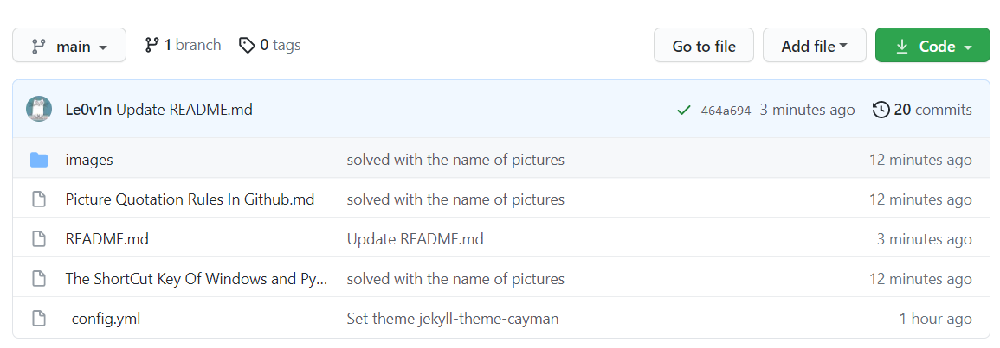

This is a test `.md` file to find out how to use pic correctly.

This is a pic within`./`

This is a pic without `./`

---------

Now we can verify them and find out the correct operation.

-----

------

------

Now we can find a rule on how to use the pic correctly.

1. The `.md` file doesn't contain `space`.

  > Because the folder contained `space` can not be used to show a picture normally. The markdown of Github has its rule that sucks.
  >
  > Fortunately, I create a fixed folder to store all pictures to improve this phenomenon. Now We can rename `.md` file what you wanna.

2. The relative path is not strict enough, and we can use `./` or not use `./`. Both can work normally.

	> If we want to use up-level directory/folder, use `../` instead of `./`

3. The `.gif` is available that allows us to share ours thought better.

----------

This is a new Test File to verify my thoughts about the Picture Quotation Rules on Github.

Now I have created a `.md` file that contains `space`, and I hope it works. 

Let's start it.

Okay, It is a fail trying, but fortunately I find out the rule about relative path.

Now, I change the path of every pic in md, it is in following.

Yeah, as you see. The Typora will create a folder named "images" and store the pics into it when the pics are used.

So you can find all pics in `images` with my blog.

