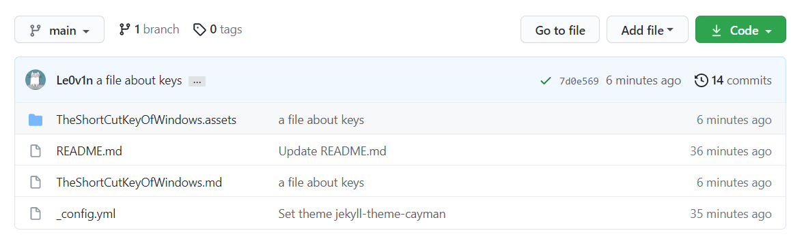

This is a test `.md` file to find out how to use pic correctly.

This is a pic within`./`

This is a pic without `./`

---------

Now we can verify them and find out the correct operation.

-----

------

------

Now we can find a rule on how to use the pic correctly.

1. The `.md` file doesn't contain `space`.

	> Because the folder contained `space` can not be used to show a picture normally. The markdown of Github has its rule that sucks.

2. The relative path is not strict enough, and we can use `./` or not use `./`. Both can work normally.

	> If we want to use up-level directory/folder, use `../` instead of `./`

3. The `gif` is available that allows us to share ours thought better.
