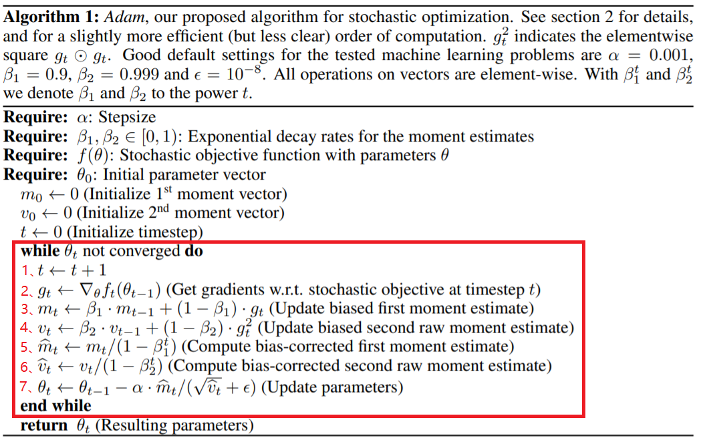

# 1. 一阶矩估计和二阶矩估计

我们首先先明确一下，什么是一阶矩和二阶矩。

## 1.1 一阶矩

一阶矩就是期望值，换句话说就是平均数(离散随机变量很好理解，连续的可以类比一下)。

举例：x-y 坐标系中，$x$ 取大于零的整数，$y_1, y_2, \ ... \ , y_n$ 对应 $x=1, 2,..., n$ 的值，现在我要对 $y$ 求期望，就是所有 $y$ 累加除以$n$，也就是 $y$ 的均值。
$$
E_y = \frac{1}{n} \sum_{-\infty}^{+\infty} {y_i}
$$
此时 $y$ 的均值我可以在坐标系中画一条线 $y=E_y$，我会发现所有的点都在这条线的两边。如果是中心矩我就会用每个值减去均值 $z=y_n-y$ 均作为一个新的序列 $z_1, z_2, ..., z_n$，再对 $z$ 求期望，这时我会发现均值为 $0$ (即在坐标轴y上)。

一阶矩只有一阶非中心矩，因为一阶中心矩永远等于零。

## 1.2 二阶矩

二阶(非中心)矩就是对变量的**平方**求期望，二阶中心矩就是对随机变量与均值(期望)的差的平方求期望。为什么要用平方，因为如果序列中有负数就会产生较大波动，而平方运算就好像对序列添加了绝对值，这样更能体现偏离均值的范围。

## 1.3 补充

在数理统计学中有一类数字特征称为**矩(moment)**。

原点矩：令 $k$ 为正整数（或为 $0$），$a$ 为任何实数，$X$ 为随机变量，则期望值 $E((X-a)^k)$  叫做随机变量 $X$ 对 $a$ 的 $k$ 阶矩，或叫动差。如果 $a=0$，则有 $E(X^k)$，叫做 $k$ 阶原点矩，记作 $v_k(X)$，也叫 $k$ 阶矩，$v_k(X)=E(X^k)$

显然，一阶原点矩就是数学期望，即 $v_1(X)=E(X),k=1,2,...$ 。原点矩顾名思义，是随机变量到原点的距离（这里假设原点为零点）。中心矩则类似于方差，先要得出样本的期望即均值，然后计算出随机变量到样本均值的一种距离，与方差不同的是，这里所说的距离不再是平方就能构建出来的，而是 $k$ 次方。

这也就不难理解为什么原点矩和中心矩不是距离的“**距**”，而是矩阵的“**矩**”了。我们都知道方差源于勾股定理，这就不难理解原点矩和中心矩了。还能联想到力学中的力矩也是“矩”，而不是“距”。力矩在物理学里是指作用力使物体绕着转动轴或支点转动的趋向。力矩也是矢量，它等于力乘力臂。

**二阶中心矩，也叫作方差**，它告诉我们**一个随机变量在它均值附近波动的大小，方差越大，波动性越大**。方差也相当于机械运动中以重心为转轴的转动惯量。**三阶中心矩告诉我们一个随机密度函数向左或向右偏斜的程度**。

在均值不为零的情况下，原点矩只有纯数学意义。

# 2. Adam优化算法

我们首先要区分一个概念：

+ 优化算法 $\neq$ 损失函数

损失函数只是用来计算损失的，而优化算法（函数）是根据损失函数得到的损失值来更新参数的。

明确这个概念之后，我们说一说Adam算法。

-----

## 2.1 什么是Adam算法?

Adam（Adaptive momentum）是一种自适应动量的随机优化方法（A method for stochastic optimization），经常作为深度学习中的优化器算法。

## 2.2 Adam算法如何实现？

### 2.2.1 参数说明

上图就是Adam优化算法在深度学习应用于梯度下降方法的详细过程，有一些参数要做出说明：

+ $t$：更新的步数（steps）
+ $\alpha$：学习率，用于控制步幅（stepsize）
+ $\theta$：要求解（更新）的参数
+ $f(\theta)$：带有参数 $\theta$ 的随机目标函数，一般指损失函数
+ $g_t$ ：目标函数 $f(\theta)$ 对 $\theta$ 求导所得梯度
+ $\beta_1$：一阶矩衰减系数
+ $\beta_2$：二阶矩衰减系数
+ $m_t$：梯度 $g_t$ 的一阶矩，即梯度 $g_t$ 的期望
+ $v_t$：梯度 $g_t$ 的二阶矩，即梯度 $g_t^2$ 的期望
+ $\hat{m_t}$：$m_t$ 的偏置矫正，考虑到 $m_t$ 在零初始值情况下向 $0$ 偏置
+ $\hat{v_t}$：$v_t$ 的偏置矫正，考虑到 $v_t$ 在零初始值情况下向 $0$ 偏置

### 2.2.2 红色方框

在上图的红色方框中显示了 while循环 实现了整个 Adam 算法在梯度下降中的优化过程:

1. 更新 steps；

2. 计算原目标函数 $f(\theta)$ 对参数 $\theta$ 的梯度；

3. 计算梯度的一阶矩(first moment)，即**过往梯度**与**当前梯度**的平均，类似平滑操作,如上图 $m_t$ 即是 $steps=t$ 时的梯度一阶矩；

4. 计算梯度的二阶距(second moment)，即**过往梯度平方**与**当前梯度平方**的平均，如上图 $v_t$ 即是 $steps=t$ 时的梯度二阶矩；

5. 对一阶矩 $m_t$ 进行校正，因为 $m_t$ 初始值为 $0$，所以它会向 $0$ 偏置，这样处理后会减少这种偏置影响，具体计算公式为：
	$$
	\hat{m_t}=\frac{m_t}{1-\beta^t_1}
	$$
	其中，$\beta^t_1$ 指的是 $\beta_1$ 的 $t$ 次方；

6. 对二阶矩 $v_t$ 进行校正，因为 $ v_t$ 初始值为 $0$，所以它会向 $0$ 偏置，这样处理后会减少这种偏置影响，具体计算公式为：
	$$
	\hat{v_t}=\frac{v_t}{1-\beta^t_2}
	$$
	其中，$\beta^t_2$ 指的是 $\beta_2$ 的 $t$ 次方；

7. 更新参数 $\theta_t$，注意此时可将 $\frac{\alpha}{\sqrt{\hat{v_t}+\epsilon}}$ 看成更新参数 $\theta_t$ 的学习率，$\hat{m_t}$ 看成更新参数 $\theta_t$ 的梯度。

## 2.3 如何理解Adam算法中的一阶矩、二阶矩

### 2.3.1 一阶矩

一阶矩 $m_t$ 相当于 $E(g_t)$，即当前梯度 $g_t$ 的期望，由于当下梯度 $g_t$ 是随机采样得到的估计结果，因此更关注它在统计意义上的期望。

### 2.3.2 二阶矩

二阶矩 $ v_t$ 相当于 $E(g_t^2)$，即当前梯度 $g_t^2$ 的平方，它的物理意义是（考虑四种情况）：

1. 当 $||m_t||$大， 且 $v_t$ 大时：说明梯度大且稳定，因为 $||m_t||$ 指的是当前梯度的均值的绝对值，$v_t$ 是平方求期望无正负抵消，得到的结果肯定为正，当 $v_t$ 很大时说明过往大部分的梯度与当前梯度的绝对值都不会太小。若此时  $||m_t||$ 也很大，则说明过往梯度与当前梯度很少有正负抵消 -> 说明过往梯度与当前梯度一般会同号，导致求出的过往梯度与当前梯度的期望绝对值大 -> 也说明梯度更新相对稳定，过度平滑，可以考虑成在梯度下降的过程中遇到一个明显的大坡，梯度下降方向明确。

2. 当 $||m_t||$ 很小， 但 $v_t$ 很大时：则说明过往的大部分梯度和当前梯度的绝对值都很大，导致对 $g_t^2$ 求期望的结果很大，但由于 $||m_t||$ 很小，则又说明过往的大部分梯度以及当前梯度一般不同号，正负相抵，求解出 $g_t$ 期望的绝对值 $||m_t||$ 自然会很小，**这就说明此时梯度更新处于振荡状态，一会正，一会负，但由于 $g_t^2$ 的期望 $v_t$ 很大，说明单个梯度的绝对值很大，可以考虑成可能是向下更新到一个局部的波谷，又进行一波反弹（可用Adam算法优化）**。

3. 当 $||m_t||$ 很大， 但 $v_t$ 却趋近于 $0$：这种情况不可能出现。

	> 因为 $v_t$ 是平方后求期望，怎么可能在 $||m_t||$ 很大的情况下趋近于 $0$ 呢！

4. 当 $||m_t||$ 趋近于 $0$，且 $v_t$ 也趋近于 $0$：梯度趋于零，可能达到局部最低点，也可能走到一个极度平缓的平地，此时要避免陷入平原(plateau)（可用Adam算法优化）。

## 2.4 Adam算法的优点

Adam(Adaptive Momentum，自适应动量)算法是一种适用于绝大多数网络训练的优化方法，其优点是调参相对简单，仅默认参数就可以处理大部分问题。

Adam方法通过对梯度的一阶矩估计和二阶矩估计进行综合考虑后，计算出更新步长再进行参数的更新。

### 2.4.1 惯性保持

Adam算法记录了梯度的一阶矩，即过往所有梯度与当前梯度的平均，使得每一次更新时，上一次更新的梯度与当前更新的梯度不会相差太大，即梯度平滑、稳定的过渡，可以适应不稳定的目标函数。

### 2.4.2 环境感知

Adam记录了梯度的二阶矩，即过往梯度平方与当前梯度平方的平均，这体现了环境感知能力，为不同参数产生自适应的学习速率。

### 2.4.3 超参数

即 $\alpha, \ \beta_1, \ \beta_2, \ \epsilon$ 具有很好的解释性，且通常无需调整或仅需很少的微调。