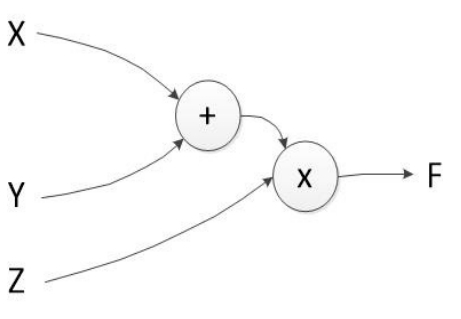
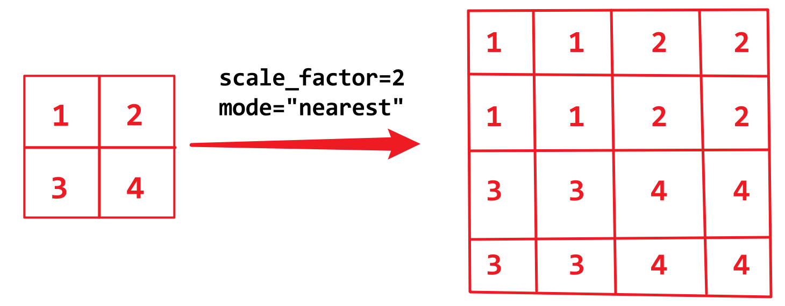

# 0.基础概念

+ 标量（Scalar）∶ 标量其实就是一个独立存在的数，比如在线性代数中一个实数5就可以被看作一个标量，所以标量的运算相对简单，与我们平常做的数字算术运算类似。
+ 张量（**Tensor**）∶ 若数组的维度超过了二维，我们就可以用张量来表示，所以我们可以将张量理解为**高维数组**。同理，张量的索引值用两个维度的数字来表示已经不够了，其中的元素的索引值会随着张量维度的改变而改变。
+ 将最大值点叫作函数**全局最大值**，将最小值点叫作函数**全局最小值**，除此之外，我们可以将其他极值点都叫作函数**局部最大值**或者函数**局部最小值**。

## a. 神经网络的本质(个人理解)

就是对一个CNN模型进行训练, 经过多次Iteration之后, 程序停止, **此时模型中的 $W_i$ 和 $b_i$ 都是确定的了**.

这个把 $W_i$ 和 $b_i$变为固定值的过程就叫做训练.

训练完成之后, 我们需要用新的数据集对模型进行验证, 此时的数据集就叫做**验证集**, 我们把验证集输入到训练好的模型中之后, 根据损失函数, 我们可以知道这个模型的损失是多少, 根据损失的大小来判断模型的好坏.

训练和预测使用的是同一个模型, 所以模型很大, 层数很深的时候对硬件的需求比较大. 因为模型越大, 层数越深, 即便是预测也会涉及到非常多的计算, 所以硬件差会导致实时性能很弱(预测相比于训练来说, 只经过一轮即可, 即 $Iteration=1$).

# 1. 监督学习和无监督学习

## a. 监督学习

提供⼀组输⼊数据和其对应 的标签数据，然后搭建⼀个模型，让模型在通过训练后准确地找到输⼊ 数据和标签数据之间的最优映射关系，在输⼊新的数据后，模型能够通
过之前学到的最优映射关系，快速地预测出这组新数据的标签。这就是⼀个监督学习的过程。

在监督学习中, 一般有两类问题: 

1. 回归问题

   

2. 分类问题

   

## b. 无监督学习

提供⼀组没有任何标签的输⼊数据，将其在我们搭建好的模型中进⾏训练，对整个训练过程不做任何⼲涉，最后得到⼀个能够发现数据之间隐藏特征的映射模型，使⽤这个映射模型能够实现对新数据的分类，这就是⼀个⽆监督学习的过程。

监督学习和无监督学习的区别


使⽤⽆监督学习实现分类的算法⼜叫作**聚类**

在无监督训练的整个过程中，我们需要做的仅仅是将训练数据提供给我们的⽆监督模型，让它自己挖掘数据中的特征和关系。

-------

### 1. 实例

假如我们在一个有大量深度学习相关文章的网站检索"深度学习"，就会显示很多带有"深度学习"关键字的相关网页，但是只要仔细观察就会发现，这些网页被大致分为几个主要的类别，比如关于深度学习的理论、算法、硬件、新闻等。其实这就是一个聚类应用，可以将这个网站中的检索工具看作一个已经训练好的无监督学习模型，在我们对检索工具输入指令后，它就会按照我们的要求将所有的页面搜索出来，但最后呈现在我们眼前的不会是乱糟糟的一堆链接，而是完成聚类后的几大类网址的主链接，这也极大提升了用户体验。


## c. 区别

+ 我们通过监督学习能够按照指定的训练数据搭建出想要的模型，但这个过程需要我们投入大量的精力处理原始数据，也因为我们的紧密参与，所以最后得到的模型更符合设计者的需求和初衷。
+ 我们通过无监督学习过程搭建的训练模型能够自己寻找数据之间隐藏的特征和关系，更具有创造性，有时还能够挖掘到数据之间让我们意想不到的映射关系，不过**最后的结果也可能会向不好的方向发展**。

所以监督学习和无监督学习各有利弊，用好这两种方法对于我们挖掘数据的特征和搭建强泛化能力模型是必不可少的。

# 2. 欠拟合和过拟合

我们可以将搭建的模型是否发生欠拟合或者过拟合作为评价模型的拟合程度好坏的指标。

欠拟合和过拟合的模型预测新数据的准确性都不理想，其最显著的区别是

+ 拥有**欠拟合**特性的模型对已有数据的匹配性很差，**不过对数据中的噪声不敏感**
+ 拥有**过拟合**特性的模型对数据的匹配性太好，所以**对数据中的噪声非常敏感**。

## a. 欠拟合


<font size=5>在解决欠拟合问题时，主要从以下三方面着手:</font>

1. **增加特征项**∶ 在大多数情况下出现欠拟合是因为我们没有准确地把握数据的主要特征，所以我们可以尝试在模型中加入更多的和原数据有重要相关性的特征来训练搭建的模型，这样得到的模型可能会有更好的泛化能力。
2. **构造复杂的多项式**∶这种方法很容易理解，我们知道一次项函数就是一条直线，二次项函数是一条抛物线，<u>一次项和二次项函数的特性决定了它们的泛化能力是有局限性的，如果数据不在直线或者抛物线附近，那么必然出现欠拟合的情形</u>，所以我们可以通过增加函数中的**次项**来增强模型的变化能力，从而提升其泛化能力。
3. **减少正则化参数**∶ 正则化参数出现的目的其实是防止过拟合情形的出现，但是如果我们的模型已经出现了欠拟合的情形，就可以通过减少正则化参数来消除欠拟合。

## b. 过拟合


（a）所示的仍然是之前已获得的房屋的大小和价格的关系数据，（b）所示的是一个过拟合的模型，可以看到这个模型过度捕获了原数据的特征。不仅同之前的欠拟合模型存在同样的问题，而且**过拟合模型受原数据中的噪声数据影响非常严重**。（c）所示，**如果噪声数据严重偏离既定的数据轨道，则拟合出来的模型会发生很大改变**，这个影响是灾难性的。

<font size=5>要想解决在实践中遇到的过拟合问题，则主要从以下三方面着手。</font>

1. **增大训练的数据量**∶<u>在大多数情况下发生过拟合是因为我们用于模型训练的**数据量太小**，搭建的模型过度捕获了数据的有限特征，这时就会出现过拟合，在增加参与模型训练的数据量后，模型自然就能捕获数据的更多特征，模型就不会过于依赖数据的个别特征</u>。
2. **采用正则化方法**∶ 正则化一般指在目标函数之后加上范数，用来防止模型过拟合的发生，在实践中最常用到的正则化方法有$L_0$正则、$L_1$正则和$L_2$正则。
3. **Dropout方法**∶ Dropout方法在神经网络模型中使用的频率较高，简单来说就是在神经网络模型进行前向传播的过程中，**随机选取和丢弃指定层次之间的部分神经连接**，因为整个过程是随机的，所以能有效防止过拟合的发生。

# 3. 后向传播

深度学习中的后向传播主要用于对我们搭建的模型中的参数进行微调，在通过多次后向传播后，就可以得到模型的最优参数组合。

接下来介绍后向传播这一系列的优化过程具体是如何实现的。

> 深度神经网络中的参数进行后向传播的过程其实就是一个复合函数求导的过程。

首先来看一个模型结构相对简单的实例，在这个实例中我们定义模型的前向传播的计算函数为$f = (x + y) \times z$，它的流程如图下图所示:



假设输入数据$x=2、y=5、z=3$，则可以得到前向传播的计算结果$f=(x+y) \times z=21$，如果把原函数改写成复合函数的形式，$h=x+y=7$，就可以得到$f=h\times z =21$。

接下来看看在后向传播中需要计算的内容，**假设在后向传播的过程中需要微调的参数有三个**，分别是$x、y、z$, 这三个参数每轮后向传播的微调值为$\large\frac{\partial f}{\partial x}$, $\large\frac{\partial f}{\partial y}$, $\large\frac{\partial f}{\partial z}$这三个，值计算的都是偏导数，我们把求偏导的步骤进行拆解，这样就更容易理解整个计算过程了。

首先，分别计算$\large \frac{\partial h}{\partial y}=1$，$\large \frac{\partial h}{\partial x}=1$, $\large \frac{\partial f}{\partial z}=h$, $\large \frac{\partial f}{\partial h}=z$, 然后计算$x、y、z$的后向传播微调值，即它们的偏导数，如下所述。

+ $z$的偏导数为$\large \frac{\partial f}{\partial z}=7$
+ $y$的偏导数为$\frac{\partial f}{\partial y}=\frac{\partial f}{\partial h} \frac{\partial h}{\partial y}=z \times 1 = 3$
+ $x$的偏导数为$\frac{\partial f}{\partial x}=\frac{\partial f}{\partial h} \frac{\partial h}{\partial x}=z \times 1 = 3$

在清楚后向传播的大致计算流程和思路后，我们再来看一个模型结构相对复杂的实例，其结构是一个初级神经网络，如下图所示。


我们假设 $x_0=1, x_1=1, b=-1$, 同时存在相对应的权重值 $w_0=0.5, w_1=0.5$ ，使用Sigmoid作为该神经网络的激活函数，就可以得到前向传播的函数为$\large f=\frac{1}{1+e^-(w_0x_0+w_1x_1+b)}$，将相应的参数代入函数中进行计算，得到计算函数为，$\large f=\frac{1}{1+e^0}=0.5$, 之后再对函数进行求导。同样，可以将原函数进行简化，改写成复合函数的形式求解，令$\large h=w_0x_0+w_1x_1+b=0$，简化后的函数为$\large f(h)=\frac{1}{1+e^-h}=0.5$，在分别计算后得到$\large \frac{\partial h}{\partial x_0}=w_0=0.5$, $\large \frac{\partial h}{\partial x_1}=w_1=0.5$, 有了以上结果后，下面来看$x_0, \ x_1$的后向传播微调值。

+ $x_0$的 后 向 传 播 微 调 值 为 $\large \frac{\partial f}{\partial x_0} = \frac{\partial f}{\partial h} \frac{\partial h}{\partial x_0} = (1-f(h))f(h)\times 0.5 = (1-0.5)\times0.5\times0.5=0.125$
+ $x_1$的 后 向 传 播 微 调 值 为 $\large \frac{\partial f}{\partial x_1} = \frac{\partial f}{\partial h} \frac{\partial h}{\partial x_1} = (1-f(h))f(h)\times 0.5 = (1-0.5)\times0.5\times0.5=0.125$

> Sigmoid函数由下列公式定义:
> $$
> \large S(x) = \frac{1}{1+e^-x}
> $$

# 4. 损失与优化

深度神经网络中的损失用来**度量我们的模型得到的预测值和数据真实值之间的差距**，也是一个用来**衡量我们训练出来的模型泛化能力好坏的重要指标**。

+ 如果模型预测值和真实值的差距越大，损失值就会越高，这时我们就需要通过不断地对模型中的参数进行优化来减少损失
+ 如果预测值和真实值的差距越小，则说明我们训练的模型预测越准确，具有更好的泛化能力。

**对模型进行优化的最终目的是尽可能地在不过拟合的情况下降低损失值**。 在拥有一部分数据的真实值后，就可通过模型获得这部分数据的预测值，然后计算预测值与真实值之间的损失值，通过不断地优化模型参数来使这个损失值变得尽可能小。可见，优化在模型的整个过程中有举足轻重的作用。

<font size=5>**具体应用过程**:</font>

以之前讲到的二分类问题为例，在该二分类问题中我们的目的是让搭建的模型能够对一堆苹果和梨混合在一起的水果进行准确分类。

首先，建立一个二分类模型，对这堆水果进行第1轮预测，得到预测值$y_{pred}$，同时把这堆水果中每个水果的真实类别记作真实值$y_{true}$, 将$y_{true}$与$y_{pred}$之间的差值作为第1轮的损失值。第1轮计算得到的损失值极有可能会较大，这时我们就需要对模型中的参数进行优化，在优化过程中对参数做相应的更新，然后进行第2轮的预测和误差值计算，如此循环往复，最后得到理想模型，该模型的预测值和真实值的差异足够小。

在上面的二分类问题的解决过程中计算模型的真实值和预测值之间损失值的方法有很多，而**进行损失值计算的函数叫作损失函数**; 同样，对模型参数进行优化的函数也有很多，这些函数叫作优化函数。下面对几种较为常用的损失函数和优化函数进行介绍。

## a. 损失函数

### 1. MSE(均方误差函数)

均方误差（Mean Square Error，简称MSE）函数计算的是预测值与真实值之差的平方的期望值，可用于评价数据的变化程度，**其得到的值越小，则说明模型的预测值具有越好的精确度**。均方误差函数的计算如下:
$$
\large MSE=\frac{1}{N}\sum_{i=1}^N{(y_{true}^i - y^i_{pred})^2}
$$
其中，$y_{pred}$表示模型的预测值，$y_{true}$表示真实值，它们的上标 $i$ 用于指明是哪个真实值和预测值在进行损失计算。

### 2. RMSE(均方根误差函数)

均方根误差（Root Mean Square Error，简称RMSE）在均方误差函数的基础上进行了改良，计算的是均方误差的算术平方根值，**其得到的值越小，则说明模型的预测值具有越好的精确度**。均方根误差函数的计算如下∶
$$
\large RMSE=\sqrt{\frac{1}{N} \sum^N_{i=1}(y_{true}^i-y_{pred}^i)^2}
$$
其中，$y_{pred}$表示模型的预测值，$y_{true}$表示真实值，它们的上标 $i$ 用于指明是哪个真实值和预测值在进行损失计算。

### 3. MAE(平均绝对误差函数)

平均绝对误差（Mean Absolute Error，MAE）计算的是绝对误差的平均值，绝对误差即模型预测值和真实值之间的差的绝对值，能更好地反映预测值误差的实际情况，**其得到的值越小，则说明模型的预测值具有越好的精确度**。平均绝对误差函数如下:
$$
\large MAE = \frac{1}{N}\sum_{i=1}^N|(y_{true}^i-y_{pred}^i)|
$$
其中，$y_{pred}$表示模型的预测值，$y_{true}$表示真实值，它们的上标 $i$ 用于指明是哪个真实值和预测值在进行损失计算。

## b. 优化函数

在计算出模型的损失值之后，接下来需要利用损失值进行模型参数的优化。

之前提到的**后向传播只是模型参数优化中的一部分**，在实际的优化过程中，我们还面临在优化过程中**相关参数的初始化、参数以何种形式进行微调、如何选取合适的学习速率等问题**。**我们可以把优化函数看作上述问题的解决方案的集合**。

**在实践操作中最常用到的是一阶优化函数**，典型的一阶优化函数包括 

+ GD
+ SGD
+ Momentum
+ Adagrad
+ Adam
+ 等等

> 一阶优化函数在优化过程中求解的是参数的一阶导数，这些一阶导数的值就是模型中参数的微调值。

这里引入了一个新的概念∶**梯度**。梯度其实就是将多元函数的各个参数求得的偏导数**以向量的形式**(既有大小也有方向)展现出来，也叫作多元函数的梯度。举例来说，有一个二元函数$f(x, y)$，分别对二元函数中的$x、y$求偏导数，然后把参数$x、y $求得的偏导数写成向量的形式，即$(\large \frac{\partial f}{\partial x}, \frac{\partial f}{\partial y})$, 这就是二元函数$f(x, y)$的梯度, 我们也可以将其记作$grad \ f(x, y)$。同理，三元函数$f(x, y, z)$的梯度为$(\large \frac{\partial f}{\partial x}, \frac{\partial f}{\partial y}, \frac{\partial f}{\partial z})$, 以此类推.

不难发现，梯度中的内容其实就是在后向传播中对每个参数求得的偏导数，所以**我们在模型优化的过程中使用的参数微调值其实就是函数计算得到的梯度，这个过程又叫作参数的梯度更新**。<u>对于只有单个参数的函数，我们选择使用计算得到的导数来完成参数的更新，如果在一个函数中需要处理的是多个参数的问题，就选择使用计算得到的梯度来完成参数的更新</u>。

下面来看几种常用的优化函数。

### 1. GD(梯度下降)

梯度下降 （Gradient Descent，简称GD）是参数优化的基础方法。**虽然梯度下降已被广泛应用，但是其自身存在许多不足，所以在其基础上改进的优化函数也非常多**。

全局梯度下降的参数更新公式如下∶
$$
\large \theta_j=\theta_j-\eta\times\frac{\partial J(\theta_j)}{\partial \theta_j}
$$
其中，训练样本总数为$n, \ j=0, 1, 2, ..., n$。可以将这里的等号看作编程中的赋值运算，$\theta$ 是我们优化的参数对象，$\eta$是学习速率，$J(\theta)$是损失函数, $\large \frac{\partial J(\theta)}{\partial \theta}$是根据损失函数来计算$θ $ 的梯度。学习速率用于控制梯度更新的快慢.

+ 如果学习速率过快，参数的更新跨步就会变大，**极易出现局部最优和抖动**

+ 如果学习速率过慢，**梯度更新的迭代次数就会增加，参数更新、优化的时间也会变长**

所以选择—个合理的学习速率是非常关键的。

全局的梯度下降在每次计算损失值时都是针对整个参与训练的数据集而言的，所以会出现一个令人困扰的问题∶因为模型的训练依赖于整个数据集，所以 **$1.$增加了计算损失值的时间成本**和 **$2.$模型训练过程中的复杂度**，而**参与训练的数据量越大，这两个问题越明显**。

### 2. BGD(批量梯度下降)

为 了**避免全局梯度下降问题带来的弊端**，人们对全局梯度下降进行了改进，创造了批量梯度下降（Batch Gradient Descent，简称BGD）的优化算法。

批量梯度下降就是将整个参与训练的数据集划分为若干个大小差不多的训练数据集，我们将其中的—个训练数据集叫作一个批量，每次用一个批量的数据来对模型进行训练，**并以这个批量计算得到的损失值为基准来对模型中的==全部参数==进行梯度更新**，**默认这个批量只使用一次**，然后使用下一个批量的数据来完成相同的工作，直到所有批量的数据全部使用完毕。

假设划分出来的批量个数为 $m$，其中的一个批量包含 $batch$个数据样本，那么一个批量的梯度下降的参数更新公式如下∶
$$
\large \theta_j=\theta_j-\eta\times\frac{\partial J_{batch}(\theta_j)}{\partial \theta_j}
$$
训练样本总数为 $batch$，$j =0…batch$。从以上公式中我们可以知道，其批量梯度下降算法大体上和全局的梯度下降算法没有多大的区别，**唯一的不同就是损失值的计算方式使用的是**$\large J_{batch}(\theta_j)$，即这个损失值是基于我们的一个批量的数据来进行计算的。

**如果我们将批量划分得足够好，则计算损失函数的时间成本和模型训练的复杂度将会大大降低**，不过仍然存在一些小问题，就是选择**BGD(批量梯度下降)很容易导致优化函数的最终结果是==局部最优解==**。

### 3. SGD(随机梯度下降)

还有一种方法能够很好地处理全局梯度下降中的问题，就是随机梯度下降 （Stochastic Gradient Descent，简称SGD）。随机梯度下降是**通过随机的方式从整个参与训练的数据集中选取一部分来参与模型的训练，所以只要我们随机选取的数据集大小合适，就不用担心计算损失函数的时间成本和模型训练的复杂度，而且==与整个参与训练的数据集的大小没有关系==**。

> stochastic	英[`stə'kæstɪk`] 美[`stə'kæstɪk`]
>
> adj.	随机的; 机会的; 有可能性的; 随便的;

假设我们随机选取的一部分数据集包含 $stochastic$ 个数据样本，那么随机梯度下降的参数更新公式如下∶
$$
\large \theta_j = \theta_j - \eta \times \frac{\partial J_{stochastic}(\theta_j)}{\partial \theta_j}
$$
训练样本的总数为 $stochastic$，$j=0...stochastic$。从该公式中可以看出，随机梯度下降和批量梯度下降的计算过程非常相似，只不过计算随机梯度下降损失值时使用的是$J_{stochastic}(\theta_j)$，即这个损失值基于我们随机抽取的 $stochastic$ 个训练数据集。**随机梯度下降虽然很好地提升了训练速度，但是==会在模型的参数优化过程中出现抖动的情况==**，**原因就是我们选取的参与训练的数据集是随机的，所以模型会受到随机训练数据集中噪声数据的影响，又因为有随机的因素，所以也==容易导致模型最终得到局部最优解==。**

### 4. Adam(自适应时刻估计方法)

最后来看一个比较"智能"的优化函数方法——自适应时刻估计方法（Adaptive Moment Estimation，简称Adam）。Adam在模型训练优化的过程中通过**让每个参数获得自适应的学习率，来达到优化质量和速度的双重提升**。

举个简单的实例，<u>假设我们在一开始进行模型参数的训练时损失值比较大，则这时需要使用较大的学习速率让模型参数进行较大的梯度更新，但是到了后期我们的损失值已经趋近于最小了，这时就需要使用较小的学习速率让模型参数进行较小的梯度更新，以防止在优化过程中出现局部最优解</u>。

在实际应用中当然不止Adam这种类型的自适应优化函数，不过应用该方法在**最后取得的效果都比较理想，这和Adam收敛速度快、学习效果好的优点脱不了干系，而且对于在优化过程中出现的学习速率消失、收敛过慢、高方差的参数更新等导致损失值波动等问题，==Adam都有很好的解决方案==**。

## c. 激活函数

我们在了解感知机和多层感知机时，很容易得到一个没有激活函数的单层神经网络模型，其数学表示如下∶
$$
\large f(x)=W\cdot X
$$
其中的大写字母代表矩阵或者张量(tensor)。

下面搭建一个两层的神经网络模型并在模型中加入激活函数。假设激活函数的激活条件是比较 **0** 和 **输入值中的最大值**.

+ 如果 $<0$，则输出结果为 $0$
+ 如果 $>0$，则输出结果是输入值本身。

同时，在神经网络模型中加入偏置 （$Bias$），偏置可以让我们搭建的神经网络模型偏离原点，而**没有偏置的函数必定会经过原点**，如图所示。


如图所示，$f(x)=2x$ 是不带偏置的函数，而$g(x)=2x+3$是偏置为3的函数。**模型偏离原点的好处就是能够使模型具有更强的变换能力，在面对不同的数据时拥有更好的泛化能力**。在增加偏置后，我们之前的单层神经网络模型的数学表示如下∶
$$
\large f(x)=W \cdot X + b
$$
如果搭建二层神经网络，那么加入激活函数的二层神经网络的数学表示如下∶
$$
\large f(x)=max(W_2 \cdot max(W_1 \cdot X + b_1, 0) + b_2, 0)
$$
如果是更多层次的神经网络模型，比如一个三层神经网络模型，并且每层的神经输出都使用同样的激活函数，那么数学表示如下∶
$$
\large f(x)=max(W_3 \cdot max(W_2 \cdot max(W_1 \cdot X + b_1, 0) + b_2, 0) + b_3, 0)
$$
深度更深的神经网络模型按如上原则类推。

就数学意义而言，在构建神经网络模型的过程中，激活函数发挥了重要的作用，比如就上面的三层神经网络模型而言，**如果没有激活函数，而我们只是一味地加深模型层次，则搭建出来的神经网络数学表示如下**∶
$$
\large f(x)=W_3 \cdot (W_2 \cdot(W_1 \cdot X + b_1) + b_2) + b_3
$$
可以看出，上面的模型存在一个很大的问题，**它仍然是一个线性模型，如果不引入激活函数，则无论我们加深多少层，其结果都一样，==线性模型在应对非线性问题时会存在很大的局限性==**。**激活函数的引入给我们搭建的模型带来了非线性因素，非线性的模型能够处理更复杂的问题，所以通过选取不同的激活函数便可以得到复杂多变的深度神经网络，从而应对诸如图片分类这类复杂的问题**。

下面讲解我们在实际应用最常用到的三种非线性激活函数∶ Sigmoid、 tanh和ReLU。

### 1. Sigmoid

Sigmoid的数学表达式如下∶ 
$$
\large S(x) = \frac{1}{1+e^-x}
$$
根据Sigmoid函数，我们可以得到Sigmoid的几何图形，如图所示。


从图中可以看到，输入 Sigmoid激活函数的数据经过激活后输出数据的区间为 $0～1$，**输入数据越大，输出数据越靠近1，反之越靠近0**。 

Sigmoid在一开始被作为激活函数使用时就受到了<u>大众的普遍认可</u>，其主要原因是从输入到经过Sigmoid激活函数激活输出的一系列过程与生物神经网络的工作机理非常相似，不过Sigmoid作为激活函数的缺点也非常明显，**其最大的缺点就是使用==Sigmoid作为激活函数会导致模型的梯度消失==，因为Sigmoid导数的取值区间为0～0.25**，如图所示。


根据**复合函数的链式法则**可以知道，如果我们的每层神经网络的输出节点都使用Sigmoid作为激活函数，那么在后向传播的过程中每逆向经过一个节点，就要乘上一个Sigmoid的导数值，而Sigmoid的导数值的取值区间为0～0.25，所以**即便每次乘上Sigmoid的导数值中的最大值0.25，也相当于在后向传播的过程中每逆向经过一个节点，梯度值的大小就会变成原来的四分之一，==如果模型层次达到了—定深度，那么后向传播会导致梯度值越来越小，直到梯度消失==。**

其次是**Sigmoid函数的输出值恒大于0，这会导致我们的模型在优化的过程中收敛速度变慢**。因为深度神经网络模型的训练和参数优化往往需要消耗大量的时间，如果模型的收敛速度变慢，就又会增加我们的时间成本。考虑到这一点，在选取参与模型中相关计算的数据时，要尽量使用零中心（Zero-Centered）数据;而且要尽量保证计算得到的输出结果是零中心数据。

> 这是黄全进师兄的讲解:
>
> 
>
> 
>
> 

### 2. tanh

激活函数tanh的数学表达式如下∶
$$
\large f(x)=\frac{e^x-e^{-x}}{e^x+e^{-x}}
$$
我们根据tanh函数可以得到tanh的几何图形，如图所示。


我们从图中可以知道，**tanh函数的输出结果是零中心数据**，所以**解决了激活函数在模型优化过程中收敛速度变慢的问题**, 但 tanh函数的导数取值区间为 $0～1$，仍然不够大(**不大于1都叫不够大**)，如图所示。


所以，因为导数取值范围的关系，在深度神经网络模型的后向传播过程中仍有可能出现梯度消失的情况。

### 3. ReLU(修正线性单元)

ReLU（Rectified Linear Unit，修正线性单元）是目前在深度神经网络模型中使用率最高的激活函数，其数学表达式如下∶
$$
f(x)=max(0, x)
$$
ReLU函数通过判断 0 和输入数据 x 中的最大值作为结果进行输出:

+ 如果 $x \le 0$，则输出结果 0

+ 如果 $x>0$，则输出结果 x

其逻辑非常简单，使用**该激活函数的模型在实际计算过程中非常高效**。我们根据ReLU函数，可以得到ReLU的几何图形，如图所示。


**ReLU函数的收敛速度非常快，其计算效率远远高于Sigmoid和tanh**。

不过ReLU也同样存在需要我们关注的问题∶从ReLU的几何图形中可以看出，**ReLU的输出并不是零中心数据，这可能会导致某些神经元永远不会被激活，并且这些神经元相对应的参数不能被更新**。<u>这一般是由于模型参数在初始化时使用了全正或者全负的值，或者在后向传播过程中设置的学习速率太快导致的</u>。其解决方法是对模型参数使用更高级的初始化方法如Xavier，以及设置合理的后向传播学习速率，==推荐使用自适应的算法如Adam==。

> xavier	美[`ˈzeɪvjər`]

ReLU尽管存在上述问题，但仍成为许多人搭建深度神经网络模型时使用的主流激活函数，它也在不断被改进，现在已经出现很多ReLU的改进版本如Leaky-ReLU、R-ReLU等。

# 5. CPU & GPU

## a. 区别

1. 核心数:
   + GPU相较于CPU的硬件构成，在结构上拥有更多的核心数量，虽然GPU的核心数量更多，但是CPU中的单个核心相对于GPU中的单个核心，拥有更快速、高效的算力。
2. 应用场景:
   + 在应用场景上GPU和CPU也各有侧重，GPU适用于需要并行计算能力的场景，比如图像处理;CPU更适用于需要串行计算能力的场景，比如计算机的指令处理。

## b. 为什么选择GPU

从各个方面来看，CPU都是为了计算而生的，那么我们为什么还会强力推荐将 GPU作为核心算力的输出硬件呢?

这是因为**在深度学习模型中生成的参数结构都是张量（Tensor）形式的**，之前我们已经了解了矩阵和张量是如何进行算术运算的，我们发现，其实矩阵和张量的算术运算的模式就是一种并行运算。所以张量的算术运算在 GPU的加持下会获得比CPU更快速、高效的计算能力，因此在对深度学习参数的训练和优化过程中，GPU能够为我们提供更多的帮助。

下面我们通过一个简单的实验，来看看GPU和CPU在计算效率上的差距，这个实验会对不同维度的张量进行计算并统计每次计算的耗时。

## c. 计算时间对比

### 1. CPU

首先，我们使用CPU来进行10次张量运算，并打印最后的计算耗时结果，张量的维度从`(100, 1000, 1000)`到`(1000, 1000, 1000)`逐次累加。

结果如下∶

```python
import time
import torch

for i in range(1, 10):
    start = time.time()
    a = torch.FloatTensor(i*100, 1000, 1000)
    a = torch.matmul(a, a)
    end = time.time() - start
    print(end)
    
"""
Res:
	0.5641357898712158
    1.0791363716125488
    1.5486154556274414
    2.0725295543670654
    2.7231976985931396
    3.24635648727417
    3.8519527912139893
    4.485507488250732
    4.59730339050293
"""
```

### 2. GPU

```python
import time
import torch

for i in range(1, 10):

    start = time.time()
    a = torch.FloatTensor(i*100, 1000, 1000)
    a = a.cuda()
    a = torch.matmul(a, a)
    if hasattr(torch.cuda, 'empty_cache'):
        torch.cuda.empty_cache()
    end = time.time() - start
    print(end)
    
"""
Res:
	2.211369514465332
    0.43592381477355957
    0.6654167175292969
    0.8856749534606934
    1.1057884693145752
    1.3193697929382324
    1.6105246543884277
    2.054593801498413
"""
```

这里使用的硬件分别是Intel-i5-10400F型号的CPU和RTX-3070型号的GPU，我们通过该实验可以看出，GPU在处理张量计算的效率上要远远高于 CPU，如果计算参数更多，那么GPU和CPU之间的差距会更明显。

## d. 配置建议

我们在了解了GPU和CPU在深度学习参数训练过程中各自的侧重点后，必然需要一款功能强大的显卡作为我们组建深度学习工作站的重要部件。这里推荐两款NVIDIA系列中的性价比较高的显卡∶RTX-1660Ti及 RTX-3060Ti。

这两款显卡比普通版的显卡型号多出了一个Ti，这个Ti在NVIDIA中主要用于区别普通版显卡，表示Ti版显卡具备更强劲的性能。

对于其他电脑硬件，建议再增加一块能够高速存取数据的固态硬盘 SSD和一个能够和显卡高效协同工作的性能强劲的CPU，再加上一块能够实现多块显卡拓展的主板。这样，我们的深度学习工作站的核心部件就凑齐了，该工作站能够满足我们对深度神经网络模型进行训练和对参数进行优化的绝大多数需求。

# 6. CNN(卷积神经网络)

卷积神经网络（Convolutional Neural Networks，简称CNN）可以说是深度神经网络模型中的"明星"网络架构，在计算机视觉方面贡献颇丰。==一个标准的卷积神经网络架构主要由卷积层、池化层和全连接层等核心层次构成==，卷积层、池化层和全连接层不仅是搭建卷积神经网络的基础，也是我们需要重点掌握和理解的内容。本章会先对卷积层、池化层和全连接层进行详细介绍，再介绍如何使用这些基本的层次结构，并配合些调整和改进，来搭建形态各异的卷积神经网络模型。

下面讲解卷积神经网络中的核心基础，涉及卷积层、池化层、全连接层在卷积神经网络中扮演的角色、实现的具体功能和工作原理。

## 1. Convolution Layer(卷积层)

**卷积层（Convolution Layer）的主要作用是对输入的数据进行==特征提取==，而完成该功能的是卷积层中的卷积核（Filter）**。**我们可以将卷积核看作一个指定窗口大小的扫描器，扫描器通过一次又一次地扫描输入的数据，来提取数据中的特征**。如果我们输入的是图像数据，那么在通过卷积核的处理后，就可以识别出图像中的重要特征了。

那么，在卷积层中是如何定义这个卷积核的呢? 卷积层又是怎样工作的呢? 下面通过一个实例进行说明。

假设有一张 $32×32×3$ 的输入图像，其中 $32×32$ 指**图像的高度×宽度** ，$3$ 指图像具有 $R、G、B$ 三个色彩通道，我们定义一个窗口大小为 $5×5×3$ 的卷积核，其中 $5×5$ 指卷积核的**高度×宽度​**，==$3$ 指卷积核的深度，对应之前输入图像的 $R、G、B$三个色彩通道==，**这样做的目的是当卷积核窗口在输入图像上滑动时，能够一次在其三个色彩通道上同时进行卷积操作**。

> <u>注意，如果我们的原始输入数据都是图像，那么我们定义的卷积核窗口的宽度和高度要比输入图像的宽度和高度小</u>，**较常用的卷积核窗口的宽度和高度大小是==3×3==和==5×5==**。

<font color="red">在定义卷积核的深度时，只要保证与输入图像的色彩通道一致就可以了，如果输入图像是3个色彩通道的，那么卷积核的深度就是3;如果输入图像是单色彩通道的，那么卷积核的深度就是1，以此类推</font>。

如图所示为单色彩通道的输入图像的卷积过程。


如图所示，输入的是一张原始图像，中间的是卷积核，图中显示的是卷积核的一次工作过程，通过卷积核的计算输出了一个结果，**其计算方式就是将对应位置的数据相乘然后相加**，如下所示∶
$$
-8=0×4+0×0+0×0+0×0+1×0+1×0+0×0+1×0+2×(-4)
$$
下面，根据我们定义的卷积核步长对卷积核窗口进行滑动。**卷积核的步长其实就是卷积核窗口每次滑动经过的图像上的像素点数量**，如图所示是一个步长为2的卷积核经过一次滑动后窗口位置发生的变化。


如果我们仔细观察，则还会发现在<u>上图中输入图像的最外层多了一圈全为0的像素</u>，这其实是一种用于提升卷积效果的边界像素填充方式。**我们在对输入图像进行卷积之前，有两种边界像素填充方式可以选择，分别是Same和Valid**。

+ <font color="green">Valid方式就是直接对输入图像进行卷积，**不对输入图像进行任何前期处理和像素填充**，这种方式的缺点是**可能会导致图像中的部分像素点不能被滑动窗口捕捉**</font>

+ <font color="green">Same 方式是**在输入图像的最外层加上指定层数的值全为0的像素边界，这样做是为了让输入图像的全部像素都能被滑动窗口捕捉**</font>

通过对卷积过程的计算，我们可以总结出一个通用公式，在本书中我们统一把它叫作卷积通用公式，用于计算输入图像经过一轮卷积操作后的输出图像的宽度和高度的参数，公式如下∶
$$
\large W_{output}=\frac{W_{input}-W_{filter}+2P}{S}+1
$$

$$
\large H_{output}=\frac{H_{input}-H_{filter}+2P}{S}+1
$$

其中，通用公式中的 $W$ 和 $H$ 分别表示图像的宽度（Weight）和高度（Height）的值; 下标 $input$ 表示输入图像的相关参数; 下标 $output$ 表示输出的图像的相关参数; 下标 $filter$ 表示卷积核的相关参数; $S$ 表示卷积核的步长; $P$（是Padding的缩写）表示在图像边缘增加的边界像素层数:

> 卷积层中的卷积核即为 $Filter$

+ 如果图像边界像素填充方式选择的是 $Same$ 模式，那么 $P$ 的值就等于图像增加的边界层数
+ 如果图像边界像素填充方式选择的是 $Valid$ 模式，那么 $P=0$。

下面看一个具体的实例。

输入一个 $7\times7×1$的图像数据，卷积核窗口为 $3×3×1$，输入图像的最外层使用了一层边界像素填充，卷积核的步长stride为 $1$，这样可以得到 $W_{input}=7, \ H_{input}=7, \ W_{filter}=3, \ P=1, \ S=1$，然后根据公式就能够计算出最后输出特征图的宽度和高度都是 $7$, 即$7 = \frac{7-3+2}{1}+1$。

我们已经了解了单通道的卷积操作过程，但是在实际应用中一般很少处理色彩通道只有一个的输入图像，所以接下来看看如何对三个色彩通道的输入图像进行卷积操作，三个色彩通道的输入图像的卷积过程如图所示。


在卷积过程中我们还加入了一个值为 $1$ 的偏置，其实整个计算过程和之前的单通道的卷积过程大同小异，**我们可以将三通道的卷积过程看作三个独立的单通道卷积过程，最后将三个独立的单通道卷积过程的结果进行相加，就得到了最后的输出结果**。

## 2. Pooling Layer(池化层)

<font color="green">卷积神经网络中的池化层可以被看作卷积神经网络中的一种提取输入数据的核心特征的方式，不仅实现了**对原始数据的压缩**，还大量**减少了参与模型计算的参数**，从某种意义上提升了计算效率</font>。

其中，<u>最常被用到的池化层方法是**平均池化层**和**最大池化层**</u>，<font color='red'>池化层处理的输入数据在一般情况下是经过卷积操作之后生成的特征图</font>。

> 在LeNet-5模型中的下采样层使用的就是MaxPooling层
>
> 在CNN中, 下采样一般有3种:
>
> 1. Max Pooling Layer
>
> 2. Average Pooling Layer
>
> 3. Stochastic Pooling Layer
>
>    > stochastic	英[`stə'kæstɪk`]	美[`stə'kæstɪk`]
>    > adj.	随机的; 机会的; 有可能性的; 随便的;

### a) MaxPoolingLayer(最大池化层)

如图所示是一个最大池化层的操作过程。


如上图所示，池化层也需要<u>定义一个类似卷积层中卷积核的滑动窗口</u>，**但这个滑动窗口仅用来提取特征图中的重要特征，==本身并没有参数==**。这里使用的滑动窗口的高度×宽度是 $2×2$，**滑动窗口的深度和特征图的深度保持一致**。如上图所示是对单层特征图进行的操作，并且滑动窗口的步长为 $2$。

下面来看看这个滑动窗口的计算细节。首先通过滑动窗口框选出特征图中的数据，然后将其中的最大值作为最后的输出结果。上图中左边的方框就是输入的特征图像，即原特征图，如果滑动窗口是步长为 $2$ 的 $2×2$ 窗口，则刚好可以将输入图像划分成4部分，取每部分中数字的最大值作为该部分的输出结果，便可以得到上图中右边的输出图像，即目标特征图。第1个滑动窗口框选的4个数字分别是 $1、1、5、 6$，所以最后选出的最大的数字是 $6$; 第2个滑动窗口框选的4个数字分别是 $ 2、4、7、8$，所以最后选出的最大的数字是 $8$，以此类推，最后得到的结果就是 $6、8、3、4$。

### b) AveragePoolingLayer(平均池化层)

在了解最大池化层的工作方法后，我们再来看另一种常用的池化层方法，如下图所示是一个平均池化层的操作过程。


平均池化层的窗口、步长和最大池化层没有区别，**但平均池化层最后对窗口框选的数据使用的计算方法与最大池化层不同**。平均池化层在得到窗口中的数字后，将它们全部相加再求平均值，将该值作为最后的输出结果。如果滑动窗口依旧是步长为 $2$ 的 $2×2$ 窗口，则同样刚好将输入图像划分成 4 部分，将每部分的数据相加然后求平均值，并将该值作为该部分的输出结果，最后得到上图中右边的输出图像，即目标特征图。第1个滑动窗口框选的4个数字分别是 $1、1、5、6$，那么最后求得平均值为 $3.25$并将其作为输出结果; 第2个滑动窗口框选的4个数字分别是 $2、4、7、8$，那么最后求得平均值为 $5.25$ 并将其作为输出结果，以此类推，最后得到的结果就是 $3.25、5.25、2、2$。

通过池化层的计算，我们也能总结出一个通用公式，在本书中我们统一把它叫作池化通用公式，用于计算输入的特征图经过一轮池化操作后输出的特征图的宽度和高度∶
$$
\large W_{output}=\frac{W_{input}-W_{filter}}{S}+1
$$

$$
\large H_{output}=\frac{H_{input}-H_{filter}}{S}+1
$$

其中，$W$ 和 $H$ 分别表示特征图的宽度和高度值，下标 $input $ 表示输入的特征图的相关参数，下标 $output$ 表示输出的特征图的相关参数，下标 $filter$ 表示滑动窗口的相关参数，$S$ 表示滑动窗口的步长，并且输入的特征图的深度和滑动窗口的深度保持一致。

下面通过一个实例来看看如何计算输入的特征图经过池化层后输出的特征图的高度和宽度，定义一个 $16×16×6$ 的输入图像，池化层的滑动窗口为 $2×2×6$，滑动窗口的步长 stride 为 $2$。这样可以得到 $W_{input}=16$, $H_{input}=16$, $W_{filter} = 16$, $S=2$，然后根据总结得到的公式，最后输出特征图的宽度和高度都是 $8$，即 $8=\frac{16-2}{2}+1$。

从结果可以看出，在使用 $2×2×6$ 的滑动窗口对输入图像进行池化操作后，得到的输出特征图的高度和宽度变成了原来的一半，这也印证了我们之前提到的池化层的作用∶<u>池化层不仅能够最大限度地提取输入的特征图的核心特征，还能够**对输入的特征图进行压缩**</u>。

## 3. Fully Connected Layer, FC(全连接层)

<font color='red'>**全连接层的主要作用是将输入图像在经过卷积和池化操作后提取的特征进行压缩，并且根据压缩的特征完成模型的分类功能**</font>。如下图所示是一个全连接层的简化流程。


其实全连接层的计算比卷积层和池化层更简单，如上图所示的输入就是我们通过卷积层和池化层提取的输入图像的核心特征，**与全连接层中定义的权重参数相乘**，最后被压缩成仅有的10个输出参数，这 10个输出参数其实已经是一个分类的结果，再经过激活函数的进一步处理，就能让我们的分类预测结果更明显。将 10个参数输入到 Softmax激活函数中，激活函数的输出结果就是模型预测的输入图像对应各个类别的可能性值。

> 就比如说LeNet-5的FC, LeNet-5是用来解决分类问题的，所以需要根据输入图像判断图像中手写字体的类别，输出的结果是输入图像对应 $10$ 个类别的可能性值，**在此之前我们需要先将 $F6$ 层输入的维度为 $1×84$ 的数据压缩成维度为 $1×10$ 的数据，同样依靠一个 $84×10$ 的矩阵来完成**。将最终得到 $10$ 个数据全部输入 $Softmax$ 激活函数中，得到的就是模型预测的输入图像所对应 $10$ 个类别的可能性值了。
>
> 所以说, FC的主要作用是将输入图像在经过卷积和池化操作后提取的特征进行压缩，并且根据压缩的特征完成模型的分类功能。

在介绍完卷积层、池化层、全连接层后，接下来讲解一些经典的卷积神经网络模型的架构和工作原理。

--------

> CNN, 卷积神经网络, <font color='red'>它并不是一种具体的网络模型, 而是一种概念</font>, 只要运用了Convolution Layer, Pooling Layer, Fully Connected Layer的网络都叫做CNN.
>
> 比如后面的LeNet, AlexNet, VGGNet, GoogleNet, ResNet这些都有用到Convolution Layer, Pooling Layer, Fully Connected Layer, 所以它们都叫CNN.
>
> 全进师兄的论文`<Prediction of Angle Deflection of Smart Car Based on Neural Network>`就是使用了CNN这一概念, 使用的模型是自己搭建的, 是将Convolution Layer, Pooling Layer, Fully Connected Layer进行不同的组合而得到的.
>
> LeNet, AlexNet, VGGNet, GoogleNet, ResNet这些都是对Convolution Layer, Pooling Layer, Fully Connected Layer进行了不同的组合而得到的具体的模型.
>
> > **因为这些模型对有着固定的模板, 这也就解释了为什么这些模型每一层特征图的维度都是固定的!**

## a. LeNet-5模型

最初的 LeNet 模型已经不再被人们使用了，被使用最多的是改进版本LeNet-5。LeNet-5作为卷积神经网络模型的先驱，最先被用于处理计算机视觉问题，**在识别手写字体的准确性上取得了非常好的成绩**。如下图所示是LeNet-5卷积神经网络的网络架构。


> + C == Convolution, 卷积层
>
> + S = Sample, 采样层
>
> + F = Fully Connected Layer, 全连接层

在上图中，从上往下分别是 $INPUT$ 层、$C1$ 层、$S2$ 层、$C3$ 层、$S4$ 层、$C5$ 层、$F6$ 层和 $OUTPUT$ 层，下面对这些层一一进行介绍。

1. **INPUT层**∶ 为输入层，**LeNet-5卷积神经网络的默认输入数据必须是维度为32×32×1的图像，即输入的是高度和宽度均为32的单通道图像**。
2. **C1层**∶ 为LeNet-5的第1个卷积层，使用的卷积核滑动窗口为 $5×5×1$，步长为 $1$，不使用 $Padding$，如果输入数据的高度和宽度均为 $32$，那么通过套用卷积通用公式，可以得出最后输出的特征图的高度和宽度均为 $28$，即 $28=\frac{32-5+0}{1}+1$。同时，我们看到这个卷积层要求最后输出深度为 $6$ 的特征图，所以需要进行 $6$ 次同样的卷积操作，最后得到输出的特征图的维度为 $28×28×6$。
3. **S2层**∶为LeNet-5中的下采样层，**下采样要完成的功能是缩减输入的特征图的大小**，这里我们使用最大池化层来进行下采样。选择最大池化层的滑动窗口为 $2×2×6$，步长为 $2$，因为输入的特征图的高度和宽度均为 $28$，所以通过套用池化通用公式，可以得到最后输出的特征图的高度和宽度均为 $14$，即 $14=\frac{28-2}{2}+1$，所以本层输出的特征图的维度为$14×14×6$。
4. **C3层**∶为LeNet-5的第 2个卷积层，使用的卷积核滑动窗口发生了变化，变成了 $5×5×6$，因为输入的特征图维度是$14×14×6$，所以卷积核滑动窗口的深度必须要和输入特征图的深度一致，步长依旧为 $1$，不使用 $Padding$。套用卷积通用公式，可以得到最后输出的特征图的高度和宽度均为 $10$，即 $10=\frac{14-5+0}{1}+1$，同时这个卷积层要求最后输出深度为 $16$ 的特征图，所以需要进行 $16$ 次卷积，最后得到输出的特征图维度为 $10× 10×16$。
5. **S4层**∶为第2个下采样层，同样使用最大池化层，这时的输入特征图是C3层输出的维度为 $10×10×16$ 的特征图，我们对最大池化层的滑动窗口选择 $2×2×16$，步长为 $2$。通过套用池化通用公式，可以得最后得到输出的特征图的高度和宽度为 $5$，即 $5=\frac{10-2}{2}+1$ , 最后得到输出的特征图维度为: $5×5× 16$。
6. **C5层**∶这一层可以看作LeNet-5的第 3个卷积层，是之前的下采样层和之后的全连接层的一个中间层。该层使用的卷积核滑动窗口为 $5×5×16$，步长为 $1$，不使用 $Padding$。通过套用卷积通用公式，可以得到最后输出的特征图的高度和宽度为 $1$，即 $1=\frac{5-5+0}{1}+1$, 同时这个卷积层要求最后输出深度为 $120$ 的特征图，所以需要进行 $120$ 次卷积，最后得到输出的特征图维度为 $1×1×120$。
7. **F6层**∶为LeNet-5的第 1个全连接层，该层的输入数据是维度为 $1×1×120$ 的特征图，要求最后输出深度为 $84$ 的特征图，**所以本层要完成的任务就是对输入的特征图进行压缩，最后得到输出维度为 $1×84$ 的特征图**。要完成这个过程，就需要让输入的特征图乘上一个维度为 $120×84$ 的权重参数，根据矩阵的乘法运算法则，一个维度为 $ 1×120$ 的矩阵乘上一个维度为 $120×84$ 的矩阵最后输出的是维度为 $ 1×84$的矩阵，这个维度为 $1×84$ 的矩阵就是全连接层最后输出的特征图。
8. **OUTPUT层**∶为输出层，因为LeNet-5是用来解决分类问题的，所以需要根据输入图像判断图像中手写字体的类别，输出的结果是输入图像对应 $10$ 个类别的可能性值，**在此之前我们需要先将 $F6$ 层输入的维度为 $1×84$ 的数据压缩成维度为 $1×10$ 的数据，同样依靠一个 $84×10$ 的矩阵来完成**。将最终得到 $10$ 个数据全部输入 $Softmax$ 激活函数中，得到的就是模型预测的输入图像所对应 $10$ 个类别的可能性值了。

## b. AlexNet模型

AlexNet模型在比赛中一举获得冠军，而且在识别准确率上比使用支持向量机（Support Vector Machines，简称SVM）这种传统的机器学习方法的第2名有一定的优势。下面让我们来看看这个卷积神经网络模型的网络架构，如下图所示。


> + $MaxPool_i$层其实就是LeNet-5中的S层(下采样层)
>   + 我们一般把下采样层叫做池化层
>
> + $Conv1_i$ 层为卷积层
>
> + $FC_i$层为全连接层

在上图中，从上往下分别是 $INPUT$ 层、$Conv1$ 层、$ MaxPool1$ 层、$Conv2$ 层、$MaxPool2$ 层、$Conv3$ 层、$Conv4$ 层、$ Conv5$ 层、$MaxPool3$ 层、$FC6$ 层、$FC7$ 层、$FC8$ 层和 $OUTPUT$ 层，<u>可见 AlexNet 的卷积神经网络架构比 LeNet-5 的卷积神经网络架构的**层次更深，也更复杂**</u>，下面一一进行介绍。

1. **INPUT 层**∶ 为输入层，AlexNet卷积神经网络默认的输入数据必须是维度为 $224×2243$ 的图像，即输入图像的高度和宽度均为 $224$，色彩通道是 $R、G、B$ 三个。
2. **Conv1层**∶ 为 AlexNet 的第 $1$ 个卷积层，使用的卷积核滑动窗口为 $11×11×3$，步长为 $4$，$Padding$为 $2$。通过套用卷积通用公式，可以得到最后输出的特征图的高度和宽度均为55, 同时这个卷积层要求最后输出深度为 $96$ 的特征图，所以需要进行 $96$ 次卷积，最后得到输出的特征图的维度为 $55×55×96$。
3. **MaxPool1层**∶为 AlexNet 的第 $1$ 个最大池化层，最大池化层的滑动窗口为 $3×3×96$ ，步长为 $2$。通过套用池化通用公式，可以得到最后输出的特征图的高度和宽度均为 $27$，输出的特征图的维度为 $27×27×96$。
4. **Conv2层**∶为 AlexNet 的第 $2$ 个卷积层，使用的卷积核滑动窗口为 $5×5×96$，步长为 $ 1$，$Padding$为 $2$。通过套用卷积通用公式，可以得到最后输出的特征图的高度和宽度均为 $27$，同时这个卷积层要求最后输出深度为 $256$ 的特征图，所以需要进行 $256$ 次卷积，最后得到输出的特征图的维度为 $27×27×256$。
5. **MaxPool2层**∶为 AlexNet 的第 $2$ 个最大池化层。最大池化层的滑动窗口为 $3×3×256$，步长为 $2$。通过套用池化通用公式，可以得到最后输出的特征图的高度和宽度均为 $13$，最后得到输出的特征图的维度为 $13×13×256$。
6. **Conv3层**∶为 AlexNet 的第 $3$ 个卷积层，使用的卷积核维度为 $3×3×256$，步长为 $1$，$Padding$为 $1$。通过套用卷积通用公式，最后输出的特征图的高度和宽度均为 $13$，同时这个卷积层要求最后输出深度为 $384$ 的特征图，所以需要进行$384 $ 次卷积，最后得到特征图的维度为 $13×13×384$。
7. **Conv4层**∶ 为 AlexNet 的第 $4$ 个卷积层，使用的卷积核滑动窗口为 $3×3×384$，步长为 $1$，$Padding$为 $1$。通过套用卷积通用公式，可以得到最后输出的特征图的高度和宽度均为 $13$，同时这个卷积层要求最后输出深度依旧为 $384$ 的特征图，所以需要进行 $384$ 次卷积，最后得到输出的特征图的维度为 $13×13×384$。
8. **Conv5层**∶为 AlexNet 的第 $5$ 个卷积层，使用的卷积核滑动窗口为 $3×3×384$ ，步长为 $1$，$Padding$为 $1$。通过套用卷积通用公式，可以得到最后输出的特征图的高度和宽度均为 $13$，同时这个卷积层要求最后输出深度为 $256$ 的特征图，所以需要进行 $256$ 次卷积，最后得到输出的特征图的维度为 $13×13×256$。
9. **MaxPool3层**∶为 AlexNet 的第 $3$ 个最大池化层，最大池化层的滑动窗口为 $3×3×256$，步长为 $2$。通过套用池化通用公式，可以得到最后输出的特征图的高度和宽度均 $6$ ，最后得到输出的特征图的维度为 $6×6×256$。
10. **FC6层**∶为 AlexNet 的第 $1$ 个全连接层，输入的特征图的维度为 $6×6×256$，首先要对输入的特征图进行扁平化处理，将其变成维度为 $1×9216$ 的输入特征图，因为本层要求输出数据的维度是 $1×4096$，所以需要一个维度为 $9216×4096$ 的矩阵完成输入数据和输出数据的全连接，最后得到输出数据的维度为 $1×4096$。
11. **FC7层**∶为 AlexNet 的第2个全连接层，输入数据的维度为 $1×4096$，输出数据的维度仍然是 $1×4096$，所以需要一个维度为 $4096×4096$的矩阵完成输入数据和输出数据的全连接，最后得到输出数据的维度依旧日为 $1×4096$。
12. **FC8层**∶为AlexNet的第 $3$ 个全连接层，输入数据的维度为 $1×4096$，输出数据的维度要求是 $1×1000$，所以需要一个维度为 $4096×1000$ 的矩阵完成输入数据和输出数据的全连接，最后得到输出数据的维度为 $1×1000$。
13. **OUTPUT层**∶为输出层，要求最后得到输入图像对应 $1000$ 个类别的可能性值，因为 AlexNet 用来解决图像分类问题，即要求通过输入图像判断该图像所属的类别，所以我们要将全连接层最后输出的维度为 $1×1000$ 的数据传递到 $Softmax$激活函数中，就能得到 $1000$ 个全新的输出值，这$ 1000$个输出值就是模型预测的输入图像对应 $1000$ 个类别的可能性值。

## c. VGGNet模型

相对于AlexNet而言，<u>VGGNet模型统一了卷积中使用的参数，比如卷积核滑动窗口的高度和宽度统一为 $3×3$，卷积核步长统一为 $1$，$Padding$ 统一为 $1$，等等</u>; 而且增加了卷积神经网络模型架构的深度，分别定义了 $16$ 层的 $VGG16$ 模型和 $19$ 层的$VGG19$ 模型，与 AlexNet 的 $8$ 层结构相比，深度更深。

这两个重要的改变对于人们重新定义卷积神经网络模型架构也有不小的帮助，至少证明**使用更小的卷积核并且增加卷积神经网络的深度，可以更有效地提升模型的性能**。

> 需要注意的是, VGGNet模型统一了卷积中使用的参数, 但没有统一(固定)深度, 比如
>
> + 卷积核滑动窗口的高度和宽度统一为 $3×3$, 但==没有固定卷积核的深度==.

下面看一个 $16$ 层结构的VGGNet模型(VGGNet-16)，如下图所示。


在上图中，从上往下分别是 $INPUT$层、$Conv1$层、$Conv2$层、 $MaxPool1$层、$Conv3$层、$Conv4$层、$MaxPool2$层、$Conv5$层、$Conv6$层、$MaxPool3$层、$Conv7$层、$Conv8$层、$Conv9$层、$MaxPool4$层、 $Conv10$层、$Conv11$层、$Conv12$层、$MaxPool5$层、$FC13$层、$FC14$层、$FC15$层和 $OUTPUT$层，一共有 $16$ 层，所以我们将这个模型叫作 $VGG16$，下面我们重点对模型中的前 $7$ 层和后 $8$ 层进行介绍。

1. **INPUT层**∶为输入层，VGG16卷积神经网络默认的输入数据必须是维度为 $224×224×3$ 的图像，和 AlexNet 一样，其输入图像的高度和宽度均为 $224$，而且拥有的色彩通道是 $R、G、B$ 这三个。
2. **Conv1层**∶为 VGG16 的第 1个卷积层，使用的卷积核滑动窗口为 $3×3×3$，步长为 $1$，Padding为 $1$。套用卷积通用公式，可以得到最后输出的特征图的高度和宽度均为 $224$，同时这个卷积层要求最后输出深度为 $64$ 的特征图，所以需要进行 $64$ 次卷积，最后得到输出的特征图的维度为 $224×224×64$。
3. **Conv2层**∶为 VGG16 的第 $2$ 个卷积层，使用的卷积核滑动窗口为 $3×3×64$，步长为 $1$，Padding为 $1$。套用卷积通用公式，可以得到最后输出的特征图的高度和宽度均为 $224$，同时这个卷积层要求最后输出深度为 $64$ 的特征图，所以需要进行 $64$ 次卷积，最后得到输出的特征图的维度为 $ 224×224×64$。
4. **MaxPool1层**∶为 VGG16 的第 1 个最大池化层，最大池化层的滑动窗口为 $2×2×64$，步长为 $2$。套用池化通用公式，可以得到最后输出的特征图的高度和宽度均为 $112$，最后得到输出的特征图的维度为 $112× 112×64$。
5. **Conv3层**∶为 VGG16 的第 3 个卷积层，使用的卷积核滑动窗口为 $3×3×64$，步长为 $1$，Padding为 $1$。套用卷积通用公式，可以得到最后输出的特征图的高度和宽度均为 $112$，同时这个卷积层要求最后输出深度为 $128$ 的特征图，所以需要进行 $128$ 次卷积，最后得到输出的特征图的维度为 $112×112×128$。
6. **Conv4层**∶为 VGG16 的第 4 个卷积层，使用的卷积核滑动窗口为 $3×3×128$，步长为 $1$，Padding为 $1$。在套用卷积通用公式后，可以得到最后输出的特征图的高度和宽度均为 $112$，同时这个卷积层要求最后输出深度为 $128$ 的特征图，所以需要进行 $128$ 次卷积，最后得到输出的特征图的维度为 $112×112×128$。
7. **MaxPool2层**∶为 VGG16 的第 2 个最大池化层，最大池化层的滑动窗口为 $2×2×128$，步长为 $2$。在套用池化通用公式后，可以得到最后输出的特征图的高度和宽度均为 $56$，最后得到本层输出的特征图的维度为 $56×56×128$。
8. **Conv10层**∶ 为 VGG16 的第 10 个卷积层，使用的卷积核滑动窗口为 $3×3×512$，步长为 $1$，Padding为 $1$。通过套用卷积通用公式，我们可以得到最后输出的特征图的高度和宽度均为 $14$，同时这个卷积层要求最后输出深度为 $512$ 的特征图，所以需要进行  $512$次卷积，最后得到输出的特征图的维度为 $14×14×512$。
9. **Conv11层**∶为 VGG16 的第 11 个卷积层，使用的卷积核滑动窗口为 $3×3×512$，步长为 $1$，Padding为 $1$。通过套用卷积通用公式，我们可以得到最后输出的特征图的高度和宽度均为 $14$，同时这个卷积层要求最后输出深度为 $512$ 的特征图，所以需要进行 $512$ 次卷积，最后得到输出的特征图的维度为 $14×14×512$。
10. **Conv12层**∶为 VGG16 的第 12 个卷积层，使用的卷积核滑动窗口为 $3×3×512$，步长为 $1$，Padding为 $1$。通过套用卷积通用公式，我们可以得到最后输出的特征图的高度和宽度均为 $14$，同时这个卷积层要求最后输出深度为 $512$ 的特征图，所以需要进行 $512$ 次卷 积，最后得到输出的特征图的维度为 $14×14×512$。
11. **MaxPool5层**∶为 VGG16 的第 5 个最大池化层。最大池化层的滑动窗口为 $2×2$，步长为 $2$。通过套用池化通用公式，我们可以得到最后输出的特征图的高度和宽度均为 $7$ ，最后得到输出的特征图的维度为 $7×7×512$。
12. **FC13层**∶为 VGG16 的第 1 个全连接层。输入特征图的维度为 $7×7×512$，**和 AlexNet 模型一样，都需要对输入特征图进行扁平化处理以得到 $1×25088$ 的数据**，输出数据的维度要求是 $1×4096$，所以需要一个维度为 $25088×4096$ 的矩阵完成输入数据和输出数据的全连接，最后得到输出数据的维度为 $1×4096$。
13. **FC14层**∶为 VGG16 的第 2 个全连接层，输入数据的维度为 $1×4096$，输出数据的维度要求是 $1×4096$，所以需要一个维度为 $4096×4096$ 的矩阵完成输入数据和输出数据的全连接，最后得到输出数据的维度为 $1×4096$。
14. **FC15层**∶为 VGG16 的第 3 个全连接层，输入数据的维度为 $1×4096$，输出数据的维度要求是 $1×1000$，所以需要一个维度为 $4096×1000$ 的矩阵完成输入数据和输出数据的全连接，最后得到输入数据的维度为 $1×1000$。
15. **OUTPUT层**∶为输出层，VGG16 同样用于解决图像的分类问题，我们将全连接层最后输出的维度为 $1×1000$的数据传递到 $Softmax$ 函数中，就能得到 $1000$ 个预测值，这 $1000$ 个预测值就是模型预测的输入图像所对应每个类别的可能性。

## d. GoogleNet

与VGGNet模型相比较， GoogleNet模型的网络深度已经达到了22层，而且在网络架构中引入了 Inception单元。这两个重要的改变证明，通过使用Inception单元构造的深层次卷积神经网络模型，能进一步提升模型整体的性能。

先通过下图大致预览一下GoogleNet模型的22层网络架构。


因为在GoogleNet模型中重复性比较大，所以我们就不进行逐层介绍了。下面重点看一下模型中的 Inception 单元结构，在此之前先来了解一下Naive Inception单元的结构，如下图所示。


从上图中可以看出，前一层（Previous Layer）是Naive Inception单元的数据输入层，之后被分成了4个部分，这4个部分分别对应 滑动窗口的高度和宽度为 $1×1$ 的卷积层、 $3×3$ 的卷积层、$5×5$ 的卷积层和 $ 3×3$ 的最大池化层，然后将各层计算的结果汇聚至合并层(Filter Concatenation)，在完成合并后将结果输出。

下面通过一个具体的实例来看看整个 Naive Inception单元的详细工作过程，假设在上图中Naive Inception单元的前一层(Previous Layer)输入的数据是一个 $32×32×256$ 的特征图，该特征图先被复制成 $4$ 份并分别被传至接下来的 $4$ 个部分。我们假设这 $4$ 个部分对应的滑动窗口的步长均为 $1$ ($Stride=1$)，其中，$1×1$ 卷积层的Padding为 $0$，滑动窗口维度为 $ 1×1×256$，要求输出的特征图深度为 $128$;  $3×3$卷积层的Padding为 $1$，滑动窗口维度为 $3×3×256$，要求输出的特征图深度为 $192$; $5×5$卷积层的Padding为 $2$，滑动窗口维度为 $5×5×256$，要求输出的特征图深度为 $96$; $3×3$最大池化层的 Padding为 $1$，滑动窗口维度为 $3×3×256$。**这里对每个卷积层要求输出的特征图深度没有特殊意义(仅仅是为了举例)**，之后通过计算，分别得到这 $4$ 部分输出的特征图为 $32×32×128$、$32×32×192$、$32×32×96$ 和 $32×32×256$，最后在合并层(Filter Concatenation)进行合并，得到 $32×32×672$ 的特征图，**合并的方法是将各个部分输出的特征图相加**，最后这个 Naive Inception 单元输出的特征图维度就是 $32×32×672$。

但是Naive Inception单元有两个非常严重的问题∶

+ 首先，所有卷积层直接和前一层输入的数据对接，所以**卷积层中的计算量会很大**

  > 一个特征图被复制成 $4$ 份并分别被传至接下来的 $4$ 个卷积层, 计算量可想而知的增大

+ 其次，在这个单元中使用的最大池化层保留了输入数据的特征图的深度，所以在最后进行合并时，**总的输出的特征图的深度==只==会增加**，这样**增加了该单元之后的网络结构的计算量**。

所以，人们为了解决这些问题，在Naive Inception单元的基础上对单元结构进行了改进，开发出了在 GoogleNet 模型中使用的 Inception 单元。

下面看看GoogleNet模型中的Inception单元结构，如下图所示。


在对 GoogleNet 中的 Inception 单元的内容进行详细介绍之前，我们先了解一下 NIN(Network in Network)中 $1×1$ 卷积层的意义和作用。

我们都知道**卷积是用来做数据特征提取的**，而目最常使用的卷积核滑动窗的高度和宽度一般是 $3×3$ 或者$5×5$，==那么在卷积核中使用高度和宽度为 $1×1$的滑动窗又有什么作用呢? 答案是能够完成特征图通道的聚合或发散==。

> + 聚合: 深度减小
> + 发散: 深度增加

举个例子来说，假设我们现在有一个维度为 $50×50×100$的特征图，三个参数分别代表特征图的宽度、高度和深度，接下来将这个特征图输入 $1×1$的卷积层中，定义该卷积层使用的卷积核的滑动窗口维度为 $1×1×100$。如果我们想要输出一个深度为 $90$的特征图，则在通过 $90$次卷积操作之后，**刚才的维度为 $50×50×100$ 的特征图就变成了维度为 $50×50×90$ 的特征图，这就是特征图通道的聚合**。反过来，如果我们想要输出的特征图的深度是 $110$，那么在通过 $110$ 次卷积操作之后，**刚才的维度为 $50×50×100$ 的特征图就变成了维度为 $50×50×110$ 的特征图，这个过程实现了特征图通道的发散**，通过 $1×1$卷积层来控制特征图最后输出的深度，从而间接影响了与其相关联的层的卷积参数数量。比如将一个 $32×32×10$ 的特征图输入 $3×3$ 的卷积层中，要求最后输出的特征图深度为 $20$，那么在这个过程中需要用到的卷积参数为 $1800$ 个，即 $1800=10×20× 3×3$，如果将 $32×32×10$ 的特征图先输入 $  1×1$ 的卷积层中，使其变成 $32×32×5$ 的特征图，再将其输入 $3x3$ 的卷积层中，那么在这个过 程中需要用到的卷积参数减少至 $950 $ 个 ， 即 $950=1×1×10×5+5×20×3×3$。**使用 $1×1$ 的卷积层使卷积参数几乎减少了一半，极大提升了模型的性能**。

GoogleNet中的 Inception 单元与 Naive Inception 单元的结构相比，就是在如上图所示的相应位置增加了 $1×1$ 的卷积层。假设新增加的 $1×1$ 的卷积的输出深度为 $64$，步长为 $1$，Padding为 $0$，**其他卷积和池化的输出深度、步长都和之前在Naive Inception单元中定义的一样**，前一层输入的数据仍然使用同之前一样的维度为 $32×32×256$ 的特征图，通过计算，分别得到这 $4$ 部分输出的特征图维度为 $32×32×128$、 $32×32×192$、 $32×32×96$ 和 $32×32×64$ ，将其合并后得到维度为 $32×32×480$ 的特征图，将这 $4$ 部分输出的特征图进行相加，最后 Inception单元输出的特征图维度是 $32×32×480$。

在输出的结果中，$32×32×128$、$32×32×192$、$32×32×96$ 和之前的 Naive Inception 单元是一样的，但其实这三部分因为 $1×1$ 卷积层的加入**，总的卷积参数数量已经大大低于之前的Naive Inception单元，而且因为在最大池化层之前也加入了 $1×1$ 的卷积层，所以最终输出的特征图的深度也降低了**。

GoogleNet的网络架构从上往下一共有 $22$ 层，层次类型主要包括输入层、卷积层、最大池化层、平均池化层、全连接层、Inception单元和输出层。虽然GoogleNet在结构上和我们之前列举的几个模型有所差异，不过可以把整个GoogleNet模型看作由三大块组成，分别是

+ 模型的起始部分
+ Inception单元堆叠部分
+ 模型最后的分类输出部分

GoogleNet模型中的起始部分的结构如下图所示。


在上图中，$INPUT$ 是整个GoogleNet模型最开始的数据输入层;  $Conv$ 层对应在模型中使用的卷积层; $MaxPooL$层对应在模型中使用的最大池化层; $Local Response Normalization$ 是在模型中使用的局部响应归一化层。**每个层后面的数字表示滑动窗口的高度和宽度及步长**，比如第 $1$ 个卷积层中的数字是 $7\times7+1(S)$，$7×7$ 就是滑动窗口的高度和宽度, $1$ 就是滑动窗口的步长。大写的 $S$ 是 $Stride$ 的缩写，这个起始部分的输出结果作为Inception单元堆叠部分的输入。

在GoogleNet模型中最后分类输出部分的结构如下图所示。


在上图中，最后分类输出部分的输入数据来自 Inception单元堆叠部分最后一个Inception单元的合并输出，AveragePool层对应模型中的平均池化层，FC层对应模型中的全连接层， Softmax对应模型最后进行分类使用的Softmax激活函数。

总而言之，在GoogleNet模型中使用Inception单元，使卷积神经网络模型的搭建实现了模块化，**如果我们想要增加或者减少 GoogleNet模型的深度，则只需增添或者减少相应的 Inception单元就可以了，非常方便**。另外，**为了避免出现深层次模型中的梯度消失问题，在GoogleNet模型结构中还增加了两个额外的辅助Softmax激活函数，用于向前传导梯度**。

## e. ResNet(残差网络)

在ResNet模型中引入了一种残差网络（Residual Network）结构，**通过使用残差网络结构，深层次的卷积神经网络模型不仅避免了出现模型性能退化的问题，反而取得了更好的性能**。下面是一个具有 $34$ 层网络结构的ResNet模型，如下图所示。


在上图中，虽然ResNet模型的深度达到了 $34$ 层，但是我们发现其实在ResNet模型中大部分结构都是残差网络结构，所以**同样具备了模块化的性质**。 

之前讲到过。==在搭建卷积神经网络模型时如果只是一味地对模型的深度进行机械式累加， 则最后得到的模型会出现梯度消失、极易过拟合等模型性能退化的问题==。在 ResNet模型中大量使用了—些相同的模块来搭建深度更深的网络，最后得到的模型在性能上却有不俗的表现，**其中一个非常关键的因素就是模型累加的模块并非简单的单输入单输出的结构，而是一种设置了附加关系的新结构，这个附加关系就是恒等映射（Identity Mapping），这个新结构也是我们要重点介绍的残差网络结构**。如下图所示是**没有**设置附加关系的单输入单输出模块。


上图显示了该模块的工作流程，输入数据 $X$ 在通过两个卷积层后得到输出结果 $H(X)$。在ResNet模型中设置附加的恒等映射关系的残差网络结构如下图所示。


如上图所示的结构和之前的单输入单输出结构相比并没有太大的变化，唯一的不同是残差模块的**最终输出结果等于输入数据$X$ 经过两个卷积之后的输出 $F(X)$**加上输入数据的恒等映射。

在残差模块中使用的这个附加的恒等映射关系能起到什么作用呢? 

事实证明，**残差模块进行的这个简单的加法并不会给整个ResNet模型增加额外的参数和计算量，却能加快模型的训练速度，提升模型的训练效果**; 另外，**在我们搭建的 ResNet模型的深度加深时，使用残差模块的网络结构不仅不会出现模型退化问题，性能反而有所提升**。

这里需要注意==附加的恒等映射关系的两种不同的使用情况==:

+ 残差模块的输入数据若和输出结果的维度一致，则直接相加
+ 若维度不一致，则先进行线性投影，在得到一致的维度后，再进行相加或者对维度不一致的部分使用0填充。

近几年，ResNet的研究者还提出了能够让网络结构更深的残差模块，如下图所示。


其在之前的残差模块的基础上引入了NIN(Network in Network)，**使用 $1×1$ 的卷积层来减少模型训练的参数量，同时减少整个模型的计算量，使得拓展更深的模型结构成为可能**。于是出现了拥有 $50$ 层、$ 101$层、$152$ 层的ResNet模型，**这不仅没有出现模型性能退化的问题，而且错误率和计算复杂度都保持在很低的程度**。

# 7. Python

## a. 简介

Python之所以受到大家的关注，是因为它有如下特性。

1. **易读性**∶Python 的语法结构层次分明，语法逻辑简单易懂，按照 Python语法构造出的程序代码简单易读，就整体而言已经很贴合自然语言的使用习惯了。
2. **解释性** ∶ 在 Python 中去除了编译环节和链接环节，这些修改提升了语言的解释性，提升了程序的开发效率，所以使用Python进行程序开发能够相对缩短开发周期。
3. **可移植性**∶ 因为Python 在设计之初就是一门==面向开源==的编程语言，而开源的一大特性就是==兼容性==，所以==Python 能够被众多平台移植和使用==。
4. **可扩展性**∶ Python汲取了其他编程语言的精华，自然也能够使用其他程序语言实现自身的扩展，比如在我们想要提升关键代码的运行效率，或者想编写一些不愿开源的算法时，就==可以使用其他编程语言如 C或者 C++来完成这部分工作，然后扩展到用 Python设计的程序中==。
5. **交互性**∶Python提供了很多实时交互的软件，而且本身自带交互功能，我们可以使用 Python自带的交互提示，以互动的方式执行我们的程序，这样还能方便程序的调试和维护。
6. **面向对象**(OO, Object Oriented)∶ Python还是一门面向对象的编程语言，在 Python中提供了支持面向对象的程序设计和对象封装的编程技术。
7. **初学者的语言**∶ Python对于初学者而言，是一种易于理解和掌握的编程语言，有相对较少的关键字，而且结构简单，有明确定义的语法，更容易学习; Python对代码的定义更清晰，还有完备的开源社区和大量的开源库可供学习和使用，对主流的操作系统如UNIX、Windows、iOS等也有极强的兼容性。

## b. Jupyter Notebook

本书的后续代码实践部分都会基于 Jupyter Notebook。Jupyter Notebook 也被称作IPython Notebook，是一款基于Web的开源应用软件，不仅具备强大的文本和代码编辑功能，还具备很棒的交互式体验，这使我们在使用Jupyter Notebook进行数据分析和逻辑整理时事半功倍; 而且 Jupyter Notebook是一款兼容性很强的应用软件，具备了IPython的所有优点，**除了支持运行Python，还支持运行其他40多种编程语言**。

正是这些特性，使Jupyter Notebook在**机器学习、数据分析、数据挖掘等领域**受到众多用户的青睐。

### 1. Jupyter Notebook使用说明

1. `Enter `(编辑模式下)∶进入编辑模式。

2. `Esc`(编辑模式下)∶退出编辑模式，进入命令模式

3. `Shift-Enter`(编辑模式下)∶运行当前选中的输入单元中的内容，并选中下一个输入单元。

4. `Ctrl-Enter`(编辑模式下)∶仅运行当前选中的输入单元中的内容。

5. `Alt-Enter`(编辑模式下)∶运行当前选中的输入单元中的内容，并在选中的输入单元之后插入新的输入单元。

   > `Shift-Enter`和`Alt-Enter`的区别:
   >
   > + `shift-Enter`: 运行并选中下一个单元格(如果没有下一个单元格则自动创建一个新的单元格)
   > + `Alt-Enter`: 运行并创建一个新的单元格(无论有没有下一个单元格都会创建一个新的单元格)

4. 数字`1-6`(命令模式下)∶将输入单元的内容编辑模式设置为Markdown模式，并在输入单元中的内容的开始处添加 $i(i=1,2,...,6)$ 级标题对应的井号个数和一个空格字符。
5. `Y`(命令模式下)∶将输入单元的内容编辑模式设置为Code模式。
6. `M`(命令模式下)∶将输入单元的内容编辑模式设置为Markdown模式。
7. `A`(命令模式下)∶在当前的输入单元的上方插入新的输入单元。
8. `B`(命令模式下)∶ 在当前的输入单元的下方插入新的输入单元。
9. `DD`(命令模式下)∶ 删除当前选中的输入单元。
10. `X`(命令模式下)∶剪切当前选中的输入单元。
11. `C`(命令模式下)∶复制当前选中的输入单元。
12. `Shift-V`(命令模式下)∶将复制或者剪切的输入单元粘贴到选定的输入单元上方。
13. `V`(命令模式下)∶将复制或者剪切的输入单元粘贴到选定的输入单元下方。
14. `Z`(命令模式下)∶ 恢复删除的最后一个输入单元。
15. `S`(命令模式下)∶保存当前正在编辑的Notebook文件。
16. `L`(命令模式下)∶ 在Notebook的所有输入单元前显示行号。
17. `Tab(编辑模式下)`∶如果输入单元的内容编辑模式为Code模式，则可以通过该快捷键对不完整的代码进行补全或缩进。
18. `Shift-Tab`(编辑模式下)∶如果输入单元的内容编辑模式为Code模式，则可以通过该快捷键显示被选取的代码的相关提示信息。

## c. Anaconda

在学习使用 Jupyter Notebook 之前，我们有必要先了解一下 Anaconda。Anaconda是一款基于Python的软件平台，集成了环境管理、 Python包的安装、Python包的检索等非常实用的功能，并集成了大约1000多种可供用户调用和安装的Python包，同时兼容目前的主流操作系统，所以安装起来十分方便。

### 1. 命令关键字说明

1. `conda`∶用于指定接下来使用的命令集来自Anaconda
2. `create`∶表示我们的具体操作是要创建一个新环境。
3. `-n`∶用于指定新环境的名称，新环境的名称必须紧跟在空格之后。
4. `xxx`∶用于指定新环境的名称为xxx。
5. `python=3.x`∶用于指定在新环境下需要预先安装的 Python版本。

### 2. 常用命令

1. `conda search xxx`∶这个命令用于搜索平台中指定名称的Python包

   **不过在搜索之前我们必须知道Python包的大致名称，如果使用了错误的名称进行搜索，则很有可能找不到或者找到的并不是我们想要的 Python包**。

2. `conda install xxx`: 这个命令用于将指定名称的包安装到当前环境下

   使用 Anaconda执行包的安装还有一个好处，就是我们在执行某个包的安装命令后，命令行窗口会返回一些建议安装的关联包，我们只要对最后返回的确认提示信息进行确认，就能让所有这些关联包被自动下载和安装，避免了我们在安装指定包的过程中==因遗漏关联包而导致程序运行出错==，或者==因缺少相应的关联包而导致程序不能正常使用==。

3. `conda install anaconda`: 这个命令用于在当前环境下安装所有 Anaconda软件平台已经集成的包

   当我们不知道自己需要安装什么或者需求不太明确时，就可以通过该方法对全部的包进行安装，尤其在不考虑安装效率且只想确保包安装的完备性时。

4. `conda list`: 这个命令用于查看当前环境下已经安装的包

   这些信息在我们对环境下的包进行管理和维护时非常有帮助。我们可以看到罗列的部分已安装的包信息，这些信息主要包含了所安装包的版本号和包所基于的 Python版本。通过这些信息，我们可以移除一些不再使用的包，下载、安装一些之前没有安装的包。

## d. Indentation(缩进)

代码的缩进在某些编程语言中代码本身并没有特别的影响，但是在Python中代码的缩进有着特别的意义。

> 在`C`, `Java`等语言中, 可以通过把代码写成一行的形式来减少代码文件存储所用的空间

Python 通过对每行代码使用不同的缩进来控制语法的判断逻辑，让程序知道有相同缩进的代码构成的是同一个逻辑代码块，而大部分编程语言使用大括号`{}`来帮助程序识别代码的逻辑代码块，从而完成逻辑的判断。

**在 Python 中代码的缩进使用的是空格**，所以必须严格控制空格的使用数量，对同一层次的逻辑代码块必须使用相同的缩进，如果缩进使用的空格数量不同，则会导致程序的逻辑出现错误。

> 强烈建议使用键盘上的`Tab`键来实现缩进操作, 一个`Tab` == 4个空格

下面来看一个实例。

```python
print("Hello World")
    print("Hello World")
```

> `File "<ipython-input-11-64b1d407fcce>", line 2`
>     		`print("Hello World")`
>  			`   ^`
> `IndentationError: unexpected indent`

在代码中，因为第2个打印输出的语句使用了不合法的缩进，即多了一个空格，所以程序在运行时发生错误。

## e. 多行语句的分割

有时我们将某行代码写得过长，导致代码既不美观，又不易读，所以我们需要对这种冗长的代码进行分割。

不同的编程语言对代码分割使用的语法也不一样，在Python中可以使用斜杠`\` 来将原本完整的一行代码分割成多行，虽然代码被分割成了多行，但是这些代码仍然是一个完整的整体，所以在 Python中使用的分割方法比较简单且容易操作。下面来看具体的实例。

```python
print("This is a test paragraph that is too long too read!")
```

>Res: This is a test paragraph that is too long too read!

```python
print("This is a test paragraph \2that is too long too read!")
```

>Res: This is a test paragraph that is too long too read!

## f. Python数据类型

### 1. 数字

常用的数字数据类型有整型 （int）和浮点型 （float）。 下面来看具体的实例。

```python
int_num = 10;
float_num = 10.00;
print(int_num);
print(float_num);

"""
Res:
	10
	10.0
"""
```

> Python中, 可以使用`;`来结尾, Python不会报错, 但在`IDE`普遍会给予警告提示(总所周知, Warning == Pass).

在以上代码中分别对变量`int_num`和`float_num`赋值整型数据和浮点型数据，然后进行打印输出。我们看到整型数据和浮点型数据的最大区别是**浮点型数据带有精度而整型数据没有**。

==在打印输出时浮点型数据默认保留到小数点后一位，和我们赋值时使用的精度不同==，其实，我们可以自定义浮点数打印输出的精度。下面来看具体的实例。

#### a. 自定义浮点数打印输出精度

```python
# 自定义打印浮点数精度
float_num = 10.000;
print(float_num);
print("%lf" %float_num);
print("%.2lf" %float_num);
print("%.4lf" %float_num);

"""
Res:
    10.0
    10.000000
    10.00
    10.0000
"""
```

> 在Python中, 可以使用`%f`, 也可以按照`C`\`Java`的习惯, 写成`%lf`

如上所示，一开始被赋值给`float_num`变量的浮点数精度保留到了小数点后3位，第1个打印输出使用了默认的输出精度(保留一位小数点); 第2个打印输出使用了`%f`来定义输出的浮点数精度，让输出的结果保留到小数点后6位; 第 3个打印输出将之前的`%f`替换成了`%.2f`，`%.2f`中的`2`指将输出的结果保留到小数点后2位

+ 如果数字写在点`.`之前，则表示保留到小数点前的位数

  > `%2.3lf`表示, 整数部分占位为2, 小数部分保留3位小数(遵循 **伪·四舍五入** 原则 -> 大于5(不包括5)则进1, 否则不进1)
  >
  > + 如果我们给的数的`1.2222`, 那么输出为:
  >   + `_1.22`, 其中`_`表示空格, 是为了占位
  >
  > ```python
  > # 伪·四舍五入
  > float_num1 = 1.264;
  > print("%1.2lf" %float_num1);
  > 
  > float_num2 = 1.265;
  > print("%1.2lf" %float_num2);
  > 
  > float_num3 = 1.266;
  > print("%1.2lf" %float_num3);
  > 
  > """
  > Res:
  >     1.26
  >     1.26
  >     1.27
  > """
  > ```

+ 如果写在点`.`之后，则表示保留到小数点后的位数

第4个打印输出使用了`%.4f`来定义输出的浮点数精度，让输出的结果保留到小数点后4位。

## g. 运算符

1. 取整运算符∶使用符号`//`表示，符号前的变量以符号后的变量为底进行取整运算。

2. 与∶使用字母`and`来表示，在字母前后参与运算的变量均为True时返回True，否则返回False。

3. 或∶使用字母`or`来表示，在字母前后参与运算的变量均为False时返回False，否则返回True。

4. 非∶使用字母`not`来表示，在字母后参与运算的变量为True时返回False，为假时返回True。

   > 需要注意的是: 
   >
   > + Java: `boolean \ Boolean` -> `true \ false`
   > + Python: `bool` -> `True \ False`
   > + C: 没有布尔这种数据类型, 一般用`1`或`0`来表示

5. 成员运算符呢`in` : 若我们已经拥有一个目标列表，则当我们想判断某个元素是否是目标列表中的元素时，就可以使用成员运算符`in`进行操作，使用成员运算符进行运算后返回的值是布尔型的。

   > ```python
   > list = ["A", "B", "C", "D"];
   > print("a" in list);  # False
   > print("A" in list);  # True
   > ```

6. 身份运算符`is \ is not`: 身份运算符用于判断我们比较的变量是否是**同一个对象**，或者定义的这些变量是否指向**相同的内存地址**。返回值同样是布尔型的。

	> ```python
	> # is & is not 与 == 的区别
	> a = 500;
	> b = 500;
	> print("a的内存地址为: ", id(a));
	> print("b的内存地址为: ", id(b));
	> print("a is b:", a is b);
	> print("a is not b:", a is not b);
	> print("a == b:", a == b);
	> 
	> """
	> Res:
	>     a的内存地址为:  3225933186896
	>     b的内存地址为:  3225933188624
	>     a is b: False
	>     a is not b: True
	>     a == b: True
	> """
	> ```
	>
	> ```python
	> a = 10;
	> b = 10;
	> print("a的内存地址为: ", id(a));
	> print("b的内存地址为: ", id(b));
	> print("a is b:", a is b);
	> print("a is not b:", a is not b);
	> print("a == b:", a == b);
	> 
	> """
	> Res:
	>     a的内存地址为:  3226748021328
	>     b的内存地址为:  3226748021328
	>     a is b: True
	>     a is not b: False
	>     a == b: True
	> """
	> ```
	>
	> ​		代码中的`id()`函数用于返回我们所定义的变量的内存地址。
	>
	> ​		我们可以看到，只要变量指向的内存地址相同，那么使用身份运算符运算后返回的结果就是True，否则返回的结果是False。
	>
	> ​		不过上面有个很奇怪的地方，就是在赋给变量a和变量b的值为10时，它们的内存地址是一样的，但是在赋给变量a和b的值为500时，它们的内存地址就不一样了，这其实是 Python的解释器引起的问题。
	>
	> ​		在代码中我们还使用了等于运算符来比较变量 a和变量 b，可见=="is"和"="运算有着本质的区别，后者仅仅比较变量值是否相等，而前者比较变量是否属于同一个对象==。

## h. 循环控制语句

1. `break`∶ 出现在循环代码块中，用于中断当次循环并结束整个循环语句。

2. `continue`∶ 出现在循环代码块中，用于中断当次循环并直接开始下次循环。

3. `pass`∶ 出现在循环代码块中，**不做任何操作(和`return`**不一样, 不会直接中断当前函数的执行, 而是还会执行`pass`之后的语句)，继续执行当次循环中的后续代码。

	> 该循环控制语句主要用于保持代码块的完整性。
	>
	> -------
	>
	> ```python
	> threshold = 10;
	> for i in range(10):
	>     if i == 5:
	>         pass;
	>     if i < threshold:
	>         print("The Threshold is: ", i);
	>         
	> """
	> Res:
	>     The Threshold is:  0
	>     The Threshold is:  1
	>     The Threshold is:  2
	>     The Threshold is:  3
	>     The Threshold is:  4
	>     The Threshold is:  5
	>     The Threshold is:  6
	>     The Threshold is:  7
	>     The Threshold is:  8
	>     The Threshold is:  9
	> """
	> ```
	>
	> ```python
	> # pass和return不一样, 不会直接中断当前函数的执行, 而是还会执行pass之后的语句
	> threshold = 10;
	> for i in range(10):
	>     if i == 5:
	>         print("Pass is coming");
	>         pass;
	>         print("Pass is finished");
	>     if i < threshold:
	>         print("The Threshold is: ", i);
	>         
	> """
	> Res:
	>     The Threshold is:  0
	>     The Threshold is:  1
	>     The Threshold is:  2
	>     The Threshold is:  3
	>     The Threshold is:  4
	>     Pass is coming
	>     Pass is finished
	>     The Threshold is:  5
	>     The Threshold is:  6
	>     The Threshold is:  7
	>     The Threshold is:  8
	>     The Threshold is:  9
	> """
	> ```

## i. Function(函数)

### 1. 函数的参数

1. **必备参数**∶ 如果函数定义的参数是必备参数，那么在调用该函数时必须将相应的参数传递给函数，否则程序会报错。
2. **关键字参数**∶ 关键字参数和函数的调用关系很紧密，在函数调用时使用关键字参数来确定传入的参数值，在传递时调换关键字的位置不会对最终的参数传递顺序产生影响。
3. **默认参数**∶ 使用默认参数的函数，在调用函数时如果我们没有对该函数进行参数传递，那么该函数使用的参数就是其已经定义的默认参数。
4. **不定长参数**∶ 当我们需要传递给函数的参数比函数声明时的参数要多很多时，我们就可以使用不定长参数来完成。

```python
# 定义必备参数
def function1(String):
    print("The msg is:", String);
    return;

# 定义默认参数
def function2(String = "Leovin123"):
    print("The msg is:", String);
    return;

# 定义关键字参数
def function3(String1 = "Leovin", String2 = "123"):
    print("The msg is:", String1, String2);
    return;

# 定义不定长参数
def function4(arg1, *arg2):
    print("The fixed argument is:", arg1);
    for i in arg2:
        print("The unfixed arguments are:", i);
    return;

# 函数调用

list = ["list1", 2, True]

function1("Leovin123");
print("----------------------------------")
function2();
print("----------------------------------")
function3();
print("----------------------------------")
function4(10, 1, 2, 3, 4);
function4("Fixed Value", "str1", "str2", "str3", 1, 2, 3, 4, 5, list);

"""
Res:
    The msg is: Leovin123
    ----------------------------------
    The msg is: Leovin123
    ----------------------------------
    The msg is: Leovin 123
    ----------------------------------
    The fixed argument is: 10
    The unfixed arguments are: 1
    The unfixed arguments are: 2
    The unfixed arguments are: 3
    The unfixed arguments are: 4
    The fixed argument is: Fixed Value
    The unfixed arguments are: str1
    The unfixed arguments are: str2
    The unfixed arguments are: str3
    The unfixed arguments are: 1
    The unfixed arguments are: 2
    The unfixed arguments are: 3
    The unfixed arguments are: 4
    The unfixed arguments are: 5
    The unfixed arguments are: ['list1', 2, True]
"""
```

## j. Class(类)

之前我们说过，Python也是面向对象(OO)的程序语言，所以在 Python中也有面向对象的方法，所以在 Python中创建一个类或对象并不是一件困难的事情。类是用来描述具有相同属性和方法的对象的集合，定义了该集合中每个对象所共有的属性和方法，对象则是类的实例。

### 1. ==类的创建==

在Python中使用`class`关键词来创建一个类，在` class`关键词之后紧接着的是类的名称，以`∶`结尾。在类的创建过程中需要注意的事项如下。

1. `类变量`∶ 在创建的类中会定义一些变量，我们把这些变量叫作类变量，类变量的值在这个类的所有实例之间是共享的，同时内部类或者外部类也能对这个变量的值进行访问。

2. `init()`∶是类的初始化方法，我们在创建一个类的实例时就会==调用一次==这个方法。

3. `self`∶代表类的实例，在定义类的方法时是必须要有的，但是在调用时不必传入参数。

  > ~~Python中的`self`和Java中的`self`是一样的, 都是指本类中的.~~
  >
  > ```java
  > package Hello;
  > 
  > public class Person {
  > 
  > 	//定义类的属性
  >  private String name;
  > 	private int age;
  > 	public void speak(){
  > 		System.out.println("我叫"+name+"，我今年"+age);
  > 	}
  > 	//默认构造方法
  > 	Person(){
  > 		System.out.println("默认的构造方法！");
  > 	}
  > 
  > 	public static void main(String[] args) {
  > 		Person person=new Person();
  > 		person.speak();
  > 
  >      /*
  >      	默认的构造方法！
  > 			我叫null，我今年0
  >      */
  > 	}
  > }
  > ```
  >
  > ```java
  > package Hello;
  > 
  > public class Person {
  > 
  > 	//定义类的属性
  >  private String name;
  > 	private int age;
  > 	public void speak(){
  > 		System.out.println("我叫"+name+"，我今年"+age);
  > 	}
  > 	//默认构造方法
  > 	Person(){
  > 		System.out.println("默认的构造方法！");
  > 	}
  > 
  > 	//有参数的构造方法
  > 	Person(String name1,int age1){
  > 		name=name1;  // 等价于: self.name = name1;
  > 		age=age1;  // 等价于: self.age = age1;
  > 		System.out.println("这是有参数的构造方法！");
  > 	}
  > 	public static void main(String[] args) {
  > 		Person person=new Person("张三",18);
  > 		person.speak();
  > 
  >      /*
  >      	这是有参数的构造方法！
  > 			我叫张三，我今年18
  >      */
  > 	}
  > }
  > ```
  >
  > 类中可以有函数, 有函数代表也有函数中的参数
  >
  > 但函数中的参数也会出现和类成员变量同名的情况, 为了能够正确的向类成员变量赋值:
  >
  > + `Java`: 使用`self.xxx`表示类成员变量
  > + ~~`Python`: 使用`self.xxx`表示类成员变量~~ -> 错误!
  >
  > 在Python中, `self`不是用来给类成员变量赋值的, 我们可以这么理解:
  >
  > + 在Python中, self是一个容器, 它的存在只是为了==让类中各个函数可以使用这个公共的容器==!
  >
  > 	```python
  > 	class Student:
  > 	    																	
  > 	    count = 0;
  > 	    																	
  > 	    def __init__(self, name, age):
  > 	        self.name = name;
  > 	        self.age = age;
  > 	        Student.count += 1;
  > 	        print("The times of construction(initialization) is:", Student.count);
  > 	    																	
  > 	    def dis_student(self):
  > 	        print("Student name:", self.name);
  > 	        print("Student age:", self.age);
  > 	       
  > 	    
  > 	# 实例化
  > 	stu1 = Student("Leovin", "20");
  > 	stu2 = Student("Tom", "12");
  > 																		
  > 	stu1.dis_student();
  > 	"""
  > 	Res:
  > 		The times of construction(initialization) is: 1
  > 	    The times of construction(initialization) is: 2
  > 	    Student name: Leovin
  > 	    Student age: 20
  > 	"""
  > 	```
  >																	
  > 	​		我们可以看到, 不像`Java`中那样, `self.name = name`只是为了把`__init__()`函数中的形参`name`传给`self`这个容器中, 这样`dis_student(self)`函数就可以使用`self.name`这个参数了!
  >																	
  > 	​		而且`Student`这个类也没有定义`name`成员变量, 单单定义了`count=0`这个成员变量, 而且在使用类成员变量`count`时, 是使用`类名.成员变量名`, 即`Student.count`而不是`this.count`, 这也印证了我们的猜想!
  >																	
  > 	​		需要注意的是, `self`这个容器只能在类中的函数之间使用, 且该函数必须有`self`这个参数! 
  >																	
  > 	例:
  >																	
  > 	```python
  > 	def dis_student(self):
  > 	        print("Student name:", self.name);
  > 	        print("Student age:", self.age);
  > 	```
  >																	
  > 	​		`self`也不能在类中直接使用, 因为类中的函数有`self`, 而类本身没有`self`(道理好比`main`直接使用函数中的形参, 肯定是不可以的)
  >																	
  > 	例:
  >																	
  > 	```python
  > 	class Student:
  > 	    																	
  > 	    count = 0;
  > 	    																	
  > 	    def __init__(self, name, age):
  > 	        self.name = name;
  > 	        self.age = age;
  > 	        Student.count += 1;
  > 	        print("The times of construction(initialization) is:", Student.count);
  > 	    																	
  > 	    def dis_student(self):
  > 	        print("Student name:", self.name);
  > 	        print("Student age:", self.age);
  > 	       																	
  > 	    print("Self.name is:", self.name);
  > 	    																	
  > 	# 实例化
  > 	stu1 = Student("Leovin", "20");
  > 	stu2 = Student("Tom", "12");
  > 																		
  > 	stu1.dis_student();
  > 	"""
  > 	Res:
  > 		---------------------------------------------------------------------------
  > 	    NameError                                 Traceback (most recent call last)
  > 	    <ipython-input-87-f12d49975b2f> in <module>
  > 	    ----> 1 class Student:
  > 	          2 
  > 	          3     count = 0;
  > 	          4 
  > 	          5     def __init__(self, name, age):
  > 																		
  > 	    <ipython-input-87-f12d49975b2f> in Student()
  > 	         13         print("Student age:", self.age);
  > 	         14 
  > 	    ---> 15     print("Self.name is:", self.name);
  > 	         16 
  > 	         17 # 实例化
  > 																		
  > 	    NameError: name 'self' is not defined
  > 	"""
  > 	```
  >																	
  > 	这样理解对吗?
  >																	
  > 	错误!
  >																	
  > 	-----------
  >																	
  > 	------
  >																	
  > 	<font size=5 color='red'>正确理解</font>:
  >																	
  > 	在类中:
  >																	
  > 	`Class关键字 类名(父类)`
  >																	
  > 	> 在Python中, 类默认继承`object`类 -> `object`是所有类的父类
  >																	
  > 	`self`在类中的理解就是==实例化对象本身==
  >																	
  > 	+ ```python
  > 		class aSample(object):
  > 		    def __init__(self, value):
  > 		        self.value = value;
  > 		```
  >																	
  > 		对于这段代码, `self.value = value`有两层含义:
  >																	
  > 		1. 给self创建了一个新的属性, 叫`value`
  > 		2. 将`__init__(self, value)`中的`value`传给`self`的新属性`value`
  >																	
  > 	+ 因为`self`是实例对象本身, 所以可以有这样的用法:
  >																	
  > 		```python
  > 		class aSample(object):
  > 		    def __init__(self, value):
  > 		        self.value = value;
  > 																			
  > 		    def add(self):
  > 		        if self.value == 5:
  > 		            return self;
  > 		        self.value += 1;
  > 		        print("The value is:", self.value);
  > 		        self.add();  # 递归
  > 																			
  > 		a = aSample(0);
  > 		print(a)
  > 		a.add();
  > 		print(a.add())
  > 																			
  > 		"""
  > 		Res:
  > 		    <__main__.aSample object at 0x0000023BFF779FD0>
  > 		    The value is: 1
  > 		    The value is: 2
  > 		    The value is: 3
  > 		    The value is: 4
  > 		    The value is: 5
  > 		    <__main__.aSample object at 0x0000023BFF779FD0>
  > 		"""
  > 		```
  >																	
  > 		这里需要注意的点有几个:
  >																	
  > 		1. `self.add();` -> 这里是递归的用法, 我们要注意的是, `self`如果是一个容器, 那么一个容器怎么可以调用`add()`方法呢?, 所以这也印证了`self`是实例化对象本身的事实.
  >																	
  > 		2. 递归说白了就是自己调用自己, 极有可能发生死循环, 那么为了避免死循环的情况, 我们需要加一个停止的条件.
  >																	
  > 			对于`while(true) \ while(1)`来说, `break`可以使循环停止, 但对于一个函数而言, 使用`break`是不符合语法规则的, 所以我们想到了`return`.
  >																	
  > 			考虑到递归的特性, 一般**把停止条件放到递归开始之前**
  >																	
  > 		3. 我们需要注意到, 在`add(self)`函数中,
  >																	
  > 			```python
  > 			def add(self):
  > 			    if self.value == 5:
  > 			        return self;
  > 			```
  >																	
  > 			`return self;`是为了使递归停止, 其实直接`return`就可以, 不加东西, 默认`return None`, 但是加了`return self`就表示把实例化对象return了, 接收变量也会变成`实例化对象`, 我们用下面的例子来说明:
  >																	
  > 			```python
  > 			class aSample(object):
  > 			    def __init__(self, value):
  > 			        self.value = value;
  > 																				
  > 			    def add(self):
  > 			        self.value += 1;
  > 			        return self;  # 这里的return可以把接收的变量变为实例化对象(和原本的实例化对象完全一样, 地址也是一样的, 只不过变量名不一样罢了)
  > 																				
  > 			a = aSample(1);
  > 			print(a)  # <__main__.aSample object at 0x0000017EFBBC9FD0>
  > 			print(a.value)  # 1
  > 																				
  > 			result = a.add()  # 因为add()中有return self, 所以接收变量result也会成为实例化对象(和原本的实例化对象完全一样, 地址也是一样的, 只不过变量名不一样罢了)
  > 			print(result)  # <__main__.aSample object at 0x0000017EFBBC9FD0>
  > 			print(result.value)  # 2
  > 																				
  > 			print(a is result)  # true
  > 			```

### 2. 类的继承

我们可以将继承理解为∶ 定义一个类，通过继承获得另—个类的所有方法，被继承的类叫作父类，进行继承的类叫作子类。这样**可以有效地解决代码的重用问题，在提升了代码的效率和利用率的基础上还增加了可扩展性**。

不过需要注意的是，==当一个类被继承时，这个类中的类初始化方法是不会被自动调用的，所以我们需要在子类中重新定义类的初始化方法==; 另外，我们在使用 Python代码去调用某个方法时，默认会先在所在的类中进行查找，如果没有找到，则判断所在的类是否为子类，如果为子类，就继续到父类中查找。

下面通过一个具体的实例来看看如何创建和使用子类。

```python
class People:
    def __init__(self, name, age):
        self.name = name;
        self.age = age;

    def dis_name(self):
        print("name is:", self.name)

    def set_age(self, age):
        self.age = age;

    def dis_age(self):
        print("age is:", self.age);


class Student(People):
    # 必须重新初始化self(实例对象)的属性才可以
    def __init__(self, name, age, school_name):
        self.name = name;
        self.age = age;
        self.school_name = school_name;

    def dis_student(self):
        print("school name is:", self.school_name);


# 实例化对象
student = Student("Leovin", "23", "North Minzu University");
student.dis_student();  # 调用自身的方法
student.dis_name();  # 调用父类的方法
student.dis_age();  # 调用父类的方法
student.set_age(25);  # 调用父类的方法
student.dis_age();  # 调用父类的方法

"""
Res:
    school name is: North Minzu University
    name is: Leovin
    age is: 23
    age is: 25
"""
```

### 3. 类的重写

在继承一个类后，父类中的很多方法也许就不能满足我们现有的需求了，这时我们就要对类进行重写。下面通过一个实例来看看如何对类中的内容进行重写。

```python
class Parent:

    def __init__(self):
        pass

    def print_info(self):
        print("This is Parent.")


class Child(Parent):

    def __init__(self):
        pass

    def print_info(self):
        print("This is Child.")


child = Child()
child.print_info()

"""
Res:
	This is Child.
"""
```

# 8. NumPy

NumPy是一个高性能的科学计算和数据分析基础包，在现在的数据分析领域有很多应用，这得益于NumPy的多维数组对象、线性代数、傅里叶变换和随机数等强大功能，下面看看NumPy的使用。

在 NumPy中非常重要的一个应用就是其多维数组对象。为了更好地理解多维数组对象，我们可以将它想象成一个用于存放数据的表格，在这个表格内存放的都是同一种类型的数据，当我们想要提取表格中的某个数据时，就可通过索引值来完成，索引值使用整数来表示。

## a. 一维数组

```python
import numpy as np
np.array([1, 2, 3])

"""
Res:
	array([1, 2, 3])
"""
```

## b. 二维数组

```python
np.array([[1, 2, 3], [4, 5, 6]])

"""
Res:
    array([[1, 2, 3],
           [4, 5, 6]])
"""
```

## c. 多维数组

创建更高维数组的方法和一维数组差不多，只不过变成了把一个嵌套的列表作为参数传递给` array`。当然，创建高维数组还有很多其他方式，并不局限于在以上实例中使用的方法。

但是，**直接将一串数字作为参数传递给` array`来创建一个数组是不合法的**，**如果我们传递给`array`的参数是列表，则列表会被`array`当作一个不定长参数进行处理，但若传递给 array的参数是一串数字，则会被array当作多个参数而不能处理**，实例如下。

```python
np.array(1, 2, 3)

"""
Res:
    ---------------------------------------------------------------------------
    TypeError                                 Traceback (most recent call last)
    <ipython-input-95-9ad0042d0266> in <module>
    ----> 1 np.array(1, 2, 3)

    TypeError: array() takes from 1 to 2 positional arguments but 3 were given
"""
```

```python
list = [1, 2, 3]
np.array(list)  # array([1, 2, 3])
```

```python
list_1 = [1, 2, 3]
list_2 = [4, 5, 6]
np.array(list_1, list_2)
"""
Res:
    ---------------------------------------------------------------------------
    TypeError                                 Traceback (most recent call last)
    <ipython-input-97-82af3a859d3b> in <module>
          4 list_1 = [1, 2, 3]
          5 list_2 = [4, 5, 6]
    ----> 6 np.array(list_1, list_2)

    TypeError: Field elements must be 2- or 3-tuples, got '4'
"""
```

```python
list = [[[1, 2, 3], [4, 5, 6], [7, 8, 9]], 
        [[10, 11, 12], [13, 14, 15], [16, 17, 18]], 
        [[20, 25, 30], [35, 40, 45], [50, 55, 60]]]
np.array(list)

"""
Res:
    array([[[ 1,  2,  3],
        [ 4,  5,  6],
        [ 7,  8,  9]],

       [[10, 11, 12],
        [13, 14, 15],
        [16, 17, 18]],

       [[20, 25, 30],
        [35, 40, 45],
        [50, 55, 60]]])
"""
```

### 1. 快捷创建多维数组

有时我们需要创建一个临时的数组，以方便之后对数据进行存储。对于这种情况，在NumPy中有多种方法可以创建维度指定的临时数组，如下所示。

1. 使用NumPy中的`ones([维度, 维度])`可以创建维度指定且元素全为1的数组。

	```python
	np.ones([2, 3])  # 创建维度为(2, 3)的全1数组
	
	"""
	Res:
	    array([[1., 1., 1.],
	           [1., 1., 1.]])
	"""
	```

	​		在以上代码中使用`onse`生成了一个元素全为1且维度为`（2.3）`的数组，传递给`ones`的参数是一个**列表**，==如果使用元组(tuple -> `(2, 3)`)，则也能够达到一样的效果==。

	​		这样，一个可用来进行临时数据存放的数组就创建完成了，之后若要更新这个数组中的元素，则**直接进行覆盖就可以了**。

	```python
	a = np.ones([2, 3]);  # 创建维度为(2, 3)的全1数组
	a[1, 2] = 2;
	print(a);
	
	"""
	Res:
	    [[1. 1. 1.]
	     [1. 1. 2.]]
	"""
	```

2. 使用NumPy中的`zeros([维度, 维度])`可以创建维度指定且元素全为0的数组。

	```python
	np.zeros([2, 3])
	# 等价于 <=>
	np.zeros((2, 3))
	
	"""
	Res:
	    array([[0., 0., 0.],
	           [0., 0., 0.]])
	"""
	```

3. 使用NumPy中的`random.random([维度, 维度])`可以创建维度指定且元素全为随机数的数组。

	```python
	np.random.random([2, 3])
	
	"""
	Res:
	    array([[0.88834714, 0.02648813, 0.65443213],
	           [0.10697662, 0.11154193, 0.06365938]])
	"""
	```

### 2. 多维数组的常用属性

1. `ndim`∶返回统计的数组维数，即维度的数量, 是一个`int`。

	```python
	import numpy as np
	a = np.array([1, 2, 3])
	print(a.ndim)  # 1
	print(a)
	"""
	Res: 
	    [1 2 3]
	"""
	b = np.array([[1, 2, 3], [4, 5, 6]])
	print(b.ndim)  # 2
	print(b)
	"""
	Res: 
	    [[1 2 3]
	     [4 5 6]]
	"""
	c = np.array([[[1, 2, 3], [4, 5, 6]], [[2, 4, 6], [8, 10, 12]]])
	print(c.ndim)  # 3
	print(c)
	"""
	Res: 
	    [[[ 1  2  3]
	      [ 4  5  6]]
	
	     [[ 2  4  6]
	      [ 8 10 12]]]
	"""
	```

2. `shape`∶返回数组的维度值，对返回的结果使用一个数据类型为==`int`的元组来表示==，比如一个二维数组返回的结果为（n，m），那么n和m，表示数组中对应维度的数据的长度。**如果使用shape输出的是矩阵的维度，那么在输出的（n，m）中，n表示矩阵的行，m表示矩阵的列**。查看维度的方法如下。

	```python
	a = np.ones(1)
	print(a)
	print("Shape is:", a.shape)
	"""
	Res:
	    [1.]
	    Shape is: (1,)
	"""
	
	a = np.ones([1])
	print(a)
	print("Shape is:", a.shape)
	"""
	Res:
	    [1.]
	    Shape is: (1,)
	"""
	
	a = np.ones([2, 3])
	print(a)
	print("Shape is:", a.shape)
	"""
	Res:
	    [[1. 1. 1.]
	     [1. 1. 1.]]
	    Shape is: (2, 3)
	"""
	
	b = np.ones([2, 3, 4])
	print(b)
	print("Shape is:", b.shape)
	"""
	Res:
	    [[[1. 1. 1. 1.]
	      [1. 1. 1. 1.]
	      [1. 1. 1. 1.]]
	
	     [[1. 1. 1. 1.]
	      [1. 1. 1. 1.]
	      [1. 1. 1. 1.]]]
	    Shape is: (2, 3, 4)
	"""
	```

	​		在以上代码中输出的数组维度为`（2，3）`，==其中`2`表示第1个维度的**数据长度**为`2`==，只要我们把以上代码的数组中的`[1.1.1.]`看作一个整体，那么在数组中就只有两个数据。然后我们把`[1.1.1.]`看作第`2`个维度的数据，那么第2个维度的数据长度是`3`，所以数组的维度是` （2.3）`。查看矩阵维度的方法如下。

	```python
	a = np.matrix([[2, 3], [3, 4]])
	print(a)
	print("Shape is:", a.shape)
	print("ndim is:", a.ndim)
	"""
	Res:
	    [[2 3]
	     [3 4]]
	    Shape is: (2, 2)
	    ndim is: 2
	"""
	# np.matrix 搭建矩阵需要传递的参数和使用array搭建数组时传递参数的方法一样。
	b = np.matrix([[2, 3], [3, 4], [5, 6]])
	print(b)
	print("Shape is:", b.shape)
	print("ndim is:", b.ndim)
	"""
	Res:
	    [[2 3]
	     [3 4]
	     [5 6]]
	    Shape is: (3, 2)
	    ndim is: 2
	"""
	```

	> 一定要仔细观察规律, 明白`shape`和`ndim`的区别: 
	>
	> + `shape`: 用`tuple`表示返回每一个维度的长度
	>
	> + `ndim`: 用一个`int`表示返回维度数
	>
	> 	> 对于`b`来说
	> 	>
	> 	> + `Shape is: (3, 2)`中的`(3, 2)`:
	> 	> 	+ `3`表示第一个维度的长度为`3`
	> 	> 	+ `2`表示第二个维度的长度为`2`
	> 	>
	> 	> + `ndim is: 2`:
	> 	> 	+ `2`表示这个数组\矩阵\tensor的维度为2(因为只有两个`[`, 所以维度是`2`)

3. `size`∶返回要统计的数组中的**元素的总数量**。具体的实例如下。

	```python
	a = np.ones([1])
	print(a)
	print("Size:", a.size)
	print("Shape:", a.shape)
	print("ndim:", a.ndim)
	"""
	Res:
	    [1.]
	    Size: 1
	    Shape: (1,)
	    ndim: 1
	"""
	
	b = np.ones([2, 3])
	print(b)
	print("Size:", b.size)
	print("Shape:", b.shape)
	print("ndim:", b.ndim)
	"""
	Res:
	    [[1. 1. 1.]
	     [1. 1. 1.]]
	    Size: 6
	    Shape: (2, 3)
	    ndim: 2
	"""
	
	c = np.ones([2, 3, 4])
	print(c)
	print("Size:", c.size)
	print("Shape:", c.shape)
	print("ndim:", c.ndim)
	"""
	Res:
	    [[[1. 1. 1. 1.]
	      [1. 1. 1. 1.]
	      [1. 1. 1. 1.]]
	
	     [[1. 1. 1. 1.]
	      [1. 1. 1. 1.]
	      [1. 1. 1. 1.]]]
	    Size: 24
	    Shape: (2, 3, 4)
	    ndim: 3
	"""
	```

	> 发现规律了吗?
	>
	> 对于`c = np.ones([2, 3, 4])`来说:
	>
	> + `[2, 3, 4]`其实就是`shape`
	> + $size = 24 = 2 \times 3 \times 4$
	> + `ndim`就是 $[x_1, x_2, ..., x_n]$ 中的 $n$ (①数有几个括号; ②逗号数+1)

4. `dtype `∶ 返回数组中的元素的数据类型。

	​		**不过其显示的数据类型和我们之前定义的变量的数据类型名有所区别，因为这些数据类型都是使用 NumPy进行定义的**，而==在NumPy中表示数据类型使用的是 `numpy.int32`、`numpy.int16`和`numpy.float64`这类格式的名字==。具体的实例如下。

	```python
	a = np.ones([2, 3])
	print("dtype:", a.dtype)
	"""
	Res:
	    dtype: float64
	"""
	```

	若想要重新改写现有元素的数据类型，则可以通过如下方法进行，不过**只能使用在NumPy中定义的数据类型的名字**。

	```python
	a = np.ones([2, 3], dtype=np.int32)
	print("dtype:", a.dtype)
	"""
	Res:
	    dtype: int32
	"""
	```

5. `itemsize`∶返回数组中每个元素的字节大小。

	> `1 Byte = 8 bit`

	+ 如果元素的`dtype == float64`，那么其`itemsize == 8`, 计算方法为 $8=\frac{64}{8}$;

	+ 如果元素的`dype == complex32`, 那么其`itemsize == 4`, 计算方法为 $4=\frac{32}{8}$
	+ 其他`dtype`的计算方法以此类推。

	```python
	a = np.ones([2, 3], dtype=np.float64)
	print("itemsize:", a.itemsize)  # itemsize: 8
	
	b = np.ones([2, 3], dtype=np.float32)
	print("itemsize:", b.itemsize)  # itemsize: 4
	
	c = np.ones([2, 3], dtype=np.int32)
	print("itemsize:", c.itemsize)  # itemsize: 4
	
	d = np.ones([2, 3], dtype=np.double)
	print("itemsize:", d.itemsize)  # itemsize: 8
	```

	> + `np.float64`: 表示64位(`bit`)的float
	>
	> + `np.double`: 同样表示64位(`bit`)的float
	>
	> 	但推荐使用`np.float64`, 因为速度比`np.double`要更快

### 3. 数组的打印

数组可以通过`print`进行打印输出，打印出的数组和嵌套的列表很相似。

```python
a = np.ones([2, 5, 3])
print(a)
"""
Res:
    [[[1. 1. 1.]
      [1. 1. 1.]
      [1. 1. 1.]
      [1. 1. 1.]
      [1. 1. 1.]]

     [[1. 1. 1.]
      [1. 1. 1.]
      [1. 1. 1.]
      [1. 1. 1.]
      [1. 1. 1.]]]
"""
```

还有一种情况，在数组中的元素太多时，若全部进行打印输出，则会占用大面积的显示空间，而且不易查看，所以在打印输出元素过多的数组时，输出显示的内容会自动跳过中间的部分，只打印首尾的一小部分，对==中间的部分用省略号`...`来代替==。

```python
a = np.arange(2000)
print(a)
"""
Res:
    [   0    1    2 ... 1997 1998 1999]
"""
```

## d. 多维数组的基本操作

在讲解完如何构建数组后，接下来讲解对数组的一些基本操作，这些操作包括**数组的算术运算、索引、切片、迭代**等。

### 1. 数组的算术运算

数组能够直接进行加法、减法、乘法和除法算术运算，实例如下。

```python
a = np.array([1, 2, 3])
b = np.array([4, 5, 6])

print("a + b =", a+b)
print("a - b =", a-b)
print("a * b =", a*b)
print("a / b =", a/b)
"""
Res:
    a + b = [5 7 9]
    a - b = [-3 -3 -3]
    a * b = [ 4 10 18]
    a / b = [0.25 0.4  0.5 ]
"""
```

从上面的实例可以看出，虽然==数组在构造上类似于矩阵，但是其运算和之前介绍的矩阵运算存在诸多不同==∶

+ ==矩阵是不存在除法运算==的，但是数组能够进行除法运算
+ 数组的乘法运算机制是通过将位置对应的元素相乘来完成的，和矩阵的乘法运算机制不同。

下面来看看如何通过数组实现矩阵乘法运算。

```python
a = np.array([1, 2, 3])
b = np.array([4, 5, 6])

print("a * b =", a*b)

c = a.dot(b)
print("Matrix1: a * b =", c)

d = np.dot(a, b)
print("Matrix2: a * b =", d)

"""
Res:
    a * b = [ 4 10 18]
    Matrix1: a * b = 32
    Matrix2: a * b = 32
"""
```

在以上代码中使用了两种方法来实现矩阵的乘法运算，其计算结果是一样的。

> Q: $a_{1\times 3}$是怎么和$b_{1\times 3}$做乘法的?
>
> A: 
>
> + ```python
> 	print(a)
> 	print(a.shape)
> 	print(a.ndim)
> 	print(b)
> 	print(b.shape)
> 	print(b.ndim)
> 																	
> 	"""
> 	Res:
> 	    [1 2 3]
> 	    (3,)
> 	    1
> 	    [4 5 6]
> 	    (3,)
> 	    1
> 	"""
> 	```
>
> 注意, 这里的 $a$ 和 $b$ 并不是 $1\times 3$ 和 $1\times 3$ 做矩阵乘法, 而是 $1\times 3$ 和 $3 \times 1$ 做矩阵乘法
>
> 所以是 $a_{1\times 3}$ 和 $b_{3\times 1}$ -> $c_{1 \times 1}$

数组和矩阵的算术运算还有一个较大的不同点，就是**数组可以直接和标量进行算术运算，但是在矩阵运算中是不可以的**。

### 2. 数组的自身运算

除了数组和数组、数组和标量之间的算术运算，我们还可以通过自定义一些方法来对数组本身进行操作。一些常用的操作方法如下。

1. `min`∶默认找出数组的所有元素中值最小的元素，可以**通过设置axis的值来按行或者列查找**元素中的最小值。

2. `max`∶ 默认找出数组的所有元素中值最大的元素，可以**通过设置axis的值来按行或者列查找**元素中的最大值。

3. `sum `∶默认对数组中的所有元素进行求和运算，并返回运算结果，同样可以**通过设置axis的值来按行或者列**对元素进行求和运算。

	```python
	a = np.array([1, 2, 3])
	print("min of array:", a.min())
	print("max of array:", a.max())
	print("sum of array:", a.sum())
	
	"""
	min of array: 1
	max of array: 3
	sum of array: 6
	"""
	```

	以上代码只是针对一维数组的情况编写的，如果是多维数组的情况，则操作又将如何进行呢? 下面来看看具体的实例。

	```python
	a = np.array([[1, 2, 3], [4, 5, 6], [7, 8, 9], [10, 11, 12]])
	print(a)
	print("----------------------")
	print("min of array:", a.min())
	print("min of array axis=0:", a.min(axis=0))
	print("min of array axis=1:", a.min(axis=1))
	# print("min of array axis=2:", a.min(axis=2)) -> 报错!
	
	"""
	Res:
	    [[ 1  2  3]
	     [ 4  5  6]
	     [ 7  8  9]
	     [10 11 12]]
	    ----------------------
	    min of array: 1
	    min of array axis=0: [1 2 3]
	    min of array axis=1: [ 1  4  7 10]
	    ---------------------------------------------------------------------------
	    AxisError                                 Traceback (most recent call last)
	    <ipython-input-53-711458fd824b> in <module>
	          5 print("min of array axis=0:", a.min(axis=0))
	          6 print("min of array axis=1:", a.min(axis=1))
	    ----> 7 print("min of array axis=2:", a.min(axis=2))
	          8 # print("min of array axis=2:", a.min(axis=2)) -> 报错!
	          9 print("max of array:", a.max())
	
	    C:\ProgramData\Anaconda3\envs\torch\lib\site-packages\numpy\core\_methods.py in _amin(a, axis, out, keepdims, initial, where)
	         41 def _amin(a, axis=None, out=None, keepdims=False,
	         42           initial=_NoValue, where=True):
	    ---> 43     return umr_minimum(a, axis, None, out, keepdims, initial, where)
	         44 
	         45 def _sum(a, axis=None, dtype=None, out=None, keepdims=False,
	
	    AxisError: axis 2 is out of bounds for array of dimension 2
	"""
	```

	> ```
	> [[ 1  2  3]
	>  [ 4  5  6]
	>  [ 7  8  9]
	>  [10 11 12]]
	> ```
	>
	> 对于这个数组来说, 它的`ndim`是`2`, 所以`axis`最多为`1`

在复杂的多维数组中，我们通过对`axis`参数进行不同的设置，来得到不同的运算结果∶

+ 当`axis=0`时，计算方向是针对数组的列的
+ 当`axis=1`时，计算方向是针对数组的行的

> 那么我们刚才说:  $axis \le ndim -1$ 的结论是错的吗?
>
> + ```python
> 	a = np.array([[[1, 2, 3], [3, 2, 1], [2, 3, 3]], [[4, 5, 7], [7, 5, 4], [4, 1, 2]], [[7, 8, 9], [9, 8, 7], [8, 6, 4]]])
> 	print(a)
> 	print("----------------------")
> 	print("min of array:", a.min())
> 	print("min of array axis=0:", a.min(axis=0))
> 	print("min of array axis=1:", a.min(axis=1))
> 	print("min of array axis=2:", a.min(axis=2))
> 	# print("min of array axis=3:", a.min(axis=3)) -> 报错!
> 																	
> 	"""
> 	Res:
> 	    [[[1 2 3]
> 	      [3 2 1]
> 	      [2 3 3]]
> 																	
> 	     [[4 5 7]
> 	      [7 5 4]
> 	      [4 1 2]]
> 																	
> 	     [[7 8 9]
> 	      [9 8 7]
> 	      [8 6 4]]]
> 	    ----------------------
> 	    min of array: 1
> 	    min of array axis=0: [[1 2 3]
> 	     [3 2 1]
> 	     [2 1 2]]
> 	    min of array axis=1: [[1 2 1]
> 	     [4 1 2]
> 	     [7 6 4]]
> 	    min of array axis=2: [[1 1 2]
> 	     [4 4 1]
> 	     [7 7 4]]
> 	    ---------------------------------------------------------------------------
> 	    AxisError                                 Traceback (most recent call last)
> 	    <ipython-input-62-555489f79994> in <module>
> 	          6 print("min of array axis=1:", a.min(axis=1))
> 	          7 print("min of array axis=2:", a.min(axis=2))
> 	    ----> 8 print("min of array axis=2:", a.min(axis=3))
> 	          9 # print("min of array axis=3:", a.min(axis=3)) -> 报错!
> 																	
> 	    C:\ProgramData\Anaconda3\envs\torch\lib\site-packages\numpy\core\_methods.py in _amin(a, axis, out, keepdims, initial, where)
> 	         41 def _amin(a, axis=None, out=None, keepdims=False,
> 	         42           initial=_NoValue, where=True):
> 	    ---> 43     return umr_minimum(a, axis, None, out, keepdims, initial, where)
> 	         44 
> 	         45 def _sum(a, axis=None, dtype=None, out=None, keepdims=False,
> 																	
> 	    AxisError: axis 3 is out of bounds for array of dimension 3
> 	"""
> 	```
>
> 说明我们的结论并没有错.
>
> 那么:
>
> + 当`axis=0`时，计算方向是针对数组的列的
> + 当`axis=1`时，计算方向是针对数组的行的
>
> 这个结论是错的吗?
>
> 不能给予肯定的答案, 因为当`ndim=2`时, 上面的行列结论是正确的, 但当`ndim>2`时, 找不到这个规律.
>
> 也有可能是这个结论是对的, 只不过在2维以上, 不能直观的找到这个结论.

4. `exp`∶ 对数组中的所有元素进行指数运算。

5. `sqrt`∶对数组中的所有元素进行平方根运算。

6. `square`∶对数组中的所有元素进行平方运算。

	```python
	a = np.array([1, 2, 3])
	print("Exp of Array:", np.exp(a))
	print("Sqrt of Array:", np.sqrt(a))
	print("Square of Array:", np.square(a))
	"""
	Res:
	    Exp of Array: [ 2.71828183  7.3890561  20.08553692]
	    Sqrt of Array: [1.         1.41421356 1.73205081]
	    Square of Array: [1 4 9]
	"""
	```

### 3. 随机数组

在 NumPy中有许多方法可以生成不同属性的随机数，以满足在计算中使用随机数字的需求。

1. `seed(int i)`∶ 随机因子，在随机数生成器的随机因子被确定后，无论我们运行多少次随机程序，最后生成的数字都是一样的，==随机因子更像把随机的过程变成一种伪随机的机制，不过这有利于结果的复现==。

2. `rand(dim1, dim2, ...)`∶ 生成一个在 $[0, 1)$ 范围内满足**均匀分布**的随机样本数。

3. `randn(dim1, dim2, ...)`∶ 生成一个满足**平均值为 $0$ 且方差为 $1$ 的正态分布**随机样本数。

	> 正态分布（Normal distribution），又名高斯分布（Gaussian distribution）
	>
	> ​		若随机变量 $X$ 服从一个数学期望为 $μ$、方差为 $σ^2$ 的正态分布，记为 $N(μ，σ^2)$ 。其概率密度函数为正态分布的期望值 $μ$ 决定了其位置，其标准差 $σ$ 决定了分布的幅度。
	>
	> ​		当 $μ = 0,σ = 1$ 时的正态分布是标准正态分布。
	>
	> 

4. `randint(low, high)`∶在给定的范围内生成类型为`int`的随机样本数。

5. `binomial(dim1, dim2, ...)`∶ 生成一个维度指定且满足**二项分布**的随机样本数。

	> ​		在 $n$ 次独立重复的伯努利试验中，设每次试验中事件 $A$ 发生的概率为 $p$ 。用 $X$ 表示 $n$ 重伯努利试验中事件 $A$发生的次数，则 $X$ 的可能取值为 $0，1，…，n$,且对每一个 $ k（0≤k≤n）$ ,事件 ${X=k}$ 即为“ $n$ 次试验中事件 $A$ 恰好发生 $ k$ 次”，随机变量 $X$ 的离散概率分布即为二项分布（Binomial Distribution）。 
	>
	> 

6. `beta(dim1, dim2, ...) `∶生成一个指定维度且满足beta分布的随机样本数。

	> ​		贝塔分布（Beta Distribution) 是一个作为伯努利分布和二项式分布的共轭先验分布的密度函数，在机器学习和数理统计学中有重要应用。在概率论中，贝塔分布，也称Β分布，是指一组定义在 $(0,1) $ 区间的连续概率分布。
	>
	> 

7. `normal(dim1, dim2, ...)` ∶ 生成一个指定维度且满足高斯正太分布的随机样本数。

```python
import numpy as np
np.random.seed(42)

print("rand:", np.random.rand(2, 3))
print("randn:", np.random.randn(2, 3))
print("randint:", np.random.randint(2, 3))
print("binomial:", np.random.binomial(6, 1))
print("beta:", np.random.beta(2, 3))
print("normal:", np.random.normal(2, 3))
"""
Res:
    rand: [[0.37454012 0.95071431 0.73199394]
           [0.59865848 0.15601864 0.15599452]]
    randn: [[ 1.57921282  0.76743473 -0.46947439]
            [ 0.54256004 -0.46341769 -0.46572975]]
    randint: 2
    binomial: 6
    beta: 0.012497871796115565
    normal: 0.7158618074712966
"""
```

### 4. 索引、切片和迭代

我们已经掌握了如何在列表中对索引、切片和迭代进行操作，而在**数组中也有索引、切片和迭代，其操作过程和列表类似**，不过多维数组相较于一维数组，在索引、切片和迭代等操作上**会更复杂**。来看一个一维数组的实例。

```python
a = np.arange(10)
print(a)  # [0 1 2 3 4 5 6 7 8 9]
print(a[:5])  # [0 1 2 3 4]

for i in a:
    print(i)
"""
0
1
2
3
4
5
6
7
8
9
"""
```

下面重点介绍多维数组的索引、切片和迭代操作。**对于多维数组而言，在每个维度上都可以通过索引值进行切片，这些索引值构成的是一个==用逗号分隔的元组==**。

```python
a = np.array([[1, 2, 3],
             [4, 5, 6],
             [7, 8, 9]])
print(a)
print("-"*10)
print(a[1])
print("-"*10)
print(a[:2, 1:3])
"""
Res:
    [[1 2 3]
     [4 5 6]
     [7 8 9]]
    ----------
    [4 5 6]
    ----------
    [[2 3]
     [5 6]]
"""
```

我们从以上实例的输出结果中可以看到，**多维数组的切片可以分别针对多个维度进行操作，而且多维数组可以针对不同的维度进行迭代**，具体的实例如下。

```python
a = np.array([[1, 2, 3],
             [4, 5, 6],
             [7, 8, 9]])

# Method 1
for i in a:
    print(i)
    
print("-"*10)

# Method 2
for i in a:
    for j in i:
        print(j)
"""
Res:
    [1 2 3]
    [4 5 6]
    [7 8 9]
    ----------
    1
    2
    3
    4
    5
    6
    7
    8
    9
"""
```

将代码中的第2种迭代方法(`Method 2`)写成如下形式，也可以达到同样的效果，这相当于将多维数组进行了扁平化处理，将其转变成了一维数组∶

```python
for i in a.flat:
    print(i)
    
"""
Res:
    1
    2
    3
    4
    5
    6
    7
    8
    9
"""
```

> `array.flat`是把数组进行扁平化处理, 将数组降到`ndim=1`(但实际上进行了flat以后是没有`ndim, shape, size`这样的`attribute`的)
>
> ```python
> a = np.array([[1, 2, 3],
>              [4, 5, 6],
>              [7, 8, 9]])
> 
> b = a.flat
> print(b)  # <numpy.flatiter object at 0x000001B3A809F520>
> # print(b.ndim)  # AttributeError: 'numpy.flatiter' object has no attribute 'ndim'
> # print(b.shape)  # AttributeError: 'numpy.flatiter' object has no attribute 'shape'
> # print(b.size)  # AttributeError: 'numpy.flatiter' object has no attribute 'size'
> ```

# 9. Matplotlib

在实际应用中，我们同样习惯于将`import matplotlib`写成`import matplotlib.pyplot as plt`。

如果是在Jupyter Notebook的Notebook文件中使用的，则要想直接显示Matplotlib绘制的图像，就需要添加`%matplotlib inline`语句，如下所示。

```python
import matplotlib.pyplot as plt
%matplotlib inline
```

## a. 创建图

Matplotlib本身**定位于数据的可视化展现**，所以集成了很多数据可视化方法。下面通过实例来了解在Matplotlib中进行数据可视化的常用方法。

## b. 线型图

线型图**通过线条的形式**对数据进行展示，可以通过它很**方便地看出数据的趋势和波动性**，下面来看一个简单的线型图绘制实例。

```python
import matplotlib.pyplot as plt
import numpy as np
%matplotlib inline

np.random.seed(42)
x = np.random.randn(30)
plt.plot(x, "r--o")
```


+ 以上代码的前三行用于导入我们需要的包，并让通过 Matplotlib绘制的图像直接在Notebook文件中显示

+ 通过 `np.random.seed(42)`设置了随机种子，以方便我们之后的结果复现

+ 通过`np.random.randn(30)`生成30个随机参数并赋值给变量`x`

+ 最后绘图的核心代码通过`plt.plot(x，"r--o")`将这30个随机参数以点的方式绘制出来并用线条进行连接

	> + 传递给`plot`的参数`r--o`用于在线型图中标记**每个参数点使用的形状**、**连接参数点使用的线条颜色和线型**
	>
	> + 线型图的横轴和纵轴也是有区别的: 纵轴生成的是30个随机数的值，横轴生成的是这30个点的索引值，同样是30个。
	>
	> 	---------
	>
	> 对于参数`r--o`我们要分成3个部分来理解:
	>
	> 1. `r`: 表明线条的颜色为红色(`red`)
	> 2. `--`:表明线条的线型为`--`(破折线) 
	> 3. `o`: 表明点的形状为`o`形
	>
	> 我们可以对其进行更改:
	>
	> ```python
	> import matplotlib.pyplot as plt
	> import numpy as np
	> %matplotlib inline
	> 
	> np.random.seed(42)
	> x = np.random.randn(30)
	> plt.plot(x, "g-v")
	> ```
	>
	> 
	>
	> 下面有更详细的讲解

## c. 线条颜色、标记形状和线型

在绘制线型图时，我们通过标记**①每个参数点使用的形状**、**②连接参数点使用的线条颜色和③线型**，可以很好地区分不同的数据，这样做可以使我们想要显示的数据更清晰 ，还能突出重要的数据。

> 主要注意的是, ==**①②③**的顺序是可以任意变动的, 因为**①②③**使用的参数各不相同, 没有同名参数==

+ 用于设置线型图中==线条颜色==的常用参数如下:

	1. `b`∶指定绘制的线条颜色为蓝色

	2. `g`∶指定绘制的线条颜色为绿色

	3. `r`∶指定绘制的线条颜色为红色

	4. `c`∶指定绘制的线条颜色为蓝绿色

		> <u>**c**</u>yan	英[`ˈsaɪən`]	美[`ˈsaɪən`]
		> n.	蓝绿色，青色(用于印刷);

	5. `m`∶指定绘制的线条颜色为洋红色

		> <u>**m**</u>agenta	英[`məˈdʒentə`]	美[`məˈdʒentə`]
		> adj.	紫红色的; 洋红色的;
		> n.	品红，洋红; 品红染料;

	6. `y`∶指定绘制的线条颜色为黄色

	7. `k`∶ 指定绘制的线条颜色为黑色

		> blac<u>**k**</u>(因为字母 $b$ 与 $blue$ 冲突了, 所以使用了最后一个字母 $k$)

	8. `w`∶指定绘制的线条颜色为白色

+ 用于设置线型图中==标记参数点形状==的常用参数如下: 

	1. `o`∶ 指定标记实际点使用的形状为实心圆形
	2. `*`∶指定标记实际点使用`*`符号
	3. `+`∶指定标记实际点使用`+`符号
	4. `x`∶指定标记实际点使用`x`符号
	5. `.` 点标记
	6. `,` 像素标记(极小点)
	7. `'v'` 倒三角标记
	8. `'^'` 上三角标记
	9. `'>'` 右三角标记
	10. `'<'` 左三角标记

	

+ 用于设置线型图中==连接参数点线条形状==的常用参数如下: 

	1. `_`∶指定线条形状为实线

	2. `--`∶ 指定线条形状为虚线

	3. `-.`∶指定线条形状为点实线

	4. `∶`∶指定线条形状为点线

	5. `" "`: 无线条

		> 是`" "`而非`""`
		>
		> + `" "`中间有一个空格

	

下面来看一个使用不同的线条颜色、形状和标记参数点形状的实例:

```python
a = np.random.randn(30)
b = np.random.randn(30)
c = np.random.randn(30)
d = np.random.randn(30)
plt.plot(a, "r--o", b, "b-*", c, "g-.+", d, "m:x")
```


以上代码和之前代码的不同是没有使用随机种子，这样做是为了让最后得到的结果有更大的差异性，在绘制的图中对比更明显。

## d. 标签(label)和图例(legend)

为了让我们绘制的图像更易理解，我们可以增加一些绘制图像的说明，一般是添加图像的轴标签和图例，如下所示就是一个添加图例和轴标签的实例。

```python
np.random.seed(42)

x = np.random.randn(30)
y = np.random.randn(30)

plt.title("Eaxmple")
plt.xlabel("X")
plt.ylabel("Y")

X, = plt.plot(x, "r--o")
Y, = plt.plot(y, "b-*")
plt.legend([X, Y], ["X-Function", "Y-Function"])
```


我们在上图中看到了**图标签**和**图例**，这是因为在以上代码中增加了标签的显示代码`plt.xlabel("Y")`、`plt.ylabel("Y")`和图例的显示代码 `plt.legend([X, Y], ["X", "Y"])`，传递给`plt.legend`的是两个列表参数，第1个列表参数是在图中实际使用的标记和线形，第2个列表参数是对应图例的文字描述。

> 介绍的不够全面和透彻, 所以我们自己来进行实验, 总结规律:
>
> 
>
> 我们发现了什么?
>
> ​		就如同我们之前学习的`<<LabWindows>>`一样, `plt.plot()`这个函数是一个`static`函数(这里涉及到了C语言和Java的概念), 既然是`static`函数, 那么它可以直接调用而不用接收返回值(如果我们要接收, 在`LabWindows`中负责接收的变量叫做句柄(`Handle`)).
>
> ​		所以我们直接使用了`plt.plot(x, "r--o")`把函数画了出来.
>
> ​		我们仍然想要展示图例(`legend`), 但`plt.legend()`函数给我们报了一个异常(`Exception`), 这是因为我们没有给`plt.legend()`函数传入参数(实际上, 我们直接调用`plt.legend`是不会报异常的, 但图例不会显示).
>
> ​		`plt.legend()`函数是这样的: 
>
> 
>
> ​		是需要传参的, 它需要的参数就是句柄(Handle).
>
> ​		和`LabWindows`类似, Handle实际上就是我们调用`plt.plot()`的返回值, 所以我们需要`X, = plt.plot(x, "r--o")`
>
> ​		准确来说, `plt.plot()`函数会有两个返回值, 但我们只是用第一个返回值, 即句柄(handle), 所以我们这里使用`X`来接收句柄, `X, `表示第二个返回值我们接收了, 但是立刻销毁了(这是为了保证`plt.plot()`不报异常).
>
> ​		当然, 这句话也可以改为:
>
> 
>
> 对于`plt.legend()`函数来说:
>
> + `param1`: handle的list -> `([X, Y, Z, ...])`
> + `param2`: 显示的内容的list -> `(["AAA", "bbb", "..."])`
> + `param3`: `Loc`, legend的位置
> 	+ `best` : 0 (only implemented for axes legends)(自适应方式)
> 	+ `upper right`: 1
> 	+ `upper left`: 2
> 	+ `lower left`: 3
> 	+ `lower right`: 4
> 	+ `right`: 5
> 	+ `center left`: 6
> 	+ `center right`: 7
> 	+ `lower center`: 8
> 	+ `upper center`: 9
> 	+ `center`: 10

## e. 子图(subplot)

若我们需要将多个图像同时在不同的位置显示，则需要用到子图（Subplot）的功能。

```python
a = np.random.randn(30)
b = np.random.randn(30)
c = np.random.randn(30)
d = np.random.randn(30)

fig = plt.figure()
ax1 = fig.add_subplot(2, 2, 1)
ax2 = fig.add_subplot(2, 2, 2)
ax3 = fig.add_subplot(2, 2, 3)
ax4 = fig.add_subplot(2, 2, 4)

A = ax1.plot(a, "r--o")[0]
ax1.legend([A], ["A"])

B = ax2.plot(b, "b-*")[0]
ax2.legend([B], ["B"])

C = ax3.plot(c, "g-.+")[0]
ax3.legend([C], ["C"])

D = ax4.plot(d, "m:x")[0]
ax4.legend([D], ["D"])
```


```python
a = np.random.randn(30)
b = np.random.randn(30)
c = np.random.randn(30)
d = np.random.randn(30)

fig = plt.figure()
ax1 = fig.add_subplot(2, 2, 1)
ax2 = fig.add_subplot(2, 2, 2)
ax3 = fig.add_subplot(2, 2, 3)
ax4 = fig.add_subplot(2, 2, 4)

A = ax1.plot(a, "r--o")[0]
B = ax2.plot(b, "b-*")[0]
C = ax3.plot(c, "g-.+")[0]
D = ax4.plot(d, "m:x")[0]
plt.legend([A, B, C, D], ["A", "B", "C", "D"])
```


在绘制子图时，我们首先需要通过 `fig = plt.figure()`定义一个实例，然后通过`fig.add_subplot`方法向`fig`实例中添加我们需要的子图。

在代码中传递给`fig.add subplot`方法的参数是1组数字，拿第1组数字`(2, 2, 1)`来说，前两个数字表示把整块图划分成了两行两列，一共4张子图，最后1个数字表示具体使用哪—张子图进行绘制(==在`plt`中, 索引从`1`开始==)。 

或者不使用`fig = plt.figure()`画图:

```python
a = np.random.randn(30)
b = np.random.randn(30)
c = np.random.randn(30)
d = np.random.randn(30)

plt.figure()
plt.subplot(2, 2, 1)
A = plt.plot(a, "r--o")[0]

plt.subplot(2, 2, 2)
B = plt.plot(b, "b-*")[0]

plt.subplot(2, 2, 3)
C = plt.plot(c)[0]

plt.subplot(2, 2, 4)
D = plt.plot(d)[0]

plt.legend([A, B, C, D], ["A", "B", "C", "D"])
```


除了绘制线型图，利用 Matplotlib强大的绘图库还能绘制散点图、直方图、饼图等常用的图形。

## f. 散点图(scatter)

如果我们获取的是一些散点数据，则可以通过绘制散点图（Scatter）更清晰地展示所有数据的分布和布局。

```python
np.random.seed(42)

x = np.random.randn(30)
y = np.random.randn(30)

plt.scatter(x, y, c="r", marker="o", label="(X, Y)")

plt.title("Example")
plt.xlabel("X-axis")
plt.ylabel("Y-axis")

plt.legend(loc=1)  # 默认loc=0
plt.show()
```


绘制散点图的核心代码是`plt.scatter(x, y, c="r", marker="o", label="(X, Y)")`，其中有三个我们需要特别留意的参数:

1. `c`∶ 指定散点图中绘制的参数点使用哪种颜色，可设置的颜色参数可参考之前绘制线型图时对线条颜色选择的参数范围，这里使用`r`表示设置为红色。
2. `marker`∶指定散点图中绘制的参数点使用哪种形状，和之前线型图中的设置一样，这里使用`o`表示设置为圆形。
3. `label`∶指定==在散点图中绘制的参数点使用的图例(图例的内容由于是`String`, 所以我们可以按照自己的要求随写)==，**与线型图中的图例不同**。

我们还可以通过`plt.legend(loc=1)`对图例的位置进行强制设定，对图例位置的参数设置一般有以下几种。

1. `loc=0`∶ 图例使用最好的位置。
2. `loc=1`∶ 强制图例使用图中右上角的位置。
3. `loc=2`∶强制图例使用图中左上角的位置。
4. `loc=3`∶ 强制图例使用图中左下角的位置。
5. `loc=4`∶强制图例使用图中右上角的位置。

当然还有其他位置可供选择(在上一节里有)，以上几个位置已经是最常用的了。 

> 需要注意的是:
>
> + `plt.scatter(x, y, c="r", marker="o", label="(X, Y)")`
>
> 	+ ==第一个自变量就是`x`==
>
> 	+ ==第二个自变量就是`y`==
>
> 		==这样形成的就是我们常见的 y和x的函数==
>
> 		```python
> 		# 其实这个规则对于plot也是一样的
> 		x = [1, 2, 3, 4, 5]
> 		y = [2, 4, 6, 8, 10]
> 																																
> 		plt.subplot(1, 2, 1)
> 		plt.plot(x, y)
> 																																
> 		plt.subplot(1, 2, 2)
> 		plt.scatter(x, y)
> 		```
>
> 		
>
> 		> 那可以写3个自变量吗?  
> 		>
> 		> + 不可以, 因为`plt.scatter`只能画`2D`图形
> 		>
> 		> 	```python
> 		> 	x = [1, 2, 3, 4, 5]
> 		> 	y = [2, 4, 6, 8, 10]
> 		> 	z = [1, 3, 6, 9, 12]
> 		> 																
> 		> 	plt.subplot(1, 2, 1)
> 		> 	plt.plot(x, y, z)
> 		> 																
> 		> 	plt.subplot(1, 2, 2)
> 		> 	plt.scatter(x, y, z)
> 		> 	```
> 		>
> 		> 	
> 		>
> 		> 	+ 对于`plot`来说: 这两个条线段明显和我们的认知不符, 暂时找不到什么规律
> 		>
> 		> 	+ 对于`scatter`来说, 第三个参数`z`的作用是控制点的大小

## g. 直方图(Histogram)

直方图（Histogram）又称**质量分布图**，是一种统计报告图，通过使用一系列高度不等的纵向条纹或直方表示数据分布的情况，==一般用横轴表示数据类型，用纵轴表示分布情况==，下面看看具体的实例。

```python
np.random.seed(42)
x = np.random.randn(1000)

plt.hist(x, bins=20, color="r")

plt.title("Example")
plt.xlabel("X")
plt.ylabel("Y")
```


绘制直方图的核心代码是`plt.hist(x, bins=20, color="r")`，其中`color`的功能和散点图(scatter)中的`c`是一样的，`bins`用于指定我们绘制的直方图条纹的数量。

> 我们分析一下参数`bins=`
>
> bin	英[`bɪn`]	美[`bɪn`]	n.	垃圾箱; (有盖)大容器，箱，柜;	v.	扔掉; 丢弃;
>
> ```python
> np.random.seed(42)
> x = np.random.randn(50)
> 
> plt.subplot(2, 2, 1)
> plt.hist(x, bins=1, color="r", label="bins=1")
> plt.legend(loc=3)
> 
> plt.subplot(2, 2, 2)
> plt.hist(x, bins=2, color="r", label="bins=2")
> plt.legend(loc=3)
> 
> plt.subplot(2, 2, 3)
> plt.hist(x, bins=10, color="r", label="bins=10")
> plt.legend(loc=2)
> 
> plt.subplot(2, 2, 4)
> plt.hist(x, bins=50, color="r", label="bins=50")
> plt.legend(loc=2)
> ```
>
> 

## h. 饼图

饼图用于显示一个**数据系列**，我们可以==将一个数据系列理解为一类数据==，而每个数据系列都应当拥有自己唯一的颜色。在同一个饼图中可以绘制多个系列的数据，并根据每个系列的数据量的不同来分配它们在饼图中的占 比。

下面看看具体的实例。

```python
labels = ["Dos", "Windows", "MacOS"]
sizes = [5, 70, 25]

plt.pie(sizes, explode=(0, 0, 0.1), labels=labels, autopct="%1.1f%%", startangle=90)
plt.axis('equal')
```


绘 制 饼 图 的 核 心 代 码 为`plt.pie(sizes, explode=(0, 0, 0.1), labels=labels, autopct="%1.1f%%", startangle=90)`，其中:

+ `sizes = [5, 70, 25]`的三个数字确定了每部分数据系列在整个圆形中的占比
+ `explode`定义每部分数据系列之间的间隔，==如果设置两个0和一个0.1，就能突出第3部分==
+ `autopct`其实就是将 `sizes`中的数据以所定义的浮点精度进行显示
+ `startangle`是绘制第1块饼图时该饼图与X轴正方向的夹角度数，这里设置为90，**默认为0**
+ `plt.axis('equal')`是必不可少的，用于使`X轴`和`Y轴`的刻度保持一致，只有这样，最后得到饼图才是圆形的。

> 我们更改其参数进行说明:
>
> + `sizes = [w1, w2, w3, ...]`
>
> 	+ 这里面的 ==$w_i$ 并不是百分比, 而是权重==
>
> 		```python
> 		labels = ["Dos", "Windows", "MacOS", "Others", "addtion"]
> 		sizes = [5, 70, 25, 10, 33]
> 																	
> 		plt.pie(sizes, explode=(0, 0, 0.1, 0, 0), labels=labels, autopct="%1.1f%%", startangle=90)
> 		plt.axis('equal')
> 		```
>
> 		
>
> + `explode`
>
> 	+ ```python
> 		labels = ["Dos", "Windows", "MacOS"]
> 		sizes = [5, 70, 25]
> 																	
> 		plt.pie(sizes, explode=(0, 0, 0), labels=labels, autopct="%1.1f%%", startangle=90)
> 		plt.axis('equal')
> 		```
>
> 		
>
> 	+ ```python
> 		labels = ["Dos", "Windows", "MacOS"]
> 		sizes = [5, 70, 25]
> 																	
> 		plt.pie(sizes, explode=(0, 0, 1), labels=labels, autopct="%1.1f%%", startangle=90)
> 		plt.axis('equal')
> 		```
>
> 		
>
> 	+ ```python
> 		labels = ["Dos", "Windows", "MacOS"]
> 		sizes = [5, 70, 25]
> 																	
> 		plt.pie(sizes, explode=(1, 1, 1), labels=labels, autopct="%1.1f%%", startangle=90)
> 		plt.axis('equal')
> 		```
>
> 		
>
> 		explode	英[`ɪkˈspləʊd`]	美[`ɪkˈsploʊd`]	v.	爆炸; 爆破; 爆裂; 勃然(大怒); 大发(雷霆); 突然发生(危险); 突然爆发，迸发(感情);
>
> 		这里我们理解为: **打散**
>
> 		`explode=(1, 1, 1)`的图形是散开的, `explode=(0, 0, 0)`的图形是紧挨着的, 说明`(w1, w2, w3, ...)`这里面的==$w_i$ 是距离饼图圆心的距离==
>
> + `autopct`
>
> 	+ 固定写法
>
> + `startangle`
>
> 	+ 任意, **单位是°**, 即便 $参数 > 360°$ 也没有关系, 最后会转换在 $[0°, 360°]$ 之间
>
> + `plt.axis('equal')`
>
> 	+ 固定写法

# 10. PyTorch基础

PyTorch是美国互联网巨头Facebook在深度学习框架Torch的基础上使用Python重写的一个全新的深度学习框架，它更**像NumPy的替代产物，不仅继承了NumPy的众多优点，还支持GPUs计算(多GPU计算)，在计算效率上要比 NumPy有更明显的优势**; 不仅如此，PyTorch还有许多高级功能，比如拥有丰富的API，可以快速完成深度神经网络模型的搭建和训练。

PyTorch一经发布，便受到了众多开发人员和科研人员的追捧和喜爱，成为AI从业者的重要工具之一。

## a. PyTorch中的Tensor

首先，我们需要学会使用PyTorch中的 Tensor。

==Tensor在 PyTorch中负责存储基本数据，PyTorch针对 Tensor也提供了丰富的函数和方法，所以PyTorch中的 Tensor与NumPy的数组具有极高的相似性==。==Tensor是一种高级的API，我们在使用Tensor时并不用了解PyTorch中的高层次架构，也不用明白什么是深度学习、什么是后向传播、如何对模型进行优化、什么是计算图等技术细节==。更重要的是，==在PyTorch中定义的Tensor数据类型的变量还可以在GPUs上进行运算(进行GPU并行加速)，而且只需对变量做一些简单的类型转换就能够轻易实现==。

### 1. Tensor的数据类型

在使用Tensor时，我们首先要掌握如何使用Tensor来定义不同数据类型的变量。和NumPy差不多，PyTorch中的Tensor也有自己的数据类型定义方式，常用的如下。

1. `torch.FloatTensor(shape\list) `∶用于生成数据类型为**浮点型的Tensor**, 传递给`torch.FloatTensor`的==参数可以是一个**列表**，也可以是一个**维度值**==。

	```python
	a = torch.FloatTensor(2, 3)
	b = torch.FloatTensor([2, 3, 4, 5])
	c = torch.FloatTensor([[1, 2, 3], [4, 5, 6]])
	
	print(a)
	print(b)
	print(c)
	"""
	Res:
	    tensor([[2.6541e+20, 4.2888e-08, 1.3002e+22],
	            [3.2870e+21, 2.1478e-04, 1.1039e-05]])
	            
	    tensor([2., 3., 4., 5.])
	    
	    tensor([[1., 2., 3.],
	            [4., 5., 6.]])
	"""
	```

	可以看到，打印输出的三组变量数据类型都显示为浮点型，不同的是:

	+ 第一组是按照我们指定的维度随机生成的浮点型Tensor
	+ 第二组是按我们给定的列表生成的一维浮点型Tensor
	+ 第三组是按我们给定的列表生成的二维浮点型Tensor

2. `torch.IntTensor(shape\list)` ∶用于生成数据类型为**整型的 Tensor**，传递给` torch.IntTensor`的参数可以是一个==列表==，也可以是一个==维度值==。

	```python
	a = torch.IntTensor(2, 3)
	b = torch.IntTensor([2, 3, 4, 5])
	c = torch.IntTensor([[1, 2, 3], [4, 5, 6]])
	
	print(a)
	print("a.ndim:", a.ndim)  # 2
	print("a.shape:", a.shape)  # torch.Size([2, 3])
	print("a.size:", a.size)  # <built-in method size of Tensor object at 0x000002056AD25E00>
	print("-"*20 * 4)
	
	print(b)
	print("b.ndim:", b.ndim)  # 1
	print("b.shape:", b.shape)  # torch.Size([4])
	print("b.size:", b.size)  #<built-in method size of Tensor object at 0x000002056AD25300>
	print("-"*20 * 4)
	
	print(c)
	print("c.ndim:", c.ndim)  # 2
	print("c.shape:", c.shape)  # torch.Size([2, 3])
	print("c.size:", c.size)  # <built-in method size of Tensor object at 0x00000205705A1500>
	
	"""
	Res:
	    tensor([[         0,    6357084, 1697920099],
	            [1647535666,  811950896, 1701196900]], dtype=torch.int32)
	    a.ndim: 2
	    a.shape: torch.Size([2, 3])
	    a.size: <built-in method size of Tensor object at 0x000002056AD25E00>
	    --------------------------------------------------------------------------------
	    tensor([2, 3, 4, 5], dtype=torch.int32)
	    b.ndim: 1
	    b.shape: torch.Size([4])
	    b.size: <built-in method size of Tensor object at 0x000002056AD25300>
	    --------------------------------------------------------------------------------
	    tensor([[1, 2, 3],
	            [4, 5, 6]], dtype=torch.int32)
	    c.ndim: 2
	    c.shape: torch.Size([2, 3])
	    c.size: <built-in method size of Tensor object at 0x00000205705A1500>
	"""
	```

	> 我们可以发现, 在PyTorch中`Tensor.size`显示的只是一个地址吗?
	>
	> + 其实不是的
	>
	> 	```python
	> 	a = torch.IntTensor(2, 3)
	> 	print("a.size:", a.size)  # <built-in method size of Tensor object at 0x000002056AD25E00>
	> 	print("a.size():", a.size())  # torch.Size([2, 3])
	> 	```
	>
	> 	与NumPy不同, PyTorch的`size`函数需要加`()`

3. `torch.rand(shape)`∶用于生成**数据类型为==浮点型==且==维度指定(给列表也是按维度算的)==的随机Tensor**，和在NumPy中使用`numpy.rand`生成随机数的方法类似，**随机生成的浮点数据在 $0～ 1$ 区间==均匀分布==**。

	```python
	a = torch.rand(2, 3)
	b = torch.rand([2, 3])
	
	print(a)
	print(b)
	"""
	Res:
	    tensor([[0.2575, 0.2106, 0.0975],
	            [0.5311, 0.0632, 0.6446]])
	    tensor([[0.8631, 0.0648, 0.8965],
	            [0.0387, 0.5751, 0.2710]])
	"""
	```

4. `torch.randn(shape)`∶**用于生成数据类型为==浮点型==且==维度指定(给列表也是按维度算的)==的随机 Tensor**，和在NumPy中使用`numpy.randn`生成随机数的方法类似，**随机生成的浮点数的取值满足均值为0、方差为1的高斯分布(正态分布)**。

	```python
	a = torch.randn(2, 3)
	b = torch.randn([2, 3, 4])
	
	print(a)
	print(a.ndim)  # 2
	
	print(b)
	print(b.ndim)  # 3
	
	"""
	Res:
	    tensor([[-0.0128,  0.1715,  1.2618],
	            [-1.4723,  0.4097, -1.3926]])
	    2
	    tensor([[[-0.1622, -0.9134,  0.8061,  0.6226],
	             [-1.3303, -0.6312,  1.2630, -2.5037],
	             [-0.3149,  1.3421, -1.2916,  0.2691]],
	
	            [[ 0.3777, -0.8137,  0.3268,  0.3401],
	             [ 1.1455,  0.2835,  1.5962,  0.0066],
	             [ 1.1822, -0.3600, -1.1737, -0.2899]]])
	    3
	"""
	```

5. `torch.range(start, end, step)`∶用于生成数据类型为==浮点型==且==自定义起始范围和结束范围==的Tensor，所以传递给`torch.range`的参数有三个，分别是:

	1. **范围的起始值**
	2. **范围的结束值**
	3. **步长**

	其中，步长用于指定从起始值到结束值的每步的数据间隔。

	```python
	a = torch.range(1, 20, 1)
	b = torch.range(1, 20, 5)
	
	print(a)
	print(b)
	"""
	Res:
	    tensor([ 1.,  2.,  3.,  4.,  5.,  6.,  7.,  8.,  9., 10., 11., 12., 13., 14.,
	            15., 16., 17., 18., 19., 20.])
	    tensor([ 1.,  6., 11., 16.])
	"""
	```

	> ~~`UserWarning: torch.range is deprecated and will be removed in a future release because its behavior is inconsistent with Python's range builtin. Instead, use torch.arange, which produces values in [start, end).`~~
	>
	> ~~`UserWarning：torch.range 已被弃用，并将在未来版本中删除，因为它的行为与 Python 的 range 内置程序不一致。 相反，使用 torch.arange，它在 [start, end) 中生成值。`~~

6. `torch.zeros(shape)`∶ 用于生成数据类型为==浮点型且维度指定(给列表也是按维度算的)==的 Tensor，不过这个浮点型的Tensor中的元素值全部为0。

	```python
	a = torch.zeros(2, 3)
	b = torch.zeros([2, 3, 4])
	
	print(a)
	print(b)
	
	"""
	Res:
	    tensor([[0., 0., 0.],
	            [0., 0., 0.]])
	    tensor([[[0., 0., 0., 0.],
	             [0., 0., 0., 0.],
	             [0., 0., 0., 0.]],
	
	            [[0., 0., 0., 0.],
	             [0., 0., 0., 0.],
	             [0., 0., 0., 0.]]])
	"""
	```

### 2. Tensor的运算

这里通过对Tensor数据类型的变量进行运算，来组合一些简单或者复杂的算法，常用的Tensor运算如下。

1. `torch.abs(tensor)`∶ 将参数传递到`torch.abs`后返回输入参数的绝对值作为输出，**输入参数必须是一个Tensor数据类型的变量**。

	```python
	a = torch.randn(2, 3)
	print(a)
	
	b = torch.abs(a)
	print(b)
	
	"""
	Res:
	    tensor([[-1.3752,  0.1550, -0.2471],
	            [-0.4051,  1.8511,  0.2520]])
	    tensor([[1.3752, 0.1550, 0.2471],
	            [0.4051, 1.8511, 0.2520]])
	"""
	```

2. `torch.add(tensor/Scalar, tensor/Scalar)`∶将参数传递到` torch.add`后返回输入参数的求和结果作为输出，**输入参数既可以全部是Tensor数据类型的变量，==也可以一个是Tensor数据类型的变量，另一个是标量==**。

	```python
	a = torch.randn(2, 3)
	print(a)
	
	b = torch.randn(2, 3)
	print(b)
	
	c = torch.add(a, b)
	print(c)
	
	d = torch.add(a, 10)
	print(d)
	"""
	Res:
	    tensor([[ 0.4206, -0.0510,  0.6914],
	            [ 1.3739,  1.7027, -0.3354]])
	            
	    tensor([[-0.2505,  1.2499,  0.6698],
	            [-0.8383, -1.6990, -0.7854]])
	            
	    tensor([[ 0.1700,  1.1988,  1.3612],
	            [ 0.5356,  0.0037, -1.1208]])
	            
	    tensor([[10.4206,  9.9490, 10.6914],
	            [11.3739, 11.7027,  9.6646]])
	"""
	```

	​		如上所示，无论是调用`torch.add`对两个Tensor数据类型的变量进行计算，还是完成Tensor数据类型的**变量和标量**的计算，计算方式都和NumPy中的数组的加法运算如出一辙。

3. `torch.clamp(tensor, min, max)`∶对输入参数按照自定义的范围进行裁剪，最后将参数裁剪的结果作为输出。

	> clamp	英[`klæmp`]	美[`klæmp`]
	> v.	(用夹具)夹紧，夹住，固定; 紧紧抓住; 紧夹住; 被抓住; 被夹紧; 用夹锁锁住(车);
	> n.	夹具; 夹子; 夹钳; 车轮夹锁(用于锁住违章停放的车辆);

	​		所以输入参数一共有三个，分别是:

	+ 需要进行裁剪的Tensor数据类型的变量
	+ 裁剪的上边界
	+ 裁剪的下边界

	​		具体的裁剪过程是∶ 使用变量中的每个元素分别和裁剪的上边界及裁剪的下边界的值进行比较，如果元素的值小于裁剪的下边界的值，该元素就被重写成裁剪的下边界的值; 同理，如果元素的值大于裁剪的上边界的值，该元素就被重写成裁剪的上边界的值。

	写成数学表达式为:
	$$
	\begin{cases}
	min& x \le min \\
	x& min \le x \le max \\
	min& x \ge max
	
	\end{cases}
	$$

	```python
	a = torch.randn(2, 3)
	print(a)
	
	b = torch.clamp(a, -0.1, 0.1)
	print(b)
	"""
	Res:
	    tensor([[-0.0799, -0.2055,  0.8727],
	            [ 3.1652,  0.4861, -0.0889]])
	            
	    tensor([[-0.0799, -0.1000,  0.1000],
	            [ 0.1000,  0.1000, -0.0889]])
	"""
	```

4. `torch.div(tensor/Scalar, tensor/Scalar)`∶将参数传递到`torch.div`后返回输入参数的求商结果作为输出，同样，参与运算的参数可以全部是Tensor数据类型的变量，也可以是Tensor数据类型的**变量和标量的组合**。

	```python
	a = torch.randn(2, 3)
	print(a)
	
	b = torch.randn(2, 3)
	print(b)
	
	c = torch.div(a, b)
	print(c)
	
	d = torch.randn(2, 3)
	print(d)
	
	e = torch.div(d, 10)
	print(e)
	
	"""
	Res:
	    tensor([[ 0.4743, -2.3762, -0.5685],
	            [ 0.9880,  0.1034, -1.1589]])
	            
	    tensor([[ 0.3398, -0.8270, -0.8765],
	            [ 1.3589,  0.0793,  0.8207]])
	            
	    tensor([[ 1.3956,  2.8733,  0.6486],
	            [ 0.7271,  1.3038, -1.4120]])
	            
	    tensor([[-0.8921,  1.2547, -0.1250],
	            [-0.0922, -0.3323, -0.0367]])
	            
	    tensor([[-0.0892,  0.1255, -0.0125],
	            [-0.0092, -0.0332, -0.0037]])
	"""
	```

5. `torch.mul(tensor/Scalar, tensor/Scalar)`∶将参数传递到` torch.mul`后返回输入参数求积的结果作为输出，参与运算的参数可以全部是Tensor数据类型的变量，也可以是Tensor数据类型的**变量和标量的组合**。

	```python
	a = torch.randn(2, 3)
	print(a)
	
	b = torch.randn(2, 3)
	print(b)
	
	c = torch.mul(a, b)
	print(c)
	
	d = torch.randn(2, 3)
	print(d)
	
	e = torch.mul(d, 10)
	print(e)
	
	"""
	Res:
	    tensor([[ 0.0946, -1.3112,  0.2282],
	            [ 0.5120,  1.9852,  0.8887]])
	            
	    tensor([[-0.6189, -0.8275,  0.7182],
	            [-0.7141, -2.3317, -0.0326]])
	            
	    tensor([[-0.0586,  1.0850,  0.1639],
	            [-0.3656, -4.6290, -0.0289]])
	            
	    tensor([[ 1.6275,  1.2017, -0.3543],
	            [-0.5955, -0.8816, -0.0955]])
	            
	    tensor([[16.2753, 12.0174, -3.5429],
	            [-5.9553, -8.8159, -0.9546]])
	"""
	```

6. `torch.pow(tensor/Scalar, tensor/Scalar)`∶将参数传递到`torchpow`后返回输入参数的求幂结果作为输出，参与运算的参数可以全部是Tensor数据类型的变量，也可以是Tensor数据类型的**变量和标量**的组合。

	对于`torch.pow(tensor1, tensor2)`来说:
	$$
	\large Res=tensor_{1}^{tensor_2}
	$$

	```python
	a = torch.randn(2, 3)
	print(a)
	
	b = torch.pow(a, 2)
	print(b)
	"""
	Res:
	    tensor([[ 0.4711, -2.0450,  0.7396],
	            [ 1.2298, -1.1078, -0.0524]])
	    tensor([[2.2195e-01, 4.1820e+00, 5.4707e-01],
	            [1.5123e+00, 1.2273e+00, 2.7466e-03]])
	"""
	```

7. `torch.mm(tensor, tensor)`∶ 将参数传递到` torch.mm`后返回输入参数的求积结果作为输出，不过这个求积的方式和之前的`torch.mul`运算方式不太一样，`torch.mm`运用矩阵之间的乘法规则进行计算，所以被传入的参数会被当作矩阵进行处理，参数的维度自然也要满足矩阵乘法的前提条件，即前一个矩阵的行数必须和后一个矩阵的列数相等，否则不能进行计算。

	> `mm`: matrix multiply

	```python
	a = torch.randn(2, 3)
	print(a)
	
	b = torch.randn(3, 2)
	print(b)
	
	c = torch.mm(a, b)
	print(c)
	
	# d = torch.mm(a, 10)  # TypeError: mm(): argument 'mat2' (position 2) must be Tensor, not int
	
	"""
	Res:
	    tensor([[-0.1094,  0.1665,  0.4018],
	            [-0.1260, -0.6703,  1.8445]])
	            
	    tensor([[ 0.1455, -0.9429],
	            [-0.2523, -0.0241],
	            [-0.1701,  0.3916]])
	            
	    tensor([[-0.1262,  0.2564],
	            [-0.1629,  0.8572]])
	"""
	```

	> Note:
	>
	> + `torch.mm()`函数传入的参数==只能是矩阵, 不能是标量==
	>
	> 	`TypeError: mm(): argument 'mat2' (position 2) must be Tensor, not int`

8. `torch.mv`∶将参数传递到`torch.mv`后返回输入参数的求积结果作为输出，`torch.mv`运用矩阵与向量之间的乘法规则进行计算，被传入的参数中的==第1个参数代表矩阵，第2个参数代表向量，顺序不能颠倒==。

	```python
	a = torch.randn(2, 3)
	print(a)
	
	b = torch.randn(3)
	print(b)
	
	c = torch.mv(a, b)
	print(c)
	"""
	Res:
	    tensor([[ 1.3193,  0.7300, -1.9790],
	            [ 0.7342,  1.6735, -0.3434]])
	    tensor([-1.5837, -0.3309,  0.6055])
	    tensor([-3.5291, -1.9244])
	"""
	```

## b. 搭建一个简易神经网络

下面通过一个示例来看看如何使用已经掌握的知识，搭建出一个基于PyTorch架构的简易神经网络模型。

搭建神经网络模型的具体代码如下，这里会将完整的代码分成几部分进行详细介绍，以便于读者理解。

### 1. 相关包的导入

```python
import torch
batch_n = 100
hidden_layer = 100
input_data = 1000
output_data= 10
```

我们先通过`import torch`导入必要的包，然后定义`4`个**整型变量**，其中∶ 

+ `batch_n`: 在一个批次中输入数据的数量，值是`100`，这意味着我们在一个批次中输入`100`个数据
+ `input_data`: 每个数据包含的数据特征有`input_data`个，因为`input_data`的值是`1000`，所以每个数据的数据特征就是`1000`个
+ `hidden_layer`: 用于定义**经过隐藏层后保留的==数据特征的个数==**，这里有`100`个，<u>因为我们的模型只考虑一层隐藏层，所以在代码中仅定义了一个隐藏层的参数</u>
+ `output_data`: 输出的数据，值是`10`，我们可**以将输出的数据看作一个分类结果值的数量**，个数`10`表示我们最后要得到`10`个分类结果值。

一个批次的数据从输入到输出的完整过程是∶先输入`100`个具有`1000`个特征的数据，经过隐藏层后变成`100`个具有`100`个特征的数据，再经过输出层后输出`100`个具有`10`个分类结果值的数据，==在得到输出结果之后计算损失并进行后向传播，这样一次模型的训练就完成了==，然后==循环这个流程就可以完成指定次数的训练，并达到优化模型参数的目的==。

<center><font color = "red" size=5>100(1000) -> 100(100) -> 100(10) -> 反向传播 -> 优化模型参数 -> ReStart</font></center>

### 2. 输入层到隐藏层、从隐藏层到输出层的权重初始化定义

下面看看如何完成从输入层到隐藏层、从隐藏层到输出层的权重初始化定义工作，代码如下∶

```python
x = torch.randn(batch_n, input_data)
y = torch.randn(batch_n, output_data)

w1 = torch.randn(input_data, hidden_layer)
w2 = torch.randn(hidden_layer, output_data)
```

> 因为 $x \cdot w_1$ 且 $(x \cdot w_1) \cdot w_2$, 根据矩阵乘法规则, 我们可以得到 $w_1$ 和 $w_2$ 的形状

在以上代码中定义的从输入层到隐藏层、从隐藏层到输出层对应的权重参数，同在之前说到的过程中使用的参数维度是一致的，**由于我们现在并没有好的权重参数的初始化方法，所以选择通过`torch.randn`来生成指定维度的随机参数作为其初始化参数，==尽管这并不是一个好主意==**。

可以看到，在代码中定义的输入层维度为`(100, 1000)`，输出层维度为`(100, 10)`，同时，从输入层到隐藏层的权重参数维度为`(1000, 100)`，从隐藏层到输出层的权重参数维度为 `(100, 10)`，这里我们可能会好奇权重参数的维度是怎么定义下来的，其实，只要我们把整个过程看作矩阵连续的乘法运算，就自然能够很快明白了。

**在代码中我们的真实值`y`也是通过随机的方式生成的，所以一开始在使用损失函数计算损失值时得到的结果会较大。**

在定义好输入、输出和权重参数之后，就可以开始训练模型和优化权重参数了，在此之前，我们还需要**明确训练的总次数和学习速率**，代码如下∶

```python
epoch_n = 20
learning_rate = 1e-6
```

> `1e-6`表示: $1 \times 10^{-6}$

因为接下来会**使用梯度下降的方法来优化神经网络的参数**，所以==必须定义后向传播的次数和梯度下降使用的学习速率==。

在以上代码中使用了`epoch_n`定义训练的次数，`epoch_n`的值为`20`，所以我们需要**通过循环的方式让程序进行`20`次训练**，来完成对初始化权重参数的优化和调整。在优化的过程中使用的学习速率`learning_rate`的值为`1e-6`，表示 $1 \times 10^{-6}$，即 `0.000001`。

### 3. 对模型进行正式训练并对参数进行优化

接下来对模型进行**正式训练**并**对参数进行优化**，代码如下∶

```python
for epoch in range(epoch_n):
    h1 = x.mm(w1)  #[100, 1000] · [1000, 100] = [100, 100]
    h1 = h1.clamp(min=0)  # 把小于0的数据赋值为0 <=>ReLU
    y_pred = h1.mm(w2)  # [100, 100] · [100, 10] = [100, 10]
    
    loss = (y_pred - y).pow(2).sum()  # 用到的损失函数是MSE(这是总的损失, 不需要除以N)
    print("Epoch:{}, Loss:{:.4f}".format(epoch, loss))  # {:0.4f}中的':'必不可少
    
    grad_y_pred = 2 * (y_pred - y)  # 2[100, 10]
    grad_w2 = h1.t().mm(grad_y_pred)  # [100, 10]
    
    grad_h = grad_y_pred.clone()  # 2[100. 10]
    grad_h = grad_h.mm(w2.t())  # 2[100, 100]
    grad_h.clamp_(min=0)
    grad_w1 = x.t().mm(grad_h) # 2[1000, 100]
    
    w1 -= learning_rate * grad_w1
    w2 -= learning_rate * grad_w2
```

以上代码通过最外层的一个大循环来保证我们的模型可以进行` 20`次训练，循环内的是神经网络模型具体的**前向传播**和**后向传播**代码，**参数的优化和更新==使用梯度下降==来完成**。

 在这个神经网络的前向传播中，通过两个连续的矩阵乘法计算出预测结果，<u>在计算的过程中还对矩阵乘积的结果使用`clamp`方法进行裁剪，将小于零的值全部重新赋值为`0`，这就像加上了一个`ReLU`激活函数的功能</u>。

前向传播得到的预测结果通过` y_pred`来表示，在得到了预测值后就可以使用预测值和真实值来计算误差值了。我们用`loss`来表示误差值，对误差值的计算使用了均方误差函数(MSE)。

> $$
> \large MSE=\frac{1}{N}\sum_{i=1}^N{(y_{true}^i - y^i_{pred})^2}
> $$

之后的代码部分就是**通过实现后向传播来对权重参数进行优化**了，为了计算方便，我们的代码实现使用的是**每个节点的链式求导结果**，在通过计算之后，就能够得到每个权重参数对应的梯度分别是`grad_w1`和`grad_w2`。

在得到参数的梯度值之后，按照之前定义好的学习速率对`w1`和`w2`的权重参数进行更新，在代码中每次训练时，我们都会对`loss`的值进行打印输出，以方便看到整个优化过程的效果，所以最后会有`20`个`loss`值被打印显示，打印输出的结果如下:

```
Epoch:0, Loss:49247100.0000
Epoch:1, Loss:106760184.0000
Epoch:2, Loss:383371072.0000
Epoch:3, Loss:770290048.0000
Epoch:4, Loss:121252880.0000
Epoch:5, Loss:23334100.0000
Epoch:6, Loss:11096533.0000
Epoch:7, Loss:6319308.0000
Epoch:8, Loss:4034172.5000
Epoch:9, Loss:2827974.7500
Epoch:10, Loss:2148124.7500
Epoch:11, Loss:1742144.8750
Epoch:12, Loss:1484306.7500
Epoch:13, Loss:1309438.0000
Epoch:14, Loss:1182721.7500
Epoch:15, Loss:1085109.0000
Epoch:16, Loss:1006060.8125
Epoch:17, Loss:939440.9375
Epoch:18, Loss:881631.1875
Epoch:19, Loss:830366.8125
```

可以看到，`loss`值从之前的巨大误差逐渐缩减，这说明我们的模型经过` 20`次训练和权重参数优化之后，得到的预测的值和真实值之间的差距越来越小了。

## c. 自动梯度(autograd)

我们在上节中基于PyTorch深度学习框架搭建了一个简易神经网络模型，并通过在代码中使用前向传播和后向传播实现了对这个模型的训练和对权重参数的优化，不过该模型在结构上很简单，而且神经网络的代码也不复杂。**我们在实践中搭建的网络模型都是层次更深的神经网络模型，即深度神经网络模型，结构会有所变化，代码也会更复杂**。

**==对于深度的神经网络模型的前向传播使用简单的代码就能实现，但是很难实现涉及该模型中后向传播梯度计算部分的代码，其中最困难的就是对模型计算逻辑的梳理==**。

**在PyTorch中提供了一种非常方便的方法，可以帮助我们实现对模型中后向传播梯度的自动计算，避免了"重复造轮子"，这就是接下来要重点介绍的`torch.autograd包`**。

==通过使用` torch.autograd 包`，可以使模型参数**自动计算**在优化过程中需要用到的梯度值，在很大程度上帮助降低了实现后向传播**代码的复杂度**==。

### 1. `torch.autograd`和`Variable`

`torch.autograd包`的主要功能是**完成神经网络后向传播中的链式求导** ，手动实现链式求导的代码会给我们带来很大的困扰 , 而` torch.autograd 包`中丰富的类减少了这些不必要的麻烦。

实现自动梯度功能的过程大致为∶

1. 先通过输入的Tensor数据类型的变量在神经网络的前向传播过程中生成一张计算图
2. 然后根据这个计算图和输出结果准确计算出每个参数需要更新的梯度，并通过完成后向传播完成对参数的梯度更新

在实践中完成自动梯度**需要用到`torch.autograd包`中的`Variable类`对我们定义的Tensor数据类型变量==进行封装==**，在封装后，**计算图中的各个节点就是一个`Variable对象`，这样才能应用自动梯度的功能**。

如果已经按照如上方式完成了相关操作，则在选中了计算图中的某个节点时，这个节点必定会是一个`Variable`对象，用`X`来代表我们选中的节点，那么`X.data`代表Tensor数据类型的变量，`X.grad`也是一个`Variable对象`，不过它表示的是`X`的梯度，在想访问梯度值时需要使用`X.grad.data`。

下面通过一个自动梯度的示例来看看如何使用` torch.autograd.Variable类`和`torch.autograd包`。

我们同样搭建一个两层结构的神经网络模型，这有利于和我们之前搭建的简易神经网络模型的训练和优化过程进行对比，重新实现的代码如下∶

```python
import torch
from torch.autograd import Variable

batch_n = 100
hidden_layer = 100
input_data = 1000
output_data = 10
```

同样，一开始导入必要的包和类，但是在代码中增加了`from torch.autograd import Variable`。定义的`4`个变量和之前的代码是一样的，其中`batch_n`是一个批次输入的数据量，`input_data`是输入数据的特征个数，`hidden_layer`是通过隐藏层后输出的特征数，`output_data`是最后输出的分类结果数，然后来看如下代码∶

```python
x = Variable(torch.randn(batch_n, input_data), requires_grad = False)  # 声明不需要求梯度
y = Variable(torch.randn(batch_n, output_data), requires_grad = False)  # 声明不需要求梯度

w1 = Variable(torch.randn(input_data, hidden_layer), requires_grad = True)  # 声明需要求梯度
w2 = Variable(torch.randn(hidden_layer, output_data), requires_grad = True)  # 声明需要求梯度
```

`Variable(torch.randn(batch_n, input_data), requires_grad = False)`这段代码就是之前讲到的用 `Variable类`对 Tensor数据类型变量**进行封装的操作**。

在以上代码中还使用了一个`requires_grad`参数，这个参数的赋值类型是`Boolean`，如果`requires_grad`的值是`False`，那么<u>表示该变量**在进行自动梯度计算的过程中不会保留梯度值**</u>。

我们将输入的数据`x`和输出的数据`y`的` requires_grad`参数均设置为`False`，这是因为**这两个变量并不是我们的模型需要优化的参数**，而两个权重`w1`和`w2`的`requires_grad`参数的值为`True`。之后的代码用于定义模型的训练次数和学习速率，代码如下∶

```python
epoch_n = 20  # 训练迭代次数
learning_rate = 1e-6
```

和之前一样，将训练次数` epoch_n `设为` 20 `次，将学习速率` learning_rate`设置为`0.000001`。

新的模型训练和参数优化的代码如下∶

```python
for epoch in range(epoch_n):
    y_pred = x.mm(w1).clamp(min=0).mm(w2)  # x · w1 · w2
    loss = (y_pred - y).pow(2).sum()  # 总的损失, 不需要除以N
    print("Epoch:{}, Loss:{:.4f}".format(epoch, loss.data))
    
    loss.backward()  # 这句话就表明了让模型自动求反向传播(有了这句话, w1.grad和w2.grad才有意义)
    
    w1.data -= learning_rate * w1.grad.data
    w2.data -= learning_rate * w2.grad.data
    
    # '_'表示在原内存上直接进行计算, 其数值改变为0
    w1.grad.data.zero_()  # <=> w1.grad.data = torch.zeros_like(w1)
    w2.grad.data.zero_()  # <=> w2.grad.data = torch.zeros_like(w2)
```

> ` w1.grad.data.zero_()`中的`zero_()`中的`_`表示在原内存上直接进行计算, 其数值改变为`0`
>
> `w1.grad.data.zero_()`等价于`w1.grad.data = torch.zeros_like(w1)`
>
> -----
>
> PyTorch中，一般函数加下划线代表直接在原来的 Tensor 上修改，即in-place操作(这样操作的好处是节省内存, 因为不用给新的结果分配内存了)

和之前的代码相比，当前的代码更简洁了，之前代码中的后向传播计算部分变成了新代码中的` loss.backward()`，这个函数的功能在于让模型根据计算图自动计算每个节点的梯度值并根据需求进行保留，有了这一步，我们的权重参数` w1.data`和 `w2.data`就可以直接使用在自动梯度过程中求得的梯度值`w1.data.grad`和`w2.data.grad`，并结合学习速率来对现有的参数进行更新、优化了。

==在代码的最后还要将本次计算得到的各个参数节点的梯度值通过`grad.data.zero()`全部置零，如果不置零，则计算的梯度值会被一直累加，这样就会影响到后续的计算==。

同样，在整个模型的训练和优化过程中，每个循环都加入了打印`loss`值的操作，所以最后会得到` 20`个`loss`值的打印输出，输出的结果如下∶

```
Epoch:0, Loss:108891.9844
Epoch:1, Loss:105936.1797
Epoch:2, Loss:103097.5078
Epoch:3, Loss:100376.0781
Epoch:4, Loss:97757.4297
Epoch:5, Loss:95237.8594
Epoch:6, Loss:92810.2188
Epoch:7, Loss:90473.8594
Epoch:8, Loss:88224.1562
Epoch:9, Loss:86058.2266
Epoch:10, Loss:83972.1172
Epoch:11, Loss:81960.0312
Epoch:12, Loss:80017.9062
Epoch:13, Loss:78142.4062
Epoch:14, Loss:76330.7344
Epoch:15, Loss:74580.9375
Epoch:16, Loss:72889.6094
Epoch:17, Loss:71256.0312
Epoch:18, Loss:69677.1562
Epoch:19, Loss:68147.5469
```

从结果来看，对参数的优化在顺利进行，因为`loss`值也越来越低了。

### 2. 自定义传播函数

其实除了可以采用自动梯度方法，我们还可以通过构建一个继承了`torch.nn.Module`的新类，来完成对前向传播函数和后向传播函数的重写。在这个新类中，我们使用` forward`作为前向传播函数的关键字，使用` backward`作为后向传播函数的关键字。

下面介绍如何使用自定义传播函数的方法，来调整之前具备自动梯度功能的简易神经网络模型。整个代码的开始部分如下∶

```python
import torch
from torch.autograd import Variable
batch_n = 64
hidden_layer = 100
input_data = 1000
output_data = 10
```

和之前的代码一样，在代码的开始部分同样是导入必要的包、类，并定义需要用到的`4 `个变量。

下面看看新的代码部分是如何定义我们的前向传播` forward `函数和后向传播`backward`函数的∶

```python
class Model(torch.nn.Module):
    def __init__(self):
        super(Model, self).__init__()
        
    def forward(self, input, w1, w2):
        x = torch.mm(input, w1)
        x = torch.clamp(x, min=0)
        x = torch.mm(x, w2)
        return x
    
    def backward(self):
        pass
```

> 解释一下这个语句:
>
> ```python
> super(Model, self).__init__()
> ```
>
> 我们分三种情况讨论:
>
> 1. 子类和父类的`__init__`方法都存在时(和只存在子类的`__init__`方法是一样的, 因为==会优先考虑子类的`__init__方法`而忽略父类的`__init__`方法==)
> 2. 只存在父类的`__init__`方法时
> 3. 使用`super().__init__()`时
>
> ```python
> """
> Case 1.子类和父类的__init__方法都存在时
> 	(和只存在子类的__init__方法是一样的, 因为会优先考虑子类的__init__方法而忽略父类的__init__方法)
> """
> 
> class Father:
>     relationship = "Extends"
> 
>     def __init__(self, name, age, sex):
>         self.name = name
>         self.age = age
>         self.sex = sex
>         
>     def fatherFn(self):
>         print("This a Method of Father")
> 
> 
> class Son(Father):
>     
>     def __init__(self, name, age, sex, stu_id):
>         self.stu_id = stu_id
> 
>     def otherFn(self):
>         print("This a Method of Son")
> 
> # 实例化
> obj = Son("chen", 12, 1, "123") 
> # print(obj.name)  # 因为子类有__init__方法, 所以在实例化的时候优先考虑子类的__init__方法而忽略父类的__init__方法, 但子类的__init__方法中是没有self.name = name的, 所以会报错
> print(obj.__dict__)
> 
> # 此时调用子类的特有方法是没有什么问题的
> obj.otherFn()
> 
> # 调用父类的特有方法是没有什么问题的
> obj.fatherFn()
> 
> """
> Res:
>     {'stu_id': '123'}
>     This a Method of Son
>     This a Method of Father
> """
> ```
>
> ```python
> """
> Case 2.只存在父类的__init__方法时
> ②如果把子类的__init__方法注释掉,实例化传参obj2 = Son("chen", 12, 1, "123")就会调用父类的__init__方法
> 也就是说通常情况下,父类的__init__方法和子类的__init__方法只能用一个
> """
> 
> class Father:
>     relationship = "Extends"
> 
>     def __init__(self, name, age, sex):
>         self.name = name
>         self.age = age
>         self.sex = sex
>         
>     def fatherFn(self):
>         print("This a Method of Father")
> 
> 
> class Son(Father):
>     
> #    def __init__(self, name, age, sex, stu_id):
> #        self.stu_id = stu_id
> 
>     def otherFn(self):
>         print("This a Method of Son")
> 
> # 实例化
> # obj2 = Son("chen", 12, 1, "123")  # TypeError: __init__() takes 4 positional arguments but 5 were given -> 此时调用的是父类的__init__方法, 而父类的__init__方法只允许传入4个参数
> obj = Son("chen", 12, 1) 
> print(obj.name)  # 因为子类没有__init__方法, 所以在实例化的时候会调用父类的__init__方法, 而父类的__init__方法中是有self.name = name的, 所以不会报错
> print(obj.__dict__)
> 
> # 此时调用子类的特有方法是没有什么问题的
> obj.otherFn()
> 
> # 调用父类的特有方法是没有什么问题的
> obj.fatherFn()
> 
> """
> Res:
>     chen
>     {'name': 'chen', 'age': 12, 'sex': 1}
>     This a Method of Son
>     This a Method of Father
> """
> ```
>
> ```python
> """
> Case 3.使用super().__init__()时
> """
> 
> class Father:
>     relationship = "Extends"
> 
>     def __init__(self, name, age, sex):
>         self.name = name
>         self.age = age
>         self.sex = sex
>         
>     def fatherFn(self):
>         print("This a Method of Father")
> 
> 
> class Son(Father):
>     
>     def __init__(self, name, age, sex, stu_id):
>         super().__init__(name, age, sex)
>         self.stu_id = stu_id
> 
>     def otherFn(self):
>         print("This a Method of Son")
> 
> # 实例化
> obj = Son("chen", 12, 1, "123")
> print(obj.name)
> print(obj.__dict__)
> 
> # 此时调用子类的特有方法是没有什么问题的
> print(obj.otherFn())
> 
> # 调用父类的特有方法是没有什么问题的
> obj.fatherFn()
> 
> """
> Res:
>     chen
>     {'name': 'chen', 'age': 12, 'sex': 1, 'stu_id': '123'}
>     This a Method of Son
>     None
>     This a Method of Father
> """
> ```
>
> 我们现在明白了`super().__init__(param1, param2, ...)`的作用了. 目的就是为了使得子类的`self`可以直接拥有父类`self`中的`Attribute`.
>
> ```python
> def __init__(self, name, age, sex, stu_id):
>     super().__init__(name, age, sex)
>     self.stu_id = stu_id
> ```
>
> 对于这段函数, 我们要明白, `super().__init__(name, age, sex)`就是让子类的`self`继承父类中`self`的属性(Attribute) -> `name`, `age`, `sex`
>
> 然后我们使用`self.stu_id = stu_id`又给子类的`self`添加了一个新的属性`stu_id`
>
> --------
>
> 总结一下`super().__init__()`的用法:
>
> + `super()`，会得到一个特殊的对象，该对象就是专门用来访问父类中的属性的（严格按照继承的关系）
>
> + `super().__init__()`, 这里`__init__(param1, param2, ...)`括号中不需要传参`self`, ==有其他参数传其他参数即可(如果不传, 那么子类的`self`则没有这个Attribute==
>
> 在`Python2`中，`super()`的完整用法是` super(自己的类，self).__init__()`, 在`Python2`中需要写完整，**而`Python3`中可以简写为` super().__init__()`**。
>
> 用法解析:
>
> 在子类的`__init__`方法中使用` super().__init__() `, 就相当于把父类的` __init__`构造方法拿过来用, ==并且可以对父类的`__init__`方法进行补充(比如添加成员属性/方法) , 也就相当于把父类的`__init__`方法继承过来了==, 之后用子类实例化一个对象后, 这个对象可以`.`出父类对象的成员属性/方法, 当然也可以点出自己类对象的成员属性/方法.
>
> 如果没有`super().__init__()`, 那么==子类中的`__init__`方法会覆盖掉父类的`__init__`方法==, 导致无法通过实例化子类的类对象去给父类的类对象添加成员属性/方法,也无法调用父类类对象的属性/方法.
>
> -----------
>
> > + 对于最后一种情况, 我们思考一个问题:
> >
> > 	+ 为什么返回值会有`None`?
> >
> > 		因为`otherFn`函数本身是没有返回值的, 所以我们非要`print`它, 它也只能返回一个`None`了
> >
> > 		所以如果我们不想显示这个`None`, 我们可以直接调用而不是打印调用 -> `obj.otherFn()`而不是`print(obj.otherFn())`

以上代码展示了一个比较常用的Python类的构造方式∶ 

1. 首先通过`class Model(torch.nn.Module)`完成了类继承的操作，
2. 之后分别是类的初始化
3. 以及`forward函数`和`backward函数`

`forward函数`实现了模型的前向传播中的矩阵运算，`backward`实现了模型的后向传播中的自动梯度计算，==后向传播如果没有特别的需求，则在一般情况下不用进行调整==。

在定义好类之后，我们就可以对其进行调用了，代码如下∶

```python
model = Model()
```

这一系列操作相当于完成了对简易神经网络的搭建，然后就只剩下对模型进行训练和对参数进行优化的部分了，代码如下∶

```python
x = Variable(torch.randn(batch_n, input_data), requires_grad = False)
y = Variable(torch.randn(batch_n, output_data), requires_grad = False)

w1 = Variable(torch.randn(input_data, hidden_layer), requires_grad = True)
w2 = Variable(torch.randn(hidden_layer, output_data), requires_grad = True)

epoch_n = 30
lr = 1e-6

for epoch in range(epoch_n):
    y_pred = model(x, w1, w2)
    
    loss = (y_pred - y).pow(2).sum()
    print("Epoch:{}, Loss:{:.4f}".format(epoch, loss.data))
    
    loss.backward()
    
    w1.data -= lr * w1.grad.data
    w2.data -= lr * w2.grad.data
    
    w1.grad.data.zero_()  # <=> w1.grad.data = torch.zeros_like(w1);
    w2.grad.data.zero_()  # <=> w2.grad.data = torch.zeros_like(w2);
```

这里，变量的赋值、训练次数和学习速率的定义，以及模型训练和参数优化使用的代码，和在上节中使用的代码没有太大的差异，不同的是，我们的模型通过`y_pred = model(x, w1, w2)`来完成对模型预测值的输出，并且整个训练部分的代码被简化了。

在`20`次训练后，`20`个`loss`值的打印输出如下∶

```
Epoch:0, Loss:29084568.0000
Epoch:1, Loss:26060242.0000
Epoch:2, Loss:28993088.0000
Epoch:3, Loss:33294864.0000
Epoch:4, Loss:34413112.0000
Epoch:5, Loss:28698932.0000
Epoch:6, Loss:18795986.0000
Epoch:7, Loss:9939385.0000
Epoch:8, Loss:4839662.0000
Epoch:9, Loss:2471042.0000
Epoch:10, Loss:1458196.0000
Epoch:11, Loss:999923.3750
Epoch:12, Loss:764464.0625
Epoch:13, Loss:621963.5625
Epoch:14, Loss:522810.0625
Epoch:15, Loss:447215.0312
Epoch:16, Loss:386514.7188
Epoch:17, Loss:336407.0625
Epoch:18, Loss:294512.7812
Epoch:19, Loss:258908.8750
Epoch:20, Loss:228421.2812
Epoch:21, Loss:202164.3750
Epoch:22, Loss:179449.6562
Epoch:23, Loss:159710.3438
Epoch:24, Loss:142493.7969
Epoch:25, Loss:127467.2031
Epoch:26, Loss:114283.0000
Epoch:27, Loss:102669.3594
Epoch:28, Loss:92413.7344
Epoch:29, Loss:83328.0000
```

从结果来看，对参数的优化同样在顺利进行，每次输出的`loss`值也在逐渐减小。

## d. 模型搭建和参数优化

接下来看看如何基于PyTorch深度学习框架用简单快捷的方式搭建出复杂的神经网络模型，同时**让模型参数的优化方法趋于高效**。

如同使用 PyTorch中的自动梯度方法一样，在搭建复杂的神经网络模型的时候，**我们也可以使用PyTorch中已定义的类和方法**，==这些类和方法覆盖了神经网络中的**线性变换**、**激活函数**、**卷积层**、**全连接层**、**池化层**等**常用**神经网络结构的实现==。

在完成模型的搭建之后，==我们还可以使用PyTorch提供的类型丰富的优化函数来完成对模型参数的优化==，除此之外，还==有很多防止模型在模型训练过程中发生过拟合的**类**==。

### 1. PyTorch之`torch.nn`

PyTorch中的` torch.nn`包提供了很多与实现神经网络中的具体功能相关的类，这些类涵盖了深度神经网络模型在搭建和参数优化过程中的常用内容，比如神经网络中的卷积层、池化层、全连接层这类层次构造的方法、防止过拟合的参数归一化方法、Dropout 方法，还有激活函数部分的线性激活函数、非线性激活函数相关的方法，等等。

> `nn`表示neural network, 神经网络

在学会使用 PyTorch的` torch.nn`进行神经网络模型的搭建和参数优化后，我们就会发现实现一个神经网络应用并没有我们想象中那么难。

下面使用PyTorch的`torch.nn包`来简化我们之前的代码，开始部分的代码变化不大，如下所示∶

```python
import torch
from torch.autograd import Variable

batch_n = 100
hidden_layer = 100
input_data = 1000
output_data = 10

x = Variable(torch.randn(batch_n, input_data), requires_grad = False)
y = Variable(torch.randn(batch_n, output_data), requires_grad = False)
```

和之前一样，这里首先导入必要的包、类并定义了`4`个变量，不过这里仅定义了输入和输出的变量，==之前定义神经网络模型中的权重参数的代码被删减了，这和我们之后在代码中使用的`torch.nn包中的类`有关==，因为==这个类能够**帮助我们自动生成和初始化对应维度的权重参数**==。

模型搭建的代码如下∶

```python
models = torch.nn.Sequential(
    torch.nn.Linear(input_data, hidden_layer), torch.nn.ReLU(), torch.nn.Linear(hidden_layer, output_data)
)
```

**`torch.nn.Sequential`括号内的内容就是我们搭建的神经网络模型的具体结构**，这里: 

1. 首先通过`torch.nn.Linear(input_data, hidden_layer)`完成从输入 层 到 隐 藏 层 的 线 性 变 换
2.  然 后 经 过 激 活 函 数`ReLU` 及 `torch.nn.Linear(hidden_layer, output_data)`完成从隐藏层到输出层的线性变换。

下面分别对在以上代码中使用的`torch.nn.Sequential`、`torch.nn.Linear`和`torch.nn.ReLU`这三个类进行详细介绍。

#### A. torch.nn.Sequential()

 `torch.nn.Sequential类`是`torch.nn`中的一种**序列容器**，通过在容器中嵌套各种实现神经网络中具体功能相关的类，来完成对神经网络模型的搭建.

最主要的是，==参数会按照我们定义好的序列自动传递下去==。我们可以将**嵌套在容器中的==各个部分==看作==各种不同的模块==，==这些模块可以自由组合==**。

模块的加入一般有两种方式: 

1. 在代码中使用的直接嵌套
2. 以`OrderedDict`有序字典的方式进行传入

这两种方式的唯一区别是: 

1. 在代码中使用的直接嵌套 默认使用从零开始的数字序列作为每个模块的名字(索引即使名字)
2. 使用`OrderedDict`有序字典搭建的模型的每个模块都有我们自定义的名字

下面通过示例来直观地看一下使用这两种方式搭建的模型之间的区别。

1. 使用直接嵌套搭建的模型代码如下∶

	```python
	hidden_layer = 100
	input_data = 1000
	output_data = 10
	
	models = torch.nn.Sequential(
	    torch.nn.Linear(input_data, hidden_layer), 
	    torch.nn.ReLU(),
	    torch.nn.Linear(hidden_layer, output_data)
	)
	
	print(models)
	
	"""
	Res:
	    Sequential(
	      (0): Linear(in_features=1000, out_features=100, bias=True)
	      (1): ReLU()
	      (2): Linear(in_features=100, out_features=10, bias=True)
	    )
	"""
	```

	`print(models)`打印的是模型的结构(类似于在Java中重写了`toString`方法)

2. 使⽤`OrderedDict`有序字典进行传入来搭建的模型代码如下：

	```python
	hidden_layer = 100
	input_data = 1000
	output_data = 10
	
	from collections import OrderedDict
	
	models = torch.nn.Sequential(
	    OrderedDict([
	        ("Linear_1", torch.nn.Linear(input_data, hidden_layer)),
	        ("ReLU_1", torch.nn.ReLU()),
	        ("Linear_2", torch.nn.Linear(hidden_layer, output_data))
	    ])
	)
	
	print(models)
	
	"""
	Res:
	    Sequential(
	      (Linear_1): Linear(in_features=1000, out_features=100, bias=True)
	      (ReLU_1): ReLU()
	      (Linear_2): Linear(in_features=100, out_features=10, bias=True)
	    )
	"""
	```

	> + `(Linear_1): Linear(in_features=1000, out_features=100, bias=True)`简化理解: 
	> 	+ `(Linear_1): Linear (1000 -> 100)`
	> + `(ReLU_1): ReLU()`简化理解: 
	> 	+ `ReLU()`
	> + `(Linear_2): Linear(in_features=100, out_features=10, bias=True)`简化理解: 
	> 	+ `(Linear_2): Linear (100 -> 10)`

通过对这两种方式进行比较，我们会发现，对模块使用自定义的名称可让我们更便捷地找到模型中相应的模块并进行操作。

#### B. torch.nn.Linear()

`torch.nn.Linear类`用于**定义模型的线性层**，即完成前面提到的**不同的层之间的线性变换**。

`torch.nn.Linear类`接收的参数有三个，分别是: 

1. 输入特征数
2. 输出特征数
3. 是否使用偏置(设置是否使用偏置的参数是一个布尔值，**默认为True**，即使用偏置)

在实际使用的过程中，我们只需将输入的特征数和输出的特征数传递给`torch.nn.Linear类`，就会==自动生成对应维度的权重参数和偏置==，**对于生成的权重参数和偏置，我们的模型默认使用了一种==比之前的简单随机方式更好的参数初始化方法==**。

根据我们搭建模型的输入、输出和层次结构需求，它的输入是在一个批次中包含`100`个特征数为`1000`的数据，最后得到`100`个特征数为`10`的输出数据，中间需要经过**两次线性变换**，所以要使用**两个线性层**，两个线性层的代码分别是

+ `torch.nn.Linear(input_data, hidden_layer)`
+ `torch.nn.Linear(hidden_layer, output_data`

可看到，其代替了之前使用矩阵乘法方式的实现，代码更精炼、简洁。

#### C. torch.nn.ReLU()

`torch.nn.ReLU类`属于非线性激活分类，在定义时默认不需要传入参数。

当然，在` torch.nn`包中还有许多非线性激活函数类可供选择，比如之前讲到的`PReLU`、`LeakyReLU`、`Tanh`、`Sigmoid`、` Softmax`等。

在掌握`torch.nn.Sequential()`、`torch.nn.Linear()`和`torch.nn.ReLU()`的使用方法后，快速搭建更复杂的多层神经网络模型变为可能，而且在整个模型的搭建过程中**不需要对在模型中使用到的权重参数和偏置进行任何定义和初始化说明，因为参数已经完成了自动生成**。

接下来对已经搭建好的模型进行训练并对参数进行优化，代码如下∶

```python
epoch_n = 10000
lr = 1e-4
loss_fn = torch.nn.MSELoss()
```

前两句代码和之前的代码没有多大区别，只是单纯地增加了学习速率和训练次数，学习速率现在是`0.0001`，训练次数增加到了`10000`次，这样做是为了让最终得到的结果更好。

> `loss_fn`中的`fn`是`function, 函数`的缩写

---------

不过计算损失函数的代码发生了改变， 现在使用的是在` torch.nn包`中已经定义好的**均方误差函数类**` torch.nn.MSELoss`来计算损失值，而之前的代码是根据损失函数的计算公式来编写的。

> 使用`PyTorch`或者`TensorFlow`的最直观的好处就是:
>
> + 很多函数不需要我们自己定义, 二者的`API`中就有, 我们可以直接调用
> + 可是使用GPUs就行并行加速

下面简单介绍在`torch.nn包`中常用的损失函数的具体用法，如下所述。

#### D. torch.nn.MSELoss()

> Note: 在使用`torch.nn.MSELoss()`函数前必须先进行实例化 -> 创建一个对象

`torch.nn.MSELoss类`使用均方误差函数对损失值进行计算，**在定义类的对象时不用传入任何参数，但在使用实例时需要输入==两个维度一样的参数==方可进行计算**。示例如下∶

```python
import torch
from torch.autograd import Variable

loss_f = torch.nn.MSELoss()

x = Variable(torch.randn(100, 100))
y = Variable(torch.randn(100, 100))

loss = loss_f(x, y)
print(loss.data)  # tensor(1.9734)
```

> 其实我们完全可以不必创建`torch.nn.MSELoss()`的对象, 直接调用就行
>
> ```python
> import torch
> from torch.autograd import Variable
> 
> x = Variable(torch.randn(100, 100))
> y = Variable(torch.randn(100, 100))
> 
> loss = torch.nn.MSELoss(x, y)  # RuntimeError: Boolean value of Tensor with more than one value is ambiguous
> """
> ---------------------------------------------------------------------------
> RuntimeError                              Traceback (most recent call last)
> <ipython-input-57-baded43b3369> in <module>
>       5 y = Variable(torch.randn(100, 100))
>       6 
> ----> 7 loss = torch.nn.MSELoss(x, y)
>       8 print(loss.data)  # tensor(1.9734)
> 
> C:\ProgramData\Anaconda3\envs\torch\lib\site-packages\torch\nn\modules\loss.py in __init__(self, size_average, reduce, reduction)
>     523 
>     524     def __init__(self, size_average=None, reduce=None, reduction: str = 'mean') -> None:
> --> 525         super(MSELoss, self).__init__(size_average, reduce, reduction)
>     526 
>     527     def forward(self, input: Tensor, target: Tensor) -> Tensor:
> 
> C:\ProgramData\Anaconda3\envs\torch\lib\site-packages\torch\nn\modules\loss.py in __init__(self, size_average, reduce, reduction)
>      16         super(_Loss, self).__init__()
>      17         if size_average is not None or reduce is not None:
> ---> 18             self.reduction = _Reduction.legacy_get_string(size_average, reduce)
>      19         else:
>      20             self.reduction = reduction
> 
> C:\ProgramData\Anaconda3\envs\torch\lib\site-packages\torch\nn\_reduction.py in legacy_get_string(size_average, reduce, emit_warning)
>      33         reduce = True
>      34 
> ---> 35     if size_average and reduce:
>      36         ret = 'mean'
>      37     elif reduce:
> 
> RuntimeError: Boolean value of Tensor with more than one value is ambiguous
> """
> ```
>
> 但是我们发现竟然报错了!
>
> 报错的原因是`MSELoss()`函数中有一个`forward`方法要求==我们在使用的`MSELoss()`时必须实例化==

以上代码首先通过随机方式生成了两个维度都是`(100, 100)`的参数，然后使用均方误差函数来计算两组参数的损失值.

#### E. torch.nn.L1Loss()

`torch.nn.L1Loss类`使用平均绝对误差函数(MAE, Mean Absolute Error)对损失值进行计算，同样，==在定义类的对象时不用传入任何参数(必须实例化)，但在使用实例时需要输入两个维度一样的参数进行计算==。

> $$
> \large MAE = \frac{1}{N}\sum_{i=1}^N|(y_{true}^i-y_{pred}^i)|
> $$

示例如下∶

```python
import torch
from torch.autograd import Variable

loss_f = torch.nn.L1Loss()

x = Variable(torch.randn(100, 100), requires_grad = True)
y = Variable(torch.randn(100, 100), requires_grad = True)

loss = loss_f(x, y)
print(loss.data)  # tensor(1.1112)
```

以上代码也是通过随机方式生成了两个维度都是`(100, 100)`的参数，然后使用平均绝对误差函数(MAE)来计算两组参数的损失值.

#### F. torch.nn.CrossEntropyLoss()

`torch.nn.CrossEntropyLoss类`用于计算交叉熵，在定义类的对象时不用传入任何参数，在使用实例时需要输入两个满足交叉熵的计算条件的参数，代码如下∶

```python
import torch
from torch.autograd import Variable

loss_f = torch.nn.CrossEntropyLoss()

x = Variable(torch.randn(3, 5))
y = Variable(torch.LongTensor(3).random_(5))

loss = loss_f(x, y)
print(loss)  # tensor(1.2882)
```

> PyTorch中，一般函数加下划线代表直接在原来的 Tensor 上修改，即in-place操作(这样操作的好处是节省内存, 因为不用给新的结果分配内存了)

这里生成的第1组参数是一个随机参数，维度为`(3, 5)`; **第2组参数是3个范围为0～4的随机数字**。计算这两组参数的损失值.

---------

在学会使用PyTorch中的优化函数之后，我们就可以对自己建立的神经网络模型进行训练并对参数进行优化了，代码如下∶

```python
import torch
from torch.autograd import Variable

batch_n = 100
hidden_layer = 100
input_data = 1000
output_data = 10

x = Variable(torch.randn(batch_n, input_data), requires_grad = False)
y = Variable(torch.randn(batch_n, output_data), requires_grad = False)

models = torch.nn.Sequential(
    torch.nn.Linear(input_data, hidden_layer), 
    torch.nn.ReLU(),
    torch.nn.Linear(hidden_layer, output_data)
)


epoch_n = 10000
lr = 1e-4
loss_fn = torch.nn.MSELoss()

for epoch in range(epoch_n):
    y_pred = models(x)
    
    loss = loss_fn(y_pred, y)
    
    if epoch % 1000 == 0:  # 每训练 1000 次我们打印一下损失值
        print("Epoch:{}, Loss:{:.4f}".format(epoch, loss.data))
        
    models.zero_grad()  # 每一个epoch都要清零一下grad
    
    loss.backward()  # 后向传播, 计算梯度
    
    for param in models.parameters():
        param.data -= lr * param.grad.data

"""
Res:
	Epoch:0, Loss:1.1039
    Epoch:1000, Loss:1.0159
    Epoch:2000, Loss:0.9427
    Epoch:3000, Loss:0.8798
    Epoch:4000, Loss:0.8254
    Epoch:5000, Loss:0.7770
    Epoch:6000, Loss:0.7333
    Epoch:7000, Loss:0.6934
    Epoch:8000, Loss:0.6564
    Epoch:9000, Loss:0.6217
"""
```

> 技巧:
>
> + ==`models.zero_grad()`最好放在`loss.backward()`之前==

以上代码中的绝大部分和之前训练和优化部分的代码是一样的，但是参数梯度更新的方式发生了改变。因为使用了不同的模型搭建方法，所以访问模型中的全部参数是通过对`models.parameters()`进行遍历完成的，然后才对每个遍历的参数进行梯度更新。其打印输入结果的方式是每完成`1000`次训练，就打印输出当前的`loss`值.

从该结果可以看出，参数的优化效果比较理想，`loss`值被控制在相对较小的范围之内，这和我们增加了训练次数有很大关系。

## 2. PyTorch之torch.optim

到目前为止，代码中的神经网络**权重的参数优化和更新还没有实现自动化**，并且目前使用的优化方法都有**固定的学习速率**，所以优化函数相对简单，**如果我们自己实现一些高级的参数优化算法，则优化函数部分的代码会变得较为复杂**。

在PyTorch的`torch.optim`包中提供了非常多的可实现参数自动优化的类，比如`SGD`、`AdaGrad`、`RMSProp`、`Adam`等，这些**类**都可以被直接调用，使用起来也非常方便。

> `optim`为`optimization, (n)优化, 最佳化`

我们使用自动化的优化函数实现方法对之前的代码进行替换，新的代码如下∶

```python
import torch
from torch.autograd import Variable

batch_n = 100
hidden_layer = 100
input_data = 1000
output_data = 10

x = Variable(torch.randn(batch_n, input_data), requires_grad = False)  # [100, 1000]
y = Variable(torch.randn(batch_n, output_data), requires_grad = False)  # [100, 10]

models = torch.nn.Sequential(
    torch.nn.Linear(input_data, hidden_layer),
    torch.nn.ReLU(),
    torch.nn.Linear(hidden_layer, output_data)
)

epoch_n = 10000
lr = 1e-4
loss_fn = torch.nn.MSELoss()

optimizer = torch.optim.Adam(models.parameters(), lr=lr)
```

这里使用了`torch.optim包`中的`torch.optim.Adam类`作为我们的模型参数的优化函数，**在`torch.optim.Adam类`中输入的是==被优化的参数==和==学习速率的初始值==**，**<u>如果没有输入学习速率的初始值，那么默认使用==0.001==这个值</u>**。因为我们需要优化的是模型中的全部参数，所以传递给` torch.optimAdam类`的参数是`models.parameters`。

另外，==`Adam`优化函数还有一个强大的功能，就是可以对梯度更新使用到的学习速率进行自适应调节，所以最后得到的结果自然会比之前的代码更理想==。进行模型训练的代码如下∶

```python
for epoch in range(epoch_n):
    y_pred = models(x)
    loss = loss_fn(y_pred, y)
    
    if epoch % 20 == 0:
        print("Epoch:{}, Loss:{:.4f}".format(epoch, loss.data))
    
    optimizer.zero_grad()
    
    loss.backward()
    
    optimizer.step()
    
"""
Res:
    Epoch:0, Loss:1.0075
    Epoch:20, Loss:0.6656
    Epoch:40, Loss:0.4451
    Epoch:60, Loss:0.2912
    Epoch:80, Loss:0.1826
    Epoch:100, Loss:0.1086
    Epoch:120, Loss:0.0610
    Epoch:140, Loss:0.0323
    Epoch:160, Loss:0.0160
    Epoch:180, Loss:0.0075
    Epoch:200, Loss:0.0033
    Epoch:220, Loss:0.0014
    Epoch:240, Loss:0.0006
    Epoch:260, Loss:0.0002
    Epoch:280, Loss:0.0001
    Epoch:300, Loss:0.0000
"""
```

> 我们讲一下`optimizer.step()`这个函数
>
> + 在用PyTorch训练模型时，通常会在遍历`epochs`的过程中依次用到`optimizer.zero_grad()`, `loss.backward()`和`optimizer.step()`三个函数. 
>
> 	总得来说，这三个函数的作用是先将梯度归零（`optimizer.zero_grad()`），然后反向传播计算得到每个参数的梯度值（`loss.backward()`），最后通过梯度下降执行一步参数更新（`optimizer.step()`）

在看到这个结果后我们会很惊讶，因为使用`torch.optim.Adam类`进行参数优化后仅仅进行了`20`次训练，得到的`loss`值就已经远远低于之前进行` 10000`次优化训练的结果。所以，如果对`torch.optim`中的优化算法类使用得当，就更能帮助我们优化好模型中的参数。

#### A. 分析optimizer.zero_grad(), loss.backward(), optimizer.step() 这三个函数

##### 1. optimizer.zero_grad()

`optimizer.zero_grad()`函数会遍历模型的所有参数，通过`p.grad.detach_()`方法截断反向传播的梯度流，再通过`p.grad.zero_()`函数将每个参数的梯度值设为`0`，即上一次的梯度记录被清空。

> 因为训练的过程通常使用`mini-batch`方法，所以如果不将梯度清零的话，梯度会与上一个`batch`的数据相关，因此`optimizer.zero_grad()`==该函数要写在反向传播和梯度下降之前==。

##### 2. loss.backward()

PyTorch的反向传播(即`tensor.backward()`)是通过`autograd包`来实现的，`autograd包`会根据`tensor`进行过的数学运算来自动计算其对应的梯度。

具体来说，`torch.tensor`是`autograd包`的**基础类**，如果设置`tensor`的`requires_grads=True`，就会开始跟踪这个`tensor`上面的所有运算，如果你做完运算后使用`tensor.backward()`，所有的梯度就会自动运算，`tensor`的梯度将会累加到它的`.grad`属性里面去。

更具体地说，损失函数`loss`是由模型的所有权重`w`经过一系列运算得到的，若某个`w`的`requires_grads=True`，则`w`的所有上层参数（后面层的权重`w`）的`.grad_fn`属性中就保存了对应的运算，然后在使用`loss.backward()`后，会一层层的反向传播计算每个`w`的梯度值，并保存到该`w`的`.grad`属性中。

如果没有进行`tensor.backward()`的话，梯度值将会是`None`，==因此`loss.backward()`要写在`optimizer.step()`之前==。

##### 3. optimizer.step()

**`step()`函数的作用是执行一次优化步骤，通过梯度下降法来更新参数的值**。因为梯度下降是基于梯度的，所以==在执行`optimizer.step()`函数前应先执行`loss.backward()`函数来计算梯度==。

> Note:
>
> + ==optimizer只负责通过梯度下降进行优化，而**不负责产生梯度**==，梯度是`tensor.backward()`方法产生的。

# 11. 实战手写数字识别

我们现在已经学会了基于PyTorch深度学习框架高效、快捷地搭建一个神经网络，并对模型进行训练和对参数进行优化的方法，接下来让我们小试牛刀，基于PyTorch框架使用神经网络来解决一个关于手写数字识别的计算机视觉问题，评价我们搭建的模型的标准是它能否准确地对手写数字图片进行识别。

其具体过程是∶ 

1. 先使用已经提供的训练数据对搭建好的神经网络模型进行训练并完成参数优化
2. 然后使用优化好的模型对测试数据进行预测，对比预测值和真实值之间的损失值，同时计算出结果预测的准确率

在将要搭建的模型中会用到**卷积神经网络模型(CNN)**，下面让我们开始吧。

## a. torch和torchvision

在PyTorch中有两个核心的包，分别是`torch`和`torchvision`。我们之前已经接触了`torch包`的一部分内容，比如使用了`torch.nn`中的线性层加激活函数配合`torch.optim`完成了神经网络模型的搭建和模型参数的优化，并使用了` torch.autograd`实现自动梯度的功能，接下来会介绍如何使用`torch.nn`中的类来搭建**卷积神经网络(CNN)**。

`torchvision包`的主要功能是**实现数据的处理、导入和预览等**，所以如果需要对计算机视觉的相关问题进行处理，就可以借用在`torchvision`包中提供的大量的类来完成相应的工作。

代码中的开始部分如下∶

```python
import torch
from torchvision import datasets
from torch.autograd import Variable
import torchvision
import torchvision.transforms as transforms  
```

首先，导入必要的包。对这个手写数字识别问题的解决只用到了` torchvision`中的部分功能，所以这里通过` from torchvision import`方法导入其中的两个子包` datasets`和`transforms`，我们将会用到这两个包。

之后，我们就要想办法获取手写 数字的训练集和测试集。使用` torchvision.datasets`可以轻易实现对这些数据集的训练集和测试集的下载，只需要使用` torchvision.datasets`再加上需要下载的数据集的名称就可以了，比如在这个问题中我们要用到手写数字数据集，它的名称是` MNIST`，那么实现下载的代码就是`torchvision.datasets.MNIST`。

其他常用的数据集如`COCO`、`ImageNet`、`CIFCAR`等都可以通过这个方法快速下载和载入。

实现数据集下载的代码如下∶

```python
# transform=transforms.ToTensor():将图像转化为Tensor，在加载数据的时候，就可以对图像做预处理
train_dataset = torchvision.datasets.MNIST(root='./data',
                                           train=True,
                                           transform=transforms.ToTensor(),
                                           download=True) 
test_dataset = torchvision.datasets.MNIST(root='./data',
                                          train=False,
                                          transform=transforms.ToTensor(),
                                          download=True)
```

其中，`root`用于指定数据集在下载之后的存放路径，这里存放在根目录下的`data文件夹`中; `transform`用于指定导入数据集时需要对数据进行哪种变换操作，在后面会介绍详细的变换操作类型(**注意，要提前定义这些变换操作**); `train`用于指定在数据集下载完成后需要载入哪部分数据，如果设置为`True`，则说明载入的是该数据集的训练集部分;如果设置为` False`，则说明载入的是该数据集的测试集部分。

## b. PyTorch之torch.transforms

在前面讲到过，在`torch.transforms`中提供了丰富的类对载入的数据进行变换，现在让我们看看如何进行变换。

我们知道，在计算机视觉中处理的数据集有很大一部分是图片类型的，而在PyTorch中实际进行计算的是Tensor数据类型的变量，所以我们首先需要解决的是数据类型转换的问题，**如果获取的数据是格式或者大小不一的图片，则还需要进行归一化和大小缩放等操作，庆幸的是，这些方法在`torch.transforms`中都能找到**。

在`torch.transforms`中有大量的数据变换类，其中有很大一部分可以用于实现数据增强（Data Argumentation）。**若在我们需要解决的问题上能够参与到模型训练中的图片数据非常有限，则这时就要通过对有限的图片数据进行各种变换，来生成新的训练集了，这些变换可以是缩小或者放大图片的大小、对图片进行水平或者垂直翻转等，都是数据增强的方法**。不过**在手写数字识别的问题上可以不使用数据增强的方法，因为可用于模型训练的数据已经足够了**。

对数据进行载入及有相应变化的代码如下∶

```python
transform = transforms.Compose([transforms.ToTensor(),
                               transforms.Normalize(mean=[0.5, 0.5, 0.5],
                                                   std=[0.5, 0.5, 0.5])])
```

我们可以将以上代码中的`torchvision.transforms.Compose类`看作一种**容器**，它能够同时对多种数据变换进行组合。传入的参数是一个列表，列表中的元素就是对载入的数据进行的各种变换操作。

在以上代码中，在` torchvision.transforms.Compose`中只使用了一个类型的转换变换` transforms.ToTensor `和 — 个 数 据 标 准 化 变 换` transforms.Normalize`。

这里使用的标准化变换也叫作标准差变换法，这种方法需要使用原始数据的均值` (Mean) `和标准差` (Standard Deviation)`来进行数据的标准化，在经过标准化变换之后，**数据全部符合均值为0、标准差为1的标准正态分布**。

计算公式如下∶
$$
\large x^{normal} = \frac{x-mean}{std}
$$
不过我们在这里偷了一个懒，均值和标准差的值并非来自原始数据的，而是自行定义了一个，不过仍然能够达到我们的目的。

> 对于这段话的理解我们需要看一下我们刚才的那段代码:
>
> ```python
> transform = transforms.Compose([transforms.ToTensor(),
>                                transforms.Normalize(mean=[0.5, 0.5, 0.5],
>                                                    std=[0.5, 0.5, 0.5])])
> ```
>
> 其中`mean=[0.5, 0.5, 0.5]`和`std=[0.5, 0.5, 0.5]`其实都是不是来自原始数据的
>
> 按道理来说, 这里的`mean`和`std`都应该是原始数据的均值和标准差.

下面看看在`torchvision.transforms`中常用的数据变换操作。

### 1. torchvision.transforms.Resize()

`torchvision.transforms.Resize()`用于对载入的图片数据按我们需求的大小进行**缩放**。传递给这个类的参数**可以是一个整型数据，也可以是一个类似于(h, w)的序列**

其中，`h`代表高度，`w`代表宽度，但是如果使用的是一个整型数据，那么表示缩放的宽度和高度都是这个整型数据的值。

> + (h, w)
> + a -> h=a; w=a

### 2. torchvision.transforms.Scale()

`torchvision.transforms.Scale()`∶用于对载入的图片数据按我们需求的大小进行缩放

用法和`torchvision.transforms.Resize`类似。

### 3. torchvision.transforms.CenterCrop()

`torchvision.transforms.CenterCrop()`∶用于对载入的图片以图片中心为参考点，按我们需要的大小进行裁剪。

传递给这个类的参数可以是一个整型数据，也可以是一个类似于`(h, w)`的序列。

### 4. torchvision.transforms.RandomCrop()

`torchvision.transforms.RandomCrop()`∶用于对载入的图片按我们需要的大小进行随机裁剪。

传递给这个类的参数可以是一个整型数据，也可以是一个类似于`(h, w)`的序列。

### 5. torchvision.transforms.RandomHorizontalFlip(default=0.5)

`torchvision.transforms.RandomHorizontalFlip()`∶用于对载入的图片按随机概率进行水平翻转。

我们可以通过传递给这个类的参数自定义随机概率，如果没有定义，则使用默认的概率值`0.5`。

### 6. torchvision.transforms.RandomVerticalFlip(default=0.5)

`torchvision.transforms.RandomVerticalFlip()`∶用于对载入的图片按随机概率进行垂直翻转。

我们可以通过传递给这个类的参数自定义随机概率，如果没有定义，则使用默认的概率值`0.5`。

### 7. torchvision.transforms.ToTensor()

`torchvision.transforms.ToTensor()`∶用于对载入的图片数据进行类型转换，将之前构成`PIL`图片的数据转换成Tensor数据类型的变量，让 PyTorch能够对其进行计算和处理。

> `PythonWare`公司提供了免费的图像处理工具包`PIL(Python Image Library)`,该软件包提供了基本的图像处理功能，如：改变图像大小，旋转图像，图像格式转换，色场空间转换，图像增强，直方图处理，插值和滤波等等。
>
> 虽然在这个软件包上要实现类似`MATLAB`中的复杂的图像处理算法**并不太适合**，但是Python的快速开发能力以及面向对象等等诸多特点使得它非常适合用来**进行原型(prototype)开发**。

### 8. torchvision.transforms.ToPILImage()

`torchvision.transforms.ToPILImage()`∶用于将Tensor变量的数据转换成`PIL`图片数据，主要是为了**方便图片内容的显示**。

## c. 数据预览和数据装载

在数据下载完成并且载入后，我们还需要对数据进行**装载**。

**我们可以将数据的载入理解为对图片的处理，在处理完成后，我们就需要将这些图片打包好送给我们的模型进行训练了，而装载就是这个打包的过程**。

**在装载时通过`batch_size`的值来确认每个包的大小，通过`shuffle的值`来确认是否在装载的过程中打乱图片的顺序**。

装载图片的代码如下∶

```python
data_loader_train = torch.utils.data.DataLoader(dataset=data_train,
                                               batch_size=64,
                                               shuffle=True)
data_loader_test = torch.utils.data.DataLoader(dataset=data_test,
                                              batch_size=64,
                                              shuffle=True)
```

对数据的装载使用的是`torch.utils.data.DataLoader类`，类中的`dataset参数`用于指定我们载入的`数据集名称`，`batch_size`参数设置了每个包中的图片数据个数，代码中的值是`64`，所以在每个包中会包含`64`张图片。将` shuffle`参数设置为`True`，在装载的过程会将数据随机打乱顺序并进行打包。

在装载完成后，我们可以选取其中一个批次的数据进行预览。进行数据预览的代码如下∶

```python
import torch
from torchvision import datasets, transforms
from torch.utils.data import DataLoader
import torchvision
import matplotlib.pyplot as plt
import os

os.environ['KMP_DUPLICATE_LIB_OK'] = 'TRUE'

# transform=transforms.ToTensor():将图像转化为Tensor，在加载数据的时候，就可以对图像做预处理
data_train = torchvision.datasets.MNIST(root='./data',
                                        train=True,
                                        transform=transforms.ToTensor(),
                                        download=True)
data_test = torchvision.datasets.MNIST(root='./data',
                                       train=False,
                                       transform=transforms.ToTensor(),
                                       download=True)

transform = transforms.Compose([transforms.ToTensor(),
                                transforms.Normalize(mean=[0.5, 0.5, 0.5],
                                                     std=[0.5, 0.5, 0.5])])

data_loader_train = torch.utils.data.DataLoader(dataset=data_train,
                                                batch_size=64,
                                                shuffle=True)
data_loader_test = torch.utils.data.DataLoader(dataset=data_test,
                                               batch_size=64,
                                               shuffle=True)

images, labels = next(iter(data_loader_train))

img = torchvision.utils.make_grid(images)

img = img.numpy().transpose(1, 2, 0)

std = [0.5, 0.5, 0.5]
mean = [0.5, 0.5, 0.5]

img = img * std + mean

print([labels[i].item() for i in range(64)])

plt.imshow(img)
plt.show()  # 切记不要忘了!
```

在以上代码中使用了`iter`和`next`来获取一个批次的图片数据和其对应的图片标签，然后使用`torchvision.utils`中的`make_grid类`方法将一个批次的图片构造成网格模式。

> + ```python
> 	images, labels = next(iter(data_loader_train))
> 	```
>
> 	`iter()`对`()`内的对象进行迭代, `next(iter对象) `返回迭代器(`iter对象`)的下一个项目(和Java中的迭代器类似, 只不过这里的`data_loader_train`迭代后返回两个对象, 我们需要用两个变量来接收)
>
> + ```python
> 	import os
> 	os.environ['KMP_DUPLICATE_LIB_OK'] = 'TRUE'
> 	```
>
> 	如果程序报错, 请加上以解决兼容性问题(没有问题则注释掉即可)
>
> + make_grid的作用是将若干幅图像拼成一幅图像。
>
> 	```python
> 	def make_grid(tensor: Union[Tensor, list[Tensor]],
> 	              nrow: int = 8,  # nrow一行放入多少图片, 默认是8张
> 	              padding: int = 2,  # padding的作用就是子图像与子图像之间的pad有多宽
> 	              normalize: bool = False,
> 	              value_range: Optional[tuple[int, int]] = None,
> 	              scale_each: bool = False,
> 	              pad_value: int = 0,
> 	              **kwargs: Any) -> Tensor
> 	```
>
> + ```python
> 	print([labels[i].item() for i in range(64)])
> 	```
>
> 	如果我们不是用`.item`而是用`.data`或者`不写`, 那么打印出来的数据为: `[tensor(3), tensor(8),..., tensor(5), tensor(2)]`
>
> 	+ `print([(labels[i]).data for i in range(64)])`
> 	+ `print([(labels[i]) for i in range(64)])`
>
> + ```python
> 	img = img.numpy().transpose(1, 2, 0)
> 	```
>
> 	因为`img`原本的`shape`是`[3, 242, 242]`, 这样的图片我们是不能直接`imshow`的, 因为不符合图像的排列规则, 所以我们要转换为`[242, 242, 3]`这样的形状

需要传递给`torchvision.utils.make_grid`的参数就是一个批次的装载数据，**每个批次的装载数据都是`4维`的，维度的构成从前往后分别为`batch_size`、`channel`、`height`和`weight`，分别对应一个批次中的数据个数、 每张图片的色彩通道数、每张图片的高度和宽度**。

在通过` torchvision.utils.make_grid `之 后 ，图片的维度变成了`(channel, height, weight)`，这个批次的图片全部被整合到了一起，所以在这个维度中对应的值也和之前不一样了，但是色彩通道数保持不变。

若我们想使用`Matplotlib`将数据显示成正常的图片形式，则使用的数据首先必须是数组， 其次这个数组的维度必须是`(height, weight, channel)`，即色彩通道数在最后面。所以我们要通过` numpy`和`transpose`完成原始数据类型的转换和数据维度的交换，这样才能够使用Matplotlib绘制出正确的图像。

在完成数据预览的代码中，我们先打印输出了这个批次中的数据的全部标签，然后才对这个批次中的所有图片数据进行显示，代码如下∶

```
[8, 2, 2, 3, 5, 5, 5, 5, 2, 2, 0, 8, 5, 7, 0, 4, 5, 5, 1, 2, 6, 0, 1, 2, 2, 7, 9, 6, 7, 2, 0, 7, 2, 6, 0, 2, 9, 4, 1, 4, 1, 2, 0, 3, 0, 1, 2, 8, 1, 5, 7, 6, 9, 8, 1, 6, 6, 9, 6, 7, 1, 8, 8, 7]
```

效果如下图所示，可以看到，打印输出的首先是`64`张图片对应的标签，然后是`64`张图片的预览结果。


## d. 模型搭建和参数优化

在顺利完成数据装载后，我们就可以开始编写卷积神经网络模型的搭建和参数优化的代码了。因为我们想要搭建一个包含了**卷积层、激活函数、池化层、全连接层的卷积神经网络(CNN)**来解决这个问题，所以模型在结构上会和之前简单的神经网络有所区别，当然，各个部分的功能实现依然是通过`torch.nn`中的类来完成的，比如卷积层使用`torch.nn.Conv2d`类方法来搭建; 激活层使用` torch.nn.ReLU类`方法来搭建; 池化层使用` torch.nn.MaxPool2d类`方法来搭建; 全连接层使用`torch.nn.Linear类`方法来搭建。

实现卷积神经网络模型搭建的代码如下∶

```python
import torch
from torch.autograd import Variable
import torchvision
import torchvision.transforms as transforms
import numpy
import matplotlib.pyplot as plt
import os
os.environ['KMP_DUPLICATE_LIB_OK'] = 'TRUE'


class Model(torch.nn.Module):
    def __init__(self):
        super(Model, self).__init__()
        self.conv1 = torch.nn.Sequential(
            torch.nn.Conv2d(1, 64, kernel_size=3, stride=1, padding=1),
            torch.nn.ReLU(),
            torch.nn.Conv2d(64, 128, kernel_size=3, stride=1, padding=1),
            torch.nn.ReLU(),
            torch.nn.MaxPool2d(stride=2, kernel_size=2)
        )

        self.dense = torch.nn.Sequential(
            torch.nn.Linear(14 * 14 * 128, 1024),
            torch.nn.ReLU(),
            torch.nn.Dropout(p=0.5),
            torch.nn.Linear(1024, 10)
        )

    def forward(self, x):
        x = self.conv1(x)
        x = x.view(-1, 14 * 14 * 128)
        x = self.dense(x)
        return x
```

因为这个问题并不复杂，所以我们选择搭建一个在结构层次上有所简化的卷积神经网络模型，在结构上使用了两个卷积层∶ 一个最大池化层和两个全连接层，这里对其具体的使用方法进行补充说明。

1. `torch.nn.Conv2d`()∶ 用于搭建卷积神经网络的卷积层，官方定义为:

	```python
	torch.nn.modules.conv.Conv2d def __init__(self,
	             in_channels: int,
	             out_channels: int,
	             kernel_size: tuple[int, ...],
	             stride: tuple[int, ...] = 1,
	             padding: tuple[int, ...] = 0,
	             dilation: tuple[int, ...] = 1,
	             groups: int = 1,
	             bias: bool = True,
	             padding_mode: str = 'zeros') -> None
	```

	主要的输入参数有:

	+ **<font color='red'>输入通道数(in_channels: int)</font>**, 用于确定输入数据的层数

	+ **<font color='red'>输出通道数(out_channels: int)</font>**, 用于确定输出数据的层数

	+ **<font color='red'>卷积核大小(kernel_size: int)</font>**, 用于确定卷积核的大小

	+ **<font color='red'>卷积核移动步长(stride: int)</font>**, 用于确定卷积核每次滑动的步长

	+ **<font color='red'>Padding填充值(padding: int)</font>**

		> 值为`0`时表示不进行边界像素的填充，如果值大于`0`，那么增加数字所对应的边界像素层数

2. `torch.nn.MaxPool2d`()∶用于实现卷积神经网络中的最大池化层，主要的输入参数是:

	+ **<font color='red'>池化窗口大小(int)</font>**，用于确定池化窗口的大小

	+ **<font color='red'>池化窗口移动步长(int)</font>**, 用于确定池化窗口每次移动的步长

	+ **<font color='red'>Padding填充值(padding: int)</font>**

		> 值为`0`时表示不进行边界像素的填充，如果值大于`0`，那么增加数字所对应的边界像素层数

3. `torch.nn.Dropout()`∶ `torch.nn.Dropout类`用于防止卷积神经网络在训练的过程中**发生过拟合**，其工作原理简单来说就是在模型训练的过程中，以**一定的随机概率将卷积神经网络模型的部分参数归零，以达到减少相邻两层神经连接的目的**。

	下图显示了 Dropout方法的效果:

	

在上图中**打叉(X)的神经节点**就是被随机抽中并丢弃的神经连接，正是因为选取方式的随机性，所以**在模型的每轮训练中选择丢弃的神经连接也是不同的**，这样做是为了让我们最后<font color='red'>训练出来的模型对各部分的权重参数不产生过度依赖，从而防止过拟合</font>。

对于`torch.nn.Dropout()`类，我们可以对随机概率值的大小进行设置，如果不做任何设置，就使用**默认的概率值`0.5`**。

最后看看代码中前向传播 forward函数中的内容:

1. 首先，经过` self.conv1`进行卷积处理

2. 然后进行`xview(-1, 14*14*128)`，<font color='red'>对参数**实现扁平化**，因为之后紧接着的就是全连接层，所以如果不进行扁平化，则全连接层的实际输出的参数维度和其定义输入的**维度将不匹配**，程序会报错</font>.

3. 最后，通过`self.dense()`定义的全连接进行最后的分类。

	> `dense()`是全连接层(fully-connected layer)

在编写完搭建卷积神经网络模型的代码后，我们就可以开始对模型进行训练和对参数进行优化了。首先，定义在训练之前使用哪种损失函数和优化函数∶

```python
# 实例化
model = Model()
cost = torch.nn.CrossEntropyLoss()
optimizer = torch.optim.Adam(model.parameters())
print(model)
"""
Res:
	Model(
      (conv1): Sequential(
        (0): Conv2d(1, 64, kernel_size=(3, 3), stride=(1, 1), padding=(1, 1))
        (1): ReLU()
        (2): Conv2d(64, 128, kernel_size=(3, 3), stride=(1, 1), padding=(1, 1))
        (3): ReLU()
        (4): MaxPool2d(kernel_size=2, stride=2, padding=0, dilation=1, ceil_mode=False)
      )
      (dense): Sequential(
        (0): Linear(in_features=25088, out_features=1024, bias=True)
        (1): ReLU()
        (2): Dropout(p=0.5, inplace=False)
        (3): Linear(in_features=1024, out_features=10, bias=True)
      )
    )
"""
```

在以上代码中定义了计算损失值的损失函数使用的是交叉熵，也确定了优化函数使用的是Adam自适应优化算法，需要优化的参数是在` Model中生成的全部参数`，**因为没有定义学习速率的值，所以使用默认值(`lr=0.001`)**; 然后，通过打印输出的方式查看搭建好的模型的完整结构，只需使用`print(model)`就可以了. 

最后，卷积神经网络模型进行模型训练和参数优化的代码如下∶

```python
import torch
from torch.autograd import Variable
import torchvision
import torchvision.transforms as transforms
import numpy
import matplotlib.pyplot as plt
import os

os.environ['KMP_DUPLICATE_LIB_OK'] = 'TRUE'

data_train = torchvision.datasets.MNIST(root='./data',
                                        train=True,
                                        transform=transforms.ToTensor(),
                                        download=True)
data_test = torchvision.datasets.MNIST(root='./data',
                                       train=False,
                                       transform=transforms.ToTensor(),
                                       download=True)

transform = transforms.Compose([transforms.ToTensor(),
                                transforms.Normalize(mean=[0.5, 0.5, 0.5],
                                                     std=[0.5, 0.5, 0.5])])

data_loader_train = torch.utils.data.DataLoader(dataset=data_train,
                                                batch_size=256,
                                                shuffle=True)
data_loader_test = torch.utils.data.DataLoader(dataset=data_test,
                                               batch_size=256,
                                               shuffle=True)


class Model(torch.nn.Module):
    def __init__(self):
        super(Model, self).__init__()
        self.conv1 = torch.nn.Sequential(
            torch.nn.Conv2d(1, 64, kernel_size=3, stride=1, padding=1),
            torch.nn.ReLU(),
            torch.nn.Conv2d(64, 128, kernel_size=3, stride=1, padding=1),
            torch.nn.ReLU(),
            torch.nn.MaxPool2d(stride=2, kernel_size=2)
        )

        self.dense = torch.nn.Sequential(
            torch.nn.Linear(14 * 14 * 128, 1024),
            torch.nn.ReLU(),
            torch.nn.Dropout(p=0.5),
            torch.nn.Linear(1024, 10)
        )

    def forward(self, x):
        x = self.conv1(x)
        x = x.view(-1, 14 * 14 * 128)
        x = self.dense(x)
        return x

# 实例化
model = Model()

# 使用GPU加速
if (torch.cuda.is_available() is True):
    model.cuda()

# 定义损失函数对象
cost = torch.nn.CrossEntropyLoss()
# 定义优化函数
optimizer = torch.optim.Adam(model.parameters())

n_epoch = 5

for epoch in range(n_epoch):
    running_loss = 0.0
    running_correct = 0
    print("Epoch:{}/{}".format(epoch, n_epoch))
    print("-"*20)

    # 训练部分
    for data in data_loader_train:
        x_train, y_train = data
        x_train, y_train = Variable(x_train), Variable(y_train)

        # 使用GPU加速
        x_train = x_train.cuda()
        y_train = y_train.cuda()

        outputs = model(x_train)  # 前向传播
        pred = torch.max(outputs.data, 1)[1]

        optimizer.zero_grad()
        loss = cost(outputs, y_train)

        loss.backward()

        # 更新参数
        optimizer.step()

        running_loss += loss.data
        running_correct += torch.sum(pred == y_train.data)

    # 验证部分
    testing_correct = 0
    for data in data_loader_test:
        x_test, y_test = data
        x_test, y_test = Variable(x_test), Variable(y_test)

        # GPU加速
        x_test = x_test.cuda()
        y_test = y_test.cuda()

        outputs = model(x_test)
        pred = torch.max(outputs.data, 1)[1]
        testing_correct += torch.sum(pred == y_test.data)

    print("Loss is:{:.4f}, Train Accuracy is:{:.4f}%, Test Accuracy is:{:.4f}".format(running_loss / len(data_train),
                                                                                      100*running_correct / len(data_train),
                                                                                      100*testing_correct / len(data_test)))
```

总的训练次数是5次，训练中的大部分代码和之前相比没有大的改动，增加的内容都在原来的基础上加入了更多的打印输出，其目的是更好地显示模型训练过程中的细节，同时，在每轮训练完成后，会使用测试集验证模型的泛化能力并计算准确率。在模型训练过程中打印输出的结果如下∶

```python
Epoch:0/5
--------------------
Loss is:0.0009, Train Accuracy is:93.3050%, Test Accuracy is:97.9000
Epoch:1/5
--------------------
Loss is:0.0002, Train Accuracy is:98.4067%, Test Accuracy is:98.5900
Epoch:2/5
--------------------
Loss is:0.0001, Train Accuracy is:98.9367%, Test Accuracy is:98.5300
Epoch:3/5
--------------------
Loss is:0.0001, Train Accuracy is:99.1717%, Test Accuracy is:98.8700
Epoch:4/5
--------------------
Loss is:0.0001, Train Accuracy is:99.3583%, Test Accuracy is:98.9700
```

可以看到，结果表现非常不错，训练集达到的最高准确率为` 99.3583%`，而测试集达到的最高准确率为`98.9700`。如果我们使用功能更强大的卷积神经网络模型，则会取得比现在更好的结果。

为了验证我们训练的模型是不是真的已如结果显示的一样准确，则最好的方法就是随机选取一部分测试集中的图片，用训练好的模型进行预测，看看和真实值有多大的偏差，并对结果进行可视化。

测试过程的代码如下:

```python
import torch
from torch.autograd import Variable
import torchvision
import torchvision.transforms as transforms
import numpy
import matplotlib.pyplot as plt
import os

os.environ['KMP_DUPLICATE_LIB_OK'] = 'TRUE'

data_train = torchvision.datasets.MNIST(root='./data',
                                        train=True,
                                        transform=transforms.ToTensor(),
                                        download=True)
data_test = torchvision.datasets.MNIST(root='./data',
                                       train=False,
                                       transform=transforms.ToTensor(),
                                       download=True)

transform = transforms.Compose([transforms.ToTensor(),
                                transforms.Normalize(mean=[0.5, 0.5, 0.5],
                                                     std=[0.5, 0.5, 0.5])])

data_loader_train = torch.utils.data.DataLoader(dataset=data_train,
                                                batch_size=256,
                                                shuffle=True)
data_loader_test = torch.utils.data.DataLoader(dataset=data_test,
                                               batch_size=256,
                                               shuffle=True)


class Model(torch.nn.Module):
    def __init__(self):
        super(Model, self).__init__()
        self.conv1 = torch.nn.Sequential(
            torch.nn.Conv2d(1, 64, kernel_size=3, stride=1, padding=1),
            torch.nn.ReLU(),
            torch.nn.Conv2d(64, 128, kernel_size=3, stride=1, padding=1),
            torch.nn.ReLU(),
            torch.nn.MaxPool2d(stride=2, kernel_size=2)
        )

        self.dense = torch.nn.Sequential(
            torch.nn.Linear(14 * 14 * 128, 1024),
            torch.nn.ReLU(),
            torch.nn.Dropout(p=0.5),
            torch.nn.Linear(1024, 10)
        )

    def forward(self, x):
        x = self.conv1(x)
        x = x.view(-1, 14 * 14 * 128)
        x = self.dense(x)
        return x

# 实例化
model = Model()

# 使用GPU加速
if (torch.cuda.is_available() is True):
    model.cuda()

# 定义损失函数对象
cost = torch.nn.CrossEntropyLoss()
# 定义优化函数
optimizer = torch.optim.Adam(model.parameters())

n_epoch = 5

for epoch in range(n_epoch):
    running_loss = 0.0
    running_correct = 0
    print("Epoch:{}/{}".format(epoch, n_epoch))
    print("-"*20)

    # 训练部分
    for data in data_loader_train:
        x_train, y_train = data
        x_train, y_train = Variable(x_train), Variable(y_train)

        # 使用GPU加速
        x_train = x_train.cuda()
        y_train = y_train.cuda()

        outputs = model(x_train)  # 前向传播
        pred = torch.max(outputs.data, 1)[1]

        optimizer.zero_grad()
        loss = cost(outputs, y_train)

        loss.backward()

        # 更新参数
        optimizer.step()

        running_loss += loss.data
        running_correct += torch.sum(pred == y_train.data)

    # 验证部分
    testing_correct = 0
    for data in data_loader_test:
        x_test, y_test = data
        x_test, y_test = Variable(x_test), Variable(y_test)

        # GPU加速
        x_test = x_test.cuda()
        y_test = y_test.cuda()

        outputs = model(x_test)
        pred = torch.max(outputs.data, 1)[1]
        testing_correct += torch.sum(pred == y_test.data)

    print("Loss is:{:.4f}, Train Accuracy is:{:.4f}%, Test Accuracy is:{:.4f}".format(running_loss / len(data_train),
                                                                                      100*running_correct / len(data_train),
                                                                                      100*testing_correct / len(data_test)))

data_loader_test = torch.utils.data.DataLoader(dataset=data_test,
                                               batch_size = 4,
                                               shuffle = True)
x_test, y_test = next(iter(data_loader_test))
inputs = Variable(x_test)

# GPU加速
inputs = inputs.cuda()

pred = model(inputs)
pred = torch.max(pred, 1)[1]

print("Predict Label is:", [i.item() for i in pred.data])
print("Real Label is:", [i.item() for i in y_test])

img = torchvision.utils.make_grid(x_test)
img = img.numpy().transpose(1, 2, 0)

std = [0.5, 0.5, 0.5]
mean = [0.5, 0.5, 0.5]

img = img * std + mean

plt.imshow(img)
plt.show()
```

输出结果如下: 

```
Epoch:0/5
--------------------
Loss is:0.0008, Train Accuracy is:93.7183%, Test Accuracy is:98.2000
Epoch:1/5
--------------------
Loss is:0.0002, Train Accuracy is:98.3717%, Test Accuracy is:98.5000
Epoch:2/5
--------------------
Loss is:0.0001, Train Accuracy is:98.9850%, Test Accuracy is:98.5800
Epoch:3/5
--------------------
Loss is:0.0001, Train Accuracy is:99.1350%, Test Accuracy is:98.9400
Epoch:4/5
--------------------
Loss is:0.0001, Train Accuracy is:99.3300%, Test Accuracy is:98.8200
Predict Label is: [9, 1, 6, 8]
Real Label is: [9, 1, 6, 8]
```

> 解释一下部分代码的作用:
>
> ```python
> print("Predict Label is:", [i for i in pred.data])
> print("Real Label is:", [i for i in y_test])
> ```
>
> 如果我们直接这样, 那么打印的结果如下:
>
> ```
> Predict Label is: [tensor(8, device='cuda:0'), tensor(1, device='cuda:0'), tensor(3, device='cuda:0'), tensor(0, device='cuda:0')]
> Real Label is: [tensor(8), tensor(1), tensor(3), tensor(0)]
> ```
>
> 很明显, 这种结果并不是我们想要的, 所以我们需要加一个`Attribute`
>
> 改为:
>
> ```python
> print("Predict Label is:", [i.item() for i in pred.data])
> print("Real Label is:", [i.item() for i in y_test])
> ```
>
> 结果为:
>
> ```python
> Predict Label is: [8, 1, 3, 0]
> Real Label is: [8, 1, 3, 0]
> ```
>
> `tensor.item()`相当于把`Torch`的封装进行了拆包, 所以结果很直观

在输出结果中，第`1`个结果是我们训练好的模型的预测值，第`2`个结果是这`4`个测试数据的真实值。对测试数据进行可视化，如下图所示。


可以看到，在上图中可视化的这部分测试集图片，模型的预测结果和真实的结果是完全一致的。当然，如果想选取更多的测试集进行可视化，则只需将`batch_size`的值设置得更大。

# 12. 迁移学习(Transfer Learning)

我们在之前的章节中学会了使用自己搭建的卷积神经网络模型解决手写图片识别问题，因为卷积神经网络在解决计算机视觉问题上有着独特的优势，所以，采用简单的神经网络模型就能使手写图片识别的准确率达到很高的水平。不过，用来训练和测试模型的**手写图片数据的特征非常明显，所以也很容易被卷积神经网络模型捕获到**。

本章将通过搭建卷积神经网络模型对生活中的普通图片进行分类，并引入迁移学习（Transfer Learning）方法。为了验证迁移学习方法的方便性和高效性，我们先使用**自定义结构的卷积神经网络模型**解决图片的分类问题，然后通过使用迁移学习方法得到的模型来解决同样的问题，以此来看看在效果上是传统的方法更出色，还是迁移学习方法更出色。

在开始之前，我们先来了解—下什么是迁移学习。在深度神经网络算法的应用过程中，如果我们面对的是**数据规模较大**的问题，那么在搭建好深度神经网络模型后，我们**势必要花费大量的算力和时间去训练模型和优化参数**，最后耗费了这么多资源得到的==模型只能解决这一个问题，性价比非常低==。如果我们用这么多资源训练的==模型能够解决同一类问题，那么模型的性价比会提高很多==，这就促使使用==迁移模型解决同一类问题的方法出现==。

因为该方法的出现，我们通过==对一个训练好的模型进行细微调整，就能将其应用到相似的问题中，最后还能取得很好的效果==; 另外，==对于原始数据较少的问题，我们也能够通过采用迁移模型进行有效解决==，所以，如果能够选取合适的迁移学习方法，则会对解决我们所面临的问题有很大的帮助。

假如我们现在需要解决一个计算机视觉的图片分类问题，需要通过搭建一个模型对猫和狗的图片进行分类，并且提供了大量的猫和狗的图片数据集。假如我们选择使用卷积神经网络模型(CNN)来解决这个图片分类问题，则首先要搭建模型，然后不断对模型进行训练，使其预测猫和狗的图片的准确性达到要求的阈值，在这个过程中会**消耗大量的时间在参数优化和模型训练上**。

<font color='red'>不久之后我们又面临另一个图片分类问题，这次需要搭建模型对猫和狗的图片进行分类，同样提供了大量的图片数据集，如果已经掌握了迁移学习方法，就不必再重新塔建一套全新的模型，然后耗费大量的时间进行训练了，可以直接使用之前已经得到的模型和模型的参数并稍加改动来满足新的需求</font>。

不过，**对迁移的模型需要进行重新训练，这是因为最后分类的对象发生了变化，但是重新训练的时间和搭建全新的模型进行训练的时间相对很少，如果调整的仅仅是迁移模型的一小部分，那么重新训练所耗费的时间会更少**。

通过迁移学习可以节省大量的时间和精力，而且最终得到的结果不会太差，这就是迁移学习的优势和特点。

需要注意的是，==在使用迁移学习的过程中有时会导致迁移模型出现**负迁移**，我们可以将其理解为模型的**泛化能力恶化**==。<font color='red'>假如我们将迁移学习用于解决**两个毫不相关的问题**，则极有可能使最后迁移得到的模型出现负迁移</font>。

## a. 数据集处理

本章使用的数据集来自`Kaggle`网站上的`Dogs vs.Cats`竞赛项目，可以通过网络免费下载这些数据集。在这个数据集的训练数据集中一共有` 25000`张猫和狗的图片，其中包含`12500`张猫的图片和`12500`张狗的图片。

在测试数据集中有`12500`张图片，不过其中的猫狗图片是**无序混杂**的，而且**没有对应的标签**。这些数据集将被用于对模型进行训练和对参数进行优化，以及在最后**对模型的泛化能力进行验证**。

> 训练集有`Label`, 但测试集没有`Label`

## b. 验证数据集和测试数据集

<font color='red'>在实践中，**我们不会直接使用测试数据集对搭建的模型进行训练和优化**，而是**在训练数据集中划出一部分作为验证集，来评估在每个批次的训练后模型的泛化能力**</font>。这样做的原因是**如果我们使用测试数据集进行模型训练和优化，那么模型最终会对测试数据集产生拟合倾向**，换而言之，我们的模型只有在对测试数据集中图片的类别进行预测时才有极强的准确率，而在对测试数据集以外的图片类别进行预测时会出现非常多的错误，这样的模型缺少泛化能力(过拟合)。所以，为了防止这种情况的出现，我们会把测试数据集从模型的训练和优化过程中隔离出来，只在每轮训练结束后使用。如果模型对验证数据集和测试数据集的预测**同时**具备高准确率和低损失值，就基本说明模型的参数优化是成功的，模型将具备极强的泛化能力。

在本章的实践中我们分别从训练数据集的猫和狗的图片中各抽出` 2500 `张图片组成一个具有`5000`张图片的验证数据集。我们也可以将验证数据集看作考试中的模拟训练测试，将测试数据集看作考试中的最终测试，通过两个结果看测试的整体能力，但是**测试数据集最后会有绝对的主导作用**。

不过本章使用的测试数据集是没有标签的，而且本章旨在证明迁移学习比传统的训练高效，所以暂时不使用在数据集中提供的测试数据集，我们进行的只是模型对验证数据集的准确性的横向比较。

## c. 数据预览

在划分好数据集之后，就可以先进行数据预览了。我们通过数据预览可以掌握数据的基本信息，从而更好地决定如何使用这些数据。

开始部分的代码如下∶

```python
import torch
from torch.autograd import Variable
import torchvision
import torchvision.transforms as transforms
import numpy
import matplotlib.pyplot as plt
import time
import os
os.environ['KMP_DUPLICATE_LIB_OK'] = 'TRUE'
```

在以上代码中先导入了必要的包，和之前不同的是新增加了`os`包和`time`包:

+ `os`包集成了一些对文件路径和目录进行操作的类
+ `time`包主要是一些和时间相关的方法。

在获取全部的数据集之后，我们就可以对这些数据进行简单分类了。新建一个名为`DogsVSCats`的文件夹，在该文件夹下面新建一个名为` train`和一个名为`valid`的子文件夹，在子文件夹下面再分别新建一个名为` cat`的文件夹和一个名为`dog`的文件夹，最后将数据集中对应部分的数据放到对应名字的文件夹中，之后就可以进行数据的载入了。

对数据进行载入的代码如下∶

```python
import torch
from torch.autograd import Variable
import torchvision
from torchvision import datasets, transforms
from torch.utils.data import DataLoader
import numpy
import matplotlib.pyplot as plt
import time
import os

os.environ['KMP_DUPLICATE_LIB_OK'] = 'TRUE'

data_dir = "DogsVSCats"
data_transform = {x: transforms.Compose([transforms.Resize([64, 64]),
                                         transforms.ToTensor()])
                  for x in ["train", "valid"]}

image_datasets = {x: datasets.ImageFolder(root=os.path.join(data_dir, x),
                                          transform=data_transform[x])
                  for x in ["train", "valid"]}

dataloader = {x: torch.utils.data.DataLoader(dataset=image_datasets[x],
                                             batch_size=16,
                                             shuffle=True)
              for x in ["train", "valid"]}
```

在进行数据的载入时我们使用`torch.transforms`中的`Resize类`将原始图片的大小统—缩放至`64×64`。在以上代码中对数据的变换和导入都使用了字典的形式，因为我们需要分别对训练数据集和验证数据集的数据载入方法进行简单定义，所以使用字典可以简化代码，也方便之后进行相应的调用和操作。

`os.path.join()`就是来自之前提到的` os包`的方法，它的作用是将输入参数中的两个名字拼接成一个完整的文件路径。

其他常用的`os.path类`方法如下。

1. `os.path.dirname` ∶ 用于返回一个目录的目录名，输入参数为文件的目录。
2. `os.path.exists` ∶用于测试输入参数指定的文件是否存在。
3. `os.path.isdir `∶ 用于测试输入参数是否是目录名。
4. `os.path.isfile`∶ 用于测试输入参数是否是一个文件。
5. `os.path.samefile` ∶用于测试两个输入的路径参数是否指向同—个文件。
6. `os.path.split` ∶用于对输入参数中的目录名进行分割，返回—个元组，该元组由目录名和文件名组成。

下面获取一个批次的数据并进行数据预览和分析，代码如下∶

```python
x_example, y_example = next(iter(dataloader["train"]))

print(u"x_example 个数为:{}".format(len(x_example)))
print(u"y_example 个数为:{}".format(len(y_example)))
```

以上代码通过`next()`和`iter()`迭代操作获取一个批次的装载数据，不过因为受到我们之前定义的`batch_size`值的影响，这一批次的数据只有`16`张图片，所以`x_example`和`y_example`的长度也全部是`16`，可以通过打印这两个变量来确认。打印输出的结果如下∶

```
x_example 个数为:16
y_example 个数为:16
```

其中，`x_example`是Tensor数据类型的变量，因为做了图片大小的缩放变换，所以现在图片的大小全部是`64×64`了，那么`x_example`的维度就是`(16,3, 64, 64)`:

+ `16`代表在这个批次中有`16`张图片
+ `3`代表色彩通道数，因为原始图片是彩色的，所以使用了`R、G、B`这三个通道
+ `64`代表图片的`宽度值(w)`和`高度值(h)`。

`y_example`也是Tensor数据类型的变量，不过其中的元素全部是`0`和` 1`。

> 我们可以打印一下:
>
> ```python
> print("x_example[0]:", x_example[0])
> print("x_example[0].shape:", x_example[0].shape)  # torch.Size([3, 64, 64])
> print("y_example:", y_example)  # tensor([0, 1, 1, 0, 0, 0, 1, 0, 0, 1, 1, 1, 0, 1, 0, 0])
> """
> Res:
>     x_example[0]: tensor([[[0.2824, 0.2824, 0.2784,  ..., 0.6510, 0.6745, 0.7059],
>               [0.5020, 0.4980, 0.5020,  ..., 0.6706, 0.6745, 0.7059],
>               [0.6196, 0.6196, 0.6157,  ..., 0.6745, 0.6706, 0.7059],
>               ...,
>              
>               ...,
>               [0.3608, 0.2471, 0.4039,  ..., 0.3451, 0.1569, 0.1647],
>               [0.4941, 0.3882, 0.3176,  ..., 0.4118, 0.1569, 0.1686],
>               [0.3255, 0.2549, 0.2000,  ..., 0.4706, 0.1686, 0.1608]]])
>              
>     x_example[0].shape: torch.Size([3, 64, 64])
>              
>     y_example: tensor([0, 1, 1, 0, 0, 0, 1, 0, 0, 1, 1, 1, 0, 1, 0, 0])
> """
> ```
>
> 发现结果确实如此.

为什么会出现`0`和`1`?这是因为在进行数据装载时已经对`dog文件夹`和` cat文件夹`下的内容进行了**独热编码**（**One-Hot Encoding**），所以这时的`0`和`1`不仅是每张图片的标签，还分别对应猫的图片和狗的图片。

我们可以做一个简单的打印输出，来验证这个独热编码的对应关系，代码如下∶

```python
index_classes = image_datasets["train"].class_to_idx
print(index_classes)  # {'cat': 0, 'dog': 1}
```

这样就很明显了，猫的图片标签和狗的**图片标签被独热编码后分别被数字化了**，相较于使用文字作为图片的标签而言，**使用`0`和`1`也可以让之后的计算方便很多**。不过，**为了增加之后绘制的图像标签的可识别性**，我们还需要通过`image_datasets["train"].classes`将原始标签的结果存储在名为`example_classes`的变量中。代码如下∶

```python
example_classes = image_datasets["train"].classes
print(example_classes)  # ['cat', 'dog']
```

`example_classes`变量其实是一个列表，而且在**这个列表中只有两个元素**，分别是`dog`和`cat`。我们使用Matplotlib对一个批次的图片进行绘制，具体的代码如下∶

```python
img = torchvision.utils.make_grid(x_example)
img = img.numpy().transpose([1, 2, 0])
print([example_classes[i] for i in y_example])
plt.imshow(img)
plt.show()

"""
Res:
	['dog', 'dog', 'cat', 'cat', 'dog', 'cat', 'dog', 'cat', 'dog', 'cat', 'cat', 'dog', 'cat', 'cat', 'cat', 'dog']
"""
```


## d. 模型搭建和参数优化

本节会先基于一个简化的`VGGNet`架构搭建卷积神经网络模型并进行模型训练和参数优化，然后迁移一个完整的`VGG16`架构的卷积神经网络模型，最后迁移一个`ResNet50`架构的卷积神经网络模型，并对比这三个模型在预测结果上的准确性和在泛化能力上的差异。

## e. 自定义VGGNet

我们首先需要搭建一个卷积神经网络模型，考虑到训练时间的成本，我们**基于`VGG16`架构来搭建一个简化版的`VGGNet`模型**，这个简化版模型**要求输入的图片大小全部缩放到`64×64`**，而在**标准的VGG16架构模型中输入的图片大小应当是`224×224`**的; 同时简化版模型**删除了`VGG16`最后的三个卷积层和池化层，也改变了全连接层中的连接参数**，这一系列的改变都是为了`减少整个模型参与训练的参数数量`。

简化版模型的搭建代码如下∶

```python
import torch
from torch.autograd import Variable
import torchvision
from torchvision import datasets, transforms
from torch.utils.data import DataLoader
import numpy
import matplotlib.pyplot as plt
import time
import os

os.environ['KMP_DUPLICATE_LIB_OK'] = 'TRUE'

data_dir = "DogsVSCats"
data_transform = {x: transforms.Compose([transforms.Resize([64, 64]),
                                         transforms.ToTensor()])
                  for x in ["train", "valid"]}

image_datasets = {x: datasets.ImageFolder(root=os.path.join(data_dir, x),
                                          transform=data_transform[x])
                  for x in ["train", "valid"]}

dataloader = {x: torch.utils.data.DataLoader(dataset=image_datasets[x],
                                             batch_size=16,
                                             shuffle=True)
              for x in ["train", "valid"]}

class Models(torch.nn.Module):

    def __init__(self):
        super(Models, self).__init__()
        self.Conv = torch.nn.Sequential(
            torch.nn.Conv2d(3, 64, kernel_size=3, stride=1, padding=1),
            torch.nn.ReLU(),
            torch.nn.Conv2d(64, 64, kernel_size=3, stride=1, padding=1),
            torch.nn.ReLU(),
            torch.nn.MaxPool2d(kernel_size=2, stride=2),

            torch.nn.Conv2d(64, 128, kernel_size=3, stride=1, padding=1),
            torch.nn.ReLU(),
            torch.nn.Conv2d(128, 128, kernel_size=3, stride=1, padding=1),
            torch.nn.ReLU(),
            torch.nn.MaxPool2d(kernel_size=2, stride=2),


            torch.nn.Conv2d(128, 256, kernel_size=3, stride=1, padding=1),
            torch.nn.ReLU(),
            torch.nn.Conv2d(256, 256, kernel_size=3, stride=1, padding=1),
            torch.nn.ReLU(),
            torch.nn.Conv2d(256, 256, kernel_size=3, stride=1, padding=1),
            torch.nn.ReLU(),
            torch.nn.MaxPool2d(kernel_size=2, stride=2),


            torch.nn.Conv2d(256, 512, kernel_size=3, stride=1, padding=1),
            torch.nn.ReLU(),
            torch.nn.Conv2d(512, 512, kernel_size=3, stride=1, padding=1),
            torch.nn.ReLU(),
            torch.nn.Conv2d(512, 512, kernel_size=3, stride=1, padding=1),
            torch.nn.MaxPool2d(kernel_size=2, stride=2),
        )

        self.Classes = torch.nn.Sequential(
            torch.nn.Linear(4*4*512, 1024),
            torch.nn.ReLU(),
            torch.nn.Dropout(p=0.5),
            torch.nn.Linear(1024, 1024),
            torch.nn.ReLU(),
            torch.nn.Dropout(p=0.5),
            torch.nn.Linear(1024, 2)
        )

        def forward(self, input):
            x = self.Conv(input)
            x = x.view(-1, 4*4*512)
            x = self.Classes(x)
            return x
```

在搭建好模型后，通过` print `对搭建的模型进行打印输出来显示模型中的细节，打印输出的代码如下∶

```python
# 实例化
model = Models()
print(model)
```

输出的内容如下∶

```
Models(
  (Conv): Sequential(
    (0): Conv2d(3, 64, kernel_size=(3, 3), stride=(1, 1), padding=(1, 1))
    (1): ReLU()
    (2): Conv2d(64, 64, kernel_size=(3, 3), stride=(1, 1), padding=(1, 1))
    (3): ReLU()
    (4): MaxPool2d(kernel_size=2, stride=2, padding=0, dilation=1, ceil_mode=False)
    (5): Conv2d(64, 128, kernel_size=(3, 3), stride=(1, 1), padding=(1, 1))
    (6): ReLU()
    (7): Conv2d(128, 128, kernel_size=(3, 3), stride=(1, 1), padding=(1, 1))
    (8): ReLU()
    (9): MaxPool2d(kernel_size=2, stride=2, padding=0, dilation=1, ceil_mode=False)
    (10): Conv2d(128, 256, kernel_size=(3, 3), stride=(1, 1), padding=(1, 1))
    (11): ReLU()
    (12): Conv2d(256, 256, kernel_size=(3, 3), stride=(1, 1), padding=(1, 1))
    (13): ReLU()
    (14): Conv2d(256, 256, kernel_size=(3, 3), stride=(1, 1), padding=(1, 1))
    (15): ReLU()
    (16): MaxPool2d(kernel_size=2, stride=2, padding=0, dilation=1, ceil_mode=False)
    (17): Conv2d(256, 512, kernel_size=(3, 3), stride=(1, 1), padding=(1, 1))
    (18): ReLU()
    (19): Conv2d(512, 512, kernel_size=(3, 3), stride=(1, 1), padding=(1, 1))
    (20): ReLU()
    (21): Conv2d(512, 512, kernel_size=(3, 3), stride=(1, 1), padding=(1, 1))
    (22): MaxPool2d(kernel_size=2, stride=2, padding=0, dilation=1, ceil_mode=False)
  )
  (Classes): Sequential(
    (0): Linear(in_features=8192, out_features=1024, bias=True)
    (1): ReLU()
    (2): Dropout(p=0.5, inplace=False)
    (3): Linear(in_features=1024, out_features=1024, bias=True)
    (4): ReLU()
    (5): Dropout(p=0.5, inplace=False)
    (6): Linear(in_features=1024, out_features=2, bias=True)
  )
)
```

然后，定义好模型的损失函数和对参数进行优化的优化函数，代码如下∶

```python
import torch
from torch.autograd import Variable
import torchvision
from torchvision import datasets, transforms
from torch.utils.data import DataLoader
import numpy
import matplotlib.pyplot as plt
import time
import os

os.environ['KMP_DUPLICATE_LIB_OK'] = 'TRUE'

data_dir = "DogsVSCats"
data_transform = {x: transforms.Compose([transforms.Resize([64, 64]),
                                         transforms.ToTensor()])
                  for x in ["train", "valid"]}

image_datasets = {x: datasets.ImageFolder(root=os.path.join(data_dir, x),
                                          transform=data_transform[x])
                  for x in ["train", "valid"]}

dataloader = {x: torch.utils.data.DataLoader(dataset=image_datasets[x],
                                             batch_size=16,
                                             shuffle=True)
              for x in ["train", "valid"]}

class Models(torch.nn.Module):

    def __init__(self):
        super(Models, self).__init__()
        self.Conv = torch.nn.Sequential(
            torch.nn.Conv2d(3, 64, kernel_size=3, stride=1, padding=1),
            torch.nn.ReLU(),
            torch.nn.Conv2d(64, 64, kernel_size=3, stride=1, padding=1),
            torch.nn.ReLU(),
            torch.nn.MaxPool2d(kernel_size=2, stride=2),

            torch.nn.Conv2d(64, 128, kernel_size=3, stride=1, padding=1),
            torch.nn.ReLU(),
            torch.nn.Conv2d(128, 128, kernel_size=3, stride=1, padding=1),
            torch.nn.ReLU(),
            torch.nn.MaxPool2d(kernel_size=2, stride=2),


            torch.nn.Conv2d(128, 256, kernel_size=3, stride=1, padding=1),
            torch.nn.ReLU(),
            torch.nn.Conv2d(256, 256, kernel_size=3, stride=1, padding=1),
            torch.nn.ReLU(),
            torch.nn.Conv2d(256, 256, kernel_size=3, stride=1, padding=1),
            torch.nn.ReLU(),
            torch.nn.MaxPool2d(kernel_size=2, stride=2),


            torch.nn.Conv2d(256, 512, kernel_size=3, stride=1, padding=1),
            torch.nn.ReLU(),
            torch.nn.Conv2d(512, 512, kernel_size=3, stride=1, padding=1),
            torch.nn.ReLU(),
            torch.nn.Conv2d(512, 512, kernel_size=3, stride=1, padding=1),
            torch.nn.MaxPool2d(kernel_size=2, stride=2),
        )

        self.Classes = torch.nn.Sequential(
            torch.nn.Linear(4*4*512, 1024),
            torch.nn.ReLU(),
            torch.nn.Dropout(p=0.5),
            torch.nn.Linear(1024, 1024),
            torch.nn.ReLU(),
            torch.nn.Dropout(p=0.5),
            torch.nn.Linear(1024, 2)
        )

    def forward(self, input):
        x = self.Conv(input)
        x = x.view(-1, 4*4*512)
        x = self.Classes(x)
        return x

# 实例化
model = Models()
# print(model)

# 使用GPU加速
if (torch.cuda.is_available() is True):
    model.cuda()

loss_f = torch.nn.CrossEntropyLoss()
optimizer = torch.optim.Adam(model.parameters(), lr=0.00001)

epoch_n = 10
time_open = time.time()

for epoch in range(epoch_n):
    print("Epoch: {} / {}".format(epoch, epoch_n - 1))
    print("-"*50)

    for phase in ["train", "valid"]:
        if phase == "train":
            print("Training...")
            model.train(True)

        else:
            print("Validating...")
            model.train(False)

        running_loss = 0.0
        running_corrects = 0

        for batch, data in enumerate(dataloader[phase], 1):
            x, y = data

            x, y = Variable(x), Variable(y)
            x = x.cuda()
            y = y.cuda()
            y_pred = model(x)

            pred = torch.max(y_pred.data, 1)[1]

            optimizer.zero_grad()

            loss = loss_f(y_pred, y)

            if phase == "train":
                loss.backward()
                optimizer.step()

            running_loss += loss.item()
            running_corrects += torch.sum(pred == y.data)

            if batch % 500 == 0 and phase == "train":
                print("Batch {}, Train Loss:{:.4f}%, Train Acc:{:.4f}%".format(batch, running_loss / batch, 100 * running_corrects / (16 * batch)))

        epoch_loss = running_loss * 16 / len(image_datasets[phase])
        epoch_acc = 100 * running_corrects / len(image_datasets[phase])

        print("{} Loss:{:.4f} Acc:{:.4f}%".format(phase, epoch_loss, epoch_acc))
        time_end = time.time() - time_open
        print("The Cost Time is:", time_end)
```

在代码中优化函数使用的是Adam，损失函数使用的是交叉熵，训练次数总共是`10 `次，最后的输出结果如下∶

```
Epoch: 0 / 9
--------------------------------------------------
Training...
Batch 500, Train Loss:0.6933%, Train Acc:49.8125%
Batch 1000, Train Loss:0.6933%, Train Acc:50.2313%
train Loss:0.6933 Acc:49.9650%
The Cost Time is: 79.39260745048523
Validating...
valid Loss:0.6942 Acc:50.0000%
The Cost Time is: 93.86793065071106
Epoch: 1 / 9
--------------------------------------------------
Training...
Batch 500, Train Loss:0.6864%, Train Acc:54.9250%
Batch 1000, Train Loss:0.6793%, Train Acc:56.7875%
train Loss:0.6760 Acc:57.4650%
The Cost Time is: 165.06209349632263
Validating...
valid Loss:0.6571 Acc:60.2400%
The Cost Time is: 178.0846095085144
Epoch: 2 / 9
--------------------------------------------------
Training...
Batch 500, Train Loss:0.6562%, Train Acc:60.8750%
Batch 1000, Train Loss:0.6503%, Train Acc:61.6875%
train Loss:0.6483 Acc:62.1650%
The Cost Time is: 249.40217113494873
Validating...
valid Loss:0.6353 Acc:64.0400%
The Cost Time is: 262.35884642601013
Epoch: 3 / 9
--------------------------------------------------
Training...
Batch 500, Train Loss:0.6419%, Train Acc:63.3375%
Batch 1000, Train Loss:0.6313%, Train Acc:64.7063%
train Loss:0.6280 Acc:65.0100%
The Cost Time is: 333.61428809165955
Validating...
valid Loss:0.6152 Acc:66.6200%
The Cost Time is: 346.5633716583252
Epoch: 4 / 9
--------------------------------------------------
Training...
Batch 500, Train Loss:0.6124%, Train Acc:66.9625%
Batch 1000, Train Loss:0.6072%, Train Acc:67.4875%
train Loss:0.6061 Acc:67.6350%
The Cost Time is: 417.80464577674866
Validating...
valid Loss:0.5871 Acc:68.9000%
The Cost Time is: 430.86913800239563
Epoch: 5 / 9
--------------------------------------------------
Training...
Batch 500, Train Loss:0.5902%, Train Acc:69.0000%
Batch 1000, Train Loss:0.5836%, Train Acc:69.4438%
train Loss:0.5815 Acc:69.6550%
The Cost Time is: 502.13036942481995
Validating...
valid Loss:0.5784 Acc:69.0200%
The Cost Time is: 515.0981004238129
Epoch: 6 / 9
--------------------------------------------------
Training...
Batch 500, Train Loss:0.5682%, Train Acc:69.7000%
Batch 1000, Train Loss:0.5652%, Train Acc:70.4625%
train Loss:0.5650 Acc:70.4900%
The Cost Time is: 586.3791444301605
Validating...
valid Loss:0.5624 Acc:70.5200%
The Cost Time is: 599.3442533016205
Epoch: 7 / 9
--------------------------------------------------
Training...
Batch 500, Train Loss:0.5586%, Train Acc:70.6500%
Batch 1000, Train Loss:0.5523%, Train Acc:71.6188%
train Loss:0.5506 Acc:71.6050%
The Cost Time is: 670.5981526374817
Validating...
valid Loss:0.5594 Acc:70.5800%
The Cost Time is: 683.5792212486267
Epoch: 8 / 9
--------------------------------------------------
Training...
Batch 500, Train Loss:0.5491%, Train Acc:71.7000%
Batch 1000, Train Loss:0.5377%, Train Acc:72.7125%
train Loss:0.5385 Acc:72.5700%
The Cost Time is: 754.822744846344
Validating...
valid Loss:0.5637 Acc:71.8200%
The Cost Time is: 767.7882895469666
Epoch: 9 / 9
--------------------------------------------------
Training...
Batch 500, Train Loss:0.5241%, Train Acc:73.6375%
Batch 1000, Train Loss:0.5288%, Train Acc:73.5063%
train Loss:0.5251 Acc:73.7350%
The Cost Time is: 839.0723466873169
Validating...
valid Loss:0.5135 Acc:74.1400%
The Cost Time is: 852.025358915329
```

## f. 开启GPU计算

虽然准确率不错，但因为全程使用了计算机的 CPU进行计算，所以整个过程非常耗时，约为492分钟 （492=29520/60）。

> 我们这里直接用GPU进行的计算, 所以花费的时间为: $14.20042264858882(min)=852.025358915329(s) / 60$

下面我们对原始代码进行适当调整，将在模型训练的过程中需要计算的参数全部迁移至 GPUs上，这个过程非常简单和方便，只需重新对这部分参数进行类型转换就可以了

当然，在此之前，我们需要先确认GPUs硬件是否可用，具体的代码如下∶

```python
import torch

print(torch.cuda.is_available())  # True
```

返回的值是`True`，这说明我们的GPUs已经具备了被使用的全部条件，如果遇到`False`，则说明显卡暂时不支持，如果是驱动存在问题，则最简单的办法是将显卡驱动升级到最新版本。

在完成对模型训练过程中参数的迁移之后，新的训练代码如下∶

```python
import torch
from torch.autograd import Variable
import torchvision
from torchvision import datasets, transforms
from torch.utils.data import DataLoader
import numpy
import matplotlib.pyplot as plt
import time
import os

os.environ['KMP_DUPLICATE_LIB_OK'] = 'TRUE'

data_dir = "DogsVSCats"
data_transform = {x: transforms.Compose([transforms.Resize([64, 64]),
                                         transforms.ToTensor()])
                  for x in ["train", "valid"]}

image_datasets = {x: datasets.ImageFolder(root=os.path.join(data_dir, x),
                                          transform=data_transform[x])
                  for x in ["train", "valid"]}

dataloader = {x: torch.utils.data.DataLoader(dataset=image_datasets[x],
                                             batch_size=16,
                                             shuffle=True)
              for x in ["train", "valid"]}

class Models(torch.nn.Module):

    def __init__(self):
        super(Models, self).__init__()
        self.Conv = torch.nn.Sequential(
            torch.nn.Conv2d(3, 64, kernel_size=3, stride=1, padding=1),
            torch.nn.ReLU(),
            torch.nn.Conv2d(64, 64, kernel_size=3, stride=1, padding=1),
            torch.nn.ReLU(),
            torch.nn.MaxPool2d(kernel_size=2, stride=2),

            torch.nn.Conv2d(64, 128, kernel_size=3, stride=1, padding=1),
            torch.nn.ReLU(),
            torch.nn.Conv2d(128, 128, kernel_size=3, stride=1, padding=1),
            torch.nn.ReLU(),
            torch.nn.MaxPool2d(kernel_size=2, stride=2),


            torch.nn.Conv2d(128, 256, kernel_size=3, stride=1, padding=1),
            torch.nn.ReLU(),
            torch.nn.Conv2d(256, 256, kernel_size=3, stride=1, padding=1),
            torch.nn.ReLU(),
            torch.nn.Conv2d(256, 256, kernel_size=3, stride=1, padding=1),
            torch.nn.ReLU(),
            torch.nn.MaxPool2d(kernel_size=2, stride=2),


            torch.nn.Conv2d(256, 512, kernel_size=3, stride=1, padding=1),
            torch.nn.ReLU(),
            torch.nn.Conv2d(512, 512, kernel_size=3, stride=1, padding=1),
            torch.nn.ReLU(),
            torch.nn.Conv2d(512, 512, kernel_size=3, stride=1, padding=1),
            torch.nn.MaxPool2d(kernel_size=2, stride=2),
        )

        self.Classes = torch.nn.Sequential(
            torch.nn.Linear(4*4*512, 1024),
            torch.nn.ReLU(),
            torch.nn.Dropout(p=0.5),
            torch.nn.Linear(1024, 1024),
            torch.nn.ReLU(),
            torch.nn.Dropout(p=0.5),
            torch.nn.Linear(1024, 2)
        )

    def forward(self, input):
        x = self.Conv(input)
        x = x.view(-1, 4*4*512)
        x = self.Classes(x)
        return x

# 实例化
model = Models()

# 使用GPU加速
if (torch.cuda.is_available() is True):
    model.cuda()

loss_f = torch.nn.CrossEntropyLoss()
optimizer = torch.optim.Adam(model.parameters(), lr=0.00001)

epoch_n = 10
time_open = time.time()

for epoch in range(epoch_n):
    print("Epoch: {} / {}".format(epoch, epoch_n - 1))
    print("-"*50)

    for phase in ["train", "valid"]:
        if phase == "train":
            print("Training...")
            model.train(True)

        else:
            print("Validating...")
            model.train(False)

        running_loss = 0.0
        running_corrects = 0

        for batch, data in enumerate(dataloader[phase], 1):
            x, y = data

            x, y = Variable(x.cuda()), Variable(y.cuda())
            y_pred = model(x)

            pred = torch.max(y_pred.data, 1)[1]

            optimizer.zero_grad()

            loss = loss_f(y_pred, y)

            if phase == "train":
                loss.backward()
                optimizer.step()

            running_loss += loss.item()
            running_corrects += torch.sum(pred == y.data)

            if batch % 500 == 0 and phase == "train":
                print("Batch {}, Train Loss:{:.4f}%, Train Acc:{:.4f}%".format(batch, running_loss / batch, 100 * running_corrects / (16 * batch)))

        epoch_loss = running_loss * 16 / len(image_datasets[phase])
        epoch_acc = 100 * running_corrects / len(image_datasets[phase])

        print("{} Loss:{:.4f} Acc:{:.4f}%".format(phase, epoch_loss, epoch_acc))
        time_end = time.time() - time_open
        print("The Cost Time is:", time_end)
```

在以上代码中，`model = model.cuda()`和`x, y = Variable(x.cuda()), Variable(y.cuda())`就是参与迁移至GPUs的具体代码.

使用CPU进行计算和GPU进行计算, 不仅验证测试集的准确率提升了近`10%`，而且最后输出的训练耗时缩短到了大约`14`分钟 （$14=855/60$），与之前的训练相比，耗时大幅下降，明显比使用CPU进行参数计算在效率上高出不少。

到目前为止，我们构建的卷积神经网络模型已经具备了较高的预测准确率了，下面引入迁移学习来看看预测的准确性还能提升多少，看看计算耗时能否进一步缩短。**在使用迁移学习时，我们只需对原模型的结构进行很小—部分重新调整和训练，所以预计最后的结果能够有所突破**。

## g. 迁移AGG16

下面看看迁移学习的具体实施过程，首先需要下载已经具备最优参数的模型，这需要对我们之前使用的`model= Models()`代码部分进行替换，**因为我们不需要再自己搭建和定义训练的模型了，而是==通过代码自动下载模型并直接调用==**，具体代码如下∶

```python
model = torchvision.models.vgg16(prepare=True)
```

在以上代码中，我们指定进行下载的模型是VGG16，并通过设置` prepare=True` 中的值为`True`，来实现下载的模型附带了已经优化好的模型参数。

这样，迁移学习的**第一步就完成了**，如果想要查看迁移模型的细节，就可以通过`print`将其打印输出，输出的结果如下∶

```
Downloading: "https://download.pytorch.org/models/vgg16-397923af.pth" to C:\Users\Leovin/.cache\torch\hub\checkpoints\vgg16-397923af.pth
100.0%
VGG(
  (features): Sequential(
    (0): Conv2d(3, 64, kernel_size=(3, 3), stride=(1, 1), padding=(1, 1))
    (1): ReLU(inplace=True)
    (2): Conv2d(64, 64, kernel_size=(3, 3), stride=(1, 1), padding=(1, 1))
    (3): ReLU(inplace=True)
    (4): MaxPool2d(kernel_size=2, stride=2, padding=0, dilation=1, ceil_mode=False)
    (5): Conv2d(64, 128, kernel_size=(3, 3), stride=(1, 1), padding=(1, 1))
    (6): ReLU(inplace=True)
    (7): Conv2d(128, 128, kernel_size=(3, 3), stride=(1, 1), padding=(1, 1))
    (8): ReLU(inplace=True)
    (9): MaxPool2d(kernel_size=2, stride=2, padding=0, dilation=1, ceil_mode=False)
    (10): Conv2d(128, 256, kernel_size=(3, 3), stride=(1, 1), padding=(1, 1))
    (11): ReLU(inplace=True)
    (12): Conv2d(256, 256, kernel_size=(3, 3), stride=(1, 1), padding=(1, 1))
    (13): ReLU(inplace=True)
    (14): Conv2d(256, 256, kernel_size=(3, 3), stride=(1, 1), padding=(1, 1))
    (15): ReLU(inplace=True)
    (16): MaxPool2d(kernel_size=2, stride=2, padding=0, dilation=1, ceil_mode=False)
    (17): Conv2d(256, 512, kernel_size=(3, 3), stride=(1, 1), padding=(1, 1))
    (18): ReLU(inplace=True)
    (19): Conv2d(512, 512, kernel_size=(3, 3), stride=(1, 1), padding=(1, 1))
    (20): ReLU(inplace=True)
    (21): Conv2d(512, 512, kernel_size=(3, 3), stride=(1, 1), padding=(1, 1))
    (22): ReLU(inplace=True)
    (23): MaxPool2d(kernel_size=2, stride=2, padding=0, dilation=1, ceil_mode=False)
    (24): Conv2d(512, 512, kernel_size=(3, 3), stride=(1, 1), padding=(1, 1))
    (25): ReLU(inplace=True)
    (26): Conv2d(512, 512, kernel_size=(3, 3), stride=(1, 1), padding=(1, 1))
    (27): ReLU(inplace=True)
    (28): Conv2d(512, 512, kernel_size=(3, 3), stride=(1, 1), padding=(1, 1))
    (29): ReLU(inplace=True)
    (30): MaxPool2d(kernel_size=2, stride=2, padding=0, dilation=1, ceil_mode=False)
  )
  (avgpool): AdaptiveAvgPool2d(output_size=(7, 7))
  (classifier): Sequential(
    (0): Linear(in_features=25088, out_features=4096, bias=True)
    (1): ReLU(inplace=True)
    (2): Dropout(p=0.5, inplace=False)
    (3): Linear(in_features=4096, out_features=4096, bias=True)
    (4): ReLU(inplace=True)
    (5): Dropout(p=0.5, inplace=False)
    (6): Linear(in_features=4096, out_features=1000, bias=True)
  )
)
```

下面开始进行迁移学习的第`2`步，对当前迁移过来的模型进行调整，尽管迁移学习要求我们需要解决的问题之间最好具有很强的相似性，但是每个问题对最后输出的结果会有不一样的要求，而<font color='red'>**承担整个模型输出分类工作的是卷积神经网络模型中的全连接层**</font>，所以在**迁移学习的过程中调整最多的也是全连接层部分**。

其基本思路是<font color='red'>冻结卷积神经网络中全连接层之前的全部网络层次，让这些**被冻结的网络层次中的参数在模型的训练过程中不进行梯度更新**，**能够被优化的参数仅仅是没有被冻结的全连接层的全部参数**</font>。

下面看看具体的代码。

首先，迁移过来的VGG16架构模型在最后输出的结果是`1000`个，在我们的问题中只需**两个输出结果**，所以全连接层必须进行调整。模型调整的具体代码如下∶

```python
# 自定义模型(修改模型)
for parameters in model.parameters():
    parameters.requires_grad = False

model.classifier = torch.nn.Sequential(torch.nn.Linear(25088, 4096),
                                       torch.nn.ReLU(),
                                       torch.nn.Linear(4096, 4096),
                                       torch.nn.ReLU(),
                                       torch.nn.Dropout(p=0.5),
                                       torch.nn.Linear(4096, 2)
                                       )
```

> 在网络中, 负责最后分类的是全连接层, 所以我们需要对其进行修改.
>
> 我们注意到, 
>
> ```
> VGG(
>   (features): Sequential(
>     (0): Conv2d(3, 64, kernel_size=(3, 3), stride=(1, 1), padding=(1, 1))
>     (1): ReLU(inplace=True)
>     ...
>     (30): MaxPool2d(kernel_size=2, stride=2, padding=0, dilation=1, ceil_mode=False)
>   )
>   (avgpool): AdaptiveAvgPool2d(output_size=(7, 7))
>   (classifier): Sequential(
>     (0): Linear(in_features=25088, out_features=4096, bias=True)
>     ...
>     (6): Linear(in_features=4096, out_features=1000, bias=True)
>   )
> )
> ```
>
> VGG16这个模型的结构分为`3`个部分:
>
> 1. `(features)`
>
> 	顾名思义, 这部分的主要工作是**特征提取**
>
> 2. `(avgpool)`
>
> 	平均池化层
>
> 3. `(classifier)`
>
> 	顾名思义, `classifier`是分类器, 而前面我们说了, 负责最后分类的是全连接层, 所以`(classifier)`这部分就是全连接层, 负责分类的输出.

1. 首先， 对原模型中的参数进行遍历操作，将参数中的`parameters.requires_grad`全部设置为`False`，这样**对应的参数将不计算梯度**，当然**也不会进行梯度更新**了，这就是之前说到的冻结操作; 
2. 然后，定义新的全连接层结构并重新赋值给`model.classifier`。

在完成了新的全连接层定义后，全连接层中的`parameters.requires_grad`参数会被默认重置为`True`，所以**不需要再次遍历参数来进行解冻操作**。损失函数的`loss`值依然使用交叉熵进行计算，但是在优化函数中负责优化的参数变成了全连接层中的所有参数，即对` model.classifier.parameters`这部分参数进行优化。

在调整完模型的结构之后，我们通过打印输出对比其与模型没有进行调整前有什么不同，结果如下∶

```
VGG(
  (features): Sequential(
    (0): Conv2d(3, 64, kernel_size=(3, 3), stride=(1, 1), padding=(1, 1))
    (1): ReLU(inplace=True)
    (2): Conv2d(64, 64, kernel_size=(3, 3), stride=(1, 1), padding=(1, 1))
    (3): ReLU(inplace=True)
    (4): MaxPool2d(kernel_size=2, stride=2, padding=0, dilation=1, ceil_mode=False)
    (5): Conv2d(64, 128, kernel_size=(3, 3), stride=(1, 1), padding=(1, 1))
    (6): ReLU(inplace=True)
    (7): Conv2d(128, 128, kernel_size=(3, 3), stride=(1, 1), padding=(1, 1))
    (8): ReLU(inplace=True)
    (9): MaxPool2d(kernel_size=2, stride=2, padding=0, dilation=1, ceil_mode=False)
    (10): Conv2d(128, 256, kernel_size=(3, 3), stride=(1, 1), padding=(1, 1))
    (11): ReLU(inplace=True)
    (12): Conv2d(256, 256, kernel_size=(3, 3), stride=(1, 1), padding=(1, 1))
    (13): ReLU(inplace=True)
    (14): Conv2d(256, 256, kernel_size=(3, 3), stride=(1, 1), padding=(1, 1))
    (15): ReLU(inplace=True)
    (16): MaxPool2d(kernel_size=2, stride=2, padding=0, dilation=1, ceil_mode=False)
    (17): Conv2d(256, 512, kernel_size=(3, 3), stride=(1, 1), padding=(1, 1))
    (18): ReLU(inplace=True)
    (19): Conv2d(512, 512, kernel_size=(3, 3), stride=(1, 1), padding=(1, 1))
    (20): ReLU(inplace=True)
    (21): Conv2d(512, 512, kernel_size=(3, 3), stride=(1, 1), padding=(1, 1))
    (22): ReLU(inplace=True)
    (23): MaxPool2d(kernel_size=2, stride=2, padding=0, dilation=1, ceil_mode=False)
    (24): Conv2d(512, 512, kernel_size=(3, 3), stride=(1, 1), padding=(1, 1))
    (25): ReLU(inplace=True)
    (26): Conv2d(512, 512, kernel_size=(3, 3), stride=(1, 1), padding=(1, 1))
    (27): ReLU(inplace=True)
    (28): Conv2d(512, 512, kernel_size=(3, 3), stride=(1, 1), padding=(1, 1))
    (29): ReLU(inplace=True)
    (30): MaxPool2d(kernel_size=2, stride=2, padding=0, dilation=1, ceil_mode=False)
  )
  (avgpool): AdaptiveAvgPool2d(output_size=(7, 7))
  (classifier): Sequential(
    (0): Linear(in_features=25088, out_features=4096, bias=True)
    (1): ReLU()
    (2): Linear(in_features=4096, out_features=4096, bias=True)
    (3): ReLU()
    (4): Dropout(p=0.5, inplace=False)
    (5): Linear(in_features=4096, out_features=2, bias=True)
  )
)
```

完成的代码为:

```python
import torch
import torchvision
from torch.autograd import Variable
from torch.utils.data import DataLoader
from torchvision import datasets, transforms, models
import numpy
import matplotlib.pyplot as plt
import time
import os
from torchsummary import summary

os.environ['KMP_DUPLICATE_LIB_OK'] = 'TRUE'

data_dir = "DogsVSCats"
data_transform = {x: transforms.Compose([transforms.Resize([128, 128]),
                                         transforms.ToTensor(),
                                         transforms.Normalize(mean=[0.5, 0.5, 0.5], std=[0.5, 0.5, 0.5])])
                  for x in ["train", "valid"]}

image_datasets = {x: datasets.ImageFolder(root=os.path.join(data_dir, x),
                                          transform=data_transform[x])
                  for x in ["train", "valid"]}

dataloader = {x: torch.utils.data.DataLoader(dataset=image_datasets[x],
                                             batch_size=16,
                                             shuffle=True)
              for x in ["train", "valid"]}


# 实例化
model = models.vgg16(pretrained=True)

# 修改模型
for parameter in model.parameters():
    parameter.requires_grad = False

model.classifier = torch.nn.Sequential(torch.nn.Linear(25088, 4096),
                                       torch.nn.ReLU(),
                                       torch.nn.Linear(4096, 4096),
                                       torch.nn.ReLU(),
                                       torch.nn.Dropout(p=0.5),
                                       torch.nn.Linear(4096, 2)
                                       )


# 使用GPU加速
Use_gpu = torch.cuda.is_available()
if Use_gpu:
    model.cuda()

summary(model, (3, 224, 224))

loss_f = torch.nn.CrossEntropyLoss()
optimizer = torch.optim.Adam(model.parameters(), lr=0.00001)

epoch_n = 5
time_open = time.time()

for epoch in range(epoch_n):
    print("Epoch: {} / {}".format(epoch, epoch_n - 1))
    print("-"*50)

    for phase in ["train", "valid"]:
        if phase == "train":
            print("Training...")
            model.train(True)

        else:
            print("Validating...")
            model.train(False)

        running_loss = 0.0
        running_corrects = 0

        for batch, data in enumerate(dataloader[phase], 1):
            x, y = data

            if Use_gpu:
                x, y = Variable(x.cuda()), Variable(y.cuda())
            else:
                x, y = Variable(x), Variable(y)

            y_pred = model(x)

            pred = torch.max(y_pred.data, 1)[1]

            optimizer.zero_grad()

            loss = loss_f(y_pred, y)

            if phase == "train":
                loss.backward()
                optimizer.step()

            running_loss += loss.item()
            running_corrects += torch.sum(pred == y.data)

            if batch % 500 == 0 and phase == "train":
                print("Batch {}, Train Loss:{:.4f}%, Train Acc:{:.4f}%".format(batch, running_loss / batch, 100 * running_corrects / (16 * batch)))

        epoch_loss = running_loss * 16 / len(image_datasets[phase])
        epoch_acc = 100 * running_corrects / len(image_datasets[phase])

        print("{} Loss:{:.4f} Acc:{:.4f}%".format(phase, epoch_loss, epoch_acc))
        time_end = time.time() - time_open
        print("The All Time Is:", time_end)
```

### *分析

通过调用函数:

```python
summary(model, (3, 224, 224))
```

我们可以看到模型参数的变化:

```
----------------------------------------------------------------
        Layer (type)               Output Shape         Param #
================================================================
            Conv2d-1         [-1, 64, 224, 224]           1,792
              ReLU-2         [-1, 64, 224, 224]               0
            Conv2d-3         [-1, 64, 224, 224]          36,928
              ReLU-4         [-1, 64, 224, 224]               0
         MaxPool2d-5         [-1, 64, 112, 112]               0
            Conv2d-6        [-1, 128, 112, 112]          73,856
              ReLU-7        [-1, 128, 112, 112]               0
            Conv2d-8        [-1, 128, 112, 112]         147,584
              ReLU-9        [-1, 128, 112, 112]               0
        MaxPool2d-10          [-1, 128, 56, 56]               0
           Conv2d-11          [-1, 256, 56, 56]         295,168
             ReLU-12          [-1, 256, 56, 56]               0
           Conv2d-13          [-1, 256, 56, 56]         590,080
             ReLU-14          [-1, 256, 56, 56]               0
           Conv2d-15          [-1, 256, 56, 56]         590,080
             ReLU-16          [-1, 256, 56, 56]               0
        MaxPool2d-17          [-1, 256, 28, 28]               0
           Conv2d-18          [-1, 512, 28, 28]       1,180,160
             ReLU-19          [-1, 512, 28, 28]               0
           Conv2d-20          [-1, 512, 28, 28]       2,359,808
             ReLU-21          [-1, 512, 28, 28]               0
           Conv2d-22          [-1, 512, 28, 28]       2,359,808
             ReLU-23          [-1, 512, 28, 28]               0
        MaxPool2d-24          [-1, 512, 14, 14]               0
           Conv2d-25          [-1, 512, 14, 14]       2,359,808
             ReLU-26          [-1, 512, 14, 14]               0
           Conv2d-27          [-1, 512, 14, 14]       2,359,808
             ReLU-28          [-1, 512, 14, 14]               0
           Conv2d-29          [-1, 512, 14, 14]       2,359,808
             ReLU-30          [-1, 512, 14, 14]               0
        MaxPool2d-31            [-1, 512, 7, 7]               0
AdaptiveAvgPool2d-32            [-1, 512, 7, 7]               0
           Linear-33                 [-1, 4096]     102,764,544
             ReLU-34                 [-1, 4096]               0
           Linear-35                 [-1, 4096]      16,781,312
             ReLU-36                 [-1, 4096]               0
          Dropout-37                 [-1, 4096]               0
           Linear-38                    [-1, 2]           8,194
================================================================
Total params: 134,268,738
Trainable params: 119,554,050
Non-trainable params: 14,714,688
----------------------------------------------------------------
Input size (MB): 0.57
Forward/backward pass size (MB): 218.74
Params size (MB): 512.19
Estimated Total Size (MB): 731.51
----------------------------------------------------------------
```

我们在加载数据集的时候已经把图片`Resize`成了`[224, 224]`

所以输入图片为`[224, 224, 3]`

符合卷积层`(0): Conv2d(3, 64, kernel_size=(3, 3), stride=(1, 1), padding=(1, 1))`

的输入

> 对于`(0): Conv2d(3, 64, kernel_size=(3, 3), stride=(1, 1), padding=(1, 1))`这个卷积层:
>
> `3`是输入的shape, `64`是输出的shape
>
> 那么图片就会变成`[-1, 64, 224, 224]`,
>
> 其中
>
> + `224`和`224`是由下面的公式计算出来的:
>
> $$
> \large W_{output}=\frac{W_{input}-W_{filter}+2P}{S}+1
> $$
>
> 
> $$
> \large H_{output}=\frac{H_{input}-H_{filter}+2P}{S}+1
> $$
>
> + 因为我们涉及到了`batch`, 所以会有`-1`
> + `64`就是我们第一个卷积层的输出`64`

```
----------------------------------------------------------------
        Layer (type)               Output Shape         Param #
================================================================
            Conv2d-1         [-1, 64, 224, 224]           1,792
              ReLU-2         [-1, 64, 224, 224]               0
            Conv2d-3         [-1, 64, 224, 224]          36,928
              ReLU-4         [-1, 64, 224, 224]               0
         MaxPool2d-5         [-1, 64, 112, 112]               0
            Conv2d-6        [-1, 128, 112, 112]          73,856
```

我们可以看到, 每一层都有一个`param`, 这个`param`表示每一层需要训练的参数的个数.

对于`ReLU`层和`MaxPool`层就没有训练的个数, 因为:

+ `ReLU`是一个激活函数, 它只是对数据进行处理(大于`0`的原样输出, 小于`0`的变为`0`)
+ `MaxPool`也是对数据进行处理, 它的目的是减少模型需要训练的参数(通过`kernel`, 把几个数弄成一个数 -> 可以看一下`MaxPool`的定义)

**标准的VGG16架构模型中输入的图片大小应当是`224×224`**

<font size=5>作者为什么这样说?</font>

这是因为:

在提取特征的时候我们主要用的是`卷积层`, `ReLU`层, `MaxPool`层这三个层.

经过这些层训练之后, 我们要把数据接着送给`Classifier`, 这个`Classifier`说白了其实就是一个全连接层, 因为全连接层就是负责分类的.

```
----------------------------------------------------------------
        Layer (type)               Output Shape         Param #
================================================================
            Conv2d-1         [-1, 64, 224, 224]           1,792
		..................		............				...
        MaxPool2d-31            [-1, 512, 7, 7]               0
AdaptiveAvgPool2d-32            [-1, 512, 7, 7]               0
           Linear-33                 [-1, 4096]     102,764,544
             ReLU-34                 [-1, 4096]               0
           Linear-35                 [-1, 4096]      16,781,312
             ReLU-36                 [-1, 4096]               0
          Dropout-37                 [-1, 4096]               0
           Linear-38                    [-1, 2]           8,194
================================================================
```

其中:

+ `Linear`就是全连接层, 其实就是一个映射的概念.

但我们需要注意一件事情, 从`MaxPool2d-31`到`Linear-33`会发生一件事情, 那就是数据的维度会发生变化, 由原来的`3`维(因为`batch`出现的`-1`我们不考虑)变为了`1`维. 这是很重要的.

因为根据上面的两个公式我们可以知道, 卷积层它说白了也就是对数据进行处理, 但是不会改变数据的维度, 因为根本没有能力去改变. 同理`ReLU`和`MaxPool`也是没有能力去改变数据的维度的.

那么为什么从`31`层到`33`层, 数据就由`3`维变为`1`维了呢?

这是因为在把数据送到`Classifier`之前, 模型对数据进行了`flatten()`, 把数据又多维拉伸到了`1`维

这也就解释了`Linear-33`中的数据`4096`的由来($4096=512 \times 7 \times 7$)

那么回到问题上,为什么作者说**标准的VGG16架构模型中输入的图片大小应当是`224×224`**?

这是因为, 在`feature`时, 经过哪一层都是提前在模型里定义好的, 所以到`Classifier`之前, 模型的数据就应该变为`[512, 7, 7]`, 所以我们需要控制模型的输入的`width`和`weight`以达到目的.

但是我们发现一个问题, 那就是如果我们模型输入的shape是`[64, 64, 3]`, 依然可以训练(只不过训练的准确度很低)

这是因为在`MaxPool2d-31`和`Linear-33`之间, 有一个`AdaptiveAvgPool2d-32`层:

我们看一下这个层, 它可训练的参数为`0`, 说明这个层并没有可训练的参数, 那么说明它是一个<font color="red">**固定的**</font>对数据进行处理的层.这个层的作用就是把数据`reshape`为`[512, 7, 7]`

这也就解释了为什么我们输出图片的shape为`[64, 64, 3]`依然可以训练的原因

-------

还有一个问题, 为什么输出图片的shape为`[64, 64, 3]`时准确率会降低?

我们先看一下`[64, 64, 3]`的准确率:

```
Epoch: 0 / 4
--------------------------------------------------
Training...
Batch 500, Train Loss:0.2994%, Train Acc:86.5250%
Batch 1000, Train Loss:0.2884%, Train Acc:87.1938%
train Loss:0.2845 Acc:87.4700%
The All Time Is: 93.51579141616821
Validating...
valid Loss:0.2486 Acc:89.1800%
The All Time Is: 107.74243330955505
Epoch: 1 / 4
```

和人类一样, 你输出的图片小, 说明看到的东西越不清晰, 对于神经网络也是一样的, 图片的尺寸减小, 说明像素点少 -> 计算机也"看的不清楚", 所以训练效果差.

那么我们把图片定义为`[1024, 1024, 3]`的是不是准确率就会好呢?

并不是

还是跟人眼一样, 图片越大, 我们看不全, 或者我们把`2k`分辨率的屏幕换成`4k`分辨率的屏幕一样, 是很难区分的. 准确度也不一定会提高(甚至会降低)

由于`1024`的大小我的GPU跑不动, 所以我将其改为了`512*512`, 我们看一下效果:

```
Training...
Batch 500, Train Loss:0.1240%, Train Acc:96.3375%
Batch 1000, Train Loss:0.0940%, Train Acc:96.8500%
train Loss:0.0868 Acc:97.0500%
The All Time Is: 449.4384686946869
Validating...
valid Loss:0.0511 Acc:98.1400%
The All Time Is: 551.7833805084229
```

我们可以看一下下面的准确率: 

```
Epoch: 0 / 4
--------------------------------------------------
Training...
Batch 500, Train Loss:0.0855%, Train Acc:96.9625%
Batch 1000, Train Loss:0.0648%, Train Acc:97.5625%
train Loss:0.0623 Acc:97.6500%
The All Time Is: 165.94852685928345
Validating...
valid Loss:0.0490 Acc:98.1600%
The All Time Is: 196.26827478408813
```

这说明我的猜想是没有问题的, 图片一味的大, 除了会增加训练时间外, 可能准确率没有我们想象中的好($449s$ VS  $165s$)

-----------

----------

可以看出，其最大的不同就是模型的最后一部分全连接层发生了变化。下面进行新模型的训练和参数优化，通过`5`次训练来看看最终的结果表现。最后的输出结果如下∶

```
Epoch: 0 / 4
--------------------------------------------------
Training...
Batch 500, Train Loss:0.0855%, Train Acc:96.9625%
Batch 1000, Train Loss:0.0648%, Train Acc:97.5625%
train Loss:0.0623 Acc:97.6500%
The All Time Is: 165.94852685928345
Validating...
valid Loss:0.0490 Acc:98.1600%
The All Time Is: 196.26827478408813
Epoch: 1 / 4
--------------------------------------------------
Training...
Batch 500, Train Loss:0.0116%, Train Acc:99.7250%
Batch 1000, Train Loss:0.0124%, Train Acc:99.6313%
train Loss:0.0141 Acc:99.5800%
The All Time Is: 358.434937953949
Validating...
valid Loss:0.0564 Acc:98.3000%
The All Time Is: 388.5462055206299
Epoch: 2 / 4
--------------------------------------------------
Training...
Batch 500, Train Loss:0.0029%, Train Acc:99.9875%
Batch 1000, Train Loss:0.0032%, Train Acc:99.9563%
train Loss:0.0030 Acc:99.9600%
The All Time Is: 547.8633205890656
Validating...
valid Loss:0.0673 Acc:98.3400%
The All Time Is: 577.7527611255646
Epoch: 3 / 4
--------------------------------------------------
Training...
Batch 500, Train Loss:0.0004%, Train Acc:100.0000%
Batch 1000, Train Loss:0.0005%, Train Acc:100.0000%
train Loss:0.0007 Acc:99.9950%
The All Time Is: 734.8737642765045
Validating...
valid Loss:0.0796 Acc:98.2200%
The All Time Is: 765.6802072525024
Epoch: 4 / 4
--------------------------------------------------
Training...
Batch 500, Train Loss:0.0003%, Train Acc:99.9875%
Batch 1000, Train Loss:0.0003%, Train Acc:99.9938%
train Loss:0.0033 Acc:99.8900%
The All Time Is: 926.2601754665375
Validating...
valid Loss:0.0966 Acc:98.0800%
The All Time Is: 958.6526172161102
```

通过应用迁移学习，最后的结果在准确率上提升非常多，而且仅仅通过`5`次训练就达到了这个效果，所以迁移学习是一种提升模型泛化能力的非常有效的方法。

下面是对VGG16结构的卷积神经网络模型进行迁移学习的完整代码实现∶

## h. 迁移ResNet50

在掌握了迁移学习方法之后，我们就可以进行更多的尝试了，下面来看强大的ResNet架构的卷积神经网络模型的迁移学习。在下面的实例中会将ResNet架构中的ResNet50模型进行迁移，进行模型迁移的代码为` model = torchvision.models.resnet50(pretrained=True)`。

和迁移VGG16模型类似，在代码中使用ResNet50对 VGG16进行替换就完成了对应模型的迁移。对迁移得到的模型进行打印输出，结果显示如下∶

```
C:\ProgramData\Anaconda3\envs\torch\python.exe C:/Users/Leovin/Desktop/Desktop/pytorch/书籍/src/leovin/Demo05_ResNet50.py
Downloading: "https://download.pytorch.org/models/resnet50-19c8e357.pth" to C:\Users\Leovin/.cache\torch\hub\checkpoints\resnet50-19c8e357.pth
100.0%
ResNet(
  (conv1): Conv2d(3, 64, kernel_size=(7, 7), stride=(2, 2), padding=(3, 3), bias=False)
  (bn1): BatchNorm2d(64, eps=1e-05, momentum=0.1, affine=True, track_running_stats=True)
  (relu): ReLU(inplace=True)
  (maxpool): MaxPool2d(kernel_size=3, stride=2, padding=1, dilation=1, ceil_mode=False)
  (layer1): Sequential(
    (0): Bottleneck(
      (conv1): Conv2d(64, 64, kernel_size=(1, 1), stride=(1, 1), bias=False)
      (bn1): BatchNorm2d(64, eps=1e-05, momentum=0.1, affine=True, track_running_stats=True)
      (conv2): Conv2d(64, 64, kernel_size=(3, 3), stride=(1, 1), padding=(1, 1), bias=False)
      (bn2): BatchNorm2d(64, eps=1e-05, momentum=0.1, affine=True, track_running_stats=True)
      (conv3): Conv2d(64, 256, kernel_size=(1, 1), stride=(1, 1), bias=False)
      (bn3): BatchNorm2d(256, eps=1e-05, momentum=0.1, affine=True, track_running_stats=True)
      (relu): ReLU(inplace=True)
      (downsample): Sequential(
        (0): Conv2d(64, 256, kernel_size=(1, 1), stride=(1, 1), bias=False)
        (1): BatchNorm2d(256, eps=1e-05, momentum=0.1, affine=True, track_running_stats=True)
      )
    )
    (1): Bottleneck(
      (conv1): Conv2d(256, 64, kernel_size=(1, 1), stride=(1, 1), bias=False)
      (bn1): BatchNorm2d(64, eps=1e-05, momentum=0.1, affine=True, track_running_stats=True)
      (conv2): Conv2d(64, 64, kernel_size=(3, 3), stride=(1, 1), padding=(1, 1), bias=False)
      (bn2): BatchNorm2d(64, eps=1e-05, momentum=0.1, affine=True, track_running_stats=True)
      (conv3): Conv2d(64, 256, kernel_size=(1, 1), stride=(1, 1), bias=False)
      (bn3): BatchNorm2d(256, eps=1e-05, momentum=0.1, affine=True, track_running_stats=True)
      (relu): ReLU(inplace=True)
    )
    (2): Bottleneck(
      (conv1): Conv2d(256, 64, kernel_size=(1, 1), stride=(1, 1), bias=False)
      (bn1): BatchNorm2d(64, eps=1e-05, momentum=0.1, affine=True, track_running_stats=True)
      (conv2): Conv2d(64, 64, kernel_size=(3, 3), stride=(1, 1), padding=(1, 1), bias=False)
      (bn2): BatchNorm2d(64, eps=1e-05, momentum=0.1, affine=True, track_running_stats=True)
      (conv3): Conv2d(64, 256, kernel_size=(1, 1), stride=(1, 1), bias=False)
      (bn3): BatchNorm2d(256, eps=1e-05, momentum=0.1, affine=True, track_running_stats=True)
      (relu): ReLU(inplace=True)
    )
  )
  (layer2): Sequential(
    (0): Bottleneck(
      (conv1): Conv2d(256, 128, kernel_size=(1, 1), stride=(1, 1), bias=False)
      (bn1): BatchNorm2d(128, eps=1e-05, momentum=0.1, affine=True, track_running_stats=True)
      (conv2): Conv2d(128, 128, kernel_size=(3, 3), stride=(2, 2), padding=(1, 1), bias=False)
      (bn2): BatchNorm2d(128, eps=1e-05, momentum=0.1, affine=True, track_running_stats=True)
      (conv3): Conv2d(128, 512, kernel_size=(1, 1), stride=(1, 1), bias=False)
      (bn3): BatchNorm2d(512, eps=1e-05, momentum=0.1, affine=True, track_running_stats=True)
      (relu): ReLU(inplace=True)
      (downsample): Sequential(
        (0): Conv2d(256, 512, kernel_size=(1, 1), stride=(2, 2), bias=False)
        (1): BatchNorm2d(512, eps=1e-05, momentum=0.1, affine=True, track_running_stats=True)
      )
    )
    (1): Bottleneck(
      (conv1): Conv2d(512, 128, kernel_size=(1, 1), stride=(1, 1), bias=False)
      (bn1): BatchNorm2d(128, eps=1e-05, momentum=0.1, affine=True, track_running_stats=True)
      (conv2): Conv2d(128, 128, kernel_size=(3, 3), stride=(1, 1), padding=(1, 1), bias=False)
      (bn2): BatchNorm2d(128, eps=1e-05, momentum=0.1, affine=True, track_running_stats=True)
      (conv3): Conv2d(128, 512, kernel_size=(1, 1), stride=(1, 1), bias=False)
      (bn3): BatchNorm2d(512, eps=1e-05, momentum=0.1, affine=True, track_running_stats=True)
      (relu): ReLU(inplace=True)
    )
    (2): Bottleneck(
      (conv1): Conv2d(512, 128, kernel_size=(1, 1), stride=(1, 1), bias=False)
      (bn1): BatchNorm2d(128, eps=1e-05, momentum=0.1, affine=True, track_running_stats=True)
      (conv2): Conv2d(128, 128, kernel_size=(3, 3), stride=(1, 1), padding=(1, 1), bias=False)
      (bn2): BatchNorm2d(128, eps=1e-05, momentum=0.1, affine=True, track_running_stats=True)
      (conv3): Conv2d(128, 512, kernel_size=(1, 1), stride=(1, 1), bias=False)
      (bn3): BatchNorm2d(512, eps=1e-05, momentum=0.1, affine=True, track_running_stats=True)
      (relu): ReLU(inplace=True)
    )
    (3): Bottleneck(
      (conv1): Conv2d(512, 128, kernel_size=(1, 1), stride=(1, 1), bias=False)
      (bn1): BatchNorm2d(128, eps=1e-05, momentum=0.1, affine=True, track_running_stats=True)
      (conv2): Conv2d(128, 128, kernel_size=(3, 3), stride=(1, 1), padding=(1, 1), bias=False)
      (bn2): BatchNorm2d(128, eps=1e-05, momentum=0.1, affine=True, track_running_stats=True)
      (conv3): Conv2d(128, 512, kernel_size=(1, 1), stride=(1, 1), bias=False)
      (bn3): BatchNorm2d(512, eps=1e-05, momentum=0.1, affine=True, track_running_stats=True)
      (relu): ReLU(inplace=True)
    )
  )
  (layer3): Sequential(
    (0): Bottleneck(
      (conv1): Conv2d(512, 256, kernel_size=(1, 1), stride=(1, 1), bias=False)
      (bn1): BatchNorm2d(256, eps=1e-05, momentum=0.1, affine=True, track_running_stats=True)
      (conv2): Conv2d(256, 256, kernel_size=(3, 3), stride=(2, 2), padding=(1, 1), bias=False)
      (bn2): BatchNorm2d(256, eps=1e-05, momentum=0.1, affine=True, track_running_stats=True)
      (conv3): Conv2d(256, 1024, kernel_size=(1, 1), stride=(1, 1), bias=False)
      (bn3): BatchNorm2d(1024, eps=1e-05, momentum=0.1, affine=True, track_running_stats=True)
      (relu): ReLU(inplace=True)
      (downsample): Sequential(
        (0): Conv2d(512, 1024, kernel_size=(1, 1), stride=(2, 2), bias=False)
        (1): BatchNorm2d(1024, eps=1e-05, momentum=0.1, affine=True, track_running_stats=True)
      )
    )
    (1): Bottleneck(
      (conv1): Conv2d(1024, 256, kernel_size=(1, 1), stride=(1, 1), bias=False)
      (bn1): BatchNorm2d(256, eps=1e-05, momentum=0.1, affine=True, track_running_stats=True)
      (conv2): Conv2d(256, 256, kernel_size=(3, 3), stride=(1, 1), padding=(1, 1), bias=False)
      (bn2): BatchNorm2d(256, eps=1e-05, momentum=0.1, affine=True, track_running_stats=True)
      (conv3): Conv2d(256, 1024, kernel_size=(1, 1), stride=(1, 1), bias=False)
      (bn3): BatchNorm2d(1024, eps=1e-05, momentum=0.1, affine=True, track_running_stats=True)
      (relu): ReLU(inplace=True)
    )
    (2): Bottleneck(
      (conv1): Conv2d(1024, 256, kernel_size=(1, 1), stride=(1, 1), bias=False)
      (bn1): BatchNorm2d(256, eps=1e-05, momentum=0.1, affine=True, track_running_stats=True)
      (conv2): Conv2d(256, 256, kernel_size=(3, 3), stride=(1, 1), padding=(1, 1), bias=False)
      (bn2): BatchNorm2d(256, eps=1e-05, momentum=0.1, affine=True, track_running_stats=True)
      (conv3): Conv2d(256, 1024, kernel_size=(1, 1), stride=(1, 1), bias=False)
      (bn3): BatchNorm2d(1024, eps=1e-05, momentum=0.1, affine=True, track_running_stats=True)
      (relu): ReLU(inplace=True)
    )
    (3): Bottleneck(
      (conv1): Conv2d(1024, 256, kernel_size=(1, 1), stride=(1, 1), bias=False)
      (bn1): BatchNorm2d(256, eps=1e-05, momentum=0.1, affine=True, track_running_stats=True)
      (conv2): Conv2d(256, 256, kernel_size=(3, 3), stride=(1, 1), padding=(1, 1), bias=False)
      (bn2): BatchNorm2d(256, eps=1e-05, momentum=0.1, affine=True, track_running_stats=True)
      (conv3): Conv2d(256, 1024, kernel_size=(1, 1), stride=(1, 1), bias=False)
      (bn3): BatchNorm2d(1024, eps=1e-05, momentum=0.1, affine=True, track_running_stats=True)
      (relu): ReLU(inplace=True)
    )
    (4): Bottleneck(
      (conv1): Conv2d(1024, 256, kernel_size=(1, 1), stride=(1, 1), bias=False)
      (bn1): BatchNorm2d(256, eps=1e-05, momentum=0.1, affine=True, track_running_stats=True)
      (conv2): Conv2d(256, 256, kernel_size=(3, 3), stride=(1, 1), padding=(1, 1), bias=False)
      (bn2): BatchNorm2d(256, eps=1e-05, momentum=0.1, affine=True, track_running_stats=True)
      (conv3): Conv2d(256, 1024, kernel_size=(1, 1), stride=(1, 1), bias=False)
      (bn3): BatchNorm2d(1024, eps=1e-05, momentum=0.1, affine=True, track_running_stats=True)
      (relu): ReLU(inplace=True)
    )
    (5): Bottleneck(
      (conv1): Conv2d(1024, 256, kernel_size=(1, 1), stride=(1, 1), bias=False)
      (bn1): BatchNorm2d(256, eps=1e-05, momentum=0.1, affine=True, track_running_stats=True)
      (conv2): Conv2d(256, 256, kernel_size=(3, 3), stride=(1, 1), padding=(1, 1), bias=False)
      (bn2): BatchNorm2d(256, eps=1e-05, momentum=0.1, affine=True, track_running_stats=True)
      (conv3): Conv2d(256, 1024, kernel_size=(1, 1), stride=(1, 1), bias=False)
      (bn3): BatchNorm2d(1024, eps=1e-05, momentum=0.1, affine=True, track_running_stats=True)
      (relu): ReLU(inplace=True)
    )
  )
  (layer4): Sequential(
    (0): Bottleneck(
      (conv1): Conv2d(1024, 512, kernel_size=(1, 1), stride=(1, 1), bias=False)
      (bn1): BatchNorm2d(512, eps=1e-05, momentum=0.1, affine=True, track_running_stats=True)
      (conv2): Conv2d(512, 512, kernel_size=(3, 3), stride=(2, 2), padding=(1, 1), bias=False)
      (bn2): BatchNorm2d(512, eps=1e-05, momentum=0.1, affine=True, track_running_stats=True)
      (conv3): Conv2d(512, 2048, kernel_size=(1, 1), stride=(1, 1), bias=False)
      (bn3): BatchNorm2d(2048, eps=1e-05, momentum=0.1, affine=True, track_running_stats=True)
      (relu): ReLU(inplace=True)
      (downsample): Sequential(
        (0): Conv2d(1024, 2048, kernel_size=(1, 1), stride=(2, 2), bias=False)
        (1): BatchNorm2d(2048, eps=1e-05, momentum=0.1, affine=True, track_running_stats=True)
      )
    )
    (1): Bottleneck(
      (conv1): Conv2d(2048, 512, kernel_size=(1, 1), stride=(1, 1), bias=False)
      (bn1): BatchNorm2d(512, eps=1e-05, momentum=0.1, affine=True, track_running_stats=True)
      (conv2): Conv2d(512, 512, kernel_size=(3, 3), stride=(1, 1), padding=(1, 1), bias=False)
      (bn2): BatchNorm2d(512, eps=1e-05, momentum=0.1, affine=True, track_running_stats=True)
      (conv3): Conv2d(512, 2048, kernel_size=(1, 1), stride=(1, 1), bias=False)
      (bn3): BatchNorm2d(2048, eps=1e-05, momentum=0.1, affine=True, track_running_stats=True)
      (relu): ReLU(inplace=True)
    )
    (2): Bottleneck(
      (conv1): Conv2d(2048, 512, kernel_size=(1, 1), stride=(1, 1), bias=False)
      (bn1): BatchNorm2d(512, eps=1e-05, momentum=0.1, affine=True, track_running_stats=True)
      (conv2): Conv2d(512, 512, kernel_size=(3, 3), stride=(1, 1), padding=(1, 1), bias=False)
      (bn2): BatchNorm2d(512, eps=1e-05, momentum=0.1, affine=True, track_running_stats=True)
      (conv3): Conv2d(512, 2048, kernel_size=(1, 1), stride=(1, 1), bias=False)
      (bn3): BatchNorm2d(2048, eps=1e-05, momentum=0.1, affine=True, track_running_stats=True)
      (relu): ReLU(inplace=True)
    )
  )
  (avgpool): AdaptiveAvgPool2d(output_size=(1, 1))
  (fc): Linear(in_features=2048, out_features=1000, bias=True)
)
```

同之前迁移VGG16模型一样，我们需要对ResNet50的全连接层部分进行调整，代码调整如下∶

```python
# 修改模型
for parameter in model.parameters():
    parameter.requires_grad = False

model.fc = torch.nn.Linear(2048, 2)
print(model)
```

因为ResNet50中的全连接层只有一层，所以对代码的调整非常简单，在调整完成后再次将模型结构进行打印输出，来对比与模型调整之前的差异，结果如下∶

```
ResNet(
  (conv1): Conv2d(3, 64, kernel_size=(7, 7), stride=(2, 2), padding=(3, 3), bias=False)
  (bn1): BatchNorm2d(64, eps=1e-05, momentum=0.1, affine=True, track_running_stats=True)
  (relu): ReLU(inplace=True)
  (maxpool): MaxPool2d(kernel_size=3, stride=2, padding=1, dilation=1, ceil_mode=False)
  (layer1): Sequential(
    (0): Bottleneck(
      (conv1): Conv2d(64, 64, kernel_size=(1, 1), stride=(1, 1), bias=False)
      (bn1): BatchNorm2d(64, eps=1e-05, momentum=0.1, affine=True, track_running_stats=True)
      (conv2): Conv2d(64, 64, kernel_size=(3, 3), stride=(1, 1), padding=(1, 1), bias=False)
      (bn2): BatchNorm2d(64, eps=1e-05, momentum=0.1, affine=True, track_running_stats=True)
      (conv3): Conv2d(64, 256, kernel_size=(1, 1), stride=(1, 1), bias=False)
      (bn3): BatchNorm2d(256, eps=1e-05, momentum=0.1, affine=True, track_running_stats=True)
      (relu): ReLU(inplace=True)
      (downsample): Sequential(
        (0): Conv2d(64, 256, kernel_size=(1, 1), stride=(1, 1), bias=False)
        (1): BatchNorm2d(256, eps=1e-05, momentum=0.1, affine=True, track_running_stats=True)
      )
    )
    (1): Bottleneck(
      (conv1): Conv2d(256, 64, kernel_size=(1, 1), stride=(1, 1), bias=False)
      (bn1): BatchNorm2d(64, eps=1e-05, momentum=0.1, affine=True, track_running_stats=True)
      (conv2): Conv2d(64, 64, kernel_size=(3, 3), stride=(1, 1), padding=(1, 1), bias=False)
      (bn2): BatchNorm2d(64, eps=1e-05, momentum=0.1, affine=True, track_running_stats=True)
      (conv3): Conv2d(64, 256, kernel_size=(1, 1), stride=(1, 1), bias=False)
      (bn3): BatchNorm2d(256, eps=1e-05, momentum=0.1, affine=True, track_running_stats=True)
      (relu): ReLU(inplace=True)
    )
    (2): Bottleneck(
      (conv1): Conv2d(256, 64, kernel_size=(1, 1), stride=(1, 1), bias=False)
      (bn1): BatchNorm2d(64, eps=1e-05, momentum=0.1, affine=True, track_running_stats=True)
      (conv2): Conv2d(64, 64, kernel_size=(3, 3), stride=(1, 1), padding=(1, 1), bias=False)
      (bn2): BatchNorm2d(64, eps=1e-05, momentum=0.1, affine=True, track_running_stats=True)
      (conv3): Conv2d(64, 256, kernel_size=(1, 1), stride=(1, 1), bias=False)
      (bn3): BatchNorm2d(256, eps=1e-05, momentum=0.1, affine=True, track_running_stats=True)
      (relu): ReLU(inplace=True)
    )
  )
  (layer2): Sequential(
    (0): Bottleneck(
      (conv1): Conv2d(256, 128, kernel_size=(1, 1), stride=(1, 1), bias=False)
      (bn1): BatchNorm2d(128, eps=1e-05, momentum=0.1, affine=True, track_running_stats=True)
      (conv2): Conv2d(128, 128, kernel_size=(3, 3), stride=(2, 2), padding=(1, 1), bias=False)
      (bn2): BatchNorm2d(128, eps=1e-05, momentum=0.1, affine=True, track_running_stats=True)
      (conv3): Conv2d(128, 512, kernel_size=(1, 1), stride=(1, 1), bias=False)
      (bn3): BatchNorm2d(512, eps=1e-05, momentum=0.1, affine=True, track_running_stats=True)
      (relu): ReLU(inplace=True)
      (downsample): Sequential(
        (0): Conv2d(256, 512, kernel_size=(1, 1), stride=(2, 2), bias=False)
        (1): BatchNorm2d(512, eps=1e-05, momentum=0.1, affine=True, track_running_stats=True)
      )
    )
    (1): Bottleneck(
      (conv1): Conv2d(512, 128, kernel_size=(1, 1), stride=(1, 1), bias=False)
      (bn1): BatchNorm2d(128, eps=1e-05, momentum=0.1, affine=True, track_running_stats=True)
      (conv2): Conv2d(128, 128, kernel_size=(3, 3), stride=(1, 1), padding=(1, 1), bias=False)
      (bn2): BatchNorm2d(128, eps=1e-05, momentum=0.1, affine=True, track_running_stats=True)
      (conv3): Conv2d(128, 512, kernel_size=(1, 1), stride=(1, 1), bias=False)
      (bn3): BatchNorm2d(512, eps=1e-05, momentum=0.1, affine=True, track_running_stats=True)
      (relu): ReLU(inplace=True)
    )
    (2): Bottleneck(
      (conv1): Conv2d(512, 128, kernel_size=(1, 1), stride=(1, 1), bias=False)
      (bn1): BatchNorm2d(128, eps=1e-05, momentum=0.1, affine=True, track_running_stats=True)
      (conv2): Conv2d(128, 128, kernel_size=(3, 3), stride=(1, 1), padding=(1, 1), bias=False)
      (bn2): BatchNorm2d(128, eps=1e-05, momentum=0.1, affine=True, track_running_stats=True)
      (conv3): Conv2d(128, 512, kernel_size=(1, 1), stride=(1, 1), bias=False)
      (bn3): BatchNorm2d(512, eps=1e-05, momentum=0.1, affine=True, track_running_stats=True)
      (relu): ReLU(inplace=True)
    )
    (3): Bottleneck(
      (conv1): Conv2d(512, 128, kernel_size=(1, 1), stride=(1, 1), bias=False)
      (bn1): BatchNorm2d(128, eps=1e-05, momentum=0.1, affine=True, track_running_stats=True)
      (conv2): Conv2d(128, 128, kernel_size=(3, 3), stride=(1, 1), padding=(1, 1), bias=False)
      (bn2): BatchNorm2d(128, eps=1e-05, momentum=0.1, affine=True, track_running_stats=True)
      (conv3): Conv2d(128, 512, kernel_size=(1, 1), stride=(1, 1), bias=False)
      (bn3): BatchNorm2d(512, eps=1e-05, momentum=0.1, affine=True, track_running_stats=True)
      (relu): ReLU(inplace=True)
    )
  )
  (layer3): Sequential(
    (0): Bottleneck(
      (conv1): Conv2d(512, 256, kernel_size=(1, 1), stride=(1, 1), bias=False)
      (bn1): BatchNorm2d(256, eps=1e-05, momentum=0.1, affine=True, track_running_stats=True)
      (conv2): Conv2d(256, 256, kernel_size=(3, 3), stride=(2, 2), padding=(1, 1), bias=False)
      (bn2): BatchNorm2d(256, eps=1e-05, momentum=0.1, affine=True, track_running_stats=True)
      (conv3): Conv2d(256, 1024, kernel_size=(1, 1), stride=(1, 1), bias=False)
      (bn3): BatchNorm2d(1024, eps=1e-05, momentum=0.1, affine=True, track_running_stats=True)
      (relu): ReLU(inplace=True)
      (downsample): Sequential(
        (0): Conv2d(512, 1024, kernel_size=(1, 1), stride=(2, 2), bias=False)
        (1): BatchNorm2d(1024, eps=1e-05, momentum=0.1, affine=True, track_running_stats=True)
      )
    )
    (1): Bottleneck(
      (conv1): Conv2d(1024, 256, kernel_size=(1, 1), stride=(1, 1), bias=False)
      (bn1): BatchNorm2d(256, eps=1e-05, momentum=0.1, affine=True, track_running_stats=True)
      (conv2): Conv2d(256, 256, kernel_size=(3, 3), stride=(1, 1), padding=(1, 1), bias=False)
      (bn2): BatchNorm2d(256, eps=1e-05, momentum=0.1, affine=True, track_running_stats=True)
      (conv3): Conv2d(256, 1024, kernel_size=(1, 1), stride=(1, 1), bias=False)
      (bn3): BatchNorm2d(1024, eps=1e-05, momentum=0.1, affine=True, track_running_stats=True)
      (relu): ReLU(inplace=True)
    )
    (2): Bottleneck(
      (conv1): Conv2d(1024, 256, kernel_size=(1, 1), stride=(1, 1), bias=False)
      (bn1): BatchNorm2d(256, eps=1e-05, momentum=0.1, affine=True, track_running_stats=True)
      (conv2): Conv2d(256, 256, kernel_size=(3, 3), stride=(1, 1), padding=(1, 1), bias=False)
      (bn2): BatchNorm2d(256, eps=1e-05, momentum=0.1, affine=True, track_running_stats=True)
      (conv3): Conv2d(256, 1024, kernel_size=(1, 1), stride=(1, 1), bias=False)
      (bn3): BatchNorm2d(1024, eps=1e-05, momentum=0.1, affine=True, track_running_stats=True)
      (relu): ReLU(inplace=True)
    )
    (3): Bottleneck(
      (conv1): Conv2d(1024, 256, kernel_size=(1, 1), stride=(1, 1), bias=False)
      (bn1): BatchNorm2d(256, eps=1e-05, momentum=0.1, affine=True, track_running_stats=True)
      (conv2): Conv2d(256, 256, kernel_size=(3, 3), stride=(1, 1), padding=(1, 1), bias=False)
      (bn2): BatchNorm2d(256, eps=1e-05, momentum=0.1, affine=True, track_running_stats=True)
      (conv3): Conv2d(256, 1024, kernel_size=(1, 1), stride=(1, 1), bias=False)
      (bn3): BatchNorm2d(1024, eps=1e-05, momentum=0.1, affine=True, track_running_stats=True)
      (relu): ReLU(inplace=True)
    )
    (4): Bottleneck(
      (conv1): Conv2d(1024, 256, kernel_size=(1, 1), stride=(1, 1), bias=False)
      (bn1): BatchNorm2d(256, eps=1e-05, momentum=0.1, affine=True, track_running_stats=True)
      (conv2): Conv2d(256, 256, kernel_size=(3, 3), stride=(1, 1), padding=(1, 1), bias=False)
      (bn2): BatchNorm2d(256, eps=1e-05, momentum=0.1, affine=True, track_running_stats=True)
      (conv3): Conv2d(256, 1024, kernel_size=(1, 1), stride=(1, 1), bias=False)
      (bn3): BatchNorm2d(1024, eps=1e-05, momentum=0.1, affine=True, track_running_stats=True)
      (relu): ReLU(inplace=True)
    )
    (5): Bottleneck(
      (conv1): Conv2d(1024, 256, kernel_size=(1, 1), stride=(1, 1), bias=False)
      (bn1): BatchNorm2d(256, eps=1e-05, momentum=0.1, affine=True, track_running_stats=True)
      (conv2): Conv2d(256, 256, kernel_size=(3, 3), stride=(1, 1), padding=(1, 1), bias=False)
      (bn2): BatchNorm2d(256, eps=1e-05, momentum=0.1, affine=True, track_running_stats=True)
      (conv3): Conv2d(256, 1024, kernel_size=(1, 1), stride=(1, 1), bias=False)
      (bn3): BatchNorm2d(1024, eps=1e-05, momentum=0.1, affine=True, track_running_stats=True)
      (relu): ReLU(inplace=True)
    )
  )
  (layer4): Sequential(
    (0): Bottleneck(
      (conv1): Conv2d(1024, 512, kernel_size=(1, 1), stride=(1, 1), bias=False)
      (bn1): BatchNorm2d(512, eps=1e-05, momentum=0.1, affine=True, track_running_stats=True)
      (conv2): Conv2d(512, 512, kernel_size=(3, 3), stride=(2, 2), padding=(1, 1), bias=False)
      (bn2): BatchNorm2d(512, eps=1e-05, momentum=0.1, affine=True, track_running_stats=True)
      (conv3): Conv2d(512, 2048, kernel_size=(1, 1), stride=(1, 1), bias=False)
      (bn3): BatchNorm2d(2048, eps=1e-05, momentum=0.1, affine=True, track_running_stats=True)
      (relu): ReLU(inplace=True)
      (downsample): Sequential(
        (0): Conv2d(1024, 2048, kernel_size=(1, 1), stride=(2, 2), bias=False)
        (1): BatchNorm2d(2048, eps=1e-05, momentum=0.1, affine=True, track_running_stats=True)
      )
    )
    (1): Bottleneck(
      (conv1): Conv2d(2048, 512, kernel_size=(1, 1), stride=(1, 1), bias=False)
      (bn1): BatchNorm2d(512, eps=1e-05, momentum=0.1, affine=True, track_running_stats=True)
      (conv2): Conv2d(512, 512, kernel_size=(3, 3), stride=(1, 1), padding=(1, 1), bias=False)
      (bn2): BatchNorm2d(512, eps=1e-05, momentum=0.1, affine=True, track_running_stats=True)
      (conv3): Conv2d(512, 2048, kernel_size=(1, 1), stride=(1, 1), bias=False)
      (bn3): BatchNorm2d(2048, eps=1e-05, momentum=0.1, affine=True, track_running_stats=True)
      (relu): ReLU(inplace=True)
    )
    (2): Bottleneck(
      (conv1): Conv2d(2048, 512, kernel_size=(1, 1), stride=(1, 1), bias=False)
      (bn1): BatchNorm2d(512, eps=1e-05, momentum=0.1, affine=True, track_running_stats=True)
      (conv2): Conv2d(512, 512, kernel_size=(3, 3), stride=(1, 1), padding=(1, 1), bias=False)
      (bn2): BatchNorm2d(512, eps=1e-05, momentum=0.1, affine=True, track_running_stats=True)
      (conv3): Conv2d(512, 2048, kernel_size=(1, 1), stride=(1, 1), bias=False)
      (bn3): BatchNorm2d(2048, eps=1e-05, momentum=0.1, affine=True, track_running_stats=True)
      (relu): ReLU(inplace=True)
    )
  )
  (avgpool): AdaptiveAvgPool2d(output_size=(1, 1))
  (fc): Linear(in_features=2048, out_features=2, bias=True)
)
```

同样，**仅仅是最后一部分全连接层有差异**，对迁移得到的模型进行`5`次训练，最终的结果如下∶

```
----------------------------------------------------------------
        Layer (type)               Output Shape         Param #
================================================================
            Conv2d-1         [-1, 64, 112, 112]           9,408
       BatchNorm2d-2         [-1, 64, 112, 112]             128
              ReLU-3         [-1, 64, 112, 112]               0
         MaxPool2d-4           [-1, 64, 56, 56]               0
            Conv2d-5           [-1, 64, 56, 56]           4,096
       BatchNorm2d-6           [-1, 64, 56, 56]             128
              ReLU-7           [-1, 64, 56, 56]               0
            Conv2d-8           [-1, 64, 56, 56]          36,864
       BatchNorm2d-9           [-1, 64, 56, 56]             128
             ReLU-10           [-1, 64, 56, 56]               0
           Conv2d-11          [-1, 256, 56, 56]          16,384
      BatchNorm2d-12          [-1, 256, 56, 56]             512
           Conv2d-13          [-1, 256, 56, 56]          16,384
      BatchNorm2d-14          [-1, 256, 56, 56]             512
             ReLU-15          [-1, 256, 56, 56]               0
       Bottleneck-16          [-1, 256, 56, 56]               0
           Conv2d-17           [-1, 64, 56, 56]          16,384
      BatchNorm2d-18           [-1, 64, 56, 56]             128
             ReLU-19           [-1, 64, 56, 56]               0
           Conv2d-20           [-1, 64, 56, 56]          36,864
      BatchNorm2d-21           [-1, 64, 56, 56]             128
             ReLU-22           [-1, 64, 56, 56]               0
           Conv2d-23          [-1, 256, 56, 56]          16,384
      BatchNorm2d-24          [-1, 256, 56, 56]             512
             ReLU-25          [-1, 256, 56, 56]               0
       Bottleneck-26          [-1, 256, 56, 56]               0
           Conv2d-27           [-1, 64, 56, 56]          16,384
      BatchNorm2d-28           [-1, 64, 56, 56]             128
             ReLU-29           [-1, 64, 56, 56]               0
           Conv2d-30           [-1, 64, 56, 56]          36,864
      BatchNorm2d-31           [-1, 64, 56, 56]             128
             ReLU-32           [-1, 64, 56, 56]               0
           Conv2d-33          [-1, 256, 56, 56]          16,384
      BatchNorm2d-34          [-1, 256, 56, 56]             512
             ReLU-35          [-1, 256, 56, 56]               0
       Bottleneck-36          [-1, 256, 56, 56]               0
           Conv2d-37          [-1, 128, 56, 56]          32,768
      BatchNorm2d-38          [-1, 128, 56, 56]             256
             ReLU-39          [-1, 128, 56, 56]               0
           Conv2d-40          [-1, 128, 28, 28]         147,456
      BatchNorm2d-41          [-1, 128, 28, 28]             256
             ReLU-42          [-1, 128, 28, 28]               0
           Conv2d-43          [-1, 512, 28, 28]          65,536
      BatchNorm2d-44          [-1, 512, 28, 28]           1,024
           Conv2d-45          [-1, 512, 28, 28]         131,072
      BatchNorm2d-46          [-1, 512, 28, 28]           1,024
             ReLU-47          [-1, 512, 28, 28]               0
       Bottleneck-48          [-1, 512, 28, 28]               0
           Conv2d-49          [-1, 128, 28, 28]          65,536
      BatchNorm2d-50          [-1, 128, 28, 28]             256
             ReLU-51          [-1, 128, 28, 28]               0
           Conv2d-52          [-1, 128, 28, 28]         147,456
      BatchNorm2d-53          [-1, 128, 28, 28]             256
             ReLU-54          [-1, 128, 28, 28]               0
           Conv2d-55          [-1, 512, 28, 28]          65,536
      BatchNorm2d-56          [-1, 512, 28, 28]           1,024
             ReLU-57          [-1, 512, 28, 28]               0
       Bottleneck-58          [-1, 512, 28, 28]               0
           Conv2d-59          [-1, 128, 28, 28]          65,536
      BatchNorm2d-60          [-1, 128, 28, 28]             256
             ReLU-61          [-1, 128, 28, 28]               0
           Conv2d-62          [-1, 128, 28, 28]         147,456
      BatchNorm2d-63          [-1, 128, 28, 28]             256
             ReLU-64          [-1, 128, 28, 28]               0
           Conv2d-65          [-1, 512, 28, 28]          65,536
      BatchNorm2d-66          [-1, 512, 28, 28]           1,024
             ReLU-67          [-1, 512, 28, 28]               0
       Bottleneck-68          [-1, 512, 28, 28]               0
           Conv2d-69          [-1, 128, 28, 28]          65,536
      BatchNorm2d-70          [-1, 128, 28, 28]             256
             ReLU-71          [-1, 128, 28, 28]               0
           Conv2d-72          [-1, 128, 28, 28]         147,456
      BatchNorm2d-73          [-1, 128, 28, 28]             256
             ReLU-74          [-1, 128, 28, 28]               0
           Conv2d-75          [-1, 512, 28, 28]          65,536
      BatchNorm2d-76          [-1, 512, 28, 28]           1,024
             ReLU-77          [-1, 512, 28, 28]               0
       Bottleneck-78          [-1, 512, 28, 28]               0
           Conv2d-79          [-1, 256, 28, 28]         131,072
      BatchNorm2d-80          [-1, 256, 28, 28]             512
             ReLU-81          [-1, 256, 28, 28]               0
           Conv2d-82          [-1, 256, 14, 14]         589,824
      BatchNorm2d-83          [-1, 256, 14, 14]             512
             ReLU-84          [-1, 256, 14, 14]               0
           Conv2d-85         [-1, 1024, 14, 14]         262,144
      BatchNorm2d-86         [-1, 1024, 14, 14]           2,048
           Conv2d-87         [-1, 1024, 14, 14]         524,288
      BatchNorm2d-88         [-1, 1024, 14, 14]           2,048
             ReLU-89         [-1, 1024, 14, 14]               0
       Bottleneck-90         [-1, 1024, 14, 14]               0
           Conv2d-91          [-1, 256, 14, 14]         262,144
      BatchNorm2d-92          [-1, 256, 14, 14]             512
             ReLU-93          [-1, 256, 14, 14]               0
           Conv2d-94          [-1, 256, 14, 14]         589,824
      BatchNorm2d-95          [-1, 256, 14, 14]             512
             ReLU-96          [-1, 256, 14, 14]               0
           Conv2d-97         [-1, 1024, 14, 14]         262,144
      BatchNorm2d-98         [-1, 1024, 14, 14]           2,048
             ReLU-99         [-1, 1024, 14, 14]               0
      Bottleneck-100         [-1, 1024, 14, 14]               0
          Conv2d-101          [-1, 256, 14, 14]         262,144
     BatchNorm2d-102          [-1, 256, 14, 14]             512
            ReLU-103          [-1, 256, 14, 14]               0
          Conv2d-104          [-1, 256, 14, 14]         589,824
     BatchNorm2d-105          [-1, 256, 14, 14]             512
            ReLU-106          [-1, 256, 14, 14]               0
          Conv2d-107         [-1, 1024, 14, 14]         262,144
     BatchNorm2d-108         [-1, 1024, 14, 14]           2,048
            ReLU-109         [-1, 1024, 14, 14]               0
      Bottleneck-110         [-1, 1024, 14, 14]               0
          Conv2d-111          [-1, 256, 14, 14]         262,144
     BatchNorm2d-112          [-1, 256, 14, 14]             512
            ReLU-113          [-1, 256, 14, 14]               0
          Conv2d-114          [-1, 256, 14, 14]         589,824
     BatchNorm2d-115          [-1, 256, 14, 14]             512
            ReLU-116          [-1, 256, 14, 14]               0
          Conv2d-117         [-1, 1024, 14, 14]         262,144
     BatchNorm2d-118         [-1, 1024, 14, 14]           2,048
            ReLU-119         [-1, 1024, 14, 14]               0
      Bottleneck-120         [-1, 1024, 14, 14]               0
          Conv2d-121          [-1, 256, 14, 14]         262,144
     BatchNorm2d-122          [-1, 256, 14, 14]             512
            ReLU-123          [-1, 256, 14, 14]               0
          Conv2d-124          [-1, 256, 14, 14]         589,824
     BatchNorm2d-125          [-1, 256, 14, 14]             512
            ReLU-126          [-1, 256, 14, 14]               0
          Conv2d-127         [-1, 1024, 14, 14]         262,144
     BatchNorm2d-128         [-1, 1024, 14, 14]           2,048
            ReLU-129         [-1, 1024, 14, 14]               0
      Bottleneck-130         [-1, 1024, 14, 14]               0
          Conv2d-131          [-1, 256, 14, 14]         262,144
     BatchNorm2d-132          [-1, 256, 14, 14]             512
            ReLU-133          [-1, 256, 14, 14]               0
          Conv2d-134          [-1, 256, 14, 14]         589,824
     BatchNorm2d-135          [-1, 256, 14, 14]             512
            ReLU-136          [-1, 256, 14, 14]               0
          Conv2d-137         [-1, 1024, 14, 14]         262,144
     BatchNorm2d-138         [-1, 1024, 14, 14]           2,048
            ReLU-139         [-1, 1024, 14, 14]               0
      Bottleneck-140         [-1, 1024, 14, 14]               0
          Conv2d-141          [-1, 512, 14, 14]         524,288
     BatchNorm2d-142          [-1, 512, 14, 14]           1,024
            ReLU-143          [-1, 512, 14, 14]               0
          Conv2d-144            [-1, 512, 7, 7]       2,359,296
     BatchNorm2d-145            [-1, 512, 7, 7]           1,024
            ReLU-146            [-1, 512, 7, 7]               0
          Conv2d-147           [-1, 2048, 7, 7]       1,048,576
     BatchNorm2d-148           [-1, 2048, 7, 7]           4,096
          Conv2d-149           [-1, 2048, 7, 7]       2,097,152
     BatchNorm2d-150           [-1, 2048, 7, 7]           4,096
            ReLU-151           [-1, 2048, 7, 7]               0
      Bottleneck-152           [-1, 2048, 7, 7]               0
          Conv2d-153            [-1, 512, 7, 7]       1,048,576
     BatchNorm2d-154            [-1, 512, 7, 7]           1,024
            ReLU-155            [-1, 512, 7, 7]               0
          Conv2d-156            [-1, 512, 7, 7]       2,359,296
     BatchNorm2d-157            [-1, 512, 7, 7]           1,024
            ReLU-158            [-1, 512, 7, 7]               0
          Conv2d-159           [-1, 2048, 7, 7]       1,048,576
     BatchNorm2d-160           [-1, 2048, 7, 7]           4,096
            ReLU-161           [-1, 2048, 7, 7]               0
      Bottleneck-162           [-1, 2048, 7, 7]               0
          Conv2d-163            [-1, 512, 7, 7]       1,048,576
     BatchNorm2d-164            [-1, 512, 7, 7]           1,024
            ReLU-165            [-1, 512, 7, 7]               0
          Conv2d-166            [-1, 512, 7, 7]       2,359,296
     BatchNorm2d-167            [-1, 512, 7, 7]           1,024
            ReLU-168            [-1, 512, 7, 7]               0
          Conv2d-169           [-1, 2048, 7, 7]       1,048,576
     BatchNorm2d-170           [-1, 2048, 7, 7]           4,096
            ReLU-171           [-1, 2048, 7, 7]               0
      Bottleneck-172           [-1, 2048, 7, 7]               0
AdaptiveAvgPool2d-173           [-1, 2048, 1, 1]               0
          Linear-174                    [-1, 2]           4,098
================================================================
Total params: 23,512,130
Trainable params: 4,098
Non-trainable params: 23,508,032
----------------------------------------------------------------
Input size (MB): 0.57
Forward/backward pass size (MB): 286.55
Params size (MB): 89.69
Estimated Total Size (MB): 376.82
----------------------------------------------------------------
Epoch: 0 / 4
--------------------------------------------------
Training...
Batch 500, Train Loss:0.5466%, Train Acc:80.7875%
Batch 1000, Train Loss:0.4584%, Train Acc:87.0875%
train Loss:0.4286 Acc:88.4500%
The Cost Time is: 116.4437141418457
Validating...
valid Loss:0.2599 Acc:96.2000%
The Cost Time is: 144.11394262313843
Epoch: 1 / 4
--------------------------------------------------
Training...
Batch 500, Train Loss:0.2654%, Train Acc:94.5500%
Batch 1000, Train Loss:0.2477%, Train Acc:94.8750%
train Loss:0.2394 Acc:94.9400%
The Cost Time is: 254.2914102077484
Validating...
valid Loss:0.1684 Acc:97.1800%
The Cost Time is: 281.22831439971924
Epoch: 2 / 4
--------------------------------------------------
Training...
Batch 500, Train Loss:0.1873%, Train Acc:95.6875%
Batch 1000, Train Loss:0.1804%, Train Acc:95.7563%
train Loss:0.1775 Acc:95.7450%
The Cost Time is: 389.0721139907837
Validating...
valid Loss:0.1313 Acc:97.4600%
The Cost Time is: 415.48504161834717
Epoch: 3 / 4
--------------------------------------------------
Training...
Batch 500, Train Loss:0.1577%, Train Acc:95.9875%
Batch 1000, Train Loss:0.1554%, Train Acc:95.7813%
train Loss:0.1544 Acc:95.6800%
The Cost Time is: 521.0652174949646
Validating...
valid Loss:0.1106 Acc:97.3600%
The Cost Time is: 546.8761460781097
Epoch: 4 / 4
--------------------------------------------------
Training...
Batch 500, Train Loss:0.1376%, Train Acc:96.2375%
Batch 1000, Train Loss:0.1358%, Train Acc:96.1563%
train Loss:0.1355 Acc:96.0850%
The Cost Time is: 652.5491816997528
Validating...
valid Loss:0.0954 Acc:97.8200%
The Cost Time is: 678.2918751239777
```

可以看到，准确率同样非常理想，和我们之前迁移学习得到的 VGG16模型相比在模型预测的准确率上相差不大。如下是对ResNet50进行迁移学习的完整代码实现∶

```python
import torch
import torchsummary
from torch.autograd import Variable
import torchvision
from torchvision import datasets, transforms
from torch.utils.data import DataLoader
from torchsummary import summary
import numpy
import matplotlib.pyplot as plt
import time
import os

os.environ['KMP_DUPLICATE_LIB_OK'] = 'TRUE'

data_dir = "DogsVSCats"
data_transform = {x: transforms.Compose([transforms.Resize([224, 224]),
                                         transforms.ToTensor(),
                                         transforms.Normalize(mean=[0.5, 0.5, 0.5],
                                                              std=[0.5, 0.5, 0.5])]
                                        )
                  for x in ["train", "valid"]}

image_datasets = {x: datasets.ImageFolder(root=os.path.join(data_dir, x),
                                          transform=data_transform[x])
                  for x in ["train", "valid"]}

dataloader = {x: torch.utils.data.DataLoader(dataset=image_datasets[x],
                                             batch_size=16,
                                             shuffle=True)
              for x in ["train", "valid"]}


# 实例化
model = torchvision.models.resnet50(pretrained=True)
# print(model)

# 修改模型
for parameter in model.parameters():
    parameter.requires_grad = False

model.fc = torch.nn.Linear(2048, 2)
# print(model)

# 使用GPU加速
if torch.cuda.is_available():
    model.cuda()

# 展示模型参数概况
summary(model, (3, 224, 224))

loss_f = torch.nn.CrossEntropyLoss()
optimizer = torch.optim.Adam(model.fc.parameters(), lr=0.00001)
epoch_n = 5
time_open = time.time()

for epoch in range(epoch_n):
    print("Epoch: {} / {}".format(epoch, epoch_n - 1))
    print("-"*50)

    for phase in ["train", "valid"]:
        if phase == "train":
            print("Training...")
            model.train(True)

        else:
            print("Validating...")
            model.train(False)

        running_loss = 0.0
        running_corrects = 0

        for batch, data in enumerate(dataloader[phase], 1):
            x, y = data
            x, y = Variable(x.cuda()), Variable(y.cuda())

            y_pred = model(x)

            pred = torch.max(y_pred.data, 1)[1]

            optimizer.zero_grad()

            loss = loss_f(y_pred, y)

            if phase == "train":
                loss.backward()
                optimizer.step()

            running_loss += loss.item()
            running_corrects += torch.sum(pred == y.data)

            if batch % 500 == 0 and phase == "train":
                print("Batch {}, Train Loss:{:.4f}%, Train Acc:{:.4f}%".format(batch, running_loss / batch, 100 * running_corrects / (16 * batch)))

        epoch_loss = running_loss * 16 / len(image_datasets[phase])
        epoch_acc = 100 * running_corrects / len(image_datasets[phase])

        print("{} Loss:{:.4f} Acc:{:.4f}%".format(phase, epoch_loss, epoch_acc))
        time_end = time.time() - time_open
        print("The Cost Time is:", time_end)
```

## i. 小结

我们通过学习本章发现: 

1. GPUs在深度学习的计算优化过程中效率明显高于CPU
2. 迁移学习非常强大，能快速解决同类问题，对于类似的问题不用再从头到尾对模型的全部参数进行优化。
3. 我们对于复杂模型的参数优化可能需要数周，采用迁移学习的思路能大大节约时间成本。
4. 当然，如果模型的训练结果不很理想，则还可以训练更多的模型层次，优化更多的模型参数，**而不是盲目地从头训练**。

也许正是这些优点使迁移学习得到了广泛应用。

# 13. 图像风格迁移实战

本章将完成一个有趣的应用，基于卷积神经网络实现图像风格迁移（Style Transfer）。

和之前基于卷积神经网络的**图像分类**有所不同，这次是神经网络与艺术的碰撞，再一次证明卷积神经网络对图像特征的提取是如此给力。神经网络和艺术的结合不仅是技术领域的创新，还在艺术领域引起了相关人员的高度关注。基于神经网络图像风格迁移的技术也被集成到了相关的应用软件中，吸引了大量的用户参与和体验。下面先来了解一下图像风格迁移技术的原理和实现方法。

## a. 风格迁移入门

其实在现实生活中有很多人都在使用与图像风格迁移技术相关的 App，比如在一些 App 中，我们可以选择一张自己喜欢的照片，然后与—些其他风格的图片进行融合，将我们原始照片的风格进行转变，如下图所示。


总的来说，图像风格迁移算法的**实现逻辑并不复杂**:

1. 我们首先选取一幅图像作为**基准图像**，也可将其叫作**内容图像**
2. 然后选取**另一幅或多幅图像**作为我们希望获取**相应风格的图像**，也可将其叫作风格图像

图像风格迁移的算法就是<font color="red">在保证内容图像的内容完整性的前提下，将风格图像的风格融入内容图像中，使得内容图像的原始风格最后发生 了转变，最终的输出图像呈现的将是输入的内容图像的内容和风格图像风格之间的理想融合</font>。当然，如果我们选取的风格图像的风格非常突出，那么最后得到的合成图像的风格和原始图像相比，会有明显的差异。

所以，图像风格迁移实现的难点就是**如何有效地提取—张图像的风格**。和传统的图像风格提取方法不同，我们在基于神经网络的图像风格迁移算法中**使用卷积神经网络来完成对图像风格的提取**。

我们已经在之前的实践中领教过卷积神经网络的强大∶<font color="red">**我们通过卷积神经网络中的卷积方法获取输入图像的重要特征，最后对提取到的特征进行组合。实现了对图片的分类**</font>。

其实，图像风格迁移成功与否对于不同的人而言评判标准也存在很大的差异，所以<u>在数学上也并没有对怎样才算完成了图像风格迁移做出严格的定义</u>。

图像的风格包含了丰富的内容，比如<u>图像的颜色</u>、<u>图像的纹理</u>、<u>图像的线条</u>、<u>图像本身想要表达的内在含义</u>，<u>等等</u>。对于普通人而言，若他们觉得两种图像在某些特征上看起来很相似，就会认为它们属干同一个风格体系; **但是对干专业人士而言，他们更关注图像深层次的境界是否相同**。所以图像风格是否完成了迁移也和每个人的认知相关，**我们在实例中更注重图像在视觉的展现上是否完成了风格迁移**。

其实早在 20 世纪初就有很多学者开始研究图像风格迁移了，当时更多的是通过获取<u>风格图像的纹理、颜色、边角 之类的特征来完成风格迁移</u>，更高级一些的通过<u>结合数学中各种图像变换的统计方法来完成风格迁移</u>，不过最后的效果都不理想。直到2015年以后，受到深度神经网络在计算机视觉领域的优异表现的启发，人们借助**卷积神经网络中强大的图像特征提取功能**，让图像风格迁移的问题得到了<u>看似更好</u>的解决。

## b. PyTorch图像风格迁移实战

1. 首先，我们需要获取**一张内容图片**和**一张风格图片**

2. 然后定义**两个度量值**，一个度量叫作**内容度量值**，另一个度量叫作**风格度量值**

	> 其中的内容度量值用于衡量图片之间的**内容差异程度**，风格度量值用于衡量图片之间的**风格差异程度**

3. 最后，建立神经网络模型，对内容图片中的内容和风格图片的风格进行提取，**以内容图片为基准**将其输入建立的模型中，并**不断调整内容度量值和风格度量值**，让它们趋近于最小，最后输出的图片就是内容与风格融合的图片。

## c. 图像的内容损失

内容度量值可以使用均方误差(MSE)作为损失函数，在代码中定义的图像内容损失如下∶

```python
class Content_loss(torch.nn.Module):
    def __init__(self, weight, target):
        super(Content_loss, self).__init__()
        self.weight = weight
        self.target = target.detach() * weight
        self.loss_fn = torch.nn.MSELoss()
        
    def forward(self, input):
        self.loss = self.loss_fn(input*self.weight, self.target)
        return input
    
    def backward(self):
        self.loss.backward(retain_graph = True)
        return self.loss
```

以上代码中:

+ `target`是通过卷积获取到的**输入图像中的内容**

+ `weight`是我们设置的一个权重参数，用来**控制内容和风格对最后合成图像的影响程度**

+ `input`代表输入图像

+ `target.detach()`用于对提取到的内容进行锁定，**不需要进行梯度**

	> `.detach`的方法，将`variable参数`从网络中隔离开，不参与参数更新。

+ `forward()`函数用于计算输入图像和内容图像之间的损失值

+ `backward()`函数根据计算得到的损失值进行后向传播，并返回损失值。

	> ​		每次` backward() `时，默认会把整个计算图free掉。
	>
	> ​		一般情况下是每次迭代，只需一次` forward() `和一次` backward() ` -> 前向运算`forward() `和反向传播`backward()`是成对存在的，一般一次`backward()`也是够用的。
	>
	> ​		但是不排除，由于自定义`loss`等的复杂性，**需要一次`forward()`，多个不同`loss`的`backward()`来累积同一个网络的`grad`**,来更新参数。
	>
	> ​		于是，若在当前`backward()`后，不执行`forward() `而是执行另一个backward()，需要在当前`backward()`时，指定**保留计算图**。
	>
	> --------
	>
	> ​		<font color="red">总的来说进行一次`backward()`之后，各个节点的值会清除，这样进行第二次`backward()`会报错，如果加上`retain_graph==True`后,可以再来一次`backward()`</font>。

## d. 图像的风格损失

风格度量同样使用均方误差(MES)作为损失函数，代码如下∶

```python
class Gram_matrix(torch.nn.Module):
    def forward(self, input):
        a, b, c, d = input.size()
        feature = input.view(a * b, c * d)
        gram = torch.mm(feature, feature.t())  # .t表示矩阵的转置
        return gram.div(a * b * c * d)


class Style_loss(torch.nn.Module):
    def __init__(self, weight, target):
        super(Style_loss, self).__init__()
        self.weight = weight
        self.target = target.detach() * weight
        self.loss_fn = torch.nn.MSELoss()
        self.gram = Gram_matrix()

    def forward(self, input):
        self.Gram = self.gram(input.clone())
        self.Gram.mul_(self.weight)
        self.loss = self.loss_fn(self.Gram, self.target)
        return input

    def backward(self):
        self.loss.backward(retain_graph=True)
        return self.loss
```

风格损失计算的代码基本和内容损失计算的代码相似，不同之处是在代码中引入了一个`Gram_matrix类`定义的实例参与风格损失的计算.

我们通过卷积神经网络提取了风格图片的风格，这些<u>风格其实是由数字组成的</u>，**数字的大小代表了图片中风格的突出程度**，而**Gram矩阵是矩阵的内积运算**，在运算过后输入到该矩阵的特征图中的大的数字会变得更大，这就相当于图片的风格被放大了，**放大的风格再参与损失计算，便能够对最后的合成图片产生更大的影响**。

## e. 模型搭建和参数优化

在定义好内容损失和风格损失的计算方法之后，我们还需要搭建一个自定义的模型，并**将这两部分内容融入模型中**。我们首先要做的是**迁移一个卷积神经网络的特征提取部分，即卷积相关的部分**，代码如下∶

```python
cnn = models.vgg16(pretrained=True).features

content_layer = ["Conv_3"]

style_layer = ["Conv_1", "Conv_2", "Conv_3", "Conv_4"]

content_losses = []

style_losses = []

content_weight = 1
style_weight = 1000
```

在以上代码中: 

+ 首先迁移了一个 VGG16 架构的卷积神经网络模型的特征提取部分
+ 然后定义了`content_layer`和`style_layer`，分别指定了我们需要在整个卷积过程中的哪一层提取内容，以及在哪一层提取风格。 
+ `content_losses`和`style_losses`是两个用于保存内容损失和风格损失的列表
+ `content_weight`和`style_weight`指定了内容损失和风格损失对我们最后得到的融合图片的影响权重。

搭建图像风格迁移模型的代码如下∶

```python
new_model = torch.nn.Sequential()
model = copy.deepcopy(cnn)
gram = Gram_matrix()

if torch.cuda.is_available():
    new_model.cuda()
    gram.cuda()

index = 1

for layer in list(model)[:8]:
    if isinstance(layer, torch.nn.Conv2d):
        name = "Conv_" + str(index)
        new_model.add_module(name, layer)
        if name in content_layer:
            target = new_model(content_img).clone()
            content_loss = Content_loss(content_weight, target)
            new_model.add_module("content_loss_" + str(index), content_loss)
            content_losses.append(content_loss)

        if name in style_layer:
            target = new_model(style_weight, target)
            new_model.add_module("style_loss_" + str(index), style_loss)
            style_losses.append(style_loss)

        if isinstance(layer, torch.nn.ReLU):
            name = "ReLU_" + str(index)
            new_model.add_module(name, layer)
            index += 1

        if isinstance(layer, torch.nn.MaxPool2d):
            name = "MaxPool_" + str(index)
            new_model.add_module(name, layer)
```

在以上代码中，`for layer in list(model)[:8]:`指明了我们仅仅用到迁移模型特征提取部分的前`8`层，因为我们的内容提取和风格提取在前`8`层就**已经完成了**。然后建立一个空的模型，使用`torch.nn.Module类`的`add_module()`方法向空的模型中加入指定的层次模块，最后得到我们自定义的图像风格迁移模型。

`add_module()`方法传递的参数分别是**层次的名字**和**模块**，该模块是使用` isinstance()`实例检测函数得到的，而名字是对应的层次。

在定义好模型之后对其进行打印输出，输出的结果如下∶

```
Sequential(
  (Conv_1): Conv2d(3, 64, kernel_size=(3, 3), stride=(1, 1), padding=(1, 1))
  (style_loss_1): Style_loss(
    (loss_fn): MSELoss()
    (gram): Gram_matrix()
  )
  (ReLU_1): ReLU(inplace=True)
  (Conv_2): Conv2d(64, 64, kernel_size=(3, 3), stride=(1, 1), padding=(1, 1))
  (style_loss_2): Style_loss(
    (loss_fn): MSELoss()
    (gram): Gram_matrix()
  )
  (ReLU_2): ReLU(inplace=True)
  (MaxPool_3): MaxPool2d(kernel_size=2, stride=2, padding=0, dilation=1, ceil_mode=False)
  (Conv_3): Conv2d(64, 128, kernel_size=(3, 3), stride=(1, 1), padding=(1, 1))
  (content_loss_3): Content_loss(
    (loss_fn): MSELoss()
  )
  (style_loss_3): Style_loss(
    (loss_fn): MSELoss()
    (gram): Gram_matrix()
  )
  (ReLU_3): ReLU(inplace=True)
  (Conv_4): Conv2d(128, 128, kernel_size=(3, 3), stride=(1, 1), padding=(1, 1))
  (style_loss_4): Style_loss(
    (loss_fn): MSELoss()
    (gram): Gram_matrix()
  )
)
```

接下来就是参数优化部分的代码∶

```python
input_img = content_img.clone()
parameter = torch.nn.Parameter(input_img.data)
optimizer = torch.optim.LBFGS([parameter])
```

在以上代码中使用的优化函数是`torch.optim.LBFGS()`，原因是在这个模型中需要优化的损失值有多个并且规模较大，使用该优化函数可以取得更好的效果。

## f. 训练新定义的卷积神经网络

在完成模型的搭建和优化函数的定义后，就可以开始进行模型的训练和参数的优化了，代码如下∶

```python
epoch_n = 300

epoch = 0

while epoch[0] <= epoch_n:

    def closure():
        optimizer.zero_grad()
        style_score = 0
        content_score = 0
        parameter.data.clamp_(0, 1)
        new_model(parameter)
        for sl in style_losses:
            style_score += sl.backward()

        for cl in content_losses:
            content_score += cl.backward()

        epoch[0] += 1
        if epoch[0] % 50 == 0:
            print("Epoch:{} Style Loss:{:4f} Content Loss:{:4f}".format(epoch[0], style_score.item(), content_score.item()))

        return style_score + content_score

    optimizer.step(closure)
```

我们定义了训练次数为`300`次，使用`sl.backward`和`cl.backward`实现了前向传播和后向传播算法。每进行`50`                次训练，便对损失值进行一次打印输出，最后的输出结果如下∶

```
Epoch:50 Style Loss:0.361912 Content Loss:1.328875
Epoch:100 Style Loss:0.148311 Content Loss:1.174426
Epoch:150 Style Loss:0.098429 Content Loss:1.120553
Epoch:200 Style Loss:0.088044 Content Loss:1.093433
Epoch:250 Style Loss:0.082137 Content Loss:1.079666
Epoch:300 Style Loss:0.079318 Content Loss:1.070995
Epoch:350 Style Loss:0.077342 Content Loss:1.065727
Epoch:400 Style Loss:0.076103 Content Loss:1.061630
Epoch:450 Style Loss:0.076134 Content Loss:1.058953
Epoch:500 Style Loss:0.074813 Content Loss:1.056883
Epoch:550 Style Loss:0.083264 Content Loss:1.050442
Epoch:600 Style Loss:0.073489 Content Loss:1.055187
Epoch:650 Style Loss:0.073078 Content Loss:1.053017
Epoch:700 Style Loss:0.073223 Content Loss:1.057495
Epoch:750 Style Loss:0.118877 Content Loss:1.115896
Epoch:800 Style Loss:0.075613 Content Loss:1.065970
程序运行时间为: 25s
```

可以看到，风格和内容损失已经降到了一个比较低的值了，这时对风格迁移的图片进行输出，如下图所示。


输出的图片无论是在颜色的基调上还是在图像的轮廓上，都和风格图片极为相似，但是整个图像的内容仍然没有发生太大的变化。

实现图像风格迁移的完整代码如下;

```python
import torch
from torch.autograd import Variable
from torchvision import datasets, transforms, models
from PIL import Image
import matplotlib.pyplot as plt
import time
import copy
import os

os.environ['KMP_DUPLICATE_LIB_OK'] = 'TRUE'

transform = transforms.Compose(
    [
        transforms.Resize([224, 224]),
        transforms.ToTensor()
    ]
)

def loading(path = None):
    img = Image.open(path)
    if img.mode != "RGB":
        img = img.convert("RGB")
    img = transform(img)
    img = img.unsqueeze(0)
    return img

content_img = loading("images/2.jpg")
content_img = Variable(content_img).cuda()  # torch.Size([1, 3, 224, 224])

style_img = loading("images/5.jpg")
style_img = Variable(style_img).cuda()  # torch.Size([1, 3, 224, 224])

class Content_loss(torch.nn.Module):
    def __init__(self, weight, target):
        # target是通过卷积获取到的输入图像中的内容
        # weight是我们设置的一个权重, 用来控制内容和风格对最终合成图像的影响程度
        super(Content_loss, self).__init__()
        self.weight = weight
        self.target = target.detach() * weight  # .detach()是对提取到的内容进行梯度锁定 -> 不计算梯度
        # 指定损失函数类型
        self.loss_fn = torch.nn.MSELoss()

    # 前向传播 -> 用于计算输入图像和内容图像中间的损失值
    def forward(self, input):
        # input 代表输入图像
        self.loss = self.loss_fn(input * self.weight, self.target)
        return input

    # 后向传播 -> 根据计算得到的损失值进行后向传播, 并返回损失值
    def backward(self):
        self.loss.backward(retain_graph=True)
        """
        retrain_graph = True
                一般情况下, 每次backward()时, 默认会把这个计算图释放掉, 所以一般来说, 每次迭代只需要一次forward()和一次
            backward(), 即forward()和backward()是成对出现的. 一般一次backward()也是够用的, 但是不排除由于自定义loss等造成的
            复杂性, 需要一次forward(), 多个不同的loss的backward()来累积同一个网络的grad, 以此来实现参数的更新.
                于是若在当前backward()之后, 不执行forward()而是执行另一个backward(), 需要在当前的backward()时使用
            retrain_graph = True指定保留计算图.
        """
        return self.loss


class Gram_matrix(torch.nn.Module):
    """
        我们通过卷积神经网络提取了风格图片的风格, 这些风格其实是由数字组成的, 数字的大小代表了图片中风格的突出程度, 而Gram矩阵是
        矩阵的内积运算, 在运算过后输入到该矩阵的特征图中的大的数字会变得更大, 这就相当于图片的风格被放大了, 放大的风格再参与损失
        计算,便能够对最后的合成图片产生更大的影响.
    """
    def forward(self, input):
        a, b, c, d = input.size()
        feature = input.view(a * b, c * d)
        gram = torch.mm(feature, feature.t())  # .t表示矩阵的转置
        return gram.div(a * b * c * d)


class Style_loss(torch.nn.Module):
    def __init__(self, weight, target):
        super(Style_loss, self).__init__()
        self.weight = weight
        self.target = target.detach() * weight
        self.loss_fn = torch.nn.MSELoss()
        self.gram = Gram_matrix()

    def forward(self, input):
        self.Gram = self.gram(input.clone())
        self.Gram.mul_(self.weight)  # in-place
        self.loss = self.loss_fn(self.Gram, self.target)
        return input

    def backward(self):
        self.loss.backward(retain_graph=True)
        return self.loss

cnn = models.vgg16(pretrained=True).features
# print(cnn)
# print("-" * 100)

if torch.cuda.is_available():
    cnn = cnn.cuda()

model = copy.deepcopy(cnn)

# summary(cnn, (3, 224, 224))

content_losses = []
style_losses = []

content_weight = 1
style_weight = 1000

# 创建一个新的模型
new_model = torch.nn.Sequential()

gram = Gram_matrix()

if torch.cuda.is_available():
    new_model = new_model.cuda()
    gram = gram.cuda()

content_layer = ["Conv_3"]
style_layer = ["Conv_1", "Conv_2", "Conv_3", "Conv_4"]
index = 1

for layer in list(model)[:8]:
    if isinstance(layer, torch.nn.Conv2d):
        name = "Conv_" + str(index)
        new_model.add_module(name, layer)
        if name in content_layer: # content_layer = ["Conv_3"]
            target = new_model(content_img).clone()
            content_loss = Content_loss(content_weight, target)
            new_model.add_module("content_loss_" + str(index), content_loss)
            content_losses.append(content_loss)

        if name in style_layer: # style_layer = ["Conv_1", "Conv_2", "Conv_3", "Conv_4"]
            target = new_model(style_img).clone()
            target = gram(target)
            style_loss = Style_loss(style_weight, target)
            new_model.add_module("style_loss_" + str(index), style_loss)
            style_losses.append(style_loss)

    if isinstance(layer, torch.nn.ReLU):
        name = "ReLU_" + str(index)
        new_model.add_module(name, layer)
        index += 1

    if isinstance(layer, torch.nn.MaxPool2d):
        name = "MaxPool_" + str(index)
        new_model.add_module(name, layer)

print(new_model)

input_img = content_img.clone()
print(input_img.shape)
parameter = torch.nn.Parameter(input_img.data)  # 将一个不可训练的tensor转换成可训练的类型parameter
print(parameter.shape)
optimizer = torch.optim.LBFGS([parameter])

epoch_n = 800
epoch = 0
time_open = time.time()

while epoch <= epoch_n:

    def closure():
        optimizer.zero_grad()
        style_score = 0
        content_score = 0
        parameter.data.clamp_(0, 1)
        new_model(parameter)
        for sl in style_losses:
            style_score += sl.backward()

        for cl in content_losses:
            content_score += cl.backward()
        global epoch
        epoch += 1
        if epoch % 50 == 0:
            print("Epoch:{} Style Loss:{:4f} Content Loss:{:4f}".format(epoch, style_score.item(), content_score.item()))
        return style_score + content_score

    optimizer.step(closure)

time_end = time.time()
print("程序运行时间为: {}s".format(int(time_end - time_open)))

plt.figure("Res")
plt.subplot(1, 3, 1)
plt.title("Content Image")
plt.imshow(content_img.data.cpu().squeeze(0).numpy().transpose([1, 2, 0]))

plt.subplot(1, 3, 2)
plt.title("Style Image")
plt.imshow(style_img.data.cpu().squeeze(0).numpy().transpose([1, 2, 0]))

plt.subplot(1, 3, 3)
plt.title("Style transfer Image")
plt.imshow(parameter.data.cpu().squeeze(0).numpy().transpose([1, 2, 0]))
plt.show()
```

> `vgg`和`vgg.features`的区别:
>
> 
>
> 我们可以很明显的区分二者的关系:
>
> `vgg`就是整个网络, 而`vgg.features`是`vgg`网络中提取`features`(特征)的那部分.
>
> 同理, 我们还可以使用`vgg.classifier`把`vgg`网络中`classifier`的部分拿出来
>
> ```
> Sequential(
>   (0): Linear(in_features=25088, out_features=4096, bias=True)
>   (1): ReLU(inplace=True)
>   (2): Dropout(p=0.5, inplace=False)
>   (3): Linear(in_features=4096, out_features=4096, bias=True)
>   (4): ReLU(inplace=True)
>   (5): Dropout(p=0.5, inplace=False)
>   (6): Linear(in_features=4096, out_features=1000, bias=True)
> )
> ```
>
> `avgpool`也是可以拿出来的

## g. 小结

本章展示的是比较基础的图像风格迁移算法，所以这个图像风格迁移过程的实现存在一个比较明显的缺点，就是每次训练只能对其中的一种风格进行迁移，如果需要进行其他风格的迁移，则还需再重新对模型进行训练，而且**需要通过对内容和风格设置不同的权重来控制风格调节的方式**，这种方式在实际应用中不太理想，在现实中我们需要更高效、智能的实现方式。若有兴趣，则可以深度了解这方面的内容。

# 14. 多模型融合(Blending Model)

多模型融合是一种"集百家之所长"的方法。我们在**使用单一的模型处理某个问题时很容易遇到模型泛化瓶颈**，模型的泛化能力因为—些客观因素受到了限制; 另外，在建立好一个模型后，**这个模型可能在解决某个问题的能力上表现比较出色，在解决其他问题时效果却不尽如人意**。所以，人们开始通过一些科学的方法对优秀的模型进行融合，**以突破单个模型对未知问题的泛化能力的瓶颈，并且综合各个模型的优点得到同一个问题的最优解决方法，这就是多模型融合**。 多模型融合的宗旨就是通过科学的方法融合各个模型的优势，以获得对未知问题的更强的解决能力。

## a. 多模型融合入门

我们先来看看在使用多模型融合方法融合神经网络模型的过程中会遇到哪些问题。

1. 首先，在使用融合神经网络模型的过程中遇到的第 1 个问题就是**训练复杂神经网络非常耗时**，因为优秀的模型—般都是深度神经网络模型，这些网络模型的特点是**层次较深、参数较多**，所以对融合了多个深度神经网络的模型进行参数训练，会比我们使用单一的深度神经网络模型进行参数训练所耗费的时间要**多上好几倍**。

	对于这种情况，我们一般使用两种方法进行解决∶ 

	1. 挑选一些**结构比较简单**、**网络层次较少**的神经网络参与到多模型融合中
	2. 如果还想继续使用深度神经网络模型进行多模型融合，就需要使用**迁移学习**方法来辅助模型的融合，以减少训练耗时。

2. 其次，在对各个模型进行融合时，在融合方法的类型选择上也很让人头痛，因为在选择不同的模型融合方法解决某些问题时其结果的表现不同，而且可以选择是**针对模型的过程进行融合(特征提取层)**，还是仅**针对各个模型输出的结果进行融合(全连接层)**，这都是值得我们思考的。

	本章为了方便大家理解和掌握最基本的多模型融合方法，在实践模型融合的实例中选取了相对简单的结果融合法。

**结果融合法**是针对各个模型的输出结果进行的融合，主要包括

1. **结果多数表决**
2. **结果直接平均**
3. **结果加权平均**

这三种主要的类型。在**结果融合法**中有一个比较通用的理论，就是<u>若我们想通过多模型融合来提高输出结果的预测准确率，则各个模型的相关度越低，融合的效果会更好，也就是说各个模型的输出结果的差异性越高，多模型融合的效果就会越好</u>。

### 1. 结果多数表决(Voting)

**结果多数表决**有点类似于我们现实生活中的多人投票表决，假设有三个人需要对一个问题进行公开表决，每个人手中有且仅有一票**且不能弃权**，只能投赞成票或者否决票，最后统计投票的结果:

+ 如果其中任意两个人投了赞成票，就算三个人通过了对这个问题的表决
+ 如果其中任意两个人投了否决票，就算三个人没有通过对这个问题的表决

这就是典型的结果多数表决方法， 多模型融合使用的结果多数表决也是如此，但是需要注意: 在使用这个方法的过程中最好保证我们融合的模型个数为**奇数**，如果为**偶数**，则极有可能会出现结果无法判断的情况。

下面来看一个使用**结果多数表决**的方法进行多模型融合的实例，假设我们现在已经拥有三个优化好的模型，而且它们能够独立完成对新输入数据的预测，现在我们向这三个模型分别输入 10 个同样的新数据，然后统计模型的预测结果。如果模型预测的结果和真实的结果是一样的，那么我们将该次预测结果记录为`True`，否则将其记录为`False`，这三个模型的最终预测结果如下表所示。

| 模型一的预测结果:                                            |
| :----------------------------------------------------------- |
| True              True             True             True             True             True             True             True             False             False |
| **模型二的预测结果:**                                        |
| False             False            True             True             True             True             True             True             True             True |
| **模型三的预测结果:**                                        |
| True              False            True             False             False            True             True             True             False             True |

可以看出，这三个模型的预测结果的准确率分别是 $80\%$、$80\%$和 $60\%$，现在我们使用结果多数表决的方法对统计得到的结果进行融合。以三个模型中的第 1 个新数据的预测结果为例，模型一对新数据的预测结果为`True`，模型二对新数据集的预测结果为`False`，模型三对新数据集的预测结果为`True`，通过多数表决得到的融合模型对新数据的预测结果为` True`，其他新数据的预测结果以此类推，最后得到多模型的预测结果如下表所示。

| 融合模型的预测结果:                                          |
| ------------------------------------------------------------ |
| True              False            True             True             True            True             True             True             False             True |

通过统计结果的准确率可以发现，使用多模型融合后的预测准确率也是 $80\%$，虽然在准确率的表现上比最差的模型三要好，但是和模型—和模型二的准确率处于同一水平，没有体现出模型融合的优势，所以这也是我们需要注意的。<font color='Red'>进行多模型融合并不—定能取得理想的效果，需要使用不同的方法不断地尝试</font>。下面对之前的实例稍微进行改变，如下表所示。

| 模型一的预测结果:                                            |
| :----------------------------------------------------------- |
| True              True             True             True             True             True             True             True             False             False |
| **模型二的预测结果:**                                        |
| False             False            True             True             True             True             True             True             True             True |
| **模型三的预测结果:**                                        |
| True              True            True             False             False            False             True             True             False             True |

在进行调整之后，三个模型的预测结果的准确率依然分别是 $80\%$、 $80\%$和 $60\%$，我们再计算一遍多模型融合的预测结果，得到如下表所示的预测结果。

| 融合模型的预测结果:                                          |
| ------------------------------------------------------------ |
| True              True            True             True             True            True             True             True             False             True |

这时多模型融合的预测结果对 10 个新数据的预测准确率已经提升到了 $90\%$，在预测结果的准确率上超过了被融合的三个模型中的任意一个。

为什么预测结果最后会发生这样的改变? 这是<font color="red">因为我们扩大了模型三在预测结果上和模型一及模型二的差异性</font>，这也印证了我们之前提到过的通用理论，<font color="red">参与融合的各个模型在输出结果的表现上差异性越高，则最终的融合模型的预测结果越好</font>。

### 2. 结果直接平均(Averaging)

**结果直接平均**追求的是<font color="red">融合各个模型的平均预测水平，以提升模型整体的预测能力</font>，但是与结果多数表决相比，结果直接平均**不强调个别模型的突出优势，却可以弥补个别模型的明显劣势**，<font color="red">比如在参与融合的模型中有一个模型已经发生了**过拟合**的问题，另一个模型却发生了**欠拟合**的问题，但是通过结果直接平均的方法能够**很好地综合这两个模型的劣势**，最后可**预防融合模型过拟合和欠拟合的发生**</font>，如下图所示。


假设在图左中两个模型处理的是同一个分类问题，圆圈(<font size=10>**.**</font>)和叉号(<font size = 4>**X**</font>)代表不同的类别，则两个模型在泛化能力上的表现都不尽如人意，—个模型出现了**严重的过拟合**现象，另一个模型出现了**严重的欠拟合**现象.

再看图右中通过结果直接平均的融合模型，它在泛化能力上表现不错，受噪声值的影响不大。所以，如果我们对两个模型进行融合并且使用结果直接平均的方法，那么最后得到的结果在一定程度上弥补了各个模型的不足，不仅如此，融合的模型还有可能取得比两个模型更好的泛化能力。

虽然结果直接平均的方法追求的是"平均水平"，但是**使用结果直接平均的多模型融合在处理很多问题时取得了优于平均水平的成绩**。

下面我们来看一个使用结果直接平均进行多模型融合的实例。依旧假设我们现在已经拥有三个优化好的模型，而且它们能够独立完成对新输入数据的预测，现在我们向这三个模型分别输入 10 个新数据，然后统计模型的预测结果。 不过，我们对结果的记录 使用的不是`True`和`False`，而是直接记录每个模型对新数据预测的可能性值，如果预测正确的可能性值大干 $50\%$，那么在计算准确率时就把这个预测结果看作正确的，三个模型的预测结果如下表所示。

| 模型一的预测结果:                                            |
| :----------------------------------------------------------- |
| $80\%$             $70\%$           $70\%$            $70\%$          $70\%$           $70\%$           $70\%$           $70\%$           $20\%$           $40\%$ |
| **模型二的预测结果:**                                        |
| $30\%$             $46\%$           $70\%$            $70\%$          $70\%$           $70\%$           $70\%$           $70\%$           $70\%$           $70\%$ |
| **模型三的预测结果:**                                        |
| $70\%$             $40\%$           $70\%$            $40\%$          $70\%$           $70\%$           $70\%$           $70\%$           $30\%$           $ 70\%$ |

可以看出，这三个模型的预测结果的准确率分别是 $80\%$、$80\%$和 $60\%$，现在使用多模型融合的方法对这三个模型的输出结果进行直接平均。 以三个模型中的第 1 个预测结果为例，模型一对新数据的预测结果为 $80\%$，模型二对新数据的预测结果为$30\%$，模型三对新数据的预测结果为 $70\%$，通过直接平均得到的融合模型对新数据的预测结果为 $60\%$，其他新数据的预测结果以此类推，最后得到多模型的预测结果如下表所示。

| 融合模型的预测结果:                                          |
| ------------------------------------------------------------ |
| $60\%$             $52\%$           $70\%$            $60\%$          $70\%$           $70\%$           $70\%$           $70\%$           $40\%$           $60\%$ |

通过对结果进行简单计算，我们便可以知道使用直接平均方法得到的融合模型的最终预测准确率是 $90\%$，在融合模型得到的对新数据的所有预测结果中，预测可能性值低于 $50\%$的只有一个，所以结果直接平均在总体的准确率上都好于被融合的三个模型，不过我们在经仔细观察后发现，<font color='red'>融合的模型在**单个数据的预测能力上并没有完胜其他三个模型**，所以这也是结果直接平均的最大不足</font>。

### 3. 结果加权平均(Averaging)

我们可以将**结果加权平均**看作**结果直接平均**的改进版本，在结果加权平均的方法中会新增一个权重参数，<u>这个权重参数用于控制各个模型对融合模型结果的影响程度</u>。简单来说，我们之前使用结果直接平均融合的模型，其实可以被看作由三个使用了一样的权重参数的模型按照结果加权平均融合而成的。 所以结果加权平均的关键是对权重参数的控制，通过对不同模型的权重参数的控制，可以得到不同的模型融合方法，最后影响融合模型的预测结果。

下面再来看一个使用结果加权平均进行多模型融合的实例。假设我们现在已经拥有了**两个**优化好的模型，不是**之前的三个**，而且它们能够独立预测新的输入数据，现在，我们向这两个模型分别输入 10 个同样的新数据，然后统计模型的预测结果，并直接记录每个模型对新数据预测的可能性值，同样，如果预测正确的可能性值大于 $50\%$，那么在计算准确率时把这个预测结果看作正确的，两个模型的预测结果如下表所示。

| 模型一的预测结果:                                            |
| :----------------------------------------------------------- |
| $80\%$             $70\%$           $70\%$            $70\%$          $70\%$           $70\%$           $70\%$           $70\%$           $20\%$           $45\%$ |
| **模型二的预测结果:**                                        |
| $30\%$             $40\%$           $70\%$            $70\%$          $70\%$           $70\%$           $70\%$           $70\%$           $70\%$           $ 80\%$ |

可以看出，这两个模型的预测结果的准确率均是 $80\%$，如果要对两个模型进行结果加权平均，那么首先需要设定各个模型的权重参数，假设模型一的权重值是 $0.8$，模型二的权重值是 $0.2$，则接下来看看如何使用结果加权平均对输出的结果进行融合。我们在计算过程中首先看到模型一对第 1 个新数据的预测结果为 $80\%$，模型二对第 1 个新数据的预测结果为 $30\%$，通过结果加权平均得到的融合模型对新数据的预测结果为 $70\%$，计算方法如下∶
$$
70\% = 0.8 \times 80\% + 0.2 \times 30\%
$$
其他新数据的预测结果以此类推，最后得到多模型的预测结果如下表所示。

| 融合模型的预测结果:                                          |
| :----------------------------------------------------------- |
| $70\%$             $64\%$           $70\%$            $70\%$          $70\%$           $70\%$           $70\%$           $70\%$           $ 30\%$           $ 52\%$ |

通过简单计算，我们可以知道使用结果加权平均的方法融合的模型的预测准确率是 $90\%$，在我们得到的对新数据的所有预测结果中，预测可能性值低于 $50\%$的预测结果只有一个，融合的模型在预测结果准确率的表现上优于被融合的两个模型，**而且融合模型对新数据的单个预测值也不低**。

下面再做一个实验，把模型一的权重值和模型二的权重值进行对调，即模型一的权重值变成了 $0.2$，模型二的权重值变成了 0.8$，那么我们融合的模型的预测结果如下表所示。

| 融合模型的预测结果:                                          |
| :----------------------------------------------------------- |
| $ 40\%$             $ 46\%$           $70\%$            $70\%$          $70\%$           $70\%$           $70\%$           $70\%$           $ 60 \%$           $ 73\%$ |

这次结果的准确率降低到了 $80\%$，而且<u>融合模型对新数据的单个预测值明显下降</u>，可见<font color='red'>调节各个模型的权重参数对最后的融合模型的结果影响较大</font>。所以在使用权重平均的过程中，**我们需要不断尝试使用不同的权重值组合，以达到多模型融合的最优解决方案**。

## b. PyTorch之多模型融合实战

下面基于PyTorch来实现一个多模型的融合，这里使用的是多模型融合方法中的**结果加权平均**，其基本思路是首先构建两个卷积神经网络模型，然后使用我们的训练数据集分别对这两个模型进行训练和对参数进行优化，使用优化后的模型对验证集进行预测，并**将各模型的预测结果进行加权平均以作为最后的输出结果**，通过对输出结果和真实结果的对比，来完成对融合模型准确率的计算。

这里，在训练和优化模型的数据集及验证数据集时依然使用了在 [迁移学习] 中划分好的猫狗数据集。数据导入部分的代码如下∶

```python
import torch
import torchvision
from torch.autograd import Variable
from torch.utils.data import DataLoader
from torchvision import datasets, transforms, models
from torchsummary import summary
import numpy
import matplotlib.pyplot as plt
import time
import os

os.environ['KMP_DUPLICATE_LIB_OK'] = 'TRUE'

data_dir = "..DogsVSCats"  # 这里用的上上级目录(如果是同级目录把..去掉就行)
data_transform = {x: transforms.Compose([transforms.Resize([224, 224]),
                                         transforms.ToTensor(),
                                         transforms.Normalize(mean=[.5, .5, .5], std=[.5, .5, .5])])
                  for x in ["train", "valid"]}

image_datasets = {x: datasets.ImageFolder(root=os.path.join(data_dir, x),
                                          transforms=data_transform[x])
                  for x in ["train", "valid"]}

dataloader = {x: torch.utils.data.DataLoader(dataset=image_datasets[x],
                                             batch_size=16,
                                             shuffle=True)
              for x in ["train", "valid"]}
```

在完成数据导入之后，就可以开始搭建我们需要使用的两个卷积神经网络模型了。使用 VGG16 架构和 ResNet50 架构的卷积神经网络模型参与本次模型的融合，然后按照结果加权平均的方法分别对这两个模型提前拟定好会使用到的权重值，对 VGG16 模型预测结果给予权重值 $0.6$，对 ResNet50 的预测结果给予权重值 $0.4$。考虑到这两个模型如果从头开始搭建、训练、优化会耗费大量的时间成本，所以我们使用迁移学习的方法来获取模型，具体的代码如下∶

```python
"""导入模型"""
model_1 = models.vgg16(pretrained=True)
model_2 = models.resnet50(pretrained=True)

"""修改模型的全连接层"""
for param in model_1.parameters():
    param.requires_grad = False

model_1.classifier = torch.nn.Sequential(torch.nn.Linear(25088, 4096),
                                         torch.nn.ReLU(),
                                         torch.nn.Dropout(p=0.5),
                                         torch.nn.Linear(4096, 4096),
                                         torch.nn.ReLU(),
                                         torch.nn.Dropout(p=0.5),
                                         torch.nn.Linear(4096, 2)
                                         )

for param in model_2.parameters():
    param.requires_grad = False
    
model_2.fc = torch.nn.Linear(2048, 2)

if torch.cuda.is_available():
    model_1.cuda()
    model_2.cuda()
```

在以上代码中，首先通过代码`models.vgg16`和`models.resnet50`得到我们想要迁移的两个卷积神经网络模型，并分别将其赋值到`model_1`和 `model_2`上。因为使用的是之前的猫狗数据，所以最后的输出结果仍然是两个，对模型也需要进行相应的调整，同时我们搭建的模型使用GPUs来计算参数。

接下来开始训练模型。我们通过`5`次训练来看看最终的输出结果，结果如下∶

```
Epoch: 0 / 4
--------------------------------------------------------------------
Training...
Batch 500:
Model_1 Train Loss:0.1000, Model_1 Train Acc:96.7125
Model_2 Train Loss:0.5462, Model_2 Train Acc:81.8375
Blending_Model Acc:96.9000%
--------------------------------------------------------------------
Batch 1000:
Model_1 Train Loss:0.0747, Model_1 Train Acc:97.3875
Model_2 Train Loss:0.4649, Model_2 Train Acc:87.2313
Blending_Model Acc:97.5188%
--------------------------------------------------------------------
Model_1 Loss:0.0704, Model_1 Acc:97.5350%
Model_2 Loss:0.4356, Model_2 Acc:88.5500%
Blending_Model Acc:97.6650%
Total Time is:191.10046291351318
--------------------------------------------------------------------
Validating...
Model_1 Loss:0.0528, Model_1 Acc:98.2000%
 Model_2 Loss:0.2697, Model_2 Acc:95.9200%
 Blending_Model Acc:98.3600%
Total Time is:228.8245506286621
--------------------------------------------------------------------
Epoch: 1 / 4
--------------------------------------------------------------------
Training...
Batch 500:
Model_1 Train Loss:0.0215, Model_1 Train Acc:99.2750
Model_2 Train Loss:0.2791, Model_2 Train Acc:93.8625
Blending_Model Acc:99.2625%
--------------------------------------------------------------------
Batch 1000:
Model_1 Train Loss:0.0229, Model_1 Train Acc:99.2313
Model_2 Train Loss:0.2556, Model_2 Train Acc:94.4188
Blending_Model Acc:99.2188%
--------------------------------------------------------------------
Model_1 Loss:0.0237, Model_1 Acc:99.1700%
Model_2 Loss:0.2482, Model_2 Acc:94.4500%
Blending_Model Acc:99.1950%
Total Time is:417.5289537906647
--------------------------------------------------------------------
Validating...
Model_1 Loss:0.0540, Model_1 Acc:98.2800%
Model_2 Loss:0.1743, Model_2 Acc:96.8600%
Blending_Model Acc:98.4800%
Total Time is:455.2544102668762
--------------------------------------------------------------------
Epoch: 2 / 4
--------------------------------------------------------------------
Training...
Batch 500:
Model_1 Train Loss:0.0070, Model_1 Train Acc:99.8000
Model_2 Train Loss:0.1971, Model_2 Train Acc:95.3875
Blending_Model Acc:99.8375%
--------------------------------------------------------------------
Batch 1000:
Model_1 Train Loss:0.0073, Model_1 Train Acc:99.7875
Model_2 Train Loss:0.1879, Model_2 Train Acc:95.4438
Blending_Model Acc:99.8313%
--------------------------------------------------------------------
Model_1 Loss:0.0089, Model_1 Acc:99.7550%
Model_2 Loss:0.1836, Model_2 Acc:95.5550%
Blending_Model Acc:99.7950%
Total Time is:644.2992596626282
--------------------------------------------------------------------
Validating...
Model_1 Loss:0.0732, Model_1 Acc:98.0800%
Model_2 Loss:0.1322, Model_2 Acc:97.4600%
Blending_Model Acc:98.1600%
Total Time is:681.9357056617737
--------------------------------------------------------------------
Epoch: 3 / 4
--------------------------------------------------------------------
Training...
Batch 500:
Model_1 Train Loss:0.0040, Model_1 Train Acc:99.9125
Model_2 Train Loss:0.1660, Model_2 Train Acc:95.4375
Blending_Model Acc:99.9000%
--------------------------------------------------------------------
Batch 1000:
Model_1 Train Loss:0.0058, Model_1 Train Acc:99.8563
Model_2 Train Loss:0.1587, Model_2 Train Acc:95.6250
Blending_Model Acc:99.8500%
--------------------------------------------------------------------
Model_1 Loss:0.0057, Model_1 Acc:99.8550%
Model_2 Loss:0.1572, Model_2 Acc:95.6250%
Blending_Model Acc:99.8450%
Total Time is:870.0810034275055
--------------------------------------------------------------------
Validating...
Model_1 Loss:0.0865, Model_1 Acc:98.1000%
Model_2 Loss:0.1135, Model_2 Acc:97.3600%
Blending_Model Acc:98.2800%
Total Time is:907.9483387470245
--------------------------------------------------------------------
Epoch: 4 / 4
--------------------------------------------------------------------
Training...
Batch 500:
Model_1 Train Loss:0.0035, Model_1 Train Acc:99.8875
Model_2 Train Loss:0.1432, Model_2 Train Acc:95.9000
Blending_Model Acc:99.8625%
--------------------------------------------------------------------
Batch 1000:
Model_1 Train Loss:0.0030, Model_1 Train Acc:99.9125
Model_2 Train Loss:0.1403, Model_2 Train Acc:95.8250
Blending_Model Acc:99.8875%
--------------------------------------------------------------------
Model_1 Loss:0.0030, Model_1 Acc:99.9150%
Model_2 Loss:0.1388, Model_2 Acc:95.8700%
Blending_Model Acc:99.8900%
Total Time is:1097.9722414016724
--------------------------------------------------------------------
Validating...
Model_1 Loss:0.0832, Model_1 Acc:98.2800%
Model_2 Loss:0.0997, Model_2 Acc:97.3800%
Blending_Model Acc:98.4400%
Total Time is:1136.6535847187042
```

在输出结果中，`Model1`代表 VGG16 模型的输出结果，`Model2`代表 ResNet50 模型的输出结果，`Blending Model`代表融合模型的输出结果。

我们通过观察其输出结果的准确率会发现，通过结果加权平均得到的融合模型在预测结果的准确率上优于 VGG16 和 ResNet50 这两个模型，所以我们进行多模型融合的方法是成功的。

> 需要注意的是, <font color='red'>**模型融合(Blending Model)并不意味着融合过的模型就比单一的模型的效果要好, 需要我们的实践**</font>!

实现多模型融合的**完整代码**如下∶

```python
import torch
import torchvision
from torch.autograd import Variable
from torch.utils.data import DataLoader
from torchvision import datasets, transforms, models
from torchsummary import summary
import numpy
import matplotlib.pyplot as plt
import time
import os

os.environ['KMP_DUPLICATE_LIB_OK'] = 'TRUE'

"""加载数据集"""
data_dir = "../DogsVSCats"  # 这里用的上上级目录(如果是同级目录把..去掉就行)
data_transform = {x: transforms.Compose([transforms.Resize([224, 224]),
                                         transforms.ToTensor(),
                                         transforms.Normalize(mean=[.5, .5, .5], std=[.5, .5, .5])])
                  for x in ["train", "valid"]}

image_datasets = {x: datasets.ImageFolder(root=os.path.join(data_dir, x),
                                          transform=data_transform[x])
                  for x in ["train", "valid"]}

dataloader = {x: torch.utils.data.DataLoader(dataset=image_datasets[x],
                                             batch_size=16,
                                             shuffle=True)
              for x in ["train", "valid"]}

# print("dataloader['train']:", dataloader["train"])  # <torch.utils.data.dataloader.DataLoader object at 0x000002379E311D60>
# iteration = iter(dataloader["train"])
# print("iteration:", iteration)
# a, b = next(iteration)
# print("type(a):", type(a))  # <class 'torch.Tensor'>
# print("type(b):", type(b))  # <class 'torch.Tensor'>
# # print(a)  a为训练数据
# print(b)  # tensor([1, 0, 1, 0, 1, 0, 0, 1, 0, 0, 0, 0, 0, 1, 0, 1]) -> b为标签(One-Hot)形式

# x_example, y_example = next(iter(dataloader["train"]))
# example_classes = image_datasets["train"].classes
# index_classes = image_datasets["train"].class_to_idx
# print("x_example:", x_example)
# print("y_example:", y_example)  # tensor([1, 1, 0, 1, 1, 1, 0, 1, 1, 0, 0, 1, 0, 0, 0, 1])
# print("example_classes:", example_classes)  # ['cat', 'dog']
# print("index_classes:", index_classes)  # {'cat': 0, 'dog': 1}

"""导入模型"""
model_1 = models.vgg16(pretrained=True)
model_2 = models.resnet50(pretrained=True)

"""修改模型的全连接层"""
for param in model_1.parameters():
    param.requires_grad = False

model_1.classifier = torch.nn.Sequential(torch.nn.Linear(25088, 4096),
                                         torch.nn.ReLU(),
                                         torch.nn.Dropout(p=0.5),
                                         torch.nn.Linear(4096, 4096),
                                         torch.nn.ReLU(),
                                         torch.nn.Dropout(p=0.5),
                                         torch.nn.Linear(4096, 2)
                                         )

for param in model_2.parameters():
    param.requires_grad = False

model_2.fc = torch.nn.Linear(2048, 2)

if torch.cuda.is_available():
    model_1.cuda()
    model_2.cuda()

# 定义损失函数
loss_Fn_1 = torch.nn.CrossEntropyLoss()
loss_Fn_2 = torch.nn.CrossEntropyLoss()

# 定义优化函数
optimizer_1 = torch.optim.Adam(model_1.classifier.parameters(), lr=0.00001)
optimizer_2 = torch.optim.Adam(model_2.fc.parameters(), lr=0.00001)

# 定义模型融合权重
weight_1 = 0.6
weight_2 = 1 - weight_1

# 定义训练论述
epoch_n = 5

# 开始训练
time_start = time.time()
for epoch in range(epoch_n):
    print("Epoch: {} / {}".format(epoch, epoch_n - 1))
    print("-" * 50)

    for phase in ["train", "valid"]:
        if phase == "train":
            print("Training...")
            model_1.train(True)
            model_2.train(True)
        else:
            print("Validating...")
            model_1.train(False)
            model_2.train(False)

        running_loss_1 = 0.0
        running_corrects_1 = 0
        running_loss_2 = 0.0
        running_corrects_2 = 0
        blending_running_corrects = 0

        for batch, data in enumerate(dataloader[phase], 1):
            x, y = data
            if torch.cuda.is_available():
                x, y = Variable(x.cuda()), Variable(y.cuda())
            else:
                x, y = Variable(x), Variable(y)

            # 前向传播
            y_pred_1 = model_1(x)
            y_pred_2 = model_2(x)
            blending_y_pred = y_pred_1 * weight_1 + y_pred_2 * weight_2

            pred_1 = torch.max(y_pred_1.data, 1)[1]
            pred_2 = torch.max(y_pred_2.data, 1)[1]
            blending_pred = torch.max(blending_y_pred.data, 1)[1]

            # 梯度清0
            optimizer_1.zero_grad()
            optimizer_2.zero_grad()

            # 计算损失
            loss_1 = loss_Fn_1(y_pred_1, y)
            loss_2 = loss_Fn_2(y_pred_2, y)

            """
            先判断是在训练还是在验证: 
                如果在训练则开始进行计算反向传播, 并更新梯度
                如果在验证则开始不进行计算反向传播, 不更新梯度
            """
            if phase == "train":
                # 反向传播
                loss_1.backward()
                loss_2.backward()

                # 梯度更新
                optimizer_1.step()
                optimizer_2.step()

            running_loss_1 += loss_1.item()
            running_corrects_1 += torch.sum(pred_1 == y.data)
            running_loss_2 += loss_2.item()
            running_corrects_2 += torch.sum(pred_2 == y.data)
            blending_running_corrects += torch.sum(blending_pred == y.data)

            if batch % 500 == 0 and phase == "train":
                print("Batch {}:\n "
                      "--------------------------------------------------------------------\n"
                      "Model_1 Train Loss:{:.4f}, "
                      "Model_1 Train Acc:{:.4f}\n"
                      "Model_2 Train Loss:{:.4f}, "
                      "Model_2 Train Acc:{:.4f}\n "
                      "--------------------------------------------------------------------\n"
                      "Blending_Model Acc:{:.4f}%".format(batch,
                                                         running_loss_1 / batch,
                                                         100 * running_corrects_1 / (16 * batch),
                                                         running_loss_2 / batch,
                                                         100 * running_corrects_2 / (16 * batch),
                                                         100 * blending_running_corrects / (16 * batch)
                                                         ))

        # 大的统计(上面那个是每500个batch后的一个小统计)(而且根据代码的设计, 如果是验证, 这也是验证的统计)
        epoch_loss_1 = running_loss_1 * 16 / len(image_datasets[phase])
        epoch_acc_1 = 100 * running_corrects_1 / len(image_datasets[phase])
        epoch_loss_2 = running_loss_2 * 16 / len(image_datasets[phase])
        epoch_acc_2 = 100 * running_corrects_2 / len(image_datasets[phase])
        epoch_blending_acc = 100 * blending_running_corrects / len(image_datasets[phase])

        print("Model_1 Loss:{:.4f}, Model_1 Acc:{:.4f}%\n "
              "Model_2 Loss:{:.4f}, Model_2 Acc:{:.4f}%\n "
              "Blending_Model Acc:{:.4f}%".format(epoch_loss_1,
                                                  epoch_acc_1,
                                                  epoch_loss_2,
                                                  epoch_acc_2,
                                                  epoch_blending_acc
                                                  ))

        # 统计时间
        time_end = time.time()
        print("Total Time is:{}".format(time_end - time_start))
        print("-"*50)
```

> 对于`for batch, data in enumerate(dataloader[phase], 1):`中的`enumerate()`函数该如何理解.
>
> 通过查看`numerate()`的文档:
>
> ```python
> enumerate(iterable, start=0)
> """Return an enumerate object. 
> iterable must be a sequence, an iterator, or some other object which supports iteration. 
> The __next__() method of the iterator returned by enumerate() returns a tuple containing a count (from start which defaults to 0) and the values obtained from iterating over iterable."""
> ```
>
> + `numerate()`会返回两个值, 一个是**索引**, 一个是**数据**
> + `numerate()`需要两个参数:
> 	1. 第一个参数是可迭代的对象
> 	2. 第二个参数是起始位置, 数据类型为`int`
>
> ```python
> seasons = ['Spring', 'Summer', 'Fall', 'Winter']
> 
> for idx, data in list(enumerate(seasons)):
>     print("idx: {}, data: {}    ".format(idx, data), end="")
>     # Res: idx: 0, data: Spring    idx: 1, data: Summer    idx: 2, data: Fall    idx: 3, data: Winter
> print("")
> 
> for idx, data in list(enumerate(seasons, 0)):
>     print("idx: {}, data: {}    ".format(idx, data), end="")
>     # Res: idx: 0, data: Spring    idx: 1, data: Summer    idx: 2, data: Fall    idx: 3, data: Winter
> print("")
> 
> for idx, data in list(enumerate(seasons, start=1)):
>     print("idx: {}, data: {}    ".format(idx, data), end="")
>     # Res: idx: 1, data: Spring    idx: 2, data: Summer    idx: 3, data: Fall    idx: 4, data: Winter
> print("")
> 
> for idx, data in list(enumerate(seasons, start=5)):
>     print("idx: {}, data: {}    ".format(idx, data), end="")
>     # Res: idx: 5, data: Spring    idx: 6, data: Summer    idx: 7, data: Fall    idx: 8, data: Winter
> ```
>
> 结合以上的代码结果, 我们观察到一个规律:
> + 默认情况下,  `numerate()`的`start`参数默认为`0`, 即返回的第一个值默认是从`0`开始的, 而且这个值**只会影响返回索引的值, 对数据没有任何影响**
>
> 所以这也就解释了在PyTorch训练部分, 一般`start=1`而不是`0`
>
> 通过阅读代码我们发现, `for batch, data in enumerate(dataloader[phase], 1):`将返回的索引给了`batch`, 而`batch`在之后打印输出训练结果的时候有用到.
>
> 即`if batch % 500 == 0 and phase == "train":`, 我们设计`enumerate(data, start=1)`是为了让`batch`从`1`开始, 因为 $batch \ge 1$).
>
> 前面的`dataloader`中也定义了`batch_size`的大小, 所以让`batch`的数量从`1`开始时绝对没有问题的!:
>
> ```python
> dataloader = {x: torch.utils.data.DataLoader(dataset=image_datasets[x],
>                                              batch_size=16,
>                                              shuffle=True)
> ```

## c. 小结

多模型融合的方法其实还是非常受大众喜爱的，比如在 [Kaggle](https://www.kaggle.com/) 比赛中就经常会用到各种各样的多模型融合实例。其实多模型融合的内容不仅仅局限于本章所介绍的内容，因为本章讲到的只是用于模型输出结果的融合方法，而且这些方法还在不断创新，所以我们最主要的还是要**发挥自己的想象力和创造力**，这样才有可能发现更多、更优秀的模型融合方法。

# 15. 循环神经网络(RNN)

循环神经网络（Recurrent Neural Network，简称RNN）是深度学习中的重要的内容，和我们之前使用的卷积神经网络有着同等重要的地位。

<font color='red'>循环神经网络主要被用于处理序列（Sequences）相关的问题，比如在自然语言领域应用循环神经网络的情况就较多</font>.

> 对于图像领域, RNN用的比较少, 一般不会用到

当然，**循环神经网络也可以用干解决分类问题**，虽然在图片特征的提取上没有卷积神经网络那样强大，但是本章仍然会使用循环神经网络来解决图片分类的问题，并主要讲解循环神经网络的工作机制和原理。

> CNN是**卷积**神经网络, 而RNN是**循环**神经网络. 在概念上二者为同一等级(注意这些基本的概念)
>
> 像之前讲到的: VGG16、ResNet、迁移网络、Blending Model`...`, 这些都是基于CNN完成的, 而RNN是一个全新的概念.

## a. 循环神经网络入门

之前讲到，卷积神经网络(CNN)有几个特点∶

+ 首先，对于一个已搭建好的卷积神经网络模型，它的**输入数据的维度是固定的**

	> 比如在处理图片分类问题时**输入图片大小是固定的**
	>
	> + VGG16是 $[224, 224, 3]$

+ 其次，卷积神经网络模型**最后输出的数据的维度也是固定的**

	> 比如在图片分类问题中我们最后得到模型的输出结果数量
	>
	> + 对于猫狗数据集, 我们的输出结果是 2 (两种)

+ 最后，卷积神经网络**模型的层次结构也是固定不变的**。

	> 我们都是在训练开始之前就把网络搭建好了, 即便我们是用的迁移学习(Transfer Learning), 要对网络进行修改(一般是修改全连接层, 且将`features`层的`requires_grad`设置为`False`)也都是在训练之前完成的

但是循环神经网络与之不同，因为在循环神经网络中**循环单元**可以**随意控制输入数据及输出数据的数量**，**具有非常大的灵活性**。

如下图所示就是这两种模式(CNN & RNN)之间的一个简单对比。


在上图中一共绘制了 4 种类型的网络结构，分别是

+ **一对一**
+ **一对多**
+ **多对一 **(①)
+ **多对一 **(②)

<u>可以将**一对一**的网络结构看作一个简单的卷积神经网络模型(CNN)，固定维度的输入和固定维度的输出</u>。在一对多的网络结构中引入了**循环单元**，**通过一个输入得到数量不等的输出**。

**多对多**的网络结构同样是一种循环模式，通过**数量不等的输入得到数量不等的输出**。

下面我们进一步对循环神经网络进行了解，如下图所示是循环神经网络的网络**简化模型**。


上图中的 $X$ 是整个模型的输入层，RNN代表循环神经网络中的循环层（Recurrent Layers），$Y$ 是整个模型的输出层。上图用最简单的方式诠释了循环神经网络(RNN)中的循环过程，<font color="red">通过不断地**对自身的网络结构进行复制**来构造不同的循环神经网络模型</font>。 下图是对上图的展开，这样我们能够更明白它的工作流程。


上图的结构其实是循环神经网络中的**多对多类型**，其中，从 $X_1$ 到 $X_n$ 代表模型的输入层，从 $Y_1$ 到 $Y_n$。代表模型的输出层，$H_0$ 是最初输入的隐藏层，在**一般情况下该隐藏层使用的是零初始化**(<font color='red'>即它的全部参数都是零</font>).

下图展示了上图中RNN所代表的循环层内部的运算细节。


上图中的虚线部分是循环层中的内容，假设我们截取的是一个循环神经网络中的第 $t+1$ 个循环单元，$W$ 表示权重参数，而 $tanh$ 是使用的激活函数，则根据上图的运算流程可以得到一个计算公式，公式如下∶
$$
\large H_{t+1} = tanh(H_t \times W_{HH} + X_{t+1} \times W_{XH})
$$
如果在计算过程中还使用了偏置，那么计算公式变为∶
$$
\large H_{t+1} = tanh(H_t \times W_{HH} + b_{HH} + X_{t+1} \times W_{XH} + b_{XH})
$$
在得到了 $H_{t+1}$ 后，可以通过如下公式计算输出结果∶
$$
Y_{t+1}=H_{t+1} \times W_{HY}
$$
虽然循环神经网络已经能够很好地对输入的序列数据进行处理，**但它有一个弊端，就是<font color='red'>不能进行长期记忆，其带来的影响就是如果近期输入的数据发生了变化，则会对当前的输出结果产生重大影响</font>**。为了避免这种情况的出现，研究者开发了LSTM(Long Short Term Memory)类型的循环神经网络模型。

下面使用循环神经网络解决一个计算机视觉问题，这就是之前的手写数字识别问题。

## b. PyTorch之循环神经网络实战(MNIST)

下面来看几段比较重要的代码，首先是循环神经网络模型搭建的相关代码∶

```python
class RNN(torch.nn.Module):
    
    def __init__(self):
        super(RNN, self).__init__()
        self.rnn = torch.nn.RNN(input_size=28,
                                hidden_size=128,
                                num_layers=1,
                                batch_first=True)
        self.output = torch.nn.Linear(128, 10)
        
    def forward(self, input):
        output = self.rnn(input, None)[0]
        output = self.output(output[:, -1, :])
        return output
```

在代码中构建循环层使用的是`torch.nn.RNN类`，在这个类中使用的几个比较重要的参数如下。

1. `input_size`∶ 用于指定**输入数据的特征数**。

2. `hidden_size `∶ 用于指定**最后隐藏层的输出特征数**

3. `num_layers`∶ 用于指定**循环层堆叠的数量**，默认使用`1`

4. `bias`∶这个值默认是`True`

	> 如果我们将其指定为`False`，就代表我们**在循环层中不再使用偏置参与计算**。

5. `batch_first `∶ 在我们的循环神经网络模型中输入层和输出层用到的数据的**默认维度**是 $[seq， batch， feature]$，其中:

	+ `seq`为序列的长度
	+ ` batch`为数据批次的数量
	+ `feature`为输入或输出的特征数

	> 如果我们将该参数指定为`True`，那么输入层和输出层的数据维度将重新对应为 $[batch， seq, feature]$。

在以上代码中，我们定义的`input_size`为`28`，这是因为输入的手写数据的宽高为`28×28`，所以**可以将每一张图片看作序列长度为`28`且每个序列中包含`28`个数据的组合**。模型最后输出的结果是用作分类的，所以仍然需要输出 `10` 个数据 ，在代码中的体现就是`self.output = torch.nn.Linear(128, 10)`。

再来看前向传播函数`forward()`中的两行代码，首先是`output = self.rnn(input, None)[0]`，其中包含两个输入参数，分别是`input`输出数据和 $H_0$ 的参数。在循环神经网络模型中，对 $H_0$ 的初始化我们一般采用 `0` 初始化(即它的全部参数都是零)，所以这里传入的参数就是`None`。

再看代码`output = self.output(output[:, -1, :])`，因为我们的模型需要处理的是分类问题，所以需要提取最后一个序列的输出结果作为当前循环神经网络模型的输出。

> `-1`表示倒数第一个

在搭建好模型后，就可以对模型进行打印输出了，打印输出的代码如下∶

```python
# 搭建模型
model = RNN()
print(model)

"""
Res:
	RNN(
      (rnn): RNN(28, 128, batch_first=True)
      (output): Linear(in_features=128, out_features=10, bias=True)
    )
"""
```

然后对我们的模型进行训练，这里进行 10 次训练，来查看最后的输出结果，训练代码如下∶

```python
# 定义优化函数
optimizer = torch.optim.Adam(model.parameters())

# 定义损失函数
loss_Fn = torch.nn.CrossEntropyLoss()

# 定义迭代次数
epoch_n = 10

for epoch in range(epoch_n):
    running_loss = 0.0
    running_correct = 0
    testing_correct = 0
    print("Epoch {}/{}".format(epoch, epoch_n - 1))
    print("-" * 100)

    for data in train_load:
        x_train, y_train = data
        # print(x_train.shape)  # torch.Size([64, 1, 28, 28]) -> 64是batch_size; 1是Channel
        x_train = x_train.view(-1, 28, 28)
        if torch.cuda.is_available():
            x_train, y_train = Variable(x_train.cuda()), Variable(y_train.cuda())
        else:
            x_train, y_train = Variable(x_train), Variable(y_train)

        # 前向传播
        y_pred = model(x_train)

        # 计算损失
        loss = loss_Fn(y_pred, y_train)

        # 预测结果为pred
        pred = torch.max(y_pred.data, 1)[1]

        # 梯度清零
        optimizer.zero_grad()

        # 反向传播
        loss.backward()

        # 梯度更新
        optimizer.step()

        running_loss += loss.item()
        running_correct += torch.sum(pred == y_train.data)

    for data in test_load:
        x_test, y_test = data
        x_test = x_test.view(-1, 28, 28)
        x_test, y_test = Variable(x_test.cuda()), Variable(y_test.cuda())

        outputs = model(x_test)

        pred = torch.max(outputs.data, 1)[1]
        testing_correct += torch.sum(pred == y_test.data)

    print("Loss is:{:.4f}, Train Accuracy is:{:.4f}%, Test Accuracy is {:.4f}%".
          format(running_loss / len(dataset_train),
                 100 * running_correct / len(dataset_train),
                 100 * testing_correct / len(dataset_test)))
```

需要注意的是，我们在进行数据输入时，首先需要对输入特征数进行维度变更，代码为`x_train = x_train.view(-1, 28, 28)`，因为这样才能够对应我们之前定义的输入数据的维度`[batch, seg, feature]`。

> ```python
> def __init__(self):
>     super(RNN, self).__init__()
>     self.rnn = torch.nn.RNN(input_size=28,
>                             hidden_size=128,
>                             num_layers=1,
>                             batch_first=True)
>     self.output = torch.nn.Linear(128, 10)
> ```
>
> 因为我们设置了`batch_first=True`, 所以输入数据的维度为`[batch, seg, feature]`
>
> 其中:
>
> + `seq`为序列的长度
> + ` batch`为数据批次的数量
> + `feature`为输入或输出的特征数
>
> 我们打印一下:
>
> ```python
> for data in train_load:
>     x_train, y_train = data
>     # print(x_train.shape)  # torch.Size([64, 1, 28, 28]) -> 64是batch_size; 1是Channel
>     x_train = x_train.view(-1, 28, 28)
>     # print(x_train.shape)  # torch.Size([64, 28, 28])
> ```
>
> `[64, 28, 28]`其中:
>
> + `64`为`batch_size`
> + `28`为序列的长度
> + `28`为特征数
>
> 在以上代码中，我们定义的`input_size`为`28`，这是因为输入的手写数据的宽高为`28×28`，所以**可以将每一张图片看作序列长度为`28`且每个序列中包含`28`个数据的组合**

同样，在每轮训练中都将损失值进行打印输出，在经过 10 轮训练后得到的输出结果如下∶

```
Epoch 0/9
---------------------------------------------------------------------
Loss is:0.0126, Train Accuracy is:73.3383%, Test Accuracy is 87.3800%
Epoch 1/9
---------------------------------------------------------------------
Loss is:0.0053, Train Accuracy is:90.1600%, Test Accuracy is 91.6400%
Epoch 2/9
---------------------------------------------------------------------
Loss is:0.0039, Train Accuracy is:92.8067%, Test Accuracy is 92.9100%
Epoch 3/9
---------------------------------------------------------------------
Loss is:0.0032, Train Accuracy is:94.1250%, Test Accuracy is 95.2800%
Epoch 4/9
---------------------------------------------------------------------
Loss is:0.0029, Train Accuracy is:94.6583%, Test Accuracy is 95.6200%
Epoch 5/9
---------------------------------------------------------------------
Loss is:0.0027, Train Accuracy is:95.2200%, Test Accuracy is 95.8000%
Epoch 6/9
---------------------------------------------------------------------
Loss is:0.0025, Train Accuracy is:95.4667%, Test Accuracy is 96.2800%
Epoch 7/9
---------------------------------------------------------------------
Loss is:0.0023, Train Accuracy is:95.8233%, Test Accuracy is 96.0700%
Epoch 8/9
---------------------------------------------------------------------
Loss is:0.0022, Train Accuracy is:96.0400%, Test Accuracy is 96.1800%
Epoch 9/9
---------------------------------------------------------------------
Loss is:0.0022, Train Accuracy is:96.1317%, Test Accuracy is 95.5900%
```

可以看出，输出的准确率比较高而且有较低的损失值，这说明我们的模型已经非常不错了。然后对结果进行测试，测试代码如下∶

```python
# 测试代码
data_loader_test = torch.utils.data.DataLoader(dataset=dataset_test,
                                               batch_size=64,
                                               shuffle=True)
x_test, y_test = next(iter(data_loader_test))
x_pred = x_test.view(-1, 28, 28)  # # torch.Size([64, 28, 28])
inputs = Variable(x_pred.cuda())
pred = model(inputs)
pred = torch.max(pred, 1)[1]

print("-" * 60)
print("Prediction Label is:\n{}".format([i.item() for i in pred.data]))
print("-" * 60)
print("Real Label is: \n{}".format([i.item() for i in y_test]))

img = torchvision.utils.make_grid(x_test)
img = img.numpy().transpose(1, 2, 0)

std = [.5, .5, .5]
mean = [.5, .5, .5]

img = img * std + mean
plt.imshow(img)
plt.show()
```

打印输出测试图片对应的标签，结果如下∶

```
Prediction Label is:
[7, 4, 9, 0, 4, 7, 3, 6, 7, 1, 7, 8, 6, 4, 1, 9, 9, 9, 1, 1, 8, 5, 7, 2, 4, 6, 4, 3, 1, 4, 6, 0, 6, 6, 0, 4, 5, 8, 3, 3, 1, 0, 8, 9, 9, 9, 5, 4, 7, 2, 5, 4, 8, 7, 5, 3, 4, 0, 6, 1, 4, 3, 3, 3]
------------------------------------------------------------
Real Label is: 
[7, 4, 4, 0, 4, 7, 3, 6, 7, 1, 7, 8, 6, 4, 1, 4, 9, 9, 1, 1, 8, 5, 7, 2, 7, 8, 4, 3, 1, 4, 6, 0, 6, 5, 0, 4, 5, 8, 3, 3, 2, 0, 8, 9, 9, 9, 5, 4, 7, 2, 5, 4, 8, 7, 5, 3, 4, 0, 6, 1, 4, 2, 3, 3]
```

通过Matplotlib对测试用到的图片进行绘制，效果如下图所示。


从最后的输出结果和图片可以看出，错误率已经非常低了，这说明我们搭建的循环神经网络模型已经能够很好地解决图片分类的问题了。

使用循环神经网络解决手写数字识别问题的完整代码如下∶

```python
import torch
import torchvision
from torch.autograd import Variable
from torch.utils.data import DataLoader
from torchvision import datasets, transforms, models
from torchsummary import summary
from tqdm import tqdm
import argparse
import numpy
import matplotlib.pyplot as plt
import time
import os

os.environ['KMP_DUPLICATE_LIB_OK'] = 'TRUE'

parser = argparse.ArgumentParser()

parser.add_argument("--batch-size", type=int, default=16, help="批大小")
parser.add_argument("--epochs", type=int, default=10, help="训练总数")
parser.add_argument('--make-dir', type=bool, default=False, help="是否需要创建train, valid, test文件夹")
parser.add_argument('--device', type=str, default='gpu', help="cpu or cuda")
parser.add_argument('--valid', type=bool, default=True, help='训练过程中验证模型')
parser.add_argument('--save-dir', type=str, default='weights', help='模型存储位置')
parser.add_argument('--model', type=str, default='resnet',choices=['resnet', 'vgg16'], help='模型保存名称')
parser.add_argument('--resume', type=str, default='weights/resnet50_70', help='恢复模型')
parser.add_argument('--save-loss', type=str, default='loss.txt', help='保存损失')
parser.add_argument('--works', type=int, default=4, help='线程数')

opt = parser.parse_args()

transform = transforms.Compose([transforms.ToTensor(),
                                transforms.Normalize(mean=[.5],
                                                     std=[.5])])

dataset_train = datasets.MNIST(root="../MNIST//data",
                               transform=transform,
                               train=True,
                               download=True)

dataset_test = datasets.MNIST(root="../MNIST//data",
                              transform=transform,
                              train=False)

train_load = torch.utils.data.DataLoader(dataset=dataset_train,
                                         batch_size=opt.batch_size,
                                         shuffle=True)

test_load = torch.utils.data.DataLoader(dataset=dataset_test,
                                        batch_size=64,
                                        shuffle=True)

images, label = next(iter(train_load))

images_example = torchvision.utils.make_grid(images)
# print(images_example.shape)  # torch.Size([3, 242, 242])

# 由原本的(Channel, Length, Weight)变为(Length, Weight, Channel)这样可以符合正常图片顺序的shape
images_example = images_example.numpy().transpose(1, 2, 0)

mean = [.5, .5, .5]
std = [.5, .5, .5]

images_example = images_example * std + mean

plt.imshow(images_example)
plt.show()


class RNN(torch.nn.Module):

    def __init__(self):
        super(RNN, self).__init__()
        self.rnn = torch.nn.RNN(input_size=28,
                                hidden_size=128,
                                num_layers=1,
                                batch_first=True)
        self.output = torch.nn.Linear(128, 10)

    def forward(self, input):
        output = self.rnn(input, None)[0]
        output = self.output(output[:, -1, :])
        return output


# 搭建模型
model = RNN()
if torch.cuda.is_available():
    model.cuda()
# print(model)

# 定义优化函数
optimizer = torch.optim.Adam(model.parameters())

# 定义损失函数
loss_Fn = torch.nn.CrossEntropyLoss()

for epoch in range(opt.epochs):
    running_loss = 0.0
    running_correct = 0
    testing_correct = 0
    print("Epoch {}/{}".format(epoch, opt.epochs - 1))
    print("-" * 100)

    for data in tqdm(train_load):
        x_train, y_train = data
        # print(x_train.shape)  # torch.Size([64, 1, 28, 28]) -> 64是batch_size; 1是Channel
        x_train = x_train.view(-1, 28, 28)
        # print(x_train.shape)  # torch.Size([64, 28, 28])
        if torch.cuda.is_available():
            x_train, y_train = Variable(x_train.cuda()), Variable(y_train.cuda())
        else:
            x_train, y_train = Variable(x_train), Variable(y_train)

        # 前向传播
        y_pred = model(x_train)

        # 计算损失
        loss = loss_Fn(y_pred, y_train)

        # 预测结果为pred
        pred = torch.max(y_pred.data, 1)[1]

        # 梯度清零
        optimizer.zero_grad()

        # 反向传播
        loss.backward()

        # 梯度更新
        optimizer.step()

        running_loss += loss.item()
        running_correct += torch.sum(pred == y_train.data)

    for data in tqdm(test_load):
        x_test, y_test = data
        x_test = x_test.view(-1, 28, 28)
        x_test, y_test = Variable(x_test.cuda()), Variable(y_test.cuda())

        outputs = model(x_test)

        pred = torch.max(outputs.data, 1)[1]
        testing_correct += torch.sum(pred == y_test.data)

    print("Loss is:{:.4f}, Train Accuracy is:{:.4f}%, Test Accuracy is {:.4f}%".
          format(running_loss / len(dataset_train),
                 100 * running_correct / len(dataset_train),
                 100 * testing_correct / len(dataset_test)))

# 测试代码
data_loader_test = torch.utils.data.DataLoader(dataset=dataset_test,
                                               batch_size=64,
                                               shuffle=True)
x_test, y_test = next(iter(data_loader_test))
x_pred = x_test.view(-1, 28, 28)  # # torch.Size([64, 28, 28])
inputs = Variable(x_pred.cuda())
pred = model(inputs)
pred = torch.max(pred, 1)[1]

print("-" * 60)
print("Prediction Label is:\n{}".format([i.item() for i in pred.data]))
print("-" * 60)
print("Real Label is: \n{}".format([i.item() for i in y_test]))

img = torchvision.utils.make_grid(x_test)
img = img.numpy().transpose(1, 2, 0)

std = [.5, .5, .5]
mean = [.5, .5, .5]

img = img * std + mean
plt.imshow(img)
plt.show()
```

> 这里我们引入了两个新的库
>
> 1. `tqdm`
>
> 	> `tqdm(可迭代对象)`
> 	>
> 	> + 可以实现训练进度可视化
> 	>
> 	> 	
>
> 2. `argparse`
>
> 	> step 1. 先使用`parser = argparse.ArgumentParser()`创建对象
> 	>
> 	> step 2. 再使用`parser.add_argument("--名字", type="数据类型", default="默认值", help="备注")`进行添加
> 	>
> 	> step 3. 最后使用`opt = parser.parse_args()`进行封装
> 	>
> 	> -------
> 	>
> 	> 在使用时, `opt.名字`便可以直接调用
>
> 这样做的目的有两个:
>
> 1. 可以在使用命令行打开`.py`文件时指定这些被封装的参数;
> 2. 这些被封装的参数相当于是`config`, 不用浏览全部代码就可以在代码的开头进行参数的更改

## c. 总结

循环神经网络模型(RNN)目前主要应用于**自然语言处理领域**，不过在计算式视觉的相关问题上也能够看到循环神经网络的身影。

比如，**我们在使用卷积神经网络识别出一张图片中的多个对象后，就可以通过循环神经网络依据识别的目标对象生成一个图片摘要**。

又比如，我们可以应用循环神经网络处理连续的视频数据，因为一个完整的视频画面是由它的最小单位帧构成的，每一帧画面都可以作为一个输入数据进行处理，这就变成了一个序列问题。

这样的例子还有很多，我们可以不断地发现和发掘，**让循环神经网络和卷积神经网络有效结合起来**。这必然能够开拓计算机视觉领域的新思路。

# 16. 自动编码器(Encoder & Decoder)

自动编码器（AutoEncoder）是一种可以进行**无监督学习**的神经网络模型。一般而言，一个完整的自动编码器主要由两部分组成，分别是用于**核心特征提取**的<u>编码部分</u>和可以实现**数据重构**的<u>解码部分</u>。

下面介绍自动编码器中编码部分和解码部分的具体内容。

## a. 自动编码器入门

在自动编码器中**负责编码的部分也叫作编码器（Encoder）**，而**负责解码的部分也叫作解码器（Decoder）**。编码器主要负责**对原始的输入数据进行压缩并提取数据中的核心特征**，而**解码器主要是对在编码器中提取的核心特征进行展开并重新构造出之前的输入数据**。我们通过下图来看看数据在自动编码器模型中的流程。

如图下图所示就是一个简化的自动编码器模型，它的主要结构是神经网络，该模型的最左边是用于数据输入的输入层，在输入数据通过神经网络的层层传递之后得到了中间输入数据的**核心特征**，这就完成了在自编码器中输入数据的编码过程。然后，将输入数据的核心特征再传递到一个**逆向的神经网络**中，核心特征会被解压并重构，最后得到了一个**和输入数据相近**的输出数据，这就是自动编码器中的解码过程。输入数据通过自动编码器模型的处理后又被重新还原了。


我们会好奇自动编码器模型这种**先编码后解码的神经网络模型**到底有什么作用，下面进行讲解。 

自动编码器模型的最大用途就是实现<font color='red'>输入数据的清洗</font>，比如

+ **去除输入数据中的噪声数据**
+ **对输入数据的某些关键特征进行增强和放大**
+ `...`

举一个比较简单的例子，假设我们现在有一些被打上了马赛克的图片需要进行除码处理，这时就可以通过自动编码器模型来解决这个问题。其实可以将这个除码的过程看作对数据进行除噪的过程，这也是我们接下来会实现的实践案例。下面看看具体如何实现基于PyTorch的自动编码器。

## b. PyTorch之自动编码实战

本节的自动编码器模型解决的是一个去除图片马赛克的问题。要训练出这个模型，我们首先需要生成一部分有马赛克的图片，实现图片打码操作的代码如下∶

```python
noisy_images = images + 0.5 * np.random.randn(*images.shape)
noisy_images = np.clip(noisy_images, 0.1)
```

-----

完整代码如下:

```python
import torch
import torchvision
from torch.autograd import Variable
from torch.utils.data import DataLoader
from torchvision import datasets, transforms, models
from torchsummary import summary
from tqdm import tqdm
import argparse
import numpy as np
import matplotlib.pyplot as plt
import time
import os

os.environ['KMP_DUPLICATE_LIB_OK'] = 'TRUE'


def main():
    parser = argparse.ArgumentParser()

    parser.add_argument("--batch-size", type=int, default=16, help="批大小")
    parser.add_argument("--epochs", type=int, default=10, help="训练总数")
    parser.add_argument('--make-dir', type=bool, default=False, help="是否需要创建train, valid, test文件夹")
    parser.add_argument('--device', type=str, default='gpu', help="cpu or cuda")
    parser.add_argument('--valid', type=bool, default=True, help='训练过程中验证模型')
    parser.add_argument('--save-dir', type=str, default='weights', help='模型存储位置')
    parser.add_argument('--model', type=str, default='resnet', choices=['resnet', 'vgg16'], help='模型保存名称')
    parser.add_argument('--resume', type=str, default='weights/resnet50_70', help='恢复模型')
    parser.add_argument('--save-loss', type=str, default='loss.txt', help='保存损失')
    parser.add_argument('--works', type=int, default=4, help='线程数')

    opt = parser.parse_args()

    transform = transforms.Compose([transforms.ToTensor(),
                                    transforms.Normalize(mean=[.5],
                                                         std=[.5])])
    dataset_train = datasets.MNIST(root="../MNIST//data",
                                   transform=transform,
                                   train=True,
                                   download=True)

    dataset_test = datasets.MNIST(root="../MNIST//data",
                                  transform=transform,
                                  train=False)

    train_loader = torch.utils.data.DataLoader(dataset=dataset_train,
                                               batch_size=4,
                                               shuffle=True)

    test_loader = torch.utils.data.DataLoader(dataset=dataset_test,
                                              batch_size=4,
                                              shuffle=True)

    images, label = next(iter(train_loader))
    print(images.shape)  # torch.Size([4, 1, 28, 28])

    images_example = torchvision.utils.make_grid(images)
    images_example = images_example.numpy().transpose(1, 2, 0)
    mean = [.5, .5, .5]
    std = [.5, .5, .5]
    images_example = images_example * std + mean
    plt.imshow(images_example)
    plt.show()

    # 加入Mosaic
    # print(type(images_example))  # <class 'numpy.ndarray'>
    # print(images_example.shape)  # (32, 122, 3)
    # print(type(*images_example))  # TypeError: type() takes 1 or 3 arguments
    print(*images_example.shape)
    noisy_images = images_example + 0.5 * np.random.randn(*images_example.shape)
    """
    因为images_example.shape的结果为:(32, 122, 3), 是一个Tuple, 所以不能直接传给np.random.rand(), 需要把它变为int才可以
    所以*(32, 122, 3)就是把这个Tuple变为了int
    np.random.randn(*(32, 122, 3)) -> np.random.randn(32, 122, 3)
    """
    # print(type(noisy_images))  # <class 'numpy.ndarray'>
    noisy_images = np.clip(noisy_images, 0., 1.)
    plt.imshow(noisy_images)
    plt.show()


if __name__ == "__main__":
    main()
```

> 有两个需要注意的点:
>
> 1. 为什么`np.random.randn(*images_example.shape)`要加中的`images_example.shape`前面需要加`*`?
>
> 	在Python里面, `*`表示解包(一般是用于List), `**`是给字典(Dict)解包. 
>
> 	`images_example.shape`前面的`*`其实也是解包的意思.
>
> 	对于一个 tensor, 它的 in-place 函数`shape`返回的是一个Tuple(元组), 但是`np.random.randn()`的里面要的参数不能是一个`Tuple`对象, 而应该是`int`. 所以这里的`*`其实就是把`Tuple`拆成了`int`.
>
> 	我们可以看一个例子:
>
> 	```python
> 	import numpy as np
> 						
> 	list = [1, 2, 3]
> 	print("list:", list)
> 	print("type(list):", type(list))
> 	print("*list:", *list)
> 						
> 	print("-" * 50)
> 						
> 	tuple = (1, 2, 3)
> 	print("tuple:", tuple)
> 	print("type(tuple):", type(tuple))
> 	print("*tuple:", *tuple)
> 						
> 	"""
> 	Res:
> 	    list: [1, 2, 3]
> 	    type(list): <class 'list'>
> 	    *list: 1 2 3
> 	    --------------------------------------------------
> 	    tuple: (1, 2, 3)
> 	    type(tuple): <class 'tuple'>
> 	    *tuple: 1 2 3
> 	"""
> 	```
> 	这个例子中, 我们看到 
>
> 	+ `[1, 2, 3]` 经过 `*` 后变为了 `1 2 3`这样很诡异的样子
> 	+ `(1, 2, 3)` 经过 `*` 后变为了 `1 2 3`这样很诡异的样子
>
> 	为什么说它"诡异"呢?
>
> 	因为它的类型(`type()`)是不能求的, 会报错:
>
> 	```python
> 	import numpy as np
> 	
> 	
> 	tuple = (1, 2, 3)
> 	print("type(*tuple):", type(*tuple))
> 						
> 	"""
> 	Res:
> 	    Traceback (most recent call last):
> 	      File "C:\Users\Leovin\Desktop\Desktop\pytorch\书籍\src\leovin\Encoder & Decoder\Exp_3.py", line 5, in <module>
> 	        print("type(*tuple):", type(*tuple))
> 	    TypeError: type.__new__() argument 1 must be str, not int
> 	"""
> 	```
>					
> 	那么 `1 2 3` 这种诡异的形式放到`np.random.randn()`中会怎么样?
>					
> 	是分批放入, 还是一起放入?
>					
> 	我们做一个验证就可以知道了:
>					
> 	```python
> 	import numpy as np
> 						
> 	a = (1, 2, 3)
> 	np.random.seed(42)
> 	A = np.random.randn(*a)
> 	np.random.seed(42)
> 	B = np.random.randn(1, 2, 3)
> 						
> 	print("A:")
> 	print(A)
> 	print("B:")
> 	print(B)
> 						
> 	"""
> 	Res:
> 	    A:
> 	    [[[ 0.49671415 -0.1382643   0.64768854]
> 	      [ 1.52302986 -0.23415337 -0.23413696]]]
> 	    B:
> 	    [[[ 0.49671415 -0.1382643   0.64768854]
> 	      [ 1.52302986 -0.23415337 -0.23413696]]]
> 	"""
> 	```
> 	答案很清晰了!
>					
> 	+ `(1, 2, 3)`这个Tuple被拆成了 `1 2 3`. 是按照 `1, 2, 3`这样的样子放进`np.random.randn()`当中的, 即:
> 		`np.random.randn(*(1, 2, 3))` <=> `np.random.randn(1, 2, 3)`
>
> -----------
>
> 2. `np.clip()`是一个截取函数，用于截取数组中小于或者大于某值的部分，并使得被截取部分等于固定值。
>
> 	函数如下：
>
> 	```python
> 	np.clip(
> 	    a, 
> 	    a_min, 
> 	    a_max, 
> 	    out=None):
> 	```
>
> 	该函数的作用是将数组a中的所有数限定到范围`a_min`和`a_max`中。
>
> 	部分参数解释：
>
> 	+ `a`：输入矩阵；
> 	+ `a_min`：被限定的最小值，所有比`a_min`小的数都会强制变为`a_min`；
> 	+ `a_max`：被限定的最大值，所有比`a_max`大的数都会强制变为`a_max`；
> 	+ `out`：可以指定输出矩阵的对象，要求`out.shape`与`a.shape`相同

以上代码中的` images`是我们现有的正常图片，我们知道图片是由像素点构成的，而**像素点其实就是一个个的数字**，我们使用的 MNIST 数据集中的手写图片的像素点数字的范围是`0~1`，所以处理马赛克的一种简单方式就是对原始图片中的像素点进行扰乱，我们在这里通过对输入的原始图片加上一个维度相同的随机数字来达到了处理马赛克的目的。

假设我们原始的输入图片如图下图所示。


则经过我们的打码处理后，如下图所示。


我们现在已经有了获取大量马赛克图片的方法，下面就可以搭建自动编码器模型了。搭建自动编码器模型最常用的两种方式分别是: 

1. 使用**线性变换**来构建模型中的神经网络
2. 使用**卷积变换**来构建模型中的神经网络

下面我们先来看看如何使用线性变换的方式来实现。

### 1. 通过线性变换实现自动编码器模型

线性变换的方式仅使用线性映射和激活函数作为神经网络结构的主要组成部分，代码如下∶

```python
class AutoEncoder(torch.nn.Module):

    def __init__(self):
        super(AutoEncoder, self).__init__()
        self.encoder = torch.nn.Sequential(torch.nn.Linear(28*28, 128),
                                           torch.nn.ReLU(),
                                           torch.nn.Linear(128, 64),
                                           torch.nn.ReLU(),
                                           torch.nn.Linear(64, 32),
                                           torch.nn.ReLU())

        self.decoder = torch.nn.Sequential(torch.nn.Linear(32, 64),
                                           torch.nn.ReLU(),
                                           torch.nn.Linear(64, 128),
                                           torch.nn.ReLU(),
                                           torch.nn.Linear(128, 28*28))

    def forward(self, input):
        output = self.encoder(input)
        output = self.decoder(output)
        return output
```

以上代码中的`self.encoder`对应的是自动编码器中的编码部分，在这个过程中实现了输入数据的数据量从`224`个到`128`个再到`64`个最后到`32`个的**压缩过程**，这`32`个数据就是我们提取到的核心特征。`self.decoder`对应的是自动编码器中的解码部分，这个过程实现了从`32`个到`64`个再到`128`个最后到`224`个的**逆向解压过程**。在模型搭建完成后对其进行打印输出，结果如下∶

```
AutoEncoder(
  (encoder): Sequential(
    (0): Linear(in_features=784, out_features=128, bias=True)
    (1): ReLU()
    (2): Linear(in_features=128, out_features=64, bias=True)
    (3): ReLU()
    (4): Linear(in_features=64, out_features=32, bias=True)
    (5): ReLU()
  )
  (decoder): Sequential(
    (0): Linear(in_features=32, out_features=64, bias=True)
    (1): ReLU()
    (2): Linear(in_features=64, out_features=128, bias=True)
    (3): ReLU()
    (4): Linear(in_features=128, out_features=784, bias=True)
  )
)
```

然后对我们定义好的模型进行训练，训练代码如下∶

```python
import torch
import torchvision
from torch.autograd import Variable
from torch.utils.data import DataLoader
from torchvision import datasets, transforms, models
from torchsummary import summary
from tqdm import tqdm
import argparse
import numpy as np
import matplotlib.pyplot as plt
import time
import os

os.environ['KMP_DUPLICATE_LIB_OK'] = 'TRUE'


def main():
    parser = argparse.ArgumentParser()

    parser.add_argument("--batch-size", type=int, default=16, help="批大小")
    parser.add_argument("--epochs", type=int, default=10, help="训练总数")
    parser.add_argument('--make-dir', type=bool, default=False, help="是否需要创建train, valid, test文件夹")
    parser.add_argument('--device', type=str, default='gpu', help="cpu or cuda")
    parser.add_argument('--valid', type=bool, default=True, help='训练过程中验证模型')
    parser.add_argument('--save-dir', type=str, default='weights', help='模型存储位置')
    parser.add_argument('--model', type=str, default='resnet', choices=['resnet', 'vgg16'], help='模型保存名称')
    parser.add_argument('--resume', type=str, default='weights/resnet50_70', help='恢复模型')
    parser.add_argument('--save-loss', type=str, default='loss.txt', help='保存损失')
    parser.add_argument('--works', type=int, default=4, help='线程数')

    opt = parser.parse_args()

    transform = transforms.Compose([transforms.ToTensor(),
                                    transforms.Normalize(mean=[.5],
                                                         std=[.5])])
    dataset_train = datasets.MNIST(root="../MNIST//data",
                                   transform=transform,
                                   train=True,
                                   download=True)

    dataset_test = datasets.MNIST(root="../MNIST//data",
                                  transform=transform,
                                  train=False)

    train_loader = torch.utils.data.DataLoader(dataset=dataset_train,
                                               batch_size=4,
                                               shuffle=True)

    test_loader = torch.utils.data.DataLoader(dataset=dataset_test,
                                              batch_size=4,
                                              shuffle=True)
    

    # 模型实例化
    model = AutoEncoder()
    # print(model)
    if opt.device:
        model.cuda()

    # 训练部分
    optimizer = torch.optim.Adam(model.parameters())
    loss_fn = torch.nn.MSELoss()

    for epoch in range(opt.epochs):
        running_loss = 0.0

        print("Epoch {}/{}".format(epoch, opt.epochs - 1))
        print("-" * 60)

        for data in train_loader:
            x_train, _ = data

            noisy_x_train = x_train + 0.5 * torch.randn(*x_train.shape)
            noisy_x_train = torch.clamp(noisy_x_train, 0.1, 1.0)  # torch.clamp和np.clip作用类似, 使用方法类似

            if opt.device:
                x_train, noisy_x_train = Variable(x_train.view(-1, 28*28).cuda()), Variable(noisy_x_train.view(-1, 28*28).cuda())
            else:
                x_train, noisy_x_train = Variable(x_train.view(-1, 28*28)), Variable(noisy_x_train.view(-1, 28*28))

            image_pred = model(noisy_x_train)
            loss = loss_fn(image_pred, x_train)  # 看讲解

            optimizer.zero_grad()
            loss.backward()
            optimizer.step()

            running_loss += loss.item()

        print("Loss is: {:.4f}".format(running_loss / len(dataset_train)))


class AutoEncoder(torch.nn.Module):

    def __init__(self):
        super(AutoEncoder, self).__init__()
        self.encoder = torch.nn.Sequential(torch.nn.Linear(28 * 28, 128),
                                           torch.nn.ReLU(),
                                           torch.nn.Linear(128, 64),
                                           torch.nn.ReLU(),
                                           torch.nn.Linear(64, 32),
                                           torch.nn.ReLU())

        self.decoder = torch.nn.Sequential(torch.nn.Linear(32, 64),
                                           torch.nn.ReLU(),
                                           torch.nn.Linear(64, 128),
                                           torch.nn.ReLU(),
                                           torch.nn.Linear(128, 28 * 28))

    def forward(self, input):
        output = self.encoder(input)
        output = self.decoder(output)
        return output


if __name__ == "__main__":
    main()
```

> 以往我们的`loss`是`pred_y`(前向传播结果)和`y`(标签)进行计算, 但这里使用的是`image_pred`和`x_train`进行计算:
>
> + `image_pred`是前向传播的结果
> + `x_train`是原始的图片
>
> 因为我在把数据封装成tensor时(`Variable`那一步)使用了`view`把数据的`shape`改为了`(-1, 28*28)`, 所以它是一张图片
>
> 我们看一下我们的网络, 前向传播的结果也是`(-1, 28*28)`, 也是一张图片(我们使用的MNIST数据集, 是单通道的)
>
> <font color='red'>所以`x_train`其实就是`label`</font>

在以上代码中损失函数使用的是`torch.nn.MSELoss()`，即计算的是均方误差，<font color='red'>我们在之前处理的都是图片分类相关的问题，所以要用交叉熵来计算损失值</font>。而在这个问题中我们需要衡量的是图片在去码后和原始图片之间的误差，所以选择均方误差这类损失函数作为度量。

总体的训练流程是我们首先获取一个批次的图片，然后**对这个批次的图片进行打码处理并裁剪到指定的像素值范围内**，因为之前说过，在MNIST数据集使用的图片中每个像素点的数字值在`0`到`1`之间。在得到了经过打码处理的图片后，将其输入搭建好的自动编码器模型中，经过模型处理后输出一个预测图片，用这个预测图片和原始图片进行损失值计算，通过这个损失值对模型进行后向传播，最后就能得到去除图片马赛克效果的模型了。

在每轮训练中，我们都对预测图片和原始图片计算得到的损失值进行输出，在训练`10`轮之后，输出的结果如下∶

```
Epoch 0/9
------------------------------------------------------------
Loss is: 0.0346
Epoch 1/9
------------------------------------------------------------
Loss is: 0.0241
Epoch 2/9
------------------------------------------------------------
Loss is: 0.0223
Epoch 3/9
------------------------------------------------------------
Loss is: 0.0213
Epoch 4/9
------------------------------------------------------------
Loss is: 0.0206
Epoch 5/9
------------------------------------------------------------
Loss is: 0.0202
Epoch 6/9
------------------------------------------------------------
Loss is: 0.0199
Epoch 7/9
------------------------------------------------------------
Loss is: 0.0197
Epoch 8/9
------------------------------------------------------------
Loss is: 0.0195
Epoch 9/9
------------------------------------------------------------
Loss is: 0.0194
```

从以上结果可以看出，我们得到的损失值在逐渐减小，而且损失值已经在—个足够小的范围内了。最后，我们通过使用一部分测试数据集中的图片来验证我们的模型能否正常工作，代码如下∶

```python
	# 测试部分
    x_test, _ = next(iter(tqdm(test_loader)))

    img_1 = torchvision.utils.make_grid(x_test)
    img_1 = img_1.numpy().transpose(1, 2, 0)
    std = [.5, .5, .5]
    mean = [.5, .5, .5]
    img_1 = img_1 * std + mean

    plt.figure()
    plt.title("Origin Image")
    plt.imshow(img_1)
    plt.show()

    # 打码
    noisy_x_test = img_1 + .5 * np.random.randn(*img_1.shape)
    noisy_x_test = np.clip(noisy_x_test, 0.0, 1.0)

    plt.figure()
    plt.title("Mosaic Image")
    plt.imshow(noisy_x_test)
    plt.show()

    img_2 = x_test + .5 * torch.randn(*x_test.shape)
    img_2 = torch.clamp(img_2, 0.0, 1.0)

    if opt.device:
        img_2 = Variable(img_2.view(-1, 28 * 28).cuda())
    else:
        img_2 = Variable(img_2.view(-1, 28 * 28))

    test_pred = model(img_2)

    img_test = test_pred.data.view(-1, 1, 28, 28)
#    print("type(img_test)", type(img_test))  # <class 'torch.Tensor'>

    img_2 = torchvision.utils.make_grid(img_test)
#    print("type(img_2)", type(img_2))  # <class 'torch.Tensor'>
    img_2 = img_2.cpu().numpy().transpose(1, 2, 0)
    img_2 = img_2 * std + mean
    img_2 = np.clip(img_2, 0.0, 1.0)
    plt.figure()
    plt.title("Fixed Image")
    plt.imshow(img_2)
    plt.show()
```

> `img_2 = img_2.cpu().numpy().transpose(1, 2, 0)`为什么要`.cpu()`?
>
> + 这是因为, 把 tensor 转为 numpy 格式对 tensor 有要求, 那就是不能是GPU加速的tensor
>
> 	如果使用了 GPU 加速(即`img_2 = Variable(img_2.view(-1, 28 * 28).cuda())`), 那就想要把它转为 numpy 格式, 就必须从 GPU 转为 CPU

在运行代码后，我们得到的第 1 张输出图片绘制了我们使用的测试集中原始照片:


输出的第 2 张图片绘制了经过打码后的效果:


输出的第 3 张打码图片经过我们训练好的自动编码器模型处理后的效果:


可以看到，最后的输出结果虽然有些模糊，但是已经基本达到了和原始图片同等水平的可辨度，而且图片中的乱码基本被清除了。

完整代码如下:

```python
import torch
import torchvision
from torch.autograd import Variable
from torch.utils.data import DataLoader
from torchvision import datasets, transforms, models
from torchsummary import summary
from tqdm import tqdm
import argparse
import numpy as np
import matplotlib.pyplot as plt
import time
import os

os.environ['KMP_DUPLICATE_LIB_OK'] = 'TRUE'


def main():
    parser = argparse.ArgumentParser()

    parser.add_argument("--batch-size", type=int, default=4, help="批大小")
    parser.add_argument("--epochs", type=int, default=1, help="训练总数")
    parser.add_argument('--make-dir', type=bool, default=False, help="是否需要创建train, valid, test文件夹")
    parser.add_argument('--device', type=str, default='gpu', help="cpu or cuda")
    parser.add_argument('--valid', type=bool, default=True, help='训练过程中验证模型')
    parser.add_argument('--save-dir', type=str, default='weights', help='模型存储位置')
    parser.add_argument('--model', type=str, default='resnet', choices=['resnet', 'vgg16'], help='模型保存名称')
    parser.add_argument('--resume', type=str, default='weights/resnet50_70', help='恢复模型')
    parser.add_argument('--save-loss', type=str, default='loss.txt', help='保存损失')
    parser.add_argument('--works', type=int, default=4, help='线程数')

    opt = parser.parse_args()

    transform = transforms.Compose([transforms.ToTensor(),
                                    transforms.Normalize(mean=[.5],
                                                         std=[.5])])
    dataset_train = datasets.MNIST(root="../MNIST//data",
                                   transform=transform,
                                   train=True,
                                   download=True)

    dataset_test = datasets.MNIST(root="../MNIST//data",
                                  transform=transform,
                                  train=False)

    train_loader = torch.utils.data.DataLoader(dataset=dataset_train,
                                               batch_size=opt.batch_size,
                                               shuffle=True)

    test_loader = torch.utils.data.DataLoader(dataset=dataset_test,
                                              batch_size=opt.batch_size,
                                              shuffle=True)

    images, label = next(iter(train_loader))
    # print(images.shape)  # torch.Size([4, 1, 28, 28])

    images_example = torchvision.utils.make_grid(images)
    images_example = images_example.numpy().transpose(1, 2, 0)
    mean = [.5, .5, .5]
    std = [.5, .5, .5]
    images_example = images_example * std + mean
    plt.imshow(images_example)
    plt.show()

    # 加入Mosaic
    # print(type(images_example))  # <class 'numpy.ndarray'>
    # print(images_example.shape)  # (32, 122, 3)
    # print(type(*images_example))  # TypeError: type() takes 1 or 3 arguments
    # print(*images_example.shape)
    noisy_images = images_example + 0.5 * np.random.randn(*images_example.shape)

    # print(type(noisy_images))  # <class 'numpy.ndarray'>
    noisy_images = np.clip(noisy_images, 0., 1.)
    plt.imshow(noisy_images)
    plt.show()

    # 模型实例化
    model = AutoEncoder()
    # print(model)
    if opt.device:
        model.cuda()

    # 训练部分
    optimizer = torch.optim.Adam(model.parameters())
    loss_fn = torch.nn.MSELoss()

    for epoch in range(opt.epochs):
        running_loss = 0.0

        print("Epoch {}/{}".format(epoch + 1, opt.epochs))
        print("-" * 60)

        for data in tqdm(train_loader):
            x_train, _ = data

            noisy_x_train = x_train + 0.5 * torch.randn(*x_train.shape)
            noisy_x_train = torch.clamp(noisy_x_train, 0.1, 1.0)

            if opt.device:
                x_train, noisy_x_train = Variable(x_train.view(-1, 28 * 28).cuda()), Variable(
                    noisy_x_train.view(-1, 28 * 28).cuda())
            else:
                x_train, noisy_x_train = Variable(x_train.view(-1, 28 * 28)), Variable(noisy_x_train.view(-1, 28 * 28))

            image_pred = model(noisy_x_train)
            loss = loss_fn(image_pred, x_train)

            optimizer.zero_grad()
            loss.backward()
            optimizer.step()

            running_loss += loss.item()

        print("Loss is: {:.4f}".format(running_loss / len(dataset_train)))

    # 测试部分
    x_test, _ = next(iter(tqdm(test_loader)))

    img_1 = torchvision.utils.make_grid(x_test)
    img_1 = img_1.numpy().transpose(1, 2, 0)
    std = [.5, .5, .5]
    mean = [.5, .5, .5]
    img_1 = img_1 * std + mean

    plt.figure()
    plt.title("Origin Image")
    plt.imshow(img_1)
    plt.show()

    # 打码
    noisy_x_test = img_1 + .5 * np.random.randn(*img_1.shape)
    noisy_x_test = np.clip(noisy_x_test, 0.0, 1.0)

    plt.figure()
    plt.title("Mosaic Image")
    plt.imshow(noisy_x_test)
    plt.show()

    img_2 = x_test + .5 * torch.randn(*x_test.shape)
    img_2 = torch.clamp(img_2, 0.0, 1.0)

    if opt.device:
        img_2 = Variable(img_2.view(-1, 28 * 28).cuda())
    else:
        img_2 = Variable(img_2.view(-1, 28 * 28))

    test_pred = model(img_2)

    img_test = test_pred.data.view(-1, 1, 28, 28)
#    print("type(img_test)", type(img_test))  # <class 'torch.Tensor'>

    img_2 = torchvision.utils.make_grid(img_test)
#    print("type(img_2)", type(img_2))  # <class 'torch.Tensor'>
    img_2 = img_2.cpu().numpy().transpose(1, 2, 0)
    img_2 = img_2 * std + mean
    img_2 = np.clip(img_2, 0.0, 1.0)
    plt.figure()
    plt.title("Fixed Image")
    plt.imshow(img_2)
    plt.show()


class AutoEncoder(torch.nn.Module):

    def __init__(self):
        super(AutoEncoder, self).__init__()
        self.encoder = torch.nn.Sequential(torch.nn.Linear(28 * 28, 128),
                                           torch.nn.ReLU(),
                                           torch.nn.Linear(128, 64),
                                           torch.nn.ReLU(),
                                           torch.nn.Linear(64, 32),
                                           torch.nn.ReLU())

        self.decoder = torch.nn.Sequential(torch.nn.Linear(32, 64),
                                           torch.nn.ReLU(),
                                           torch.nn.Linear(64, 128),
                                           torch.nn.ReLU(),
                                           torch.nn.Linear(128, 28 * 28))

    def forward(self, input):
        output = self.encoder(input)
        output = self.decoder(output)
        return output


if __name__ == "__main__":
    main()
```

### 2. 通过卷积变换实现自动编码器模型

以**卷积变换的方式**和以线性变换方式构建的自动编码器模型会有较大的区别，而且相对复杂一些，卷积变换的方式仅使用卷积层(Conv-2d)、最大池化层(MaxPooling)、上采样层和激活函数作为神经网络结构的主要组成部分，代码如下∶

```python
class AutoEncoder(torch.nn.Module):

    def __init__(self):
        super(AutoEncoder, self).__init__()
        self.encoder = torch.nn.Sequential(
            torch.nn.Conv2d(1, 64, kernel_size=3, stride=1, padding=1),
            torch.nn.ReLU(),
            torch.nn.MaxPool2d(kernel_size=2, stride=2),
            torch.nn.Conv2d(64, 128, kernel_size=3, stride=1, padding=1),
            torch.nn.ReLU(),
            torch.nn.MaxPool2d(kernel_size=2, stride=2)
        )

        self.decoder = torch.nn.Sequential(
            torch.nn.Upsample(scale_factor=2, mode="nearest"),
            torch.nn.Conv2d(128, 64, kernel_size=3, padding=1, stride=1),
            torch.nn.ReLU(),
            torch.nn.Upsample(scale_factor=2, mode="nearest"),
            torch.nn.Conv2d(64, 1, kernel_size=3, stride=1, padding=1)
        )

    def forward(self, input):
        output = self.encoder(input)
        output = self.decoder(output)
        return output
```

在以上代码中出现了一个我们之前从来没有接触过的**上采样层**，即 `torch.nn.Upsample()类`。<font color='red'>这个类的作用就是对我们提取到的**核心特征进行解压**，实现图片的重写构建</font>，传递给它的参数一共有两个，分别是:

+ `scale_factor`: 用于确定解压的倍数

+ `mode`: 用于定义图片重构的模式

	> 可选择的模式有`nearest`、`linear`、`bilinear`和`trilinear`，其中
	>
	> + `nearest`是最邻近法
	> + `linear`是线性插值法
	> + `bilinear`是双线性插值法
	> + `trilinear`是三线性插值法

因为在我们的代码中使用的是**最邻近法**，所以这里通过一张图片来看一下最邻近法的具体工作方式，如下图所示。



在模型搭建完成后对其进行打印输出，结果如下∶

```
AutoEncoder(
  (encoder): Sequential(
    (0): Conv2d(1, 64, kernel_size=(3, 3), stride=(1, 1), padding=(1, 1))
    (1): ReLU()
    (2): MaxPool2d(kernel_size=2, stride=2, padding=0, dilation=1, ceil_mode=False)
    (3): Conv2d(64, 128, kernel_size=(3, 3), stride=(1, 1), padding=(1, 1))
    (4): ReLU()
    (5): MaxPool2d(kernel_size=2, stride=2, padding=0, dilation=1, ceil_mode=False)
  )
  (decoder): Sequential(
    (0): Upsample(scale_factor=2.0, mode=nearest)
    (1): Conv2d(128, 64, kernel_size=(3, 3), stride=(1, 1), padding=(1, 1))
    (2): ReLU()
    (3): Upsample(scale_factor=2.0, mode=nearest)
    (4): Conv2d(64, 1, kernel_size=(3, 3), stride=(1, 1), padding=(1, 1))
  )
)
```

然后对我们定义好的模型进行训练，训练代码如下∶

```python
import torch
import torchvision
from torch.autograd import Variable
from torch.utils.data import DataLoader
from torchvision import datasets, transforms, models
from torchsummary import summary
from tqdm import tqdm
import argparse
import numpy as np
import matplotlib.pyplot as plt
import time
import os

os.environ['KMP_DUPLICATE_LIB_OK'] = 'TRUE'


def main():
    parser = argparse.ArgumentParser()

    parser.add_argument("--batch-size", type=int, default=16, help="批大小")
    parser.add_argument("--epochs", type=int, default=1, help="训练总数")
    parser.add_argument('--make-dir', type=bool, default=False, help="是否需要创建train, valid, test文件夹")
    parser.add_argument('--device', type=str, default='gpu', help="cpu or cuda")
    parser.add_argument('--valid', type=bool, default=True, help='训练过程中验证模型')
    parser.add_argument('--save-dir', type=str, default='weights', help='模型存储位置')
    parser.add_argument('--model', type=str, default='resnet', choices=['resnet', 'vgg16'], help='模型保存名称')
    parser.add_argument('--resume', type=str, default='weights/resnet50_70', help='恢复模型')
    parser.add_argument('--save-loss', type=str, default='loss.txt', help='保存损失')
    parser.add_argument('--works', type=int, default=4, help='线程数')

    opt = parser.parse_args()

    # 导入数据集
    transform = transforms.Compose([transforms.ToTensor(),
                                    transforms.Normalize(mean=[.5],
                                                         std=[.5])])
    dataset_train = datasets.MNIST(root="../MNIST//data",
                                   train=True,
                                   transform=transform,
                                   download=True)
    dataset_test = datasets.MNIST(root="../MNIST//data",
                                  train=False,
                                  transform=transform)

    train_loader = torch.utils.data.DataLoader(dataset=dataset_train,
                                               batch_size=opt.batch_size,
                                               shuffle=True)
    test_loader = torch.utils.data.DataLoader(dataset=dataset_test,
                                              batch_size=opt.batch_size,
                                              shuffle=True)

    # # 展示数据集
    # images, label = next(iter(train_loader))
    # print(images.shape)
    # print(label)
    #
    # images_example = torchvision.utils.make_grid(images)
    # images_example = images_example.numpy().transpose(1, 2, 0)
    mean = [.5, .5, .5]
    std = [.5, .5, .5]
    # images_example = images_example * std + mean
    # plt.imshow(images_example)
    # plt.show()

    # 创建模型实例
    model = AutoEncoder()
    if opt.device:
        model.cuda()
    # print(model)
    # summary(model, (1, 28, 28))

    optimizer = torch.optim.Adam(model.parameters())
    loss_fn = torch.nn.MSELoss()

    for epoch in range(opt.epochs):
        running_loss = 0.0
        print("Epoch {}/{}".format(epoch + 1, opt.epochs))
        print("-" * 60)

        for data in tqdm(train_loader):
            x_train = data[0]

            noisy_x_trian = x_train + 0.5 * torch.randn(*x_train.shape)
            noisy_x_trian = torch.clamp(noisy_x_trian, 0.0, 1.0)

            if opt.device:
                x_train, noisy_x_trian = Variable(x_train.cuda()), Variable(noisy_x_trian.cuda())
            else:
                x_train, noisy_x_trian = Variable(x_train), Variable(noisy_x_trian)

            train_pred = model(noisy_x_trian)
            loss = loss_fn(train_pred, x_train)

            optimizer.zero_grad()

            loss.backward()

            optimizer.step()

            running_loss += loss.data.item()

        print("Loss is:{:.4f}".format(running_loss / len(dataset_train)))

    # 测试部分
    x_test, _ = next(iter(tqdm(test_loader)))

    img_origin = torchvision.utils.make_grid(x_test)
    img_origin = img_origin.numpy().transpose(1, 2, 0)
    std = [.5, .5, .5]
    mean = [.5, .5, .5]
    img_origin = img_origin * std + mean

    plt.figure()
    plt.title("Origin Image")
    plt.imshow(img_origin)
    plt.show()

    # 打码
    noisy_x_test = img_origin + .5 * np.random.randn(*img_origin.shape)
    noisy_x_test = np.clip(noisy_x_test, 0.0, 1.0)

    plt.figure()
    plt.title("Mosaic Image")
    plt.imshow(noisy_x_test)
    plt.show()

    img_test = x_test + .5 * torch.randn(*x_test.shape)
    img_test = torch.clamp(img_test, 0.0, 1.0)

    if opt.device:
        img_test = Variable(img_test.cuda())
    else:
        img_test = Variable(img_test)

    test_pred = model(img_test)

    img_test = test_pred.data.view(-1, 1, 28, 28)

    img_test = torchvision.utils.make_grid(img_test)
    img_test = img_test.cpu().numpy().transpose(1, 2, 0)
    img_test = img_test * std + mean
    img_test = np.clip(img_test, 0.0, 1.0)
    plt.figure()
    plt.title("Fixed Image")
    plt.imshow(img_test)
    plt.show()


class AutoEncoder(torch.nn.Module):

    def __init__(self):
        super(AutoEncoder, self).__init__()
        self.encoder = torch.nn.Sequential(
            torch.nn.Conv2d(1, 64, kernel_size=3, stride=1, padding=1),
            torch.nn.ReLU(),
            torch.nn.MaxPool2d(kernel_size=2, stride=2),
            torch.nn.Conv2d(64, 128, kernel_size=3, stride=1, padding=1),
            torch.nn.ReLU(),
            torch.nn.MaxPool2d(kernel_size=2, stride=2)
        )

        self.decoder = torch.nn.Sequential(
            torch.nn.Upsample(scale_factor=2, mode="nearest"),
            torch.nn.Conv2d(128, 64, kernel_size=3, padding=1, stride=1),
            torch.nn.ReLU(),
            torch.nn.Upsample(scale_factor=2, mode="nearest"),
            torch.nn.Conv2d(64, 1, kernel_size=3, stride=1, padding=1)
        )

    def forward(self, input):
        output = self.encoder(input)
        output = self.decoder(output)
        return output


if __name__ == "__main__":
    main()
```

## c. 小结

本章处理的问题比较简单，所使用的自动编码器模型的网络结构也不复杂，如果输入数据具有更高的维度，那么可以尝试**增加我们的模型层次(深度)**进行应对。

不过本章介绍的主要是一种方法，使用自动编码器这种非监督学习的神经网络模型同样可以解决很多和计算机视觉相关的问题，虽然监督学习方法在目前仍然是主流，但是通过无监督学习和监督学习可以处理更多、更复杂的问题。

