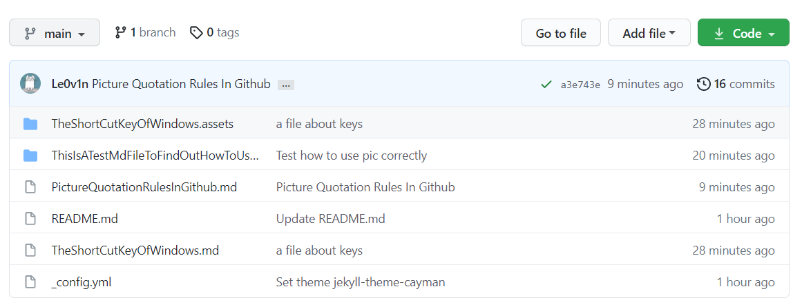
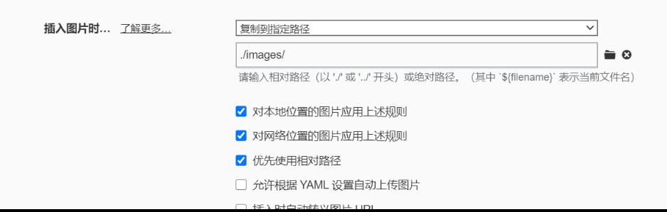

# Le0v1n.github.io

This is my GithubBlog, and I'll share my findings and thoughts in some time. Thanks for ur patience.

This is a new Test File to verify my thoughts about the Picture Quotation Rules on Github.

Now I have created a `.md` file that contains `space`, and I hope it works. 

Let's start it.

------

Okay, It is a fail trying, but fortunately I find out the rule about relative path.

Now, I change the path of every pic in md, it is in following.

Yeah, as you see. The Typora will create a folder named "images" and store the pics into it when the pics are used.

So you can find all pics in `images` with my blog.
