# Windows

## `Shift`

`shift`, 又名换挡键, 一般是`Shift + 其他按键`

### 1. 多选

`Shift + ←/→`可以实现选中文字

+ 按下`shift + →`

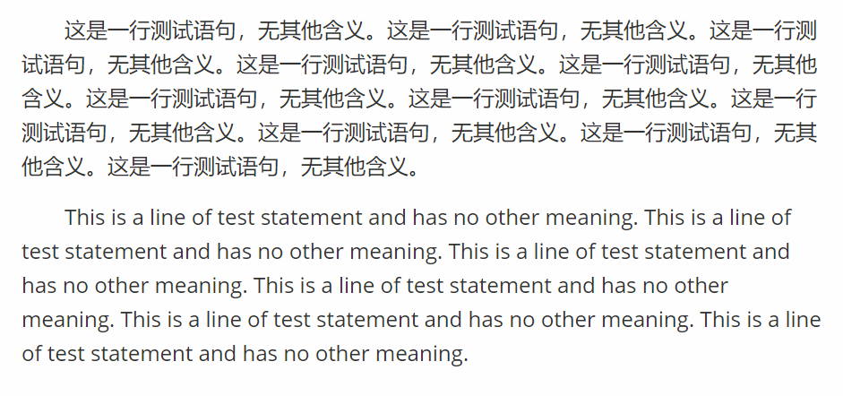

+ `Shift + 鼠标左键`也可以实现一样的功能

+ 我们按住`Shift`, 鼠标左键随便一行

------

+ 同样的, 在别处也可以实现多选的功能

	比如在一个资源管理器中, 我们可以通过按住`Shift + ↑/↓`实现多选
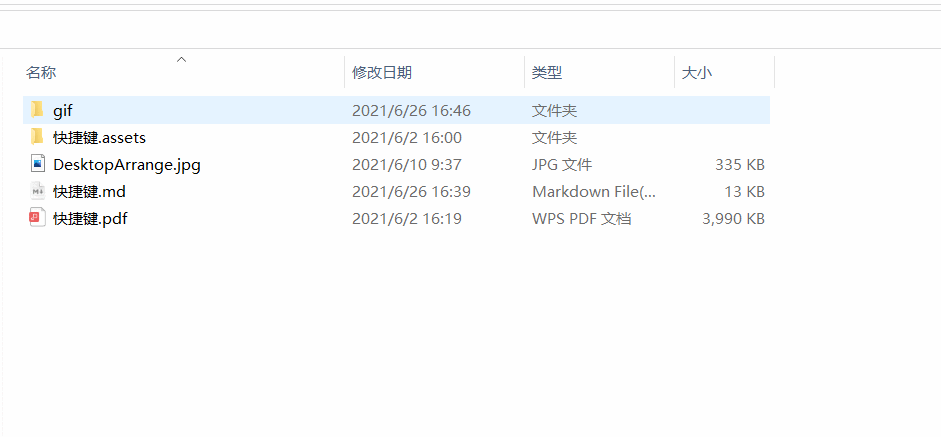
	也可以先选中一个文件, 再按住`Shift` 鼠标左键点击一下别的文件, 可以实现选中其中的所有文件

	先选中一个文件
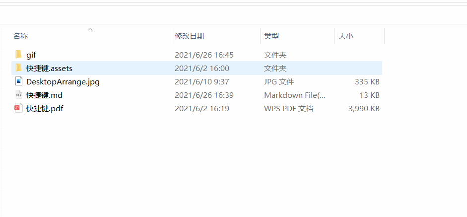
**总结: 通过`Shift+←/→/鼠标左键`可以实现多选**

## `Insert`

`insert`有两个作用:

### 1. 覆盖重写

按下`Insert`后输入会覆盖后面的输入

一般来说会有一个标识(多数情况下, 少数情况没有标识提醒)

+ 正常情况下的光标
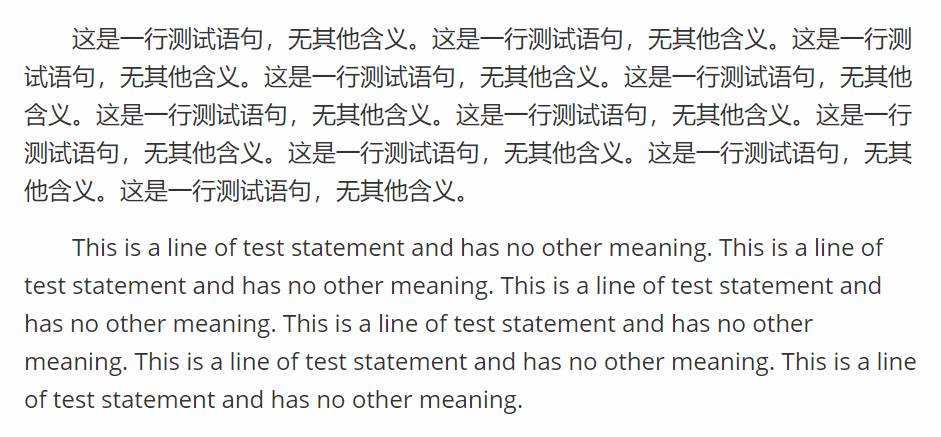
+ 按了`Insert`情况下的光标

	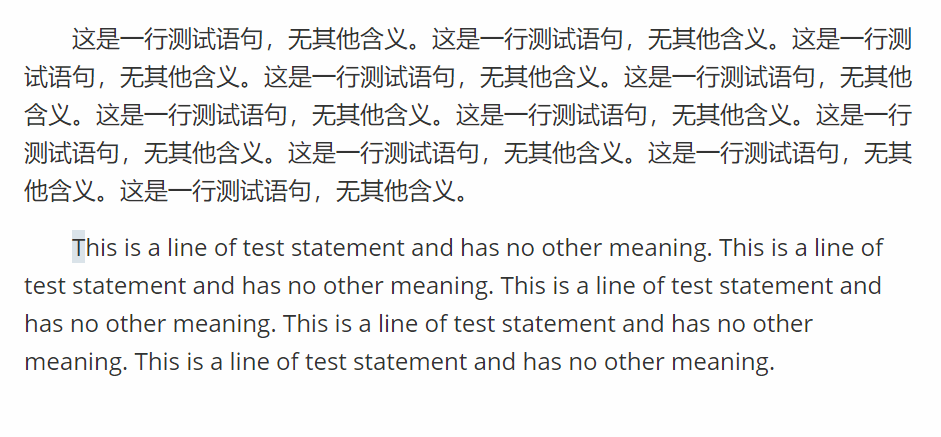


### 2. `Shift + Insert`

和`Ctrl + V`效果一样 -> 粘贴

## `Delete`

1. 我们知道, `←(backspace)`是删除**左边**的一个字符, 而`Delete`是删除**右边**的一个字符
2. 选中文件后, 按`Delete`可以实现删除文件 -> 文件到回收站
3. 选中文件后, 按`Shift + Delete`可以实现<font color="red">永久删除文件</font> -> **文件不会进回收站, 而是直接删除**(<font color="red">**此过程不可逆**</font>)

## `Home`

1. 按一下`Home`可以直接将光标返回到一行的**开头**
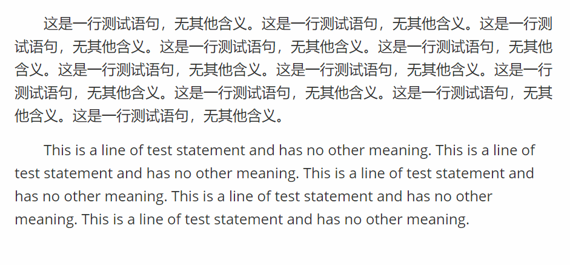
2. `Ctrl + Home`可以实现`回到最开始的页面`, 常用在在**网页**, 或**文档**中
  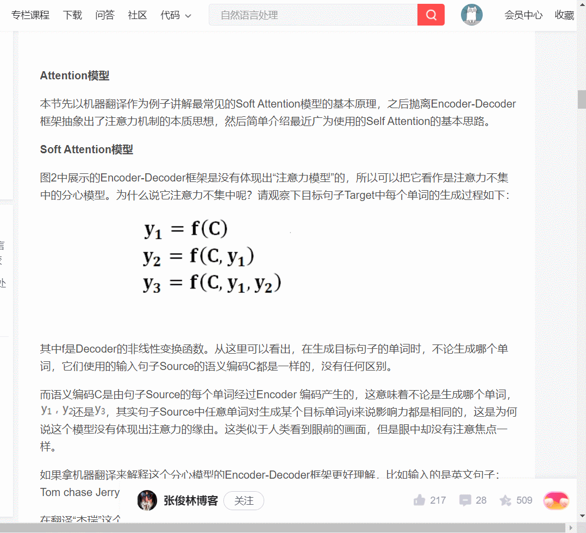

  > 通俗的讲和"**返回顶部**"的效果是一样的

3. `Shift + Home`可以直接从光标到左全部选中
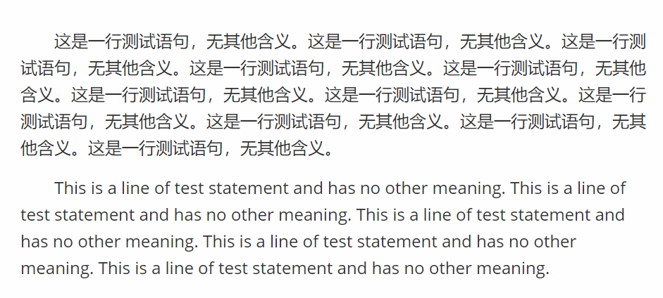
## `End`

和`Home`功能类似, 只不过方向是反着的

## `PageUp`

上一 **半** 页(在浏览网页的时候用的比较多)
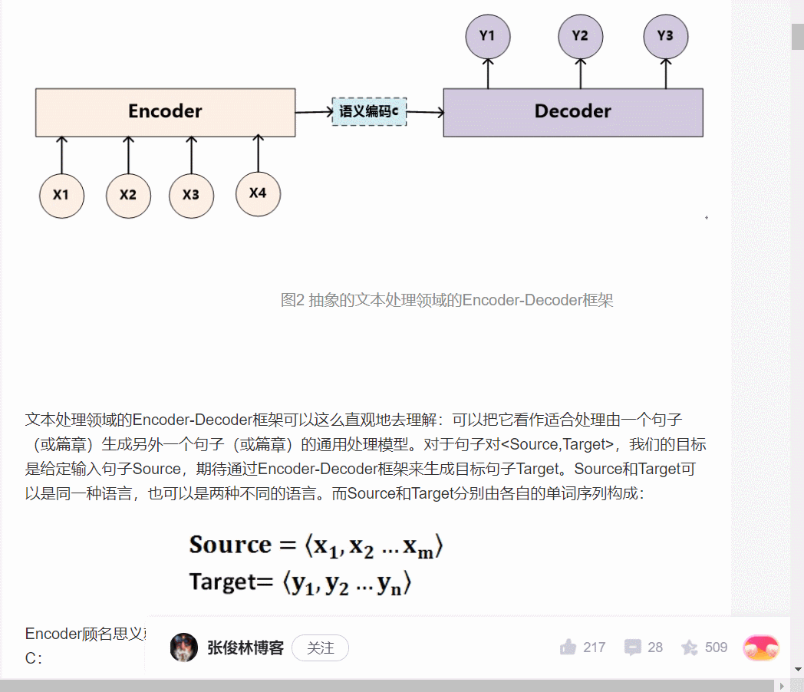

## `PageDown`

下一 **半** 页(在浏览网页的时候用的比较多)


## `Ctrl`

### 1. 全选

`Ctrl + A`可以实现全选

### 2. 复制/剪切/粘贴

+ `Ctrl + C`
+ `Ctrl + X`
+ `Ctrl + v`

### 3. [Office]加粗/斜体

+ `Ctrl + B`: 加粗
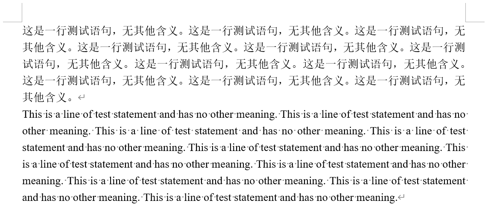

+ `Ctrl + I`: 斜体

### 4. [Office]字体大小

通过按`Ctrl + [`或`Ctrl + ]`实现字体大小的改动
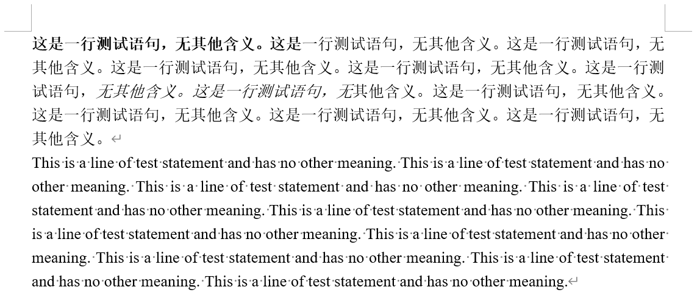

### 5. 按词组移动光标

`Ctrl + ←/→`可以实现 按词组移动光标.
![>  [外链图片转存失败,源站可能有防盗链机制,建议将图片保存下来直接上传(img-SQiH6tQr-1624696801110)(快捷键.assets/image-20210602141926169.png)]](Shortcut Key in Windows and PyCharm.assets/20210626165925575-1624769758817-1624769980607.gif)
注意光标的位置, 如果我们按`→`, 则光标只移动一个位置

![>  [外链图片转存失败,源站可能有防盗链机制,建议将图片保存下来直接上传(img-b3vpY0sC-1624696801111)(快捷键.assets/image-20210602142001891.png)]](Shortcut Key in Windows and PyCharm.assets/20210626165953598-1624769981906.gif)

对于中文也适用。

![>  [外链图片转存失败,源站可能有防盗链机制,建议将图片保存下来直接上传(img-VXyhGcl6-1624696801112)(快捷键.assets/image-20210602142138625.png)]](Shortcut Key in Windows and PyCharm.assets/20210626170102470-1624769983581.gif)

在面对长单词时, 我们就可以不用疯狂按`→`或者`→`了, 只需要按一下`Ctrl + ←`或`Ctrl + →`, 非常优雅.

## `Alt`

`Alt`是alter, 转换的意思, 本质上和`Shift`键是一样的, 常用的组合有:

### 1. `Alt + Tab`: 多任务之间的切换
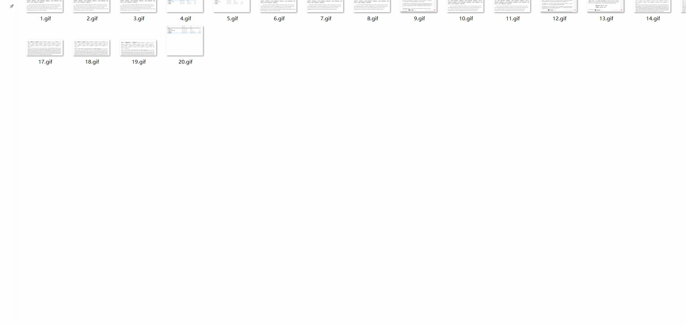
### 2. `Alt + Esc`: 直接切换到下一个任务

## `Tab`

### 1. 缩进

在Windows中,  一个`Tab`等于 `4`个空格

比如我们在写代码时, 需要缩进, 我们可以直接打一个`Tab`就行, 就不用打`4`个空格了
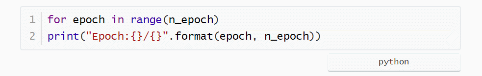

### 2. 切换下一个项目

在网页中输入密码, 我们可以使用`tab`来切换下一个项目吗，我们就不必用鼠标点击`密码`了, 直接用`tab`, 光标会自动调到下一个框中
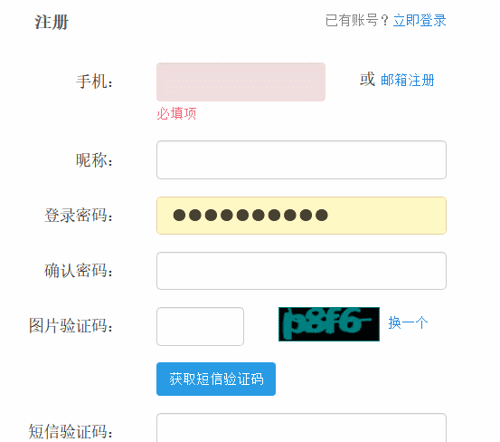

## `Windows键`

### 1. 切换桌面

我们可以使用`Windows + Tab`键来实现桌面的切换

我们可以通过切换桌面来高效的工作.

### 2. 快速打开任务
我们可以使用`Windows + 数字1, 2, ..., 9`来快速打开我们的任务
### 3. 快捷菜单

按`Windows + X`可以呼出快捷菜单

![[外链图片转存失败,源站可能有防盗链机制,建议将图片保存下来直接上传(img-nVcyu6RS-1624696801118)(快捷键.assets/image-20210602151321206.png)]](Shortcut Key in Windows and PyCharm.assets/20210626171057774-1624769992983.gif)

### 4. 搜索

`Windows + S`可以快速呼出`Cortana`搜索
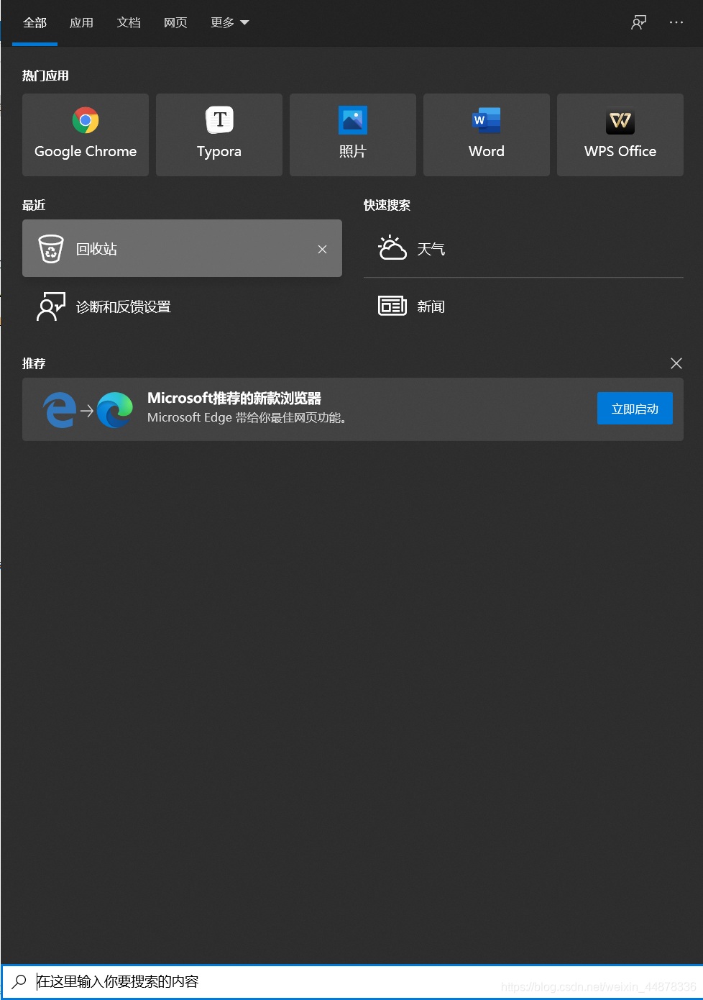
这样我们就没必要把搜索框留在我们的任务栏里了, 大大加强了任务栏的空间利用率

### 5. 回到桌面

`Windows + D`可以让我们快速回到桌面

> D = Desktop, 桌面

### 6. 快速打开文件资源管理器

`Windows + E`可以让我们快速打开文件资源管理器

> E = Explorer

### 7. 快速锁屏
`Windows + L`可以让我们快速锁屏(解锁需要输入我们的用户密码)

> L = Lock

### 8. 快速整理窗口
`Windows + ←/→`可以帮助我们快速整理窗口
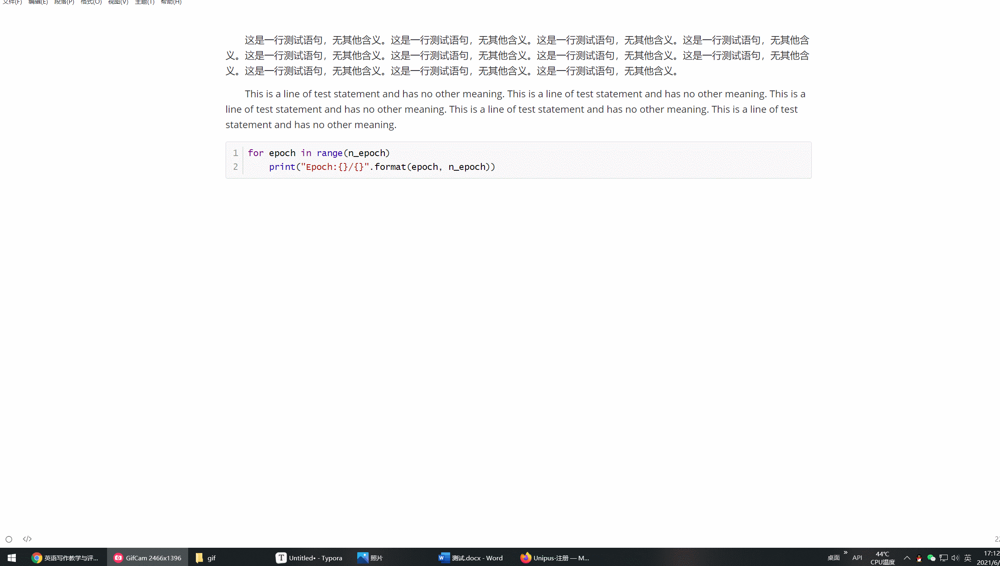


------

# PyCharm

下面介绍PyCharm特有的快捷键

## 1. 快速选中变量

[外链图片转存失败,源站可能有防盗链机制,建议将图片保存下来直接上传(img-Y3OmGyFj-1624696801118)(快捷键.assets/image-20210602152237008.png)]

如果我们在程序中想要选中`epoch`这个变量, 有下面的几种方式:

1. 鼠标双击`epoch`可以选中
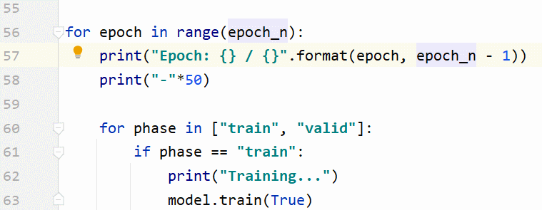
2. 按住鼠标左键拖动也可以
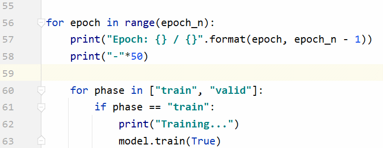
3. <font color="red" size = 5>使用`Ctrl + W`</font>
	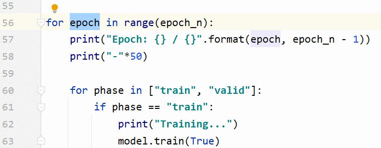
	
	> `Ctrl + W`和`Ctrl + ←/→`的原理类似, 在PyCharm中会选取一个单词/中文词组

## 2. 快速复制一行代码

我们在写这段代码时发现, 第一行代码和第二行代码只是把`x`换成`y`, 所以我们可以复制这一行, 再把`x`换成`y`即可

我们当然可以使用`Shift + Home`选中这一行, 再`Ctrl + C` + `回车` + `Ctrl  + V`完成赋值粘贴的操作
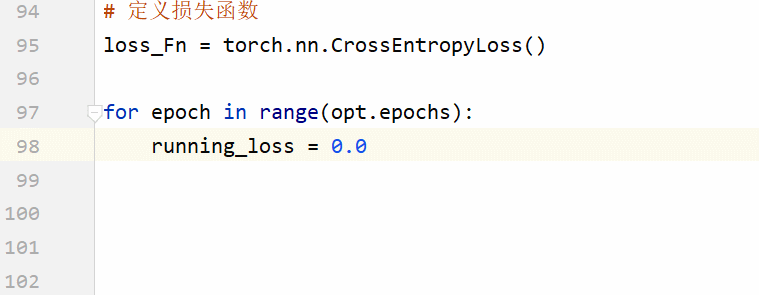

但这样在PyCharm中过于繁琐, 我们可以使用`Ctrl + D`完成快速复制的操作

## 3. 快速开启新的一行

比如我们的光标在`outputs`上, 那么怎么样可以**快速重启一行**呢?

+ 传统方法: 我们可以使用`End`快速调到行尾, 再按`Enter`开启新的一行
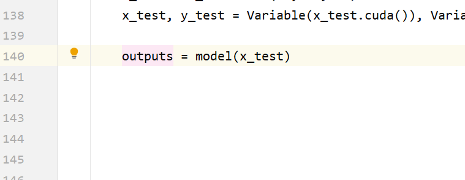


+ **PyCharm专用方法**: 我们可是使用`Shift + Enter`直接开启新的一行
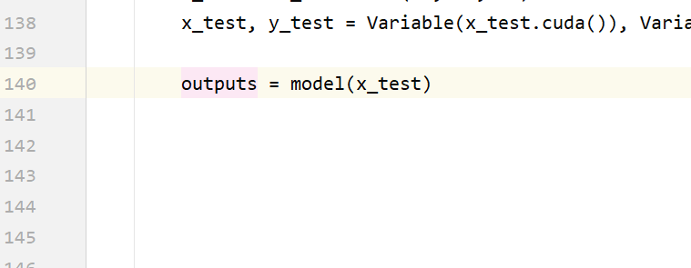


## 4. 快速查询函数定义及用法

有时候我们遇到一个新的函数, 需要百度才能明白它的含义. 

但其实函数自带了文档说明, 我们可以使用`Ctrl + Q`来进行查询

```python
# 定义优化函数
optimizer = torch.optim.Adam(model.parameters())
```

对于`Adam()`函数, 我们想要知道它是怎么定义的, 需要传入什么参数, 默认参数是什么, 返回值又是什么.

我们选中`Adam`，`Ctrl + Q`
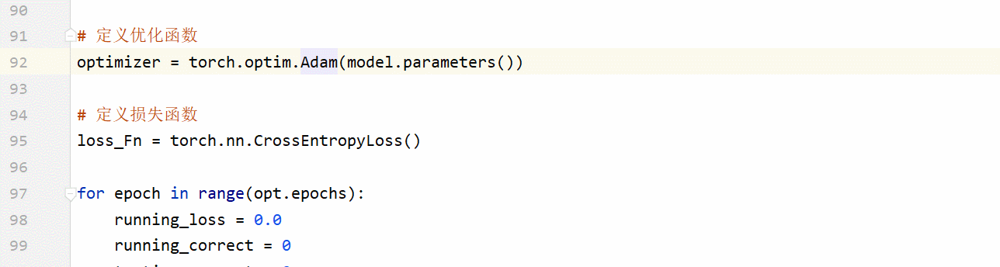
我们可以知道`Adam`函数的具体用法了.

## 5. 创建一个模板

我们在使用PyCharm新建一个`.py`文件时, 里面都是空的.

我们可以自定义一个模板, 里面有我们写的函数, 这样就会大大提高我们的效率
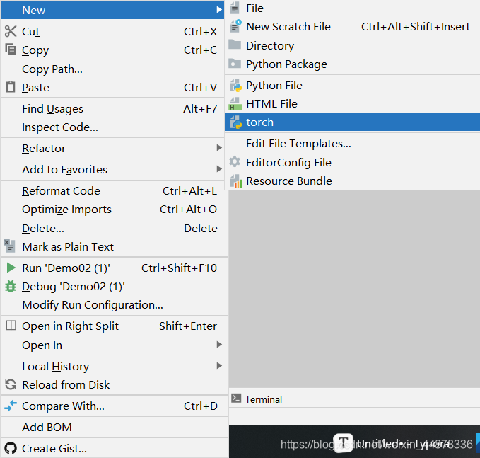
这是我自定义的模板
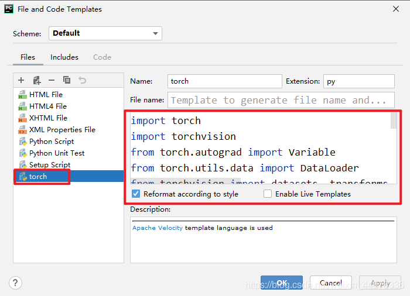

## 6. 代码的format

我们可以使用`Ctrl + Alt + L`来实现代码的format.

```python
image_datasets= {x:datasets.ImageFolder(root=os.path.join(data_dir,x),
                          transform=data_transform[x])
        for x in ["train", "valid"]}
dataloader = {x: torch.utils.data.DataLoader(dataset=image_datasets[x],
        batch_size=16,
                                       shuffle=True)
              for x in ["train", "valid"]}
```

`Ctrl + Alt + L`后:

```python
image_datasets = {x: datasets.ImageFolder(root=os.path.join(data_dir, x),
                                          transform=data_transform[x])
                  for x in ["train", "valid"]}
dataloader = {x: torch.utils.data.DataLoader(dataset=image_datasets[x],
                                             batch_size=16,
                                             shuffle=True)
              for x in ["train", "valid"]}
```

## 7. 快速变量重命名

我们可以使用`Shift + F6`实现变量的快速重命名(下方的同名变量都会重命名, 而且这个重命名是很智能的, 建议多使用)
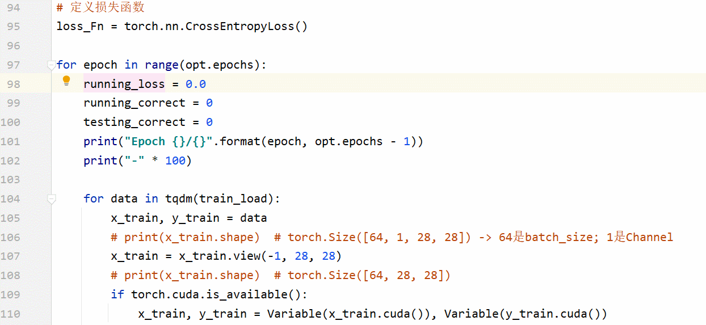
