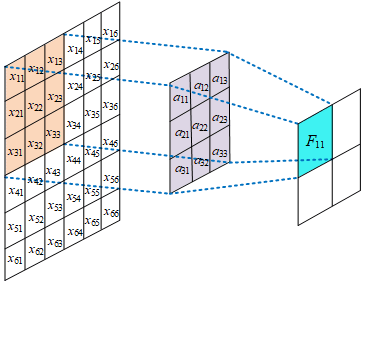

# 1. Introduction

深度学习的两大核心特征：

1. 局部感知
2. 权值共享

------

# 2. Local Perception

图1 全连接与局部连接

图1(a)表示神经网络中神经元之间的全连接结构，即前后两层神经元都是彼此相互连接的，这样可以保证后面一层的每个神经元都能获取前面一层神经元的所有信息。图1(b)表示神经元之间进行局部连接，即后面一层的神经元只与前面一层的部分神经元进行连接，这样后面一层的神经元只能包含前面一层神经元的部分信息。表面上看局部连接似乎损失了部分信息，但实际上后层神经元并没有损失信息。通过后面一层神经元感知局部信息不仅可以减少网络需要学习的大量参数，同时可以减少网络的冗余信息。在图像领域，如果网络输入的是一张图片，每个神经元在卷积层都进行局部感知图像信息，经过几层卷积和池化后再通过卷积可以将这些局部的信息进行综合起来得到图像的全局信息。通过局部感知不仅减少了神经网络的复杂性和参数量，同时减少了对训练时设备算力的高要求。

下面分析网络采用局部的神经元连接方式相比于全连接方式，计算量减少了多少。假设图像大小为 $500×500$，共有 $10^5$ 个神经元。在图1(a)的全连接中，每个神经元需要与图像进行全连接，则网络需要训练的参数有 $2.5×10^{10}$个。

> 前一层图像的大小为 $500 \times 500 = 2.5 \times 10^5$ , 后一层我们设计了 $10^5$ 个神经元，那么全连接需要计算的参数个数为： $2.5\times 10^5 \times 10^5 = 2.5 \times 10^{10}$。

如果网络神经元采用图1(b)的局部连接方式，并假设神经元的感受野为 $10×10$，那么需要训练的参数个数为 $10^7$ 个。

> 感受野为 $10×10$，下一层共有 $10^5$ 个神经元，需要训练的参数个数为 $10 \times 10 \times 10^5 = 10^7$ 个

由于神经元个数相同，偏置值的数量也是相同的，故在计算中忽略了偏置值的统计，该操作不影响两者计算量的比较。通过比较两种连接方式计算的结果可知，采用局部连接方式的参数量是采用全连接方式的 $\frac{1}{2500}$。由此可见，神经元采用局部连接可以减少大量网络需要学习的参数，降低模型的复杂度。

图2 局部感知+权值共享示意图

对于原图 -> 特征图，这里使用的Kernel_size为 $5 \times 5 \times 3 \times 10$ ，其中 $5\times 5$ 表示卷积核的大小，$3$ 表示通道数（即RGB三原色）， $10$ 表示卷积核的个数。这里就涉及到我们所说的**局部感知**这个概念了。输入特征图（原图）的特征都被这个卷积核所卷积，输出了10个特征图，这10个特征图和原图并不是全连接的关系，而是原图被分成 10 个部分，每一部分都由一个特征图所负责（即 $FeatureMap_{1 \ to \ 10}$）。

--------

# 3. Weight Sharing

权值共享是卷积神经网络的另一个特性。在网络对输入图片进行卷积时，对于同一特征的提取，卷积核的参数是共享的，即卷积核中的参数是相同的。在全图对某一个特征，如边缘、纹理等进行提取时，所有卷积核参数相同。这种特性大大减少了卷积神经网络中需要学习的参数，图3是神经网络权值共享示意图。

图3 权值共享示意图

当对不同的特征进行提取时，需要设置不同的卷积核。下面分析采用权值共享机制时，网络减少了多少参数量。假设此时进行特征提取是已经采用了局部连接方法，并且每个神经元的感受野为 $10×10$，神经元个数为 $10^5$，因此需要学习的参数量为 $10^7$，这个参数量依然是非常大的，如果网络此时提取图片中的边缘特征，根据权值共享特性，这 $10^6 $个神经元包含的权值是相同的，即 $10×10=100$ 个参数，网络总体参数量也为 $10×10=100$ 个，相比于前面的 $10^7$，网络整体需要学习的参数量是减少了 $10^5$，这就大大减少了网络需要学习的参数以及训练的时间。根据具体使用场景，对图片提取多少种特征是可以调整的，假设设置卷积核的个数为 $64$，即对网络提取 $64$ 种不同的特征，需要的参数量为 $6400$ 个，按照目前计算机的处理能力，这个数字也是合理的。

图3中，第 $n+1$ 层神经元只与第 $n$ 层的部分神经元进行连接，该图中第 $n+1$ 层只与第 $n$ 层中的 3 个神经元连接，每一个神经元与上一层的神经元进行连接时，权值是相同的。$w_1$，$w_2$，$w_3$ 是不同神经元共享的权值。

权值共享就是说，给一张输入图片，用一个卷积核去扫这张图，**卷积核里面的数就叫权重**，这张图每个位置是被同样的卷积核扫的，所以权重是一样的，也就是共享。

图2 卷积运算示意图

这里面，最左边的可以理解为是输入图片的一部分，而中间的是卷积核，右边的是得到FeatureMap。这里的GIF动图演示的是通道数为1的情况（显示情况下，$Channel=1$ 一般为灰度图）。如果是彩色图像（RGB），那么左边的通道数为3（即有RGB各3张图），中间卷积核的通道数也应该是3（对应输入图片的RGB 3 通道），~~右边输出的FeatureMap的通道数也是3~~。

我们需要注意一下：右边输出的FeatureMap的通道数并不是3，而是1。

+ 这是因为，即便输入特征图和卷积核都是3通道的，但输出特征并不是三通道的，而是把这三个通道对应位置上的值进行了相加，最终形成了一个 1 通道的输出特征图。

而且我们还要注意一个问题，那就是卷积核上的参数是不变的。这就是我们所说的**权值共享**技巧。如果我们不进行权值共享，那么结果会这样：

无权值共享

我们会发现，卷积核在根据 Stride 移动时，每次移动后自己的内部参数是会变动的。这就导致计算量会增大。

## 3.1 Why do the weights fix?

有个曲线的特征过滤器，那么这个过滤器在扫描全图的时候，我们想要提取出所有的曲线区域，是不是这个过滤器不能变？如果在上半部分过滤器是曲线，到下半部分变成了直线，那么在图像上下区域内提取出来的曲线特征是真正的曲线吗？个人认为从这个直白的角度更容易理解。

-------

# 4. Others

这里有一个问题，这10张FeatureMap可以表示这张原图所有的特征吗？

事实上，这10张特征图单独拎出来并不能表示原图的所有特征，看图2说话。我们把这10张特征图用蓝色的框框起来，框起来就表示是一个整体，这个整体就可以表示原图的特征经过卷积后的效果。

-----

那我们得到10张FeatureMap后想要继续该怎么办？

最传统的方法就是继续使用这样的原理。

这里我们使用Kernel_size的大小是 $3\times 3 \times 10 \times 5$， 其中 $3 \times 3$ 表示Kernel的大小，$10$ 表示通道数为10，$5$ 表示卷积核的个数。这里的通道数其实就是我们蓝色框起来的10个FeatureMap，因为我们把它当做一个整体了，所以我们卷积核的通道数应该是10。至于5个卷积核的个数是我们自己设计的，我们让其输出5张新的特征图，所以我们使用了5个卷积核。

-----

最后我们想使用这5张特征图通过一个全连接层来输出结果。FC（全连接）的本质就是将特征图打平，比如我们这里假设新特征图（粉色框住的）的size为：$H_2 \times W_2 \times 1 \times 5 = 1024$ ，这里的 1024 是我们假设的，它被Flatten之后得到 $1024 \times 1$ 的FeatureMap（这里可以理解为1024行1列的特征图），然后我们将这 1024 行 1 列的特征图送进 1024 个神经元（**这里图2并没有画这1024个神经元**），然后这1024个神经元再和两个标签进行全连接。

> 注意: 
>
> + 这里 1024 个神经元到标签使用的并不是卷积，其实就是一个简单的求和来实现的降维（降到 2 行 1 列）
> + 因为这1024个到两个标签有着不同的权重 $w_i$ 和 $b_i$，所以结果也是不一样的。

# 5. Conclusion

局部连接和权值共享特性是卷积神经网络的基本特性，它们都能够有效减少大量网络需要学习的参数，也是构建复杂神经网络模型的基础。

