# 0. 提前声明

原文地址:[Understanding LSTM Networks](http://colah.github.io/posts/2015-08-Understanding-LSTMs/)

如对原文感兴趣，请翻阅原文，本文只是翻译+自己的注解。

> 如果涉及到版权问题，请联系我，我会尽快删除。

# 1. 循环神经网络(RNN)

人类不会每一秒都从头开始思考。 当你阅读这篇文章时，你会根据对之前单词的理解来理解每个单词。 您不会扔掉所有东西并重新从头开始思考。 你的思想有贯穿的，会和之前的记忆共同起作用。

传统的神经网络做不到这一点，相比于LSTM来说，这也是传统神经网络主要的缺点。想象一下，如果你想对电影中的每个事件(event)进行分类。我们无法想象传统神经网络如何能够利用前面的场景去干预后面的预测（本身的机制就不允许它去这么做）。

幸好循环神经网络(RNN)解决了这个问题， 它们是具有循环(loops)的网络，允许信息持续存在，示意图如下。

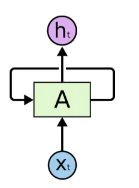

图1-1 循环神经网络具有循环(loops)

在上图中，一块神经网络 $A$ 查看某个输入 $x_t$ 并输出一个值 $h_t$。 循环允许信息从网络的一个步骤传递到下一个步骤。这些循环使循环神经网络看起来有点神秘。 然而，如果你多想一想，就会发现它们与普通的神经网络并没有什么不同。 循环神经网络可以被认为是同一个网络的多个副本(copies)，每个副本都向后继者传递一条消息。 考虑如果我们展开循环(loops)会发生什么：

图1-2 一个展开的循环神经网络

这种链状性质表明循环神经网络(RNN)与序列(sequences)和列表(lists)密切相关。 它们是用于此类数据的神经网络的自然架构。

在过去几年中，将 RNN 应用于各种问题取得了令人难以置信的成功：语音识别、语言建模(language modeling)、翻译、图像字幕...不胜枚举。 我将把关于使用 RNN 可以实现的惊人壮举的讨论留给 Andrej Karpathy 的优秀博客文章“循环神经网络的不讲道理的效率性”（[The Unreasonable Effectiveness of Recurrent Neural Networks](http://karpathy.github.io/2015/05/21/rnn-effectiveness/)）。

这些成功的关键是使用了“LSTM”，这是一种非常特殊的循环神经网络，在许多任务中，它比标准版本[^1]好得多。 几乎所有基于RNN的高效的结果都是用它们实现的。 本文将探讨这些 LSTM。

[^1]: 指原始的RNN

# 2. 长依赖存在的问题(The Problem of Long-Term Dependencies)

RNN 的魅力之一是它们可能能够将先前的信息连接到当前任务，例如使用之前的视频帧可能会加强对当前帧的理解。 如果 RNN 可以做到这一点，它们将非常有用。 但是它们可以吗？这得看情况(It depends)。

有时，我们只需要查看最近的信息(即可执行当前的任务)。 例如，一个语言模型试图根据之前的单词预测下一个单词。 如果我们试图预测“the clouds are in the **sky**”中的最后一个词，我们不需要任何进一步的上下文——很明显下一个词将是天空。 在这种情况下，<u>相关信息与需要它的地方之间的差距很小</u>，RNN 可以学习使用过去的信息。

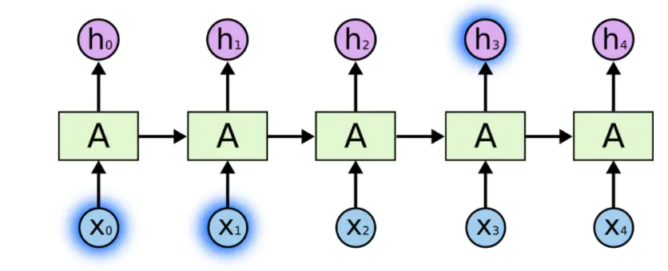

但也有需要更多上下文的情况。 考虑尝试预测文本中的最后一个单词“I grew up in France… I speak fluent **French**.”。最近的信息表明，下一个单词可能是一种语言的名称，但如果我们想缩小范围确定那种语言，我们需要从前面获取法国(France)的背景。 <u>相关信息和需要该信息的地方的距离变得非常大</u>，而这种情况经常发生。

不幸的是，随着距离的增加[^2]，RNN无法有效的利用历史信息。

[^2]: 这里的距离就是原本应该有语义发生的上下文之间的距离

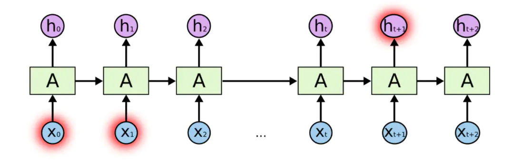

在理论上，RNN绝对有能力处理这样的“长依赖”问题[^3]。人们可以仔细挑选参数来解决这种形式的问题。 但在实践中，RNN 似乎无法学习到这些特征。[Hochreiter(1991)](http://people.idsia.ch/~juergen/SeppHochreiter1991ThesisAdvisorSchmidhuber.pdf)和[Bengio](http://www-dsi.ing.unifi.it/~paolo/ps/tnn-94-gradient.pdf)等人，曾经深入的研究过这个问题，他们发现一些根本性的原因能够解释 RNN 为什么不能很好的起效果。

但幸运的是LSTM没有这个问题！

[^3]: 原本应该有语义发生的上下文之间的距离很大的现象就叫做长依赖(Long-Term Dependencies)

# 3. 长短期记忆神经网络(LSTM Networks)

长短期记忆神经网络——通常称作 LSTM[^4]，是一种特殊的 RNN，能够学习长依赖(Long-Term Dependencies)关系。它们由[Hochreiter ＆ Schmidhuber](http://www.bioinf.jku.at/publications/older/2604.pdf)引入，并被许多人进行了改进，现在被广泛使用。

[^4]: Long Short Term Memory

LSTM 被明确设计为避免长依赖问题。 长时间记住信息实际上是他们的默认行为，而不是他们努力学习的东西！[^5]

所有循环神经网络(RNN)都具有神经网络重复模块链的形式。 在标准 RNN 中，这个重复模块将具有非常简单的结构，例如单个 $tanh$ 层。

[^5]: 这里理解为 LSTM 从设计之处就具备了长时记录的功能

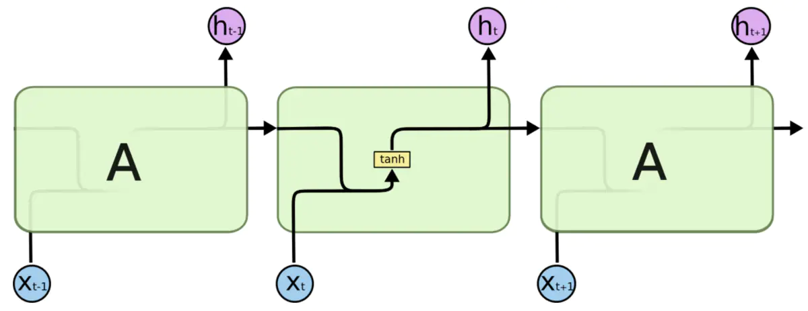

标准 RNN 中的重复模块包含单层，即单个 tanh 层

LSTM 也有这种类似链的结构，但重复模块有不同的结构。 不是只有一个神经网络层，而是有**四个**，以一种非常特殊的方式进行交互。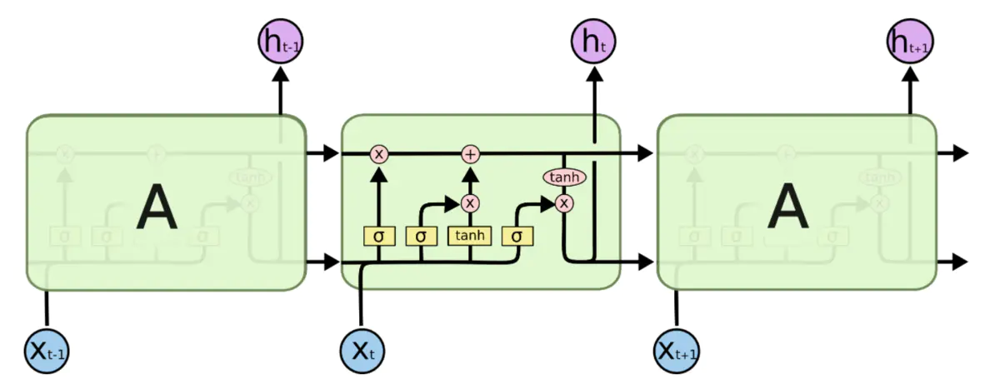

LSTM 中的重复模块包含四个交互层

先不要担心里面的细节。，我们稍后将逐步介绍 LSTM 图。 现在，让我们试着熟悉一下我们将使用的符号。

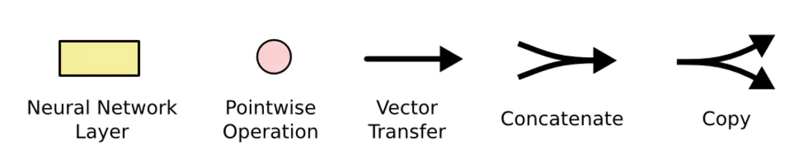

+ 黄色框是学习神经网络层
+ 粉红色圆圈表示点向运算，如向量加法、点乘
+ `→` 表示该向量从一个节点输出到其他节点的输入
+ 线的合并表示连接
+ 线的交叉表示其内容正在复制，副本将转到不同的位置。

# 4. LSTM背后的核心思想

LSTM 的关键是细胞状态(cell state)，即贯穿图表顶部的水平线。

细胞状态有点像传送带。 它直接沿着整个链条运行，只有一些轻微的线性交互(linear interactions)。 信息很容易保持不变的流过整个链。

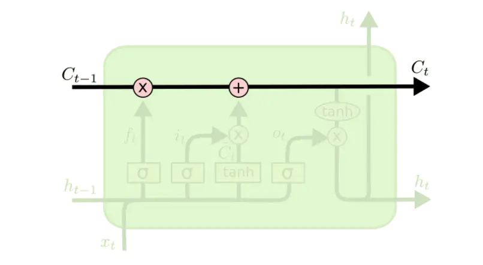

LSTM 确实能够**删除(remove)**或**添加(add)**信息到细胞状态，这个能力是由被称为门(Gates)的结构所赋予的。

门是一种选择性地让信息通过的方式。 它们由 $Sigmoid$ 神经网络层和逐点乘法运算组成。

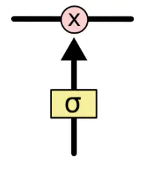

$Sigmoid$ 神经网络层输出 $0$ 和 $1$ 之间的数字，这个数字描述每个组件有多少信息可以通过， $0$ 表示不通过任何信息，$1$ 表示全部通过。

LSTM有三个门，用于保护和控制细胞的状态。

# 5. 一步步的理解LSTM

LSTM 的第一步是决定我们要从细胞状态中丢弃哪些信息。 这个决定是由一个称为“遗忘门层(forget gate layer)”的 $Sigmoid$ 层做出的。 它查看 $h_{t-1}$ 和 $x_t$，并为细胞状态 $C_{t-1}$ 中的每个数字输出一个介于 $0$ 和 $1$ 之间的数字。 $1$ 代表“完全保留这个”，而 $0$ 代表“完全脱离这个”。

让我们回到我们的语言模型示例，该示例试图根据之前的所有单词预测下一个单词。 在这样的问题中，细胞状态可能包括当前主语的性别，以便可以使用正确的代词。 当我们看到一个新的主体时，我们想要忘记旧主体的性别。[^6]

[^6]: 这里的意思是：LSTM不光需要通过前面的信息推测出正确的性别，并且还需要它可以在新旧主体之间进行切换，以便正确的使用新旧主体的性别代词。

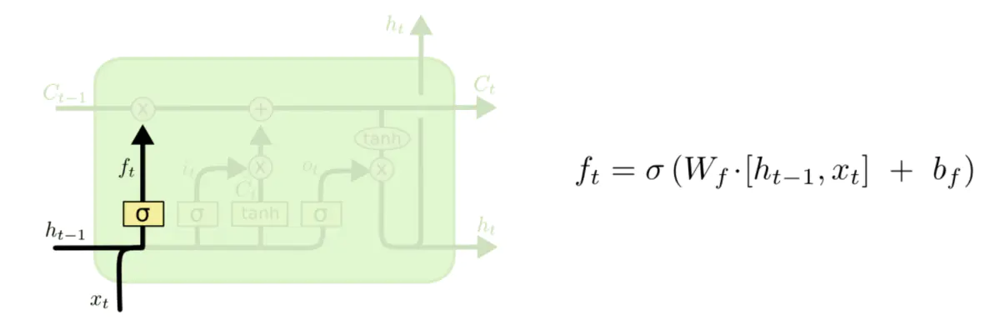

下一步是决定我们将在细胞状态中存储哪些新信息。 这有两个部分：

+ 首先，称为“输入门层(input gate layer)”的 $Sigmoid$ 层决定我们将更新哪些值。 

+ 接着 $tanh $ 层创建一个新的候选值向量 $\tilde{C}_t$ 添加到状态中。 
+ 最后我们将结合这两者来创建状态更新。

在我们的语言模型示例中，我们希望将新主体的性别添加到细胞状态，以替换我们忘记的旧主体。

现在是时候将旧的细胞状态 $C_{t-1}$ 更新为新的细胞状态 $C_t$。 前面的步骤已经决定了要做什么，我们只需要实际去做。

我们将旧状态乘以 $f_t$，忘记了我们之前决定忘记的事情。 然后我们加上它 $i_t \times \tilde{C}_t$。 这是新的候选值，按我们决定更新每个状态值的程度进行缩放。

在语言模型的情况下，正如我们在前面的步骤中决定的那样，这是我们实际上删除有关旧主体性别的信息并添加新信息的地方。

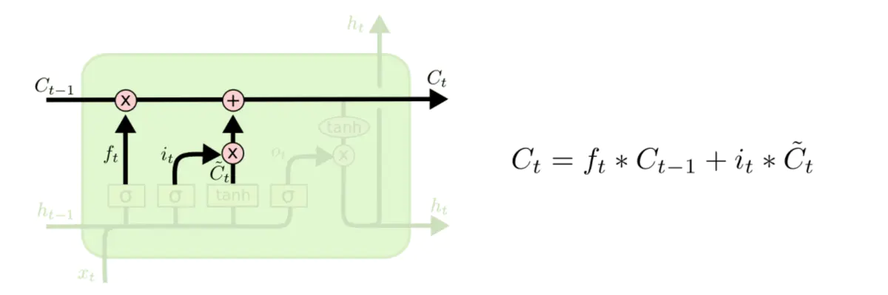

最后，我们需要决定我们要输出什么。 此输出将基于我们的细胞状态，但将是一个过滤版本。 首先，我们运行一个 $Sigmoid$ 层，它决定我们要输出细胞状态的哪些部分。 然后，我们将单元状态通过 $tanh$（将值推到 $-1$ 和 $1$ 之间）并将其乘以 $Sigmoid$ 门的输出，以便我们只输出我们决定的部分。

对于语言模型示例，由于它只看到一个主语，它可能想要输出与动词相关的信息，以防接下来要发生的事情。 例如，它可能会输出主语是单数还是复数，以便我们知道如果接下来是动词，那么我们应该将动词变为什么形式。

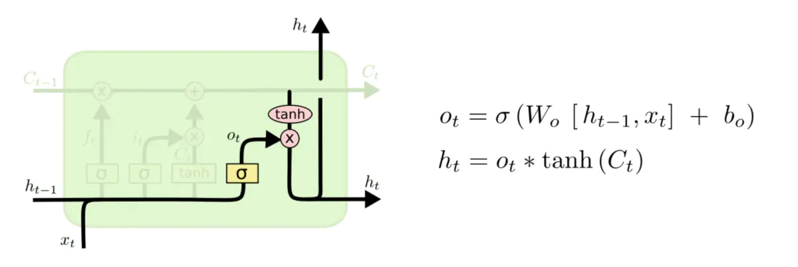

# 6. 长短期记忆的变体

到目前为止，我所描述的是一个非常普通的 LSTM。 但并非所有 LSTM 都与上述相同。 事实上，似乎几乎每篇涉及 LSTM 的论文都略有不同。虽然差异很小，但其中一些还是值得一提的。

[Gers & Schmidhuber (2000)](ftp://ftp.idsia.ch/pub/juergen/TimeCount-IJCNN2000.pdf)引入的一种流行的 LSTM 变体是添加“窥视孔连接(peephole connections)”。 这意味着我们让门层(gate layers)查看单元状态(cell state)。

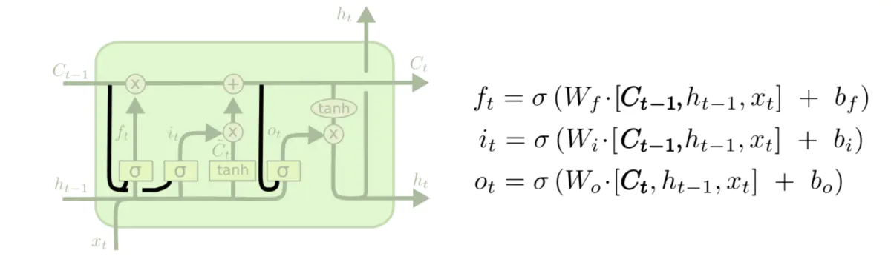

上面的图表在所有的门上都增加了窥视孔，但是很多文章只给出了一些窥视孔而没有其他的。

另一种变体是使用耦合忘记门(coupled forget)和输入门(input gates)。这两者一起做决定，而不是分别决定忘记什么和添加什么新信息。他们只会忘记什么时候输入什么东西。当他们忘记一些旧的东西时，他们才会向状态输入新的值。

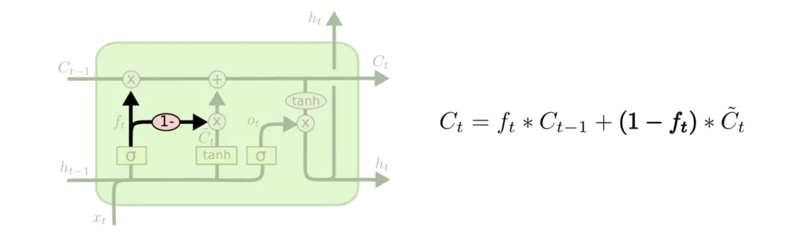

LSTM的一个更显著的变化是由[Cho](http://arxiv.org/pdf/1406.1078v3.pdf)等人(2014)引入的门控循环单元(Gated Recurrent Unit，简称GRU)。它将遗忘门和输入门结合成一个单一的“更新门(update gate)”。它还合并了单元状态和隐藏状态，并进行了一些其他更改。 由此产生的模型比标准的 LSTM 模型更简单，并且越来越受欢迎。

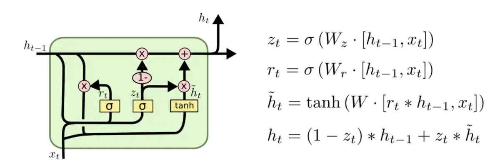

这些只是一些最著名的 LSTM 变体。 还有很多其他的，比如 [Yao](http://arxiv.org/pdf/1508.03790v2.pdf) 等人的 Depth Gated RNNs (2015)。 还有一些完全不同的方法来解决长期依赖关系，比如[ Koutnik ](http://arxiv.org/pdf/1402.3511v1.pdf)等人的 Clockwork RNN (2014)。

哪些变体是最好的？这些差异重要吗？[Greff](http://arxiv.org/pdf/1503.04069.pdf)等人(2015)对流行的变体做了一个很好的比较，发现它们都差不多。[Jozefowicz](http://jmlr.org/proceedings/papers/v37/jozefowicz15.pdf)等人(2015)测试了超过 $10,000$ 个 RNN 体系结构，发现一些在某些任务上比 LSTM 更有效。

# 7. 结论

早些时候，我提到了人们使用 RNN 取得的显着成果。基本上所有这些都是使用 LSTM 实现的。对于大多数任务，它们确实工作得更好！

写成一组方程，LSTM 看起来很吓人。希望通过在本文中一步一步地了解它们，可以使它们更加平易近人。

LSTM 是我们可以用 RNN 完成的一大步。很自然地想知道：还有另一个大步骤吗？研究人员普遍认为：“是的！还有下一步，就是注意(attention)！”这个想法是让 RNN 的每一步都从一些更大的信息集合中挑选要查看的信息。例如，如果您使用 RNN 创建描述图像的标题，它可能会选择图像的一部分来查看它输出的每个单词。事实上，[徐等人](http://arxiv.org/pdf/1502.03044v2.pdf)（2015）正是这样做的——如果你想探索注意力，这可能是一个有趣的起点！使用注意力已经有许多非常令人兴奋的结果，而且似乎还有更多的结果即将到来……

注意力并不是 RNN 研究中唯一令人兴奋的线索。例如，[Kalchbrenner](http://arxiv.org/pdf/1507.01526v1.pdf) 等人的 Grid LSTMs（2015）似乎非常有希望。在生成模型中使用 RNN 工作——例如 [Gregor](http://arxiv.org/pdf/1502.04623.pdf) 等 (2015), [Chung等人](http://arxiv.org/pdf/1506.02216v3.pdf) (2015) 或 [Bayer & Osendorfer ](http://arxiv.org/pdf/1411.7610v3.pdf)(2015) – 似乎也很有趣。过去几年对于循环神经网络来说是一个激动人心的时刻，而接下来的几年将会更加精彩！

# 8. 致谢

我感谢许多人帮助我更好地理解 LSTM，对可视化发表评论，并对这篇文章提供反馈。

我非常感谢 Google 的同事提供的有用反馈，尤其是 [Oriol Vinyals](http://research.google.com/pubs/OriolVinyals.html)、[Greg Corrado](http://research.google.com/pubs/GregCorrado.html)、[Jon Shlens](http://research.google.com/pubs/JonathonShlens.html)、[Luke Vilnis](http://people.cs.umass.edu/~luke/) 和 [Ilya Sutskever](http://www.cs.toronto.edu/~ilya/)。我还要感谢许多其他朋友和同事花时间帮助我，包括 [Dario Amodei](https://www.linkedin.com/in/dario-amodei-3934934) 和 [Jacob Steinhardt](http://cs.stanford.edu/~jsteinhardt/)。我特别感谢 [Kyunghyun Cho](http://www.kyunghyuncho.me/) 对我的图表非常周到的通信。

在这篇文章之前，我在我教授的关于神经网络的两个系列研讨会中练习解释 LSTM。感谢所有参与其中的人对我的耐心和反馈。

除了原作者之外，还有很多人为现代 LSTM 做出了贡献。一个不完整的列表是：Felix Gers、Fred Cummins、Santiago Fernandez、Justin Bayer、Daan Wierstra、Julian Togelius、Faustino Gomez、Matteo Gagliolo 和 [Alex Graves](https://scholar.google.com/citations?user=DaFHynwAAAAJ&hl=en)。↩